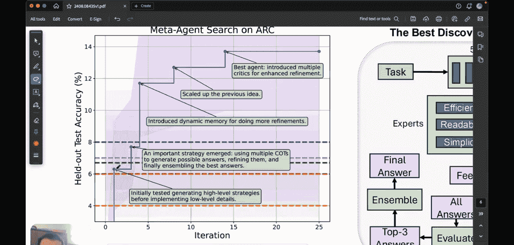

#  018：我们离AGI还有多远？- 智能体系统的自动发现 🚀


## 概述
在本节课中，我们将讨论一篇近期发布的新论文，其标题为《智能体系统的自动设计》。这篇论文提出了一个名为“智能体系统自动设计”的新研究领域，其核心思想是自动创建强大的智能体系统设计。我们将探讨其基本方法、核心假设，并通过一个具体示例来理解其运作机制。

## 自动设计智能体系统的基本框架

上一节我们概述了论文的目标，本节中我们来看看其提出的核心方法框架。

论文提出了一种通过“元智能体”来自动迭代生成更优智能体的方法。智能体首先以代码形式定义，然后由元智能体自动发现新的智能体。

这个过程可以清晰地用下图表示：


以下是该框架的关键组成部分：

*   **智能体档案库**：这是一个存储所有已学习智能体的知识库。可以将其类比为一个书籍档案，其中包含不同时期、不同版本的智能体。每个智能体都有其对应的性能表现。
*   **迭代过程**：在每次迭代中，元智能体会审视现有的档案库，并尝试发现下一个“有趣”的智能体。这里的“有趣”通常意味着新智能体应比档案库中的先前智能体表现出更好的性能。
*   **评估与归档**：新发现的智能体会在某些任务上进行性能测试。如果其表现令人满意，就会被添加到智能体档案库中。
*   **循环演进**：这个过程会运行多次。每次循环都会发现一个新智能体，并将其添加到档案库的智能体列表中。随着迭代次数增加，发现的智能体数量会持续增长，直到达到预设的迭代上限。

这个框架就是所谓的“ADS”，即智能体系统的自动设计。

## 核心假设与研究问题

了解了基本框架后，我们来看看这项研究背后的驱动理念。

论文的主要假设是：机器学习的历史揭示了一个反复出现的主题。随着时间的推移，随着我们获得更多的计算资源和数据，手工设计的特征会被本质上更自动化的、更好的系统所取代。

他们指出，历史上我们看到机器学习领域从需要较多人工干预，发展到例如卷积神经网络这样的系统，其中的特征无需手动设计即可自行发现。他们试图将这一趋势外推到智能体系统领域。

他们提出的核心研究问题是：**我们能否自动化智能体系统的设计，而不是依赖人工努力？** 这正是本文试图解决的基本问题。

## 示例解析：ARC挑战

为了更具体地理解ADS如何工作，我们来看一个应用于“ARC挑战”的具体例子。ARC指的是抽象与推理语料库。

在这个挑战中，通常会给出三组输入-输出示例。以下图为例，展示了其中两组：


每组示例包含一个输入网格和一个输出网格。任务背后存在一个将输入转换为输出的变换规则。人类可以轻易看出，此例中的规则是围绕中心方块填充其外接矩形。

关键问题是：能否构建一个AI智能体来理解此逻辑，并在给定测试网格时，预测出正确的输出答案？传统AI智能体在此类任务上表现不佳。

### ADS在ARC挑战中的应用

现在，我们看看研究者如何使用他们的ADS方法来解决这个问题。

首先，他们为元智能体定义了一个描述。这个描述本质上是一个提供给大型语言模型的提示词。

以下是元智能体描述的一个示例：

```text
概述：你的目标是为ARC（抽象与推理语料库）挑战找到一个性能优异的智能体。
在此挑战中，每个任务包含三个演示示例和一个测试示例。
每个示例包含一个输入网格和一个输出网格。
测试者需要使用从示例中学到的变换规则来预测测试示例的输出网格。
```

这个描述，连同几个具体的输入-输出示例（例如示例0、示例1、示例2），构成了元智能体的初始“知识”或“提示”。元智能体本身是基于OpenAI的GPT-4模型构建的一段代码。

### 智能体的发现与演进

根据之前展示的流程图（图1），ADS会逐步发现多个智能体。

以下是智能体发现过程的演进步骤：

1.  **初始迭代**：在第一步中，发现了“智能体1”，并将其添加到档案库。此时其测试准确率可能并不高。
2.  **持续优化**：在第二步中，发现了“智能体2”并添加到档案库。这个过程持续进行，不断发现越来越好的智能体。
3.  **性能提升**：从迭代1到迭代25，随着越来越多新的智能体被发现和加入档案库，整体性能（测试准确率）呈现上升趋势。

这个过程展示了如何通过自动化的元设计，逐步提升智能体在复杂推理任务上的能力。

## 总结



本节课中，我们一起学习了论文《智能体系统的自动设计》的核心内容。我们探讨了其提出的“智能体系统自动设计”框架，该框架通过一个元智能体来自动化地迭代发现和优化任务智能体。我们理解了其背后的核心假设——即机器学习正朝着减少人工干预、增强自动化设计的方向发展。最后，通过ARC挑战的具体示例，我们看到了ADS方法如何在实际任务中运作，并逐步提升智能体的性能。这项工作为探索更通用的人工智能系统设计提供了一条新的自动化途径。