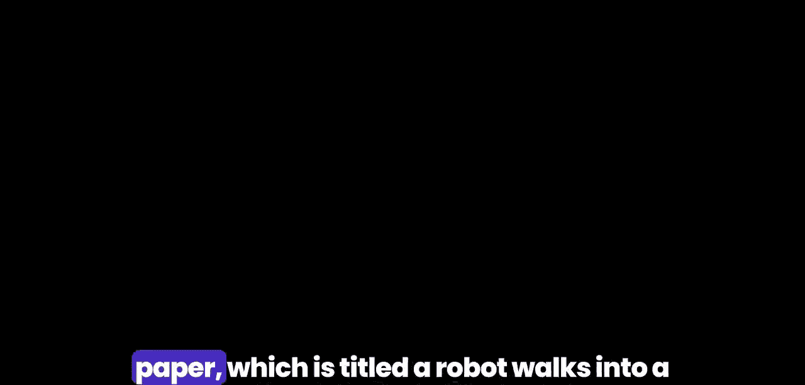
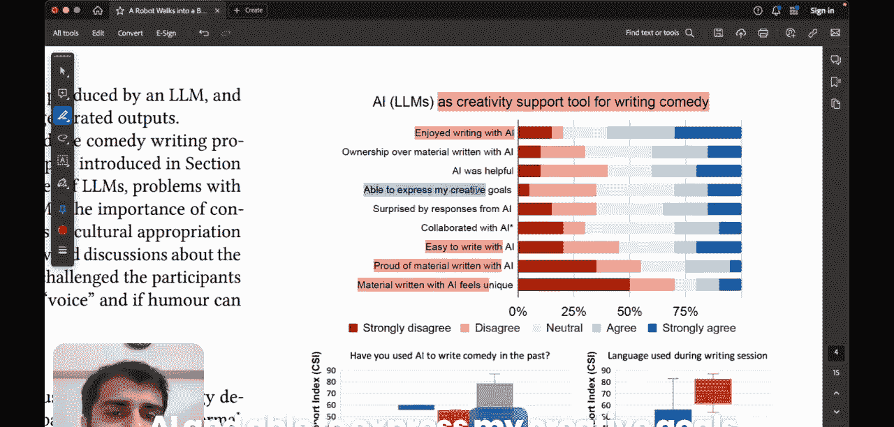

#  019：使用AI创作单口喜剧 - Google DeepMind新研究解析

## 概述

在本节课中，我们将要学习一篇由Google DeepMind发表的、题为《A Robot Walks into a Bar》的有趣研究论文。这篇论文的核心目标是探索大型语言模型能否作为单口喜剧创作的创意支持工具。我们将详细拆解其研究背景、假设、方法、结果与发现，并理解其对AI与创意领域结合的启示。

---

## 研究背景与目标

上一节我们介绍了论文的基本目标，本节中我们来看看其具体的研究背景。

这篇论文探讨了语言模型能否作为喜剧创作的创意支持工具。该主题本身非常有趣，因为它深入研究了专业单口喜剧演员是否能在大型语言模型的帮助下，生成剧本和创作内容，并从中获得实际效用。

研究人员采访了20位在观众面前进行现场表演的专业喜剧演员。他们进行了一项包含人机交互问卷的调查，试图通过该问卷了解这些人是否确实从ChatGPT等工具中获得了帮助。

这是一个名为“AI、伦理与社区”的研讨会。其理念是探索任何形式存在于大型语言模型核心的偏见或其他因素，是否会影响喜剧内容的生成。

当你观看此视频时，可以试着思考哪些因素可能影响喜剧创作。无论你喜欢哪位单口喜剧演员，你喜欢他们笑话的哪个部分？你可能与他们个人的故事或背景产生共鸣，也可能喜欢他们的幽默类型，无论是黑色幽默还是略带冒犯性的幽默。每位喜剧演员都有自己独特的风格，正是这种风格使他们受欢迎。

因此，我们在此探索的主题本身就非常有趣，因为我们使用的是一套通过在海量数据集上训练而演化出来的软件，现在却试图用它来生成喜剧。

---

## 核心挑战与假设

在深入了解研究方法之前，我们需要理解将机器学习与幽默结合所面临的根本性挑战。

正如论文所言，人类是已知唯一使用幽默来逗笑他人的物种。幽默经过数百万年的进化演变而来。它的进化方式赋予我们更好地与同类建立联系的能力。幽默不仅在于你说什么，更是面部表情、词语语境等一切元素的完整混合体。因此，很难确切地写下为什么某个特定的喜剧片段让你发笑。这正是这项任务难度极高的原因。

在开展研究之前，研究人员提出了一些希望验证的假设。

以下是他们提出的主要假设：

*   **假设一：LLM存在偏见，且会影响生成的喜剧内容。**
    这些偏见可能有两种类型：性别偏见和种族偏见。研究人员详细列出了所有这些偏见。其中一些可能是表征性偏见本身，另一些则可能是这些偏见模型的下游后果所表现出的外在偏见。基本上，偏见会极大地影响剧本的生成方式，因为如果你对特定宗教或性别存在偏见，那么你的笑话将总是特定类型的。偏见会限制你的创作，如果大型语言模型确实存在偏见，这将在生成的剧本中体现出来。这假设是否正确有待检验。

*   **假设二：可能对被视为冒犯性的言论进行审查。**
    喜剧演员经常使用包含大量粗俗语言的表达，他们的素材也可能包含一些挑衅性主题。研究人员强调，LLM可能会审查你的内容，即它们会拒绝回答具有冒犯性的提示。这对于许多喜剧演员来说，将真正夺走其喜剧的核心本质。如果他们的喜剧套路核心包含大量黑色幽默或冒犯性笑话，那么LLM的这种审查将严重阻碍剧本的生成。这些喜剧演员通常使用冒犯性笑话来进行“向上抨击”和讽刺，即挑战现有的社会结构，以建立同理心，而不是“向下打压”他人。因此，它并非用于贬低某人，而是作为讽刺手段来挑战现有的社会结构。

*   **假设三：LLM将完全错过语境。**
    语境是关键，否则，如果你只是听到某事或某人在你不了解语境的情况下对你说某事，你可能会感到被冒犯。因此，笑话必须与语境恰当关联，否则不会成功。研究人员认为LLM会出现这种情况。

*   **假设四：内容将趋于同质化。**
    这意味着AI生成的产物可能导致审美风格的同质化。例如，如果对某个种族存在偏见，那么这将成为一种同质化的力量，并成为社会主导风格。

以上是作者在进行研究之前提出的所有假设。

---

## 研究方法

接下来，我们具体看看研究人员是如何设计和实施这项研究的。

他们与20位喜剧演员一起举办了研讨会，其中第一次研讨会是线下进行的，有10位参与者，随后的三次研讨会是在线上完成的。

他们以描述项目议程开始为期三小时的会议，并要求参与者填写信息表和同意书。

第一个练习是写作练习，参与者必须参与喜剧写作练习。他们花费大约45分钟与大型语言模型合作来开发一个剧本。研究人员邀请他们使用自己感到舒适的语言。他们使用该工具来生成、解释笑话，通过迭代提示共同创作笑话，并分析、重写或完成他们之前的一些素材。因此，它被用作生成喜剧套路剧本的一种助手。大多数人使用了ChatGPT-3.5，有些人也使用了GPT-4或由Gemini驱动的Google Bard。

之后，他们要求参与者填写多项调查。第二项调查用于计算创意支持指数。基本上，创意支持指数越高，表示在AI帮助下生成的剧本越有创意且令人满意。CSI包含探索性、表达性、沉浸感、享受度、成果等方面。

最后，还进行了焦点小组提问。

---

## 研究结果与分析

现在，让我们来看看这项研究的结果。希望你已经理解了这项研究的更广泛目标以及它是如何进行的。

**AI作为喜剧写作的创意支持工具**

以下是针对一些关键问题的反馈结果：

*   **AI编写的材料是否独特？**
    大多数喜剧演员不同意这一点，他们认为材料并不独特，非常普通。
*   **你是否享受与AI一起写作？**
    大多数人表示是的，他们确实享受这个过程。
*   **你是否对AI编写的材料感到自豪？**
    他们并不为此感到自豪。
*   **与AI一起写作是否容易？**
    这并不是非常容易。
*   **是否能够表达我的创意目标？**
    同意程度也不是非常强烈。

这些结果表明，虽然AI可以作为辅助工具提供一定帮助，并在过程中带来乐趣，但在生成独特、高质量、能充分体现创作者个人风格和目标的喜剧内容方面，目前仍存在明显局限。

---

## 总结

本节课中，我们一起学习了Google DeepMind关于使用AI辅助单口喜剧创作的研究。我们了解了该研究旨在探索LLM作为创意工具的潜力，分析了其提出的关于偏见、审查、语境缺失和内容同质化等核心假设，并回顾了通过研讨会和调查进行的研究方法。最终的结果表明，AI在喜剧创作中能提供一定的协助和乐趣，但在生成独特、个性化且符合创作者深层意图的优质内容方面，仍有很长的路要走。这项研究揭示了AI与人类创意结合时的复杂性与挑战，为未来开发更有效的创意支持工具提供了重要参考。