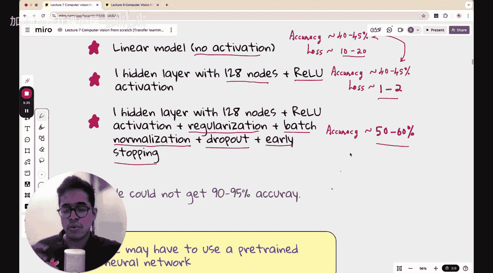

#  002：迁移学习


欢迎回到计算机视觉从零开始的系列课程。在本节课中，我们将学习迁移学习。

如果你没有观看本系列之前的一些视频，不必担心。因为本节课的内容几乎是独立的，因为迁移学习的概念普遍适用于计算机视觉内外的各种深度学习问题。

如果你一直在学习本课程之前的讲座，可能会感到有些困难。因为我们一直在努力构建一个能够以不错准确率对五类花卉数据集进行分类的深度神经网络。我们希望能达到90%或95%的准确率，但尚未实现，因为我们仍在尝试较简单的模型。

如果你感到困难，那么在本节课结束时，你会感到非常满意。因为今天我们将构建一个在实际数据上表现非常好的分类模型，度过一段愉快的时光。让我们开始今天的课程。

和本系列课程一样，在开始之前，让我们提醒自己开始这个计算机视觉系列的原因：是为了从零学习CV技术及其基本原理，以便在课程结束后能为我们所用。如果你有开始学习的理由，就应该坚持完成。这是我们共同许下的承诺。理想情况下，如果你和朋友或熟人一起学习本课程，请互相督促，确保你们能一节课一节课地完成。

如果你想通过公开评论来督促自己，也请随意。无论哪种方式，只要对你有用，都可以。我会在本系列每节课开始时重复这一点，因为我真的非常希望你能从头到尾跟随这个系列，从而从中获得最大收益。

言归正传，让我们进入今天的课程，并简要说明在本节课结束时你将学到什么。

你将学习预训练嵌入。预训练嵌入指的是，如果有一个深度神经网络已经在其他数据上训练过（不是你当前试图训练神经网络的数据，而是其他互联网数据），你能否以某种方式获取那些嵌入（即权重、偏置和参数），并将其转移到你当前的神经网络中，以增强网络在你感兴趣的数据上进行分类的能力。预训练嵌入可以被导入并用于你当前的模型，这通常也被称为迁移学习。这是一个非常著名的术语。

人们正在各种数据集上训练神经网络。因此，如果你仔细想想，实际上并不需要自己从头开始训练。例如，你可以对大型语言模型进行微调，完全没有必要花费数百万美元从头训练一个完整的GPT或任何其他语言模型。你可以利用人们已经在大量互联网数据上训练好的LLM，并在此基础上进行微调。

在今天的课程中，我们将从图像分类神经网络（特别是深度神经网络）的角度来学习这些概念。但其中许多思想也与大型语言模型的微调方式有相似之处。所以，如果你熟悉大型语言模型领域，这些术语可能对你来说并不陌生。

无论如何，让我们假设自己是完全的初学者，开始本课的学习。

## 为什么学习迁移学习？🤔

在本课程中，我们学习迁移学习的原因是，在未来的计算机视觉课程中，我们几乎总是会使用迁移学习。

为了让你跟上进度，即使你没有看过之前的课程，我也简要回顾一下本系列到目前为止我们一直在尝试做的事情。

我们有一个名为“五类花卉”的数据集，包含雏菊、蒲公英、玫瑰、向日葵和郁金香五类花卉。我们想要构建一个图像分类器，一个能对这些花卉进行分类的五分类器。每个类别大约有几千张图片，具体数字需要核实，但数据量并不大，可能比十万张花卉数据小两个数量级。这是一个相对较小的数据集，这使得从头开始训练神经网络并获得很高的准确率变得非常困难。

如果一个神经网络进行随机分类，就像一只猴子随机挑选一个类别作为预测的花卉类别，那么它的准确率将是20%，因为这是随机分类。同样，一个非常糟糕的神经网络在这种情况下最低也能获得20%的准确率。

以此为基准，我们尝试了三件事。首先，我们尝试了线性模型。在这个线性模型中，没有激活函数。这意味着我们最后使用了一个softmax层来获得概率分布，但在主要架构中没有激活函数。我们所做的是将图像转换为RGB像素，并展平成一个单层，然后通过全连接层连接到最终的输出层。这是线性模型，其准确率在训练集上约为40-45%，在测试/验证集上可能更低，约为30-35%，损失值在10到20之间。

然后，我们增加了一个隐藏层。这个隐藏层有128个节点，并使用了修正线性单元激活函数。不幸的是，尽管我们期望获得更好的准确率，但并未实现。准确率仍然在40-45%左右，具体数字显然取决于你的特定超参数或随机种子等。但一个令人惊讶的现象是，损失值从10-20下降到了1-2。这很有趣，于是我们产生了一个疑问：如果损失值下降了一个数量级，为什么准确率没有相应变化？这是因为模型正确分类的图像数量并没有增加，在验证集或训练集上，它仍然只正确分类了40-45%的图像。损失值下降的原因是每个预测变得更加自信了。例如，第二个模型不再说“这是75%的雏菊”，而是开始说“这是95%的雏菊”。这种置信度的提高降低了交叉熵损失。这就是损失值大幅下降但准确率基本保持不变背后的逻辑。

接着我们想，只有128个节点和ReLU激活函数可能还不够。于是我们引入了一些正则化技术，以通过消除可能的过拟合来提高模型性能。我们从图表中注意到存在一些过拟合现象。例如，在一张图表中，训练准确率在5个epoch后持续上升，但验证准确率在3个epoch后开始下降。这是模型出现过拟合的迹象。因此，我们决定进行正则化。我们使用了L2正则化、批归一化（使数据集均值接近0，标准差为1）、引入了Dropout（以预设的概率随机关闭不同层中的某些节点），并且还引入了早停法，这样模型就不会运行过多的epoch。一旦验证准确率开始下降，它会再观察几次迭代，如果验证准确率没有改善，模型就会停止训练。通过这些方法，我们期望获得很好的准确率，但同样没有实现。准确率仅从40-45%提高到了50-60%。训练准确率最高达到60%，验证准确率在45-55%左右。这并非巨大的改进，只是略有提升，但它给了我们希望，让我们觉得如果尝试更复杂的模型或其他方法，我们的从零开始方法或许能行得通。



然而，本节课我们将采用一种不同的、更强大的方法：迁移学习。我们将看到，利用他人已经训练好的模型知识，可以极大地提升我们在这个小型花卉数据集上的性能。

## 迁移学习核心概念 🧠

迁移学习的核心思想是**知识迁移**。一个在大型、多样化数据集（如ImageNet）上预训练好的神经网络，已经学习到了丰富的通用视觉特征（如边缘、纹理、形状）。我们可以利用这些学到的特征作为起点，而不是从随机权重开始训练我们的模型。

这通常通过两种主要方式实现：

1.  **使用预训练模型作为特征提取器**：我们移除预训练模型的最后几层（通常是负责特定分类的全连接层），然后将其余部分（称为“骨干网络”或“编码器”）的输出作为我们新任务的输入特征。接着，我们可以在这些特征之上训练一个全新的分类器（例如，几个全连接层）。在此过程中，**预训练骨干网络的权重被冻结（即不更新）**，我们只训练新添加的分类器层。
    ```python
    # 伪代码示例：特征提取模式
    base_model = PretrainedCNN(weights='imagenet')
    base_model.trainable = False  # 冻结预训练层
    features = base_model.output
    # 添加新的分类层
    x = layers.GlobalAveragePooling2D()(features)
    x = layers.Dense(256, activation='relu')(x)
    predictions = layers.Dense(5, activation='softmax')(x)  # 5类花卉
    model = Model(inputs=base_model.input, outputs=predictions)
    # 只编译和训练新添加的层
    model.compile(...)
    model.fit(...)
    ```

2.  **微调**：在特征提取器方法的基础上更进一步。我们不仅训练新添加的分类层，还会**解冻预训练模型的一部分或全部层**，并以较小的学习率对它们进行更新。这允许模型根据我们的特定数据集对其学到的通用特征进行细微调整。
    ```python
    # 伪代码示例：微调模式
    # 首先，在冻结基网络的情况下训练新层几轮
    # ...（同上特征提取模式训练）
    # 然后，解冻部分层进行微调
    base_model.trainable = True
    # 通常只微调后面的层，前面的层保持冻结
    for layer in base_model.layers[:100]:
        layer.trainable = False
    # 使用更小的学习率重新编译模型
    model.compile(optimizer=optimizers.Adam(learning_rate=1e-5), ...)
    model.fit(...)
    ```

## 迁移学习步骤 📝

以下是使用迁移学习解决我们花卉分类问题的一般步骤：

1.  **选择预训练模型**：选择一个在大型图像数据集（如ImageNet）上预训练好的成熟卷积神经网络架构，例如VGG16、ResNet、EfficientNet等。
2.  **准备数据**：确保我们的花卉图像数据被预处理成与预训练模型训练时相同的格式（例如，相同的图像尺寸、像素值归一化范围）。
3.  **构建迁移学习模型**：
    *   加载预训练模型，不包括其顶部的全连接分类层。
    *   添加新的全局池化层（如GlobalAveragePooling2D）来减少参数。
    *   添加新的全连接层，其输出节点数等于我们的花卉类别数（5个），并使用softmax激活函数。
4.  **训练策略**：
    *   **第一阶段（特征提取）**：冻结预训练基网络的所有层，只训练新添加的顶层。使用相对较高的学习率。
    *   **第二阶段（可选，微调）**：解冻基网络的部分或全部层（通常从后面的层开始），以非常低的学习率继续训练整个模型。这有助于模型更好地适应我们的特定数据。
5.  **评估与预测**：在独立的测试集上评估最终模型的性能，并使用它进行预测。

## 预期优势 ✨

通过应用迁移学习，我们期望在五类花卉数据集上实现以下突破：
*   **准确率大幅提升**：有望达到90%甚至更高的分类准确率，远高于我们之前从零开始训练的模型。
*   **训练效率高**：由于利用了预训练的特征，模型收敛速度更快，所需的训练时间和数据量更少。
*   **避免过拟合**：预训练模型提供的强大特征表示有助于防止在小数据集上容易发生的过拟合。

## 总结 🎯

本节课中，我们一起学习了迁移学习这一强大的深度学习技术。我们了解到，迁移学习的核心在于重用在大规模数据集上预训练好的模型所学习到的通用特征，并将其应用于我们自己的、通常规模较小的特定任务中。

我们探讨了两种主要方法：将预训练模型作为固定的特征提取器，以及对其进行微调以更好地适应新数据。通过这种方式，我们可以克服从头训练模型需要大量数据和计算资源的限制，快速构建出高性能的模型。


在接下来的实践中，你将亲身体验迁移学习如何轻松地将我们花卉分类模型的性能提升到一个新的高度。这标志着我们从构建基础模型迈向了应用先进、实用的解决方案。