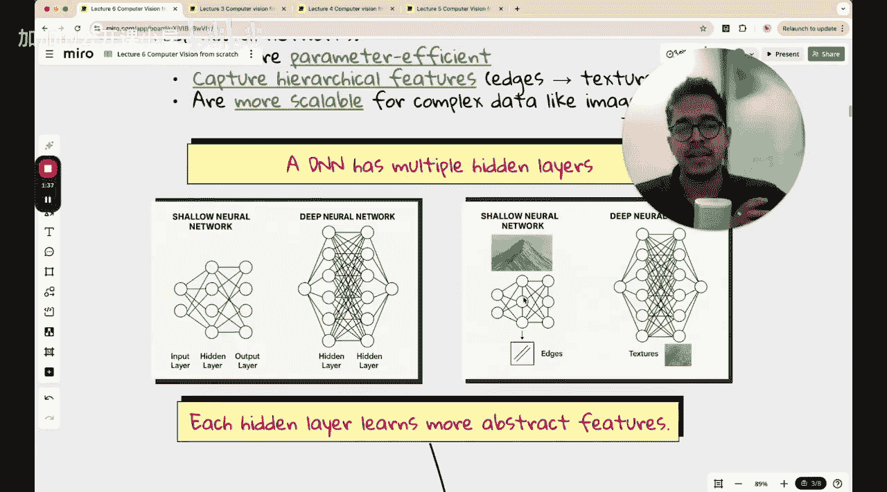

#  003：防止过拟合 - 正则化、Dropout、早停、批归一化


在本节课中，我们将学习四种有助于最小化神经网络过拟合的技术：正则化、Dropout、早停和批归一化。我们将从基础概念讲起，并在课程最后将这些技术整合起来，应用于我们的五类花卉分类模型，以观察性能的提升。

## 课程回顾与问题引入

在开始新内容之前，我们先简要回顾前两讲的内容，以便建立上下文。

在第三讲中，我们为五类花卉数据集构建了一个线性模型。该模型的架构非常简单：将RGB图像展平为一维向量，然后通过全连接层直接输出到最终的Softmax层。这个模型的分类准确率很低，大约只有45%-50%。

在第四讲中，我们尝试增加模型的复杂度，添加了一个包含128个节点的隐藏层，并使用了ReLU激活函数。虽然模型的损失值从10-20下降到了1-2，但分类准确率并没有显著提升。模型只是对相同的预测变得更加“自信”，而并未学到更有效的特征。

紧接着，在上一讲中，我们进行了超参数调优，尝试了不同的学习率、训练轮数、批次大小和图像尺寸。然而，即使使用了像Weights & Biases这样的专业工具进行系统化实验，我们仍未获得显著改进。更重要的是，我们观察到了一个典型的过拟合现象：训练准确率持续上升，而验证准确率却达到平台期后开始下降。

这表明模型开始“记忆”训练数据中的噪声，导致其在未见过的验证数据上表现变差。本节课的核心目标，就是学习如何应对和缓解这种过拟合问题。

## 为何需要深度神经网络？🧠

在深入具体技术之前，我们首先探讨一下为何要转向更深的神经网络。

我们的课程目标是最终掌握卷积神经网络和迁移学习，这些都是深度神经网络。增加网络深度（即添加更多隐藏层）主要有两个原因：

1.  **参数效率**：深度神经网络是高效的通用函数逼近器。图像数据本质上是像素值的函数，深度网络能以更少的参数来拟合复杂的函数模式，比传统的近似方法（如傅里叶级数）更高效。
2.  **特征学习能力**：与我们在第三、四讲中探索的浅层网络不同，深度网络（特别是卷积神经网络）能够学习到图像的层次化特征。浅层网络可能只擅长检测边缘等基础形状，而深层网络可以进一步组合这些边缘，检测出纹理、部件乃至整个物体。



上图直观展示了从边缘检测到纹理/物体检测的层次化过程，这正是深度网络的优势所在。

## 核心防过拟合技术 🔧

接下来，我们将逐一探讨四种防止过拟合的核心技术。

### 1. 正则化

正则化是一种通过修改损失函数来约束模型权重、防止其变得过大的技术。其核心思想是鼓励模型学习更简单、更平滑的函数，从而提升泛化能力。

最常用的L2正则化（也称为权重衰减）将权重的平方和添加到原始损失函数中。新的损失函数公式如下：

**`L_new = L_original + λ * Σ(w_i²)`**

其中，`L_original`是原始损失（如交叉熵），`λ`是正则化强度超参数，`Σ(w_i²)`是所有模型权重的平方和。

添加这项后，优化算法在降低原始损失的同时，也会倾向于让权重值变小。大的权重通常意味着模型对输入数据的微小变化反应剧烈，这往往是过拟合的特征。通过惩罚大权重，模型会变得更加稳健。

### 2. Dropout 🎲

Dropout是另一种非常有效的正则化技术，它在训练过程中随机“丢弃”一部分神经元。

具体操作是：在每次训练迭代（前向传播和反向传播）中，以预先设定的概率 `p`（例如0.5）随机将网络中某些隐藏层神经元的输出设置为0。这些被“关闭”的神经元在此次迭代中不参与计算。

```python
# 在PyTorch中，添加Dropout层非常简单
self.dropout = nn.Dropout(p=0.5)
```

Dropout迫使网络不能过度依赖任何少数神经元，因为它们在每次迭代中都有可能被随机屏蔽。这相当于在每次迭代中训练一个不同的、更“薄”的网络子集。最终效果是让网络学习到更加鲁棒的特征，因为特征信息必须分散在许多不同的神经元上，从而减轻了过拟合。

### 3. 早停 ⏹️

早停是一种简单直观的策略。其做法是持续监控验证集上的性能（如准确率或损失）。

当验证性能在连续若干轮训练后不再提升，甚至开始下降时（而此时训练性能可能仍在上升），我们就提前终止训练过程。

这种方法直接阻止了模型在训练集上继续“记忆”噪声。我们需要一个“耐心”参数，例如`patience=5`，意味着只有当验证损失连续5轮没有改善时，才触发早停。

### 4. 批归一化

批归一化虽然最初是为了解决训练时内部协变量偏移、加速训练而提出的，但它也具有良好的正则化效果。

BN层通常添加在激活函数之前。它对每一批输入数据进行归一化处理，使其均值为0，方差为1。

**`BN(x) = γ * [(x - μ) / √(σ² + ε)] + β`**

其中，`μ`和`σ²`是当前批次的均值和方差，`γ`和`β`是可学习的缩放和偏移参数，`ε`是一个极小值用于数值稳定。

通过保持每一层输入的稳定分布，BN使得网络对参数初始化和学习率不那么敏感，训练更稳定。同时，由于它在训练时使用批次的统计量（均值和方差），而在测试时使用整个训练集估算的移动平均值，这种噪声引入了一种轻微的正则化效果，有助于防止过拟合。

## 总结与展望 📚

本节课我们一起学习了四种防止神经网络过拟合的关键技术：
1.  **正则化**：通过惩罚大的权重，促使模型学习更简单的模式。
2.  **Dropout**：在训练中随机禁用神经元，增强网络的鲁棒性。
3.  **早停**：根据验证集性能提前结束训练，避免过度拟合训练数据。
4.  **批归一化**：稳定层间输入分布，加速训练并带来正则化益处。


在接下来的实践中，我们将把这些技术应用到我们的花卉分类模型上。通过组合使用这些方法，我们期望能够显著抑制过拟合现象，从而在验证集上获得更高的分类准确率，让模型获得真正的泛化能力。