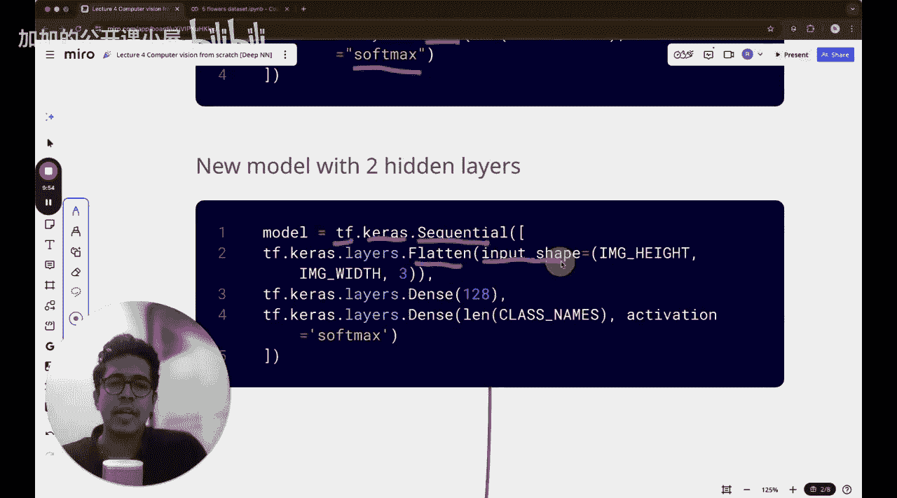
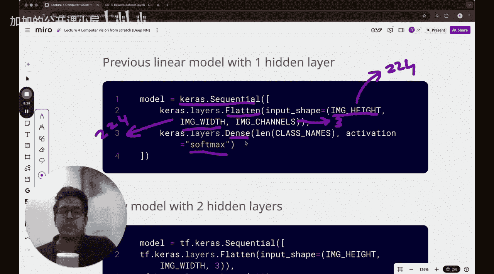

#  005：用于图像分类的神经网络


在本节课中，我们将构建一个简单的深度神经网络。与上一节使用的线性模型不同，这次我们将引入激活函数。我们将观察这个简单的深度神经网络是否能在五类花卉数据集上实现分类。

欢迎来到本节课。在开始之前，让我们回顾一下本课程的目标：从最基础开始，共同掌握计算机视觉。我们目前仍处于课程的早期阶段。开始容易，坚持完成不易。让我们共同承诺完成这个学习过程。

## 回顾上一节内容

上一节中，我们尝试了一个单隐藏层网络。严格来说，它甚至不能称为神经网络，因为我们只是将输入图像展平。我们有一个包含五类花卉（蒲公英、玫瑰、向日葵、郁金香等）的数据集。我们将RGB彩色图像转换为像素表示，然后将其展平为一个列向量作为输入，试图预测图像属于哪一类花卉。

在上一节结束时，我们讨论了希望构建更深的神经网络。这就是我们接下来的步骤。今天，我们将构建一个稍深的神经网络，即包含两个隐藏层。虽然真正的深度神经网络有更多隐藏层，但两个隐藏层是一个很好的起点。更重要的是，与之前不同，这次我们将使用激活函数。

## 上一节实验结果

我们尝试了对训练数据和验证数据进行五分类。从图中可以看到，训练数据的分类准确率大约在0.5到0.6之间。这个结果并非100%可重复，但根据多次实验，训练准确率通常在0.45到0.6的范围内，而验证准确率则低于这个值。

你还可以观察到，验证准确率的曲线波动很大。这是因为我们以批次（batch）为单位训练模型，每次迭代后更新参数。这种波动表明模型参数在训练或验证过程中没有得到很好的优化。

## 本节目标与改进思路

今天我们要探讨的问题是：能否通过某些方法提高这个准确率？使用更深的神经网络可能是一个答案。因此，今天我们将使用一个包含两个隐藏层的深度神经网络，而不是线性模型。

上一节使用的线性模型存在一个问题：它在输入层之后直接连接了输出层（尽管使用了Softmax将输出转换为概率），但在分类过程中并未使用激活函数来引入非线性。我们得到的准确率曲线显示，训练准确率在0.4到0.6之间，验证准确率更低且波动大。

这种波动可能与我们使用的批次大小（16）和优化器（Adam，默认学习率0.001）有关。找到最佳学习率、迭代次数和批次大小的过程称为超参数调优。

从结果中可以明显观察到模型开始过拟合。在第三个或第四个迭代周期（epoch）结束时，验证准确率开始下降，而训练准确率仍在上升。这意味着模型正在学习训练数据中更细微的模式（可能是噪声），而不是学习花卉的通用模式。当验证准确率开始下降时，就表明模型开始过拟合。因此，我们不应运行过多的迭代周期。同时，注意损失值（loss）的量级大约在10到20之间。

现在的问题是：我们能否定义一个稍复杂的、具有两个隐藏层的神经网络来获得更好的结果？例如，将准确率从50%提高到70%？

## 新的网络架构

让我们讨论新的隐藏层结构。

*   第一个隐藏层是展平层（Flatten）。这与之前相同。
*   第二个隐藏层是一个包含特定数量节点的层。在我们的例子中，第二个隐藏层将使用128个节点。

展平层中的节点数量等于图像中RGB像素的总数。如果我们使用224x224的RGB图像，那么总像素数为 `224 * 224 * 3`。第一个隐藏层（展平层）就有这么多节点。

然后，从隐藏层1到隐藏层2是全连接（Fully Connected）的，从隐藏层2到输出层也是全连接的。最后，输出通过Softmax函数转换为概率分布，得到每类花卉的概率。

回顾上一节使用Keras构建的代码，我们使用 `tf.keras.Sequential` 顺序模型，其中定义了初始的展平操作 `tf.keras.layers.Flatten`，输入形状为 `(224, 224, 3)`。下一层就是带有Softmax激活函数的最终输出层。严格来说，这个Softmax并没有为模型的预测能力做出贡献，它只是将最终输出转换为概率分布。

## 本节引入的改进

今天，我们将引入一个额外的隐藏层，即这个128个节点的隐藏层。

以下是更新后的代码结构示意：

```python
model = tf.keras.Sequential([
    tf.keras.layers.Flatten(input_shape=(224, 224, 3)),  # 第一隐藏层：展平层
    tf.keras.layers.Dense(128, activation='relu'),       # 第二隐藏层：128个节点，使用ReLU激活函数
    tf.keras.layers.Dense(5, activation='softmax')       # 输出层：5个节点，使用Softmax激活函数
])
```

现在，模型的层数增加了。第一层是展平层，作为输入。





## 总结


本节课中，我们一起回顾了上一节线性模型的局限性，并提出了构建更深层网络的改进思路。我们计划构建一个包含两个隐藏层的神经网络，并在其中引入激活函数（如ReLU），以期提升模型在五类花卉图像分类任务上的性能。下一节我们将具体实现这个网络并观察其结果。