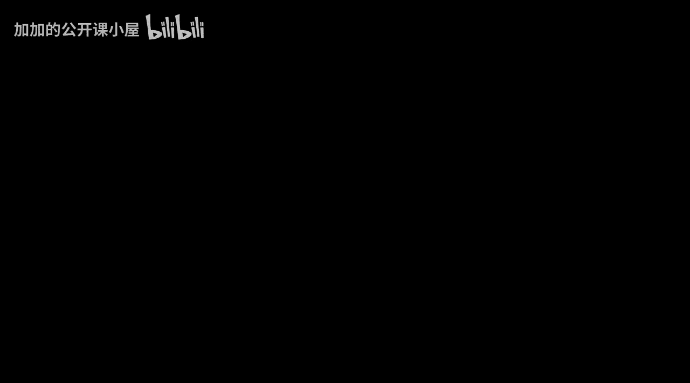
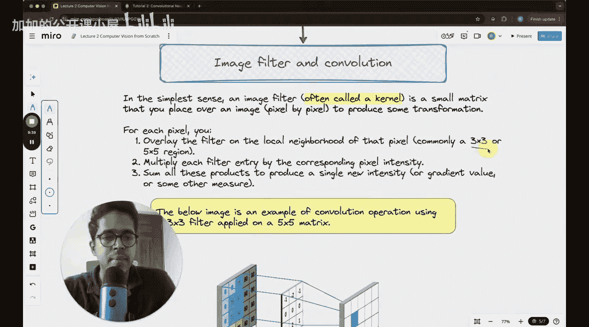

#  007：滤波器与卷积入门

在本节课中，我们将学习计算机视觉中的传统方法，重点是理解滤波器以及卷积运算。这些概念不仅是传统计算机视觉的核心，也是现代深度学习（特别是卷积神经网络）的基础。通过掌握这些基础知识，你将能更好地理解图像特征是如何被提取的。

上一节我们介绍了课程的整体框架，本节中我们来看看计算机视觉中一个非常核心的操作：卷积。

## 卷积运算与滤波器简介

卷积运算和滤波器是传统计算机视觉方法的心脏。在2012年深度学习兴起之前，这些手工设计的滤波器是处理图像的主要工具。即使在现代深度学习中，卷积操作依然是卷积神经网络背后的核心思想。

滤波器本质上是一些简单的矩阵，例如 **3x3** 或 **5x5** 的矩阵。这些矩阵是手工设计的，其背后有特定的逻辑或数学构造，用于识别图像中的特定特征，如边缘、角点、垂直边缘或水平边缘。

以下是卷积运算的一个直观示例：

上图展示了一个卷积核（即滤波器）在图像上滑动的过程。当滤波器的形状与图像中某个区域（例如眼睛）匹配时，输出值会很高（例如100）；当不匹配时，输出值则很低（例如0）。右侧的5x5矩阵就是卷积的输出结果，其中高亮部分对应图像中眼睛的位置。

## 为何需要学习传统滤波器

你可能会问，既然我们已经进入深度学习时代，为何还要关心这些手工设计的滤波器？原因在于，尽管现代神经网络通过反向传播自动学习滤波器参数，但理解传统滤波器的工作原理能为你提供坚实的基础。

*   **建立直觉**：理解滤波器如何捕捉特征，能让你在后续学习卷积神经网络时，对各层的作用有更直观的认识。
*   **预处理应用**：在计算资源有限的情况下，使用滤波器对图像进行预处理（如降噪、边缘增强）是提高效率的好方法。
*   **历史与基础**：这些手工滤波器是现代学习型滤波器的前身。了解Sobel、Laplacian等经典滤波器，能让你对整个领域有更深的领悟。

## 图像滤波器与卷积操作详解

如前所述，滤波器（常称为卷积核）是一个矩阵。图像本身也是一个矩阵（像素值）。卷积操作就是让这个滤波器矩阵在图像矩阵上滑动，并在每个位置进行特定的计算。

卷积操作的基本公式可以简化为：在图像的每个局部区域，将滤波器矩阵与对应的图像像素值逐元素相乘，然后将所有乘积结果求和，得到一个输出值。这个过程在图像的所有位置上重复进行。

上图示意了卷积核在图像上移动并计算的过程。通过这种操作，我们可以提取出图像的各种特征。

本节课中我们一起学习了滤波器与卷积的基本概念。我们了解了滤波器是什么，卷积运算如何工作，以及为什么这些传统知识对理解现代计算机视觉仍然至关重要。在接下来的课程中，我们将深入探讨几种具体的经典滤波器。