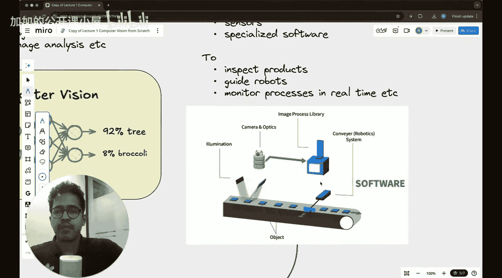
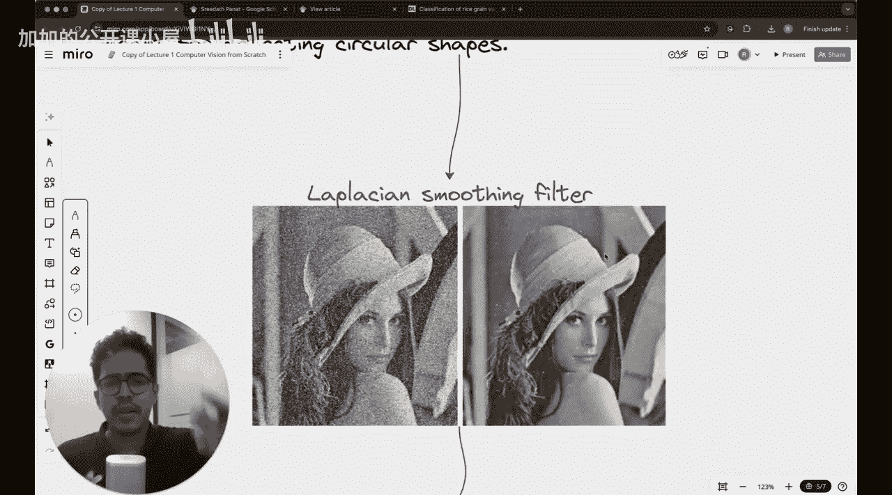

#  008：计算机视觉导论

在本节课中，我们将正式学习什么是计算机视觉，了解其历史演变，以及在应用机器学习和深度学习技术之前，人们尝试过哪些方法。

## 课程概述与承诺

在开始之前，我想展示一张图表。这张图表来自我们的一个播放列表，显示了观看次数随课程编号的变化。

可以看到，前几节课的观看量很高，但超过90%的观众在后续课程中流失了。这清楚地表明，开始一件事很容易，但坚持完成却很难。我真诚地希望，如果你正在观看这个视频并开始这个系列课程，你能成为坚持完成的那一类人。在开始之前，让我们共同承诺，一起完成计算机视觉的端到端学习。这对你将是非常有益的，如果你能学会并打下坚实的基础，我也会感到非常高兴。

## 课程参考材料

如果你想知道本系列课程将使用什么参考资料，我主要参考的是O'Reilly出版的《Practical Machine Learning for Computer Vision》一书。

😊，这是一本非常受欢迎的书，你可以在亚马逊上找到。我购买了Kindle电子书格式，价格并不昂贵（大约2000印度卢比）。这本书写得非常好，并且有一个关联的GitHub仓库，发布在Google Cloud Platform上。仓库链接也在这个笔记中提供，它有近500个星标，这是一个非常大的成就。如果你购买这本书，我认为这是一项非常好的投资。全书大约500页，我发现书中的某些章节需要为本课程做一些调整，因此我对书的目录进行了一些修改。但本书将是你在整个课程中的主要参考资料。

## 计算机视觉与机器视觉的区别

让我们从一个很多人可能都有的常见疑问开始：计算机视觉和机器视觉到底有什么区别？十年前我开始从事机器视觉工作时，也有几乎完全相同的疑问。

主要区别在于，机器视觉关注的是视觉系统在制造业等行业的实际应用。我曾参与一个项目，在一个砂轮附近安装了一个小型摄像头。砂轮可用于切割金属或抛光表面，其表面嵌有许多磨粒。当砂轮非常锋利时，用光照射表面会显示出许多明亮的白点；而当锋利度下降时，这些亮点的亮度也会减弱。因此，你可以通过这个机器视觉设置（摄像头定期拍摄照片）来跟踪光学照明的减少程度，从而监测砂轮的磨损情况。这是一个纯粹的机器视觉项目，因为你将整个系统视为一个整体，可能涉及摄像头、照明、传感器或处理软件。所有这些共同构成了机器视觉系统。

在另一个项目中，我在第一节课已经展示过。

这是一篇关于使用计算机视觉对大米品种进行分类的论文，并被国际机器视觉会议接受。

在这篇论文中，我们本质上也是使用了一个基于摄像头的系统，通过图像跟踪单个米粒的分布，然后我们可以用最小二乘法椭圆拟合米粒，利用椭圆的长轴和短轴长度来预测它是哪种大米。这也是一个经典的机器视觉应用。

因此，在机器视觉中，你通常需要将硬件与软件系统结合起来，包括摄像头、照明等，所有这些都很重要。

而在计算机视觉中，主要目标是如何让机器理解或解释图像或视频（视频可以分解为帧，本质上也可以视为图像）。这意味着计算机视觉更侧重于：你已经有了来自视觉系统的输入数据，然后你开发算法、理论模型、机器学习模型或基于规则的系统，用于诸如人脸识别、自动驾驶汽车、分析身体扫描图像等应用。在计算机视觉中，你已经有了图像输入，并使用基于机器学习的系统、基于规则的系统或深度学习系统来对其进行处理，并从中得出一些结论。在我展示的这个示例图像中，就像一个神经网络在进行二元分类，判断这是一棵树还是西兰花。

这就是计算机视觉和机器视觉的根本区别。本课程不是关于机器视觉，而是关于计算机视觉，因此我们将主要关注那些允许我们处理图像并从中提取信息的技术。

## 计算机视觉与人类视觉的区别

这是计算机视觉和人类视觉的根本区别。在计算机视觉中，你的输入是一张图像。例如，如果是一张苹果的图像，你有一个计算机视觉模型以该图像作为输入。这个模型（可以是机器学习模型或非机器学习模型，稍后我会展示一些非机器学习模型的例子）会做出预测。

😊，显然，在人类视觉中，你看到一个苹果，你的眼睛看到了它。神经递质会产生适当的信号，你最终会在大脑中接收到这些信息，从而使你说出“这是一个苹果”。所以主要区别在于，判断这是苹果还是橙子或其他东西的处理过程，在计算机视觉系统中发生在模型里，而在你身上则发生在大脑中。

## 计算机视觉的技术演变

在2010年之前，计算机视觉方法主要通过启发式方法（即手动定义的规则）来实现。但如今，你更常见的是基于深度学习和卷积神经网络的计算机视觉方法。视觉Transformer、生成扩散模型等先进技术也相继出现，但这些都开始得稍晚一些。

😊，2010年之前主要是没有机器学习的计算机视觉技术。如果你看这个重叠部分，计算机视觉并不总是意味着会使用机器学习，事实远非如此。计算机视觉中有许多技术与机器学习无关，也有许多技术更侧重于深度学习而非传统机器学习。

如果你想知道机器学习和深度学习之间的区别，我将在同一节课中简要讨论。但基本上，只需理解计算机视觉并不自动意味着你在研究卷积神经网络。

然而，这也是一个问题。在2010年之前，要处理图像并从中提取信息或特征，你必须手动定义一些算法和规则。这些规则大多是通过一种称为“滤波器”的东西来实现的。

例如，请看这个滤波器的例子。

如你所见，左侧的图像有很多噪点。你可以应用一种称为拉普拉斯平滑滤波器来平滑图像。我稍后会展示这些滤波器。但滤波器的定义是非常手动的。如果你非常聪明，你可以设计出能高效完成任务的滤波器。

## 课程总结

在本节课中，我们一起学习了计算机视觉的基本定义，区分了计算机视觉与机器视觉、人类视觉的不同，并回顾了计算机视觉从基于规则的方法到现代机器学习与深度学习方法的技术演变历程。我们还了解了本课程将使用的主要参考书籍。下一节课，我们将开始深入探讨具体的图像处理技术和基础概念。