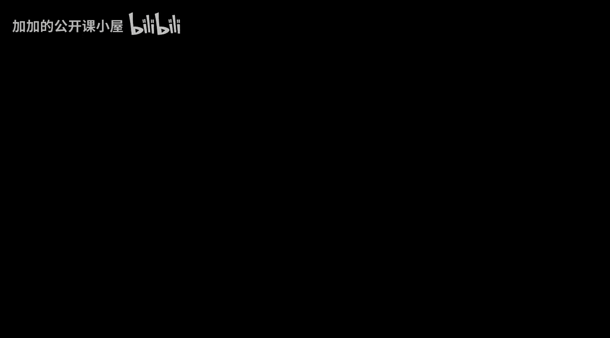
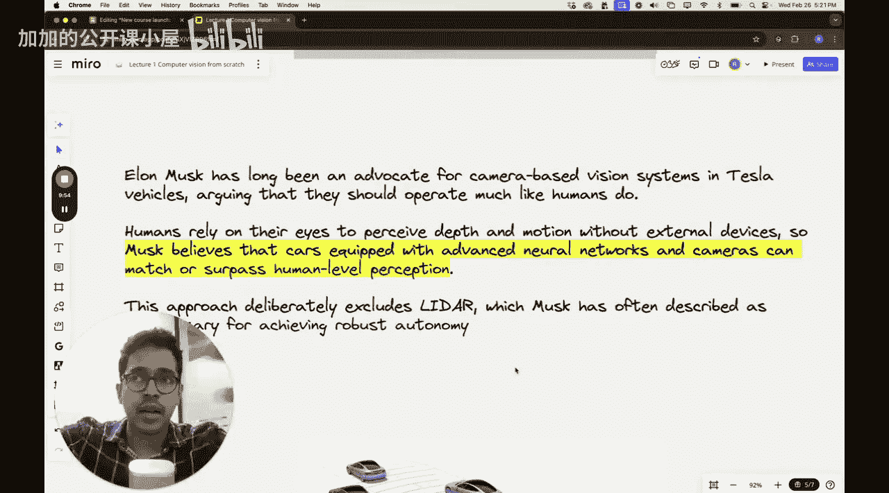

#  009：课程介绍与动机 🚀

在本节课中，我们将介绍全新的“计算机视觉从零开始”课程。我们将了解课程大纲、目标受众，并探讨如何在学习过程中保持动力，为后续深入学习打下基础。

---

## 课程大纲与目标受众

上一节我们介绍了课程启动的背景，本节中我们来看看课程的具体内容和适合的学习者。

本课程将教授计算机视觉的基础知识以及为实际生活问题实现计算机视觉模型的实践方面。我们收到了大量来自不同平台的信息，表明市场对结构良好的计算机视觉课程有强烈需求，这是创建本课程的主要动机之一。

我是 Sar Panant 博士，是 Visuwarra AI Labs 的联合创始人之一，同时也拥有麻省理工学院的博士学位。在开始攻读博士之前，我就已深入计算机视觉领域，但当时更多使用的是传统的机器视觉技术。

以下是本课程旨在帮助的人群：
*   **行业专业人士**：希望在公司（如制造自动驾驶汽车、自主无人机或物体检测AI摄像头的公司）中获得相关职位的人。
*   **学生**：希望系统学习计算机视觉知识的学习者。
*   **严肃的学习者**：真正对计算机视觉感兴趣并愿意完成整个课程的人。

---

## 保持学习动力

完成一个长课程充满挑战。我注意到，许多学生可能在最初几讲热情高涨，但随着课程长度增加，很难坚持到底。实际上完成整个课程的学生数量远少于开始课程的学生数量。我自己作为学生时，开始学习的课程数量也远多于实际完成的。

但如果你是一位严肃的学习者，真心想掌握计算机视觉，我希望能陪伴你完成整个学习旅程。我们将讨论如何保持动力，如何一讲一讲地坚持学习。

---

## 从传统视觉到深度学习的演进

我首次深入计算机视觉研究大约在10年前，当时是本科期间与教授合作的一个有趣项目。

项目目标是使用相机图像对水稻谷物品种进行分类，并且我们必须实现非机器学习的传统算法来完成此任务。我和合著者开发了传统滤波器，用于检测图像的各个方面，例如边界、边缘、水稻谷物的曲率等。从中我们可以提取某些特征，如谷粒长度、宽度、长宽比等，并利用这些特征进行聚类分析。

这是一次非常宝贵的经历，因为即使实现基于传统非机器学习的算法，也是一次很好的练习，它教会了我许多关于图像处理的知识。

当时（2015-2016年）的流程如下：
1.  获取不同品种水稻谷物的相机图像。
2.  进行**阈值处理**以增强背景与谷物之间的对比度。
3.  找出检测谷物与其背景之间边缘或边界的方法。
4.  用于计算谷物局部曲率半径。
5.  定义何时两个谷物接触、何时未接触，如果接触，如何将其分割。
所有这些技术都是通过纯数学和逻辑手动开发的。

我们在法国尼斯举行的国际机器视觉会议（ICMV）上展示了这项工作。在会议上，我们意识到一个趋势：大多数前来展示研究成果的研究人员都在思考机器学习或深度学习技术。用于手动定义识别图像或视频中物体规则和条件的传统机器视觉技术正在迅速改变，机器视觉领域正在快速演进。

许多研究人员正逐渐从这些基于规则或专家知识的系统转向，他们明确地在实施深度学习技术。我们甚至被问到诸如“你是否尝试过使用深度学习技术进行预测？”或“在基于大小进行聚类时，能否使用K均值聚类？”等问题。我意识到，从那时起，如果我想继续从事机器视觉工作，就必须将重点转向基于机器学习的方法，而不是传统的基于规则的方法。

---

## 规则方法与深度学习方法对比

在基于规则的方法中，你需要手动定义算法来分类图像或从中提取信息。典型步骤包括：
*   将图像转换为灰度图。
*   执行一些增强技术，如**Otsu阈值处理**。
*   进行噪声过滤。
*   提取边界信息。
*   处理物体接触或破损等复杂情况。
*   拟合最小二乘椭圆以近似谷物尺寸。
*   计算几何参数（如长度、宽度）。
*   使用这些参数进行聚类分析。

然而，自从许多深度学习方法发展以来，这已经变成一个相对简单的问题。如果有大量图像，我们可以轻松训练基于卷积神经网络的方法。这个神经网络可以执行多类分类，并轻松预测它正在查看的图像类型。在过去的10到12年里，我亲眼目睹了这一转变。

---

## 深度学习在复杂问题中的应用

现在，每当我从事机器视觉或计算机视觉相关项目时，几乎总是使用深度神经网络。例如：
*   用于目标检测的技术，如 **YOLO**。
*   在麻省理工学院攻读博士期间，我曾致力于生物系统，任务是构建深度卷积神经网络，根据细胞形态预测信使RNA（mRNA）处理效果。这是一个非常困难的问题，因为形态不仅取决于mRNA处理，还严重依赖于温度、湿度等外部条件，信噪比非常高。构建一个优秀的深度卷积神经网络架构来解决这个问题极具挑战性，但从计算机视觉的实践角度来看，这段经历也教会了我很多东西。

---

## 现实世界的例子：特斯拉自动驾驶

让我们看看特斯拉的自动驾驶汽车。我最近读了Walter Isaacson所著的《埃隆·马斯克》一书，这是一本650页的大部头，我读得非常享受。但在特斯拉的背景下，我从书中得到的一点是：埃隆·马斯克曾强烈反对激光雷达技术。激光雷达是一种利用传感器数据预测汽车周围环境的技术。

---

## 总结

本节课中，我们一起学习了“计算机视觉从零开始”课程的概述。我们明确了课程目标、适合的学习者，并回顾了计算机视觉从传统规则方法向现代深度学习演进的历史。我们还探讨了如何保持学习动力，并看到了深度学习在复杂研究问题和现实世界应用（如自动驾驶）中的强大能力。在接下来的课程中，我们将从基础开始，逐步深入这些激动人心的技术。