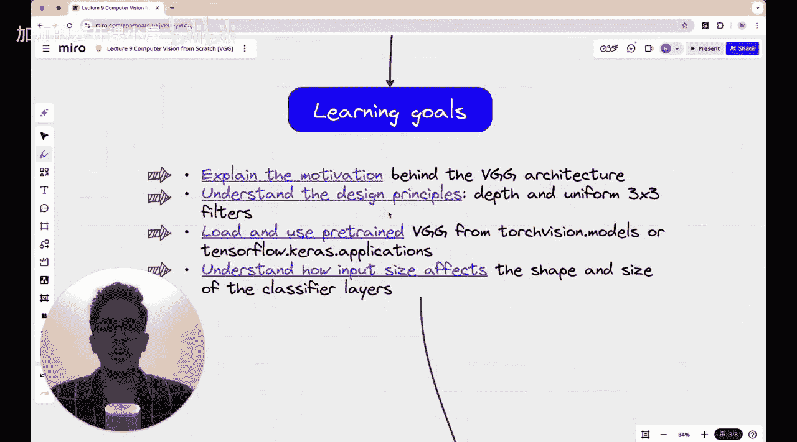

计算机视觉从零开始：P10：VGGNet：拥有14.5万次引用的传奇论文

在本节课中，我们将学习一个非常著名的神经网络架构——VGGNet。我们将探讨它如何挑战了AlexNet的统治地位，分析其架构特点，并学习如何将其应用于我们的五类花卉数据集。

---

在上一讲中，我们讨论了AlexNet如何在2012年彻底主导了深度学习领域，并赢得了ImageNet竞赛。

本节中，我们将看看VGGNet如何威胁到AlexNet的统治地位。这同样是一篇传奇论文，拥有超过14.5万次引用，于2014年提出，并在当年的ImageNet挑战赛中获得亚军。

我们将具体讨论VGGNet，它与AlexNet相比有何特别之处，以及“VGG”这个术语代表什么。我们将研究其架构，并为其在我们的五类花卉数据集上实现一个模型。现在，让我们开始学习。

2014年至2016年间，深度学习领域发生了许多重大进展。正是在这一时期，VGGNet、Inception、ResNet等神经网络架构相继出现。在后续的一些课程中，我们也将花时间学习Inception和ResNet，它们同样是极其著名的深度学习架构。

然而，所有这些模型都在试图回答一个问题：**如何在卷积神经网络中增加更深层的数量，以提升性能，同时不显著增加训练所需时间，也不损失性能（即验证或测试准确率）？** 这是当时深度学习社区的研究者们共同探索的问题。VGGNet作为早期提出的架构之一，给出了一个非常清晰的答案，尽管它只是对深度神经网络架构进行了一个简单而巧妙的调整。这些模型中的一些，为未来更复杂的模型设定了基准。

我们将结合本课程迄今为止所学内容来审视VGGNet。在深入VGG细节之前，让我们先退一步，回顾一下本计算机视觉课程中我们已经完成的工作。

我们一直在处理五类花卉数据集，每类大约有1000张图像，因此我们面临的是一个五分类任务。

我们从一个线性模型开始。这个模型只是将图像转换成一个线性向量，然后通过一个全连接层直接输出。没有激活函数，只在最后使用Softmax函数将预测转换为概率。这个模型表现很差，训练准确率在40%到45%之间，验证准确率更低，大约在35%到40%之间，损失非常高，在10到20之间。

随后我们意识到线性模型效果不佳，因此需要引入激活函数和隐藏层。我们引入了一个具有128个节点和ReLU激活函数的隐藏层模型。这并没有显著提高准确率，准确率大致相同，但损失降低了一个数量级，表明我们的预测比之前的线性模型更有信心。这是最初的模型架构：RGB图像被展平，然后通过全连接层连接到输出层。额外的层被添加在这个展平层之后。

接着我们认识到，仅仅在中间隐藏层添加128个节点是不够的，因为模型可能过拟合了——训练准确率仍然高于验证准确率，这在我们的实验中非常明显。于是我们决定采取措施防止过拟合，包括正则化、批量归一化、Dropout和早停法。这些措施取得了一定成功，我们将验证准确率从30%-40%提高到了50%-60%。对于一个随机分类准确率为20%的五分类模型来说，这已经不错了。我们还看到，当我们进行批量归一化时，训练准确率可以达到近75%-80%，尽管验证准确率仍接近60%。与之前的基于隐藏层的模型相比，这是一个巨大的改进。

但我们意识到进展缓慢，这还不够好。因为在典型的卷积神经网络图像分类任务中，我们通常期望看到准确率达到90%甚至95%的模型。因此，我们决定进行迁移学习。我们使用了一个预训练的ResNet模型，不是从头开始训练，而是只训练模型的后面几层，其余层基本保持不变。通过这种方法，我们实际上达到了100%的训练准确率和约80%的验证准确率。虽然从趋势上看存在一些过拟合，但这已经是我们迄今为止获得的最佳结果。

正是在上一讲中，我们决定尝试AlexNet，它在2012年彻底革新了深度学习领域。这篇由Geoffrey Hinton教授和OpenAI联合创始人Ilya Sutskever等人撰写的论文，是一篇被引用超过17万次的传奇论文。我们使用AlexNet获得了约90%的验证准确率和95%的训练准确率，这是迄今为止最好的模型。

然而，2012年之后，深度学习卷积神经网络领域发生了许多变化。在本课程接下来的几讲中，我们将探索这些变化，了解出现了哪些新模型，以及它们在深度学习领域带来了哪些新思路。今天，我们就从VGG开始。

但在开始之前，我们总是说，开始任何课程系列都很容易，但坚持完成却绝非易事。我很高兴大家已经到达了课程的这一阶段，因为我确信很多从第一、二讲开始学习的人可能没有坚持下来，这是普遍现象。我重复这一点，是为了激励我们所有人朝着同一个目标前进。让我们在心里许下承诺，既然已经开始了，就要完成它。如果你有朋友或熟人也对学习计算机视觉感兴趣，请互相督促。如果没有，也可以公开留言，以此督促自己回来完成课程。

现在，让我们深入了解VGG的细节。希望在本讲结束时，我们能够理解VGGNet在2014年提出其架构背后的动机。

VGG有一个非常具体的特点：它主要使用**3x3的卷积滤波器**。它摒弃了使用不同形状滤波器（如5x5、11x11、7x7等）的复杂性。VGGNet专注于一件事：**使用统一尺寸（3x3）的滤波器，但增加网络层数，即增加深度，同时保持架构简洁**。这种方法被证明非常有效，我们稍后会讨论这一点。

我们还将加载并使用一个预训练的VGG模型（不使用Keras，而是使用PyTorch的`torchvision.models`）。我们会将这个预训练的VGG模型应用到我们的五类花卉数据集上，看看能得到什么样的结果。它可能比AlexNet更好，也可能不是。

最后，我们还将讨论图像的**输入尺寸如何影响后续分类层的形状和大小**。由于我们正在进行迁移学习，显然需要修改神经网络最后几层的结构，因为我们处理的是五分类任务，而VGG的预训练很可能不是针对五分类进行的。因此，我们需要修改最后几层。我们将学习如何操作，以及从预训练VGG部分的最后一层到我们添加的额外层，再到最终的五节点输出层，这些中间层的形状应该是怎样的。我们也会讨论相关的维度问题。

现在，让我们正式开始介绍VGG架构。如前所述，这篇论文于2014年由牛津大学的一个研究小组提出。实际上，“VGG”这个缩写与机器学习或深度学习无关，它代表的是提出这篇论文的**视觉几何组**。

---

本节课中，我们一起学习了VGGNet这一传奇的卷积神经网络架构。我们回顾了从简单线性模型到复杂网络的发展历程，理解了VGGNet通过**统一使用3x3小卷积核并堆叠深层网络**来提升性能的核心思想。我们还探讨了如何将预训练的VGG模型通过迁移学习应用到新的分类任务上，并了解了修改网络末端以适应特定任务输出维度的方法。VGGNet以其简洁有效的设计，为后续更复杂的网络架构奠定了重要基础。