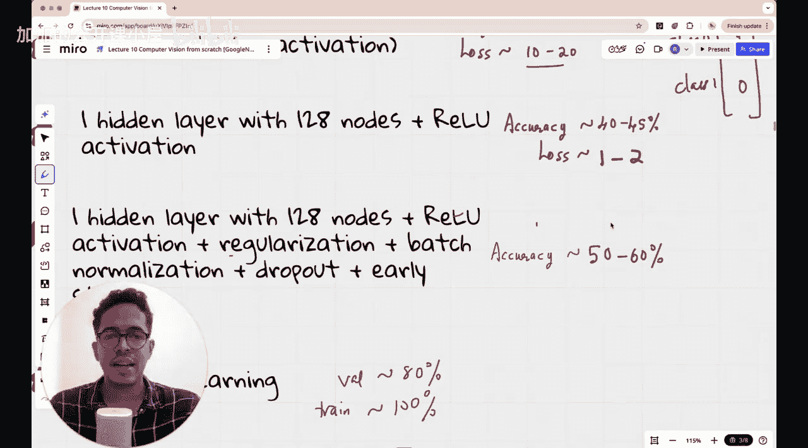

#  011：GoogleNet（又名Inception V1）｜ 在ImageNet挑战赛中排名第一的传奇CNN模型 🏆


在本节课中，我们将学习GoogleNet，也称为Inception V1。这是一个非常著名的卷积神经网络架构，它在2014年的ImageNet挑战赛中获得了第一名，其相关论文已获得超过68,500次引用，达到了传奇地位。如果你从事计算机视觉工作，几乎可以肯定你尝试过Inception V1、V2、V3等不同模型。今天，我们将花时间理解是什么让GoogleNet如此流行和高效，以及它如何克服了AlexNet、VGG等先前架构的一些缺点。我们将通过在我们的五类花卉数据集上构建GoogleNet模型来进行实践。

## 背景与动机

在上一讲中，我们讨论了VGG架构，它尝试使用非常基础的3x3卷积滤波器，这与AlexNet等先前架构不同。但总体而言，计算机视觉领域的研究人员当时正试图构建越来越深的卷积神经网络。到2014年，人们清楚地认识到，深度意味着可以从复杂图像中学习更多特征。然而，问题是网络越深，训练就越困难，因为参数过多，在反向传播时更新如此多的参数非常困难。此外，当深度过大时，初始层会经历梯度消失问题，其权重和偏置的更新速度远不如后面的层。同时，计算开销也非常巨大。

VGG架构通过简化思路，在所有卷积层中使用3x3滤波器，展示了无需使用不同大小的卷积滤波器，只需选择一种尺寸并增加深度即可。这一发现非常有趣，使得VGG在2014年ImageNet挑战赛中获得第二名。

然而，VGG网络的一个问题是其总参数量高达约1.38亿，这是一个非常庞大的架构。尽管它使用了简单的3x3卷积滤波器，但总参数量依然巨大。

## GoogleNet的核心理念

谷歌的研究人员提出了Inception（GoogleNet）的想法。他们提出的基本问题是：**我们能否设计一个既有深度，又在训练时相对高效的架构？**

他们的答案是GoogleNet。其核心思想是：**不再仅仅使用3x3滤波器，而是在每一层内部使用多尺度滤波器**。他们意识到，与VGG的做法不同，你实际上可以使用不同尺寸的滤波器，这实际上有助于减少参数总量，从而使整个神经网络架构不那么庞大。

## 课程回顾

在深入GoogleNet之前，我们先简要回顾一下本课程迄今为止的内容。

我们一直在使用五类花卉数据集（雏菊、蒲公英、玫瑰、向日葵、郁金香），每类大约有1000张图像。任务是进行五类图像分类，我们正逐步构建复杂度递增的神经网络。

1.  **线性模型（无激活函数）**：结构为：RGB图像 -> 展平层 -> 全连接输出层（5个节点）。仅在最后使用Softmax函数将输出值转换为概率分布。该模型准确率约为40-45%，损失在10-20之间。
2.  **添加隐藏层和激活函数**：我们在展平层后添加了一个128个节点的隐藏层，并使用ReLU激活函数。令人惊讶的是，准确率并未提高（仍为40-45%），验证准确率甚至更低（35-40%）。但损失下降了一个数量级（降至1-2）。这是因为模型现在做出了更自信的预测，尽管分类正确的比例变化不大，但每个预测相关的损失减小了。
3.  **应对过拟合**：由于训练准确率（40-45%）高于验证准确率（35-40%），我们认为是过拟合。于是我们添加了正则化、批归一化、Dropout和早停法。这使得验证准确率提升至50-60%，训练准确率甚至接近70%。虽然有所改善，但距离我们期望的95%以上的多类分类准确率仍有差距。

## Inception模块详解

现在，让我们来看看GoogleNet的核心创新——Inception模块。

传统的卷积层通常只使用一种尺寸的滤波器（例如VGG只用3x3）。Inception模块的想法是，与其在深度上纠结，不如在宽度上做文章，**在同一层中并行应用多种尺寸的卷积核（如1x1, 3x3, 5x5）以及池化操作**，然后将所有结果在深度维度上拼接起来。这样，网络可以在同一层级捕捉不同尺度的特征。

然而，直接这样做会导致计算成本爆炸式增长。例如，将上层所有通道与多种大尺寸卷积核进行卷积，参数量会非常大。

GoogleNet的关键优化是引入了 **1x1卷积**。1x1卷积主要有两大作用：
1.  **降维**：在应用3x3或5x5等大卷积核之前，先使用1x1卷积来减少输入特征的通道数，这可以显著减少计算量和参数量。
2.  **增加非线性**：1x1卷积后通常会接一个ReLU激活函数，从而增加网络的非线性表达能力。

因此，一个典型的Inception模块结构如下：

以下是Inception模块的标准结构流程：

1.  输入特征图。
2.  并行进行四个分支处理：
    *   **分支1**：1x1卷积。
    *   **分支2**：1x1卷积 -> 3x3卷积。
    *   **分支3**：1x1卷积 -> 5x5卷积。
    *   **分支4**：3x3最大池化 -> 1x1卷积。
3.  将四个分支输出的特征图在通道维度上进行拼接。
4.  输出拼接后的特征图。

通过代码可以更直观地表示其核心结构（以PyTorch风格为例）：

```python
class InceptionModule(nn.Module):
    def __init__(self, in_channels, ch1x1, ch3x3red, ch3x3, ch5x5red, ch5x5, pool_proj):
        super().__init__()
        # 分支1: 1x1卷积
        self.branch1 = nn.Conv2d(in_channels, ch1x1, kernel_size=1)
        # 分支2: 1x1卷积 -> 3x3卷积
        self.branch2 = nn.Sequential(
            nn.Conv2d(in_channels, ch3x3red, kernel_size=1),
            nn.Conv2d(ch3x3red, ch3x3, kernel_size=3, padding=1)
        )
        # 分支3: 1x1卷积 -> 5x5卷积
        self.branch3 = nn.Sequential(
            nn.Conv2d(in_channels, ch5x5red, kernel_size=1),
            nn.Conv2d(ch5x5red, ch5x5, kernel_size=5, padding=2)
        )
        # 分支4: 3x3最大池化 -> 1x1卷积
        self.branch4 = nn.Sequential(
            nn.MaxPool2d(kernel_size=3, stride=1, padding=1),
            nn.Conv2d(in_channels, pool_proj, kernel_size=1)
        )
    def forward(self, x):
        branch1_out = self.branch1(x)
        branch2_out = self.branch2(x)
        branch3_out = self.branch3(x)
        branch4_out = self.branch4(x)
        # 在通道维度上拼接所有分支的输出
        outputs = [branch1_out, branch2_out, branch3_out, branch4_out]
        return torch.cat(outputs, dim=1)
```

## 辅助分类器

GoogleNet的另一个重要创新是引入了**辅助分类器**。

由于网络很深，梯度在反向传播时可能会减弱或消失，导致深层网络难以训练。为了解决这个问题，GoogleNet在网络中间层添加了两个辅助分类器。这些辅助分类器在训练期间参与计算损失，但在推理（预测）时会被移除。

辅助分类器的作用是：
1.  **提供额外的梯度信号**：帮助梯度更有效地传播回网络的早期层，缓解梯度消失问题。
2.  **起到正则化作用**：相当于一种模型内部的正则化，可能有助于提升主分类器的性能。

总损失函数由三部分组成：
**总损失 = 主分类器损失 + 辅助分类器1损失 * 权重 + 辅助分类器2损失 * 权重**
通常权重设置为0.3。

## 整体网络架构

GoogleNet的整体架构由多个Inception模块堆叠而成，中间穿插着一些用于下采样的最大池化层。网络开头是普通的卷积层和池化层，结尾是全局平均池化层和全连接层。

其大致结构如下：
1.  初始卷积和池化层。
2.  多个Inception模块堆叠（例如Inception 3a, 3b, 4a, 4b, 4c, 4d, 4e, 5a, 5b）。
3.  在中间层（4a和4d输出后）插入辅助分类器。
4.  末尾使用全局平均池化替代传统的全连接层，这大大减少了参数量。
5.  最后一个全连接层输出最终的分类结果。

与拥有1.38亿参数的VGG相比，GoogleNet的参数量仅为约500万，但却实现了更高的精度，这充分体现了其设计的优越性。

## 实践应用与总结

在本课程中，我们将像使用VGG一样，利用预训练的GoogleNet模型，并在我们的五类花卉数据集上进行迁移学习。我们将比较GoogleNet与之前模型的验证准确率和训练准确率。



本节课中，我们一起学习了传奇的GoogleNet（Inception V1）架构。我们了解到，它通过设计**Inception模块**（在单层内并行使用多尺度卷积与池化，并用1x1卷积降维）和引入**辅助分类器**，成功地构建了一个既深又宽且参数高效的网络，从而在2014年ImageNet挑战赛中夺冠。其核心在于**通过精心设计的结构来提升性能，而非简单地堆叠参数**。在接下来的实践中，我们将亲身体验这一强大架构的效果。