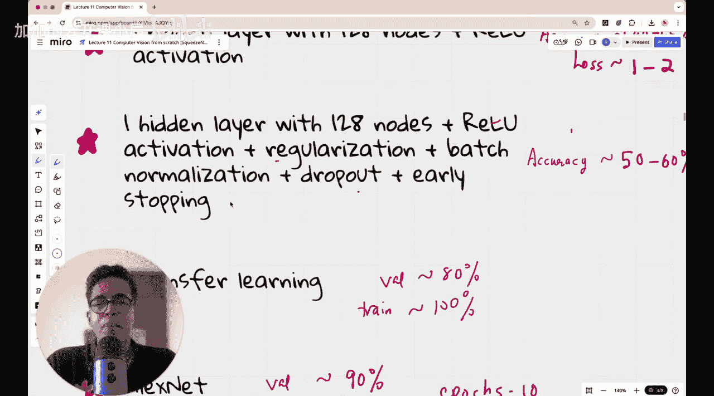

#  012：为何更小的CNN可以更聪明？

欢迎回到计算机视觉从零开始的新一讲。本节课我们将理解SqueezeNet，并将在我们的5类花卉数据集上实现它。

SqueezeNet是一种非常出色且流行的神经网络架构。它首次让深度学习研究者们相信，即使是参数量相对较少、体积较小的神经网络，也能达到与其他流行卷积神经网络（如AlexNet）相似的准确率。因此，SqueezeNet非常受欢迎。当我们为数据集实现SqueezeNet架构时，我希望能展示其结果，并将其与我们迄今为止尝试过的所有架构（包括ResNet、AlexNet、VGG和Inception V1）的结果进行比较。那么，欢迎来到今天的课程。

## 背景与动机

2012年至2016年是深度学习研究的疯狂时期。随着2012年AlexNet的引入，它彻底改变了深度学习在计算机视觉中的应用方式，证明了深度神经网络可以被有效地训练以对图像做出良好预测。随后出现了更多模型，例如2014-15年引入的VGG，以及后来更名为Inception V1的GoogleNet。

那么问题来了，既然在2015、2016年左右发生了这么多事情，并且这些神经网络在ImageNet自然图像分类挑战赛中表现出色，为什么研究者们还要引入SqueezeNet？SqueezeNet究竟是什么？我们将在今天的课程中讨论这些问题。

## 核心问题：模型大小

2015-2016年左右，深度学习社区面临的主要问题是，像VGG和GoogleNet这样的模型体积“庞大”——这里的“庞大”指的是参数数量和文件大小。VGG约有1.38亿个参数，GoogleNet约有680万个参数。与VGG相比，GoogleNet的体积显著减小，这本身就是一个重大进步。正如我们在上一讲中讨论的，GoogleNet赢得了2014年ImageNet挑战赛的第一名，而VGG在同一挑战赛中获得了第二名。

如果我们使用这些大型模型，将它们部署到移动电话或物联网等小型设备上会非常困难，这些设备可能使用树莓派等计算能力较低的模块。最终，如果你想要边缘计算，即将模型嵌入这些小型设备中，而不是放在云端，你就需要非常高效的小型模型。但问题是，小型模型在分类任务上通常表现不佳。这就是为什么AlexNet在2012年引入时很重要，它表明你可以拥有深度神经网络并有效训练它来做出良好预测。VGG将其提升到了另一个层次，它是一个更大的架构，表明你只需要简单的3x3卷积层，将它们串联堆叠就能得到好结果。而GoogleNet则表明，你不仅可以使用3x3卷积，还可以使用1x1卷积，然后并行使用3x3、5x5卷积等，然后将这个Inception模块串联重复，也能得到好结果。

那么，为什么人们会想到压缩卷积神经网络的大小呢？正是因为他们看到神经网络变得越来越大、越来越大。如果你真的想将其部署到设备上，就必须拥有高精度的小型模型。

## SqueezeNet论文简介

这篇可以在arXiv上访问的论文标题非常直接：“SqueezeNet: AlexNet-level accuracy with 50x fewer parameters and <0.5MB model size”。如此大胆且有趣的论文标题实属罕见。

论文的第一作者是Forrest N. Iandola。这篇论文现在已有近11000到12000次引用，是一篇非常出色的论文。任何引用超过1000次的论文都可以称为杰作，而超过10000次引用的论文则是顶级论文，因此这篇论文和SqueezeNet架构都非常著名。

它的目标是（或者说它实现的是）达到AlexNet级别的准确率。尽管AlexNet早在四年前的2012年就已问世，但它仍然非常流行，因此超越AlexNet确实是一个基准。更重要的是，它实现了参数数量的大幅减少。我将在今天课程的后半部分展示一个表格，比较AlexNet、VGG、Inception V1（即GoogleNet）以及SqueezeNet的参数数量、文件大小、引入年份和构建者等信息。基本上，这个高效、低参数的模型有望实现设备端部署，让你可以在手机上运行神经网络，而不是调用某个API访问托管在云端的模型。

## 课程回顾

在进一步深入课程之前，我想做一个简短的回顾，以防你不记得本课程到目前为止的内容，或者你是第一次观看本课程。如果你不想看回顾，可以跳过，但这不会超过五分钟。

在本课程中，我们一直在探索这个5类花卉数据集。共有五个花卉类别：雏菊、蒲公英、玫瑰、向日葵和郁金香。我们尝试使用各种神经网络架构进行五分类。每个类别只有大约1000张图像，因此数据集总大小并不高，只有约5000张图像。这不是一个非常容易的任务，因为通常你可能需要数万或更多的图像才能进行非常高效的分类。但这很好，因为这将真正把我们的实验推向极限。

我们从一个最简单的线性模型开始。我们有RGB图像，首先将其转换为一个展平层。如果我们有三个通道上的n个像素，那么这些像素将被转换为一个n x 1的列向量。在这个展平层之后，我们有一个最终的五节点输出层，前一层的所有节点都完全连接到最终层的所有节点。除了最后一层使用softmax激活函数将最终输出数字转换为概率分布外，没有其他激活函数。但这并不影响预测方式，所以本质上这是一个没有任何激活函数的线性模型。

当我们实现这个模型时，我们得到了大约40%到45%的训练准确率，验证准确率在35%到40%之间，不是很高。但一个最差的随机分类模型只有20%的准确率（因为有五个类别），所以这个模型比随机分类器要好。损失值在10到20的量级。

然后我们决定，仅仅线性模型是不够的，让我们引入一个具有128个节点的隐藏层，并使用ReLU激活函数。这个模型实际上并没有表现得更好，训练准确率仍在44.5%左右，验证准确率在35%到40%之间。但令人惊讶的是，损失值降到了1到2，降低了一个数量级，但准确率相似。你可能会想，这怎么可能？这是可能的，因为模型仍然做出了相似数量的正确分类。因为如果真实标签是类别0，无论你做出哪种预测（例如概率分布为[0.6, 0.1, 0.1, 0.1, 0.1]或[0.4, 0.2, 0.2, 0.1, 0.1]），准确率都是一样的，因为两者都预测类别0。但后者的损失会更低，因为你做出了更自信的预测。这大致就是单隐藏层方法中发生的情况。此外，还存在一些过拟合，因为训练准确率平均比验证准确率高约10个百分点，这并不好。

于是我们想，如何防止过拟合？然后我们引入了正则化、批归一化、Dropout和早停。早停实际上并不需要，因为我们只运行了100个周期，没有观察到准确率下降，模型并没有过度训练。问题更多在于模型本身不够好，在少数情况下存在过拟合，但除此之外，问题更多与Dropout相关。

---

**本节课总结**

在本节课中，我们一起探讨了SqueezeNet的背景和动机。我们了解到，在深度学习模型日益庞大的背景下，研究者们为了实现在移动设备等资源受限环境中的高效部署，开始追求在保持高准确率的同时大幅减少模型参数和体积。SqueezeNet论文以其明确的目标——“以50倍更少的参数和小于0.5MB的模型大小达到AlexNet级别的准确率”——成为了这一领域的标志性工作。我们还简要回顾了本课程之前使用简单线性模型和单隐藏层模型在花卉分类任务上的实验历程，为后续实现和评估SqueezeNet架构做好了铺垫。下一节，我们将深入SqueezeNet的核心设计思想。