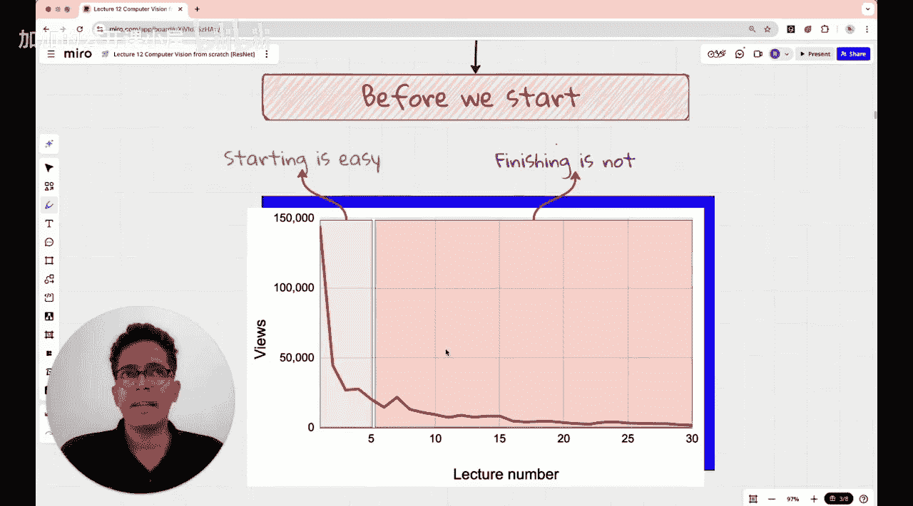

#  013：ResNet详解 - 梯度消失、跳跃连接与代码实现


欢迎回到计算机视觉从零开始的新一讲。本节课我们将实现ResNet，这是最流行的卷积神经网络架构之一。我们将讨论梯度消失问题，这是深度学习社区在2015年之前面临的一个极具挑战性的难题，以及ResNet如何永久地解决了这个问题。我们还将讨论ResNet的实现，并将其结果与本课程中已实现的VGG、SqueezeNet和AlexNet进行比较。我们将对比所有结果，看看ResNet与其他卷积神经网络架构相比表现如何。

现在，让我们开始课程。

## 背景与问题

深度学习社区最初面临一个问题。2012年，AlexNet引入了用于图像数据训练的深度神经网络，并成功展示了通过同时实现ReLU激活、正则化技术以及基于GPU的计算，实际上可以训练更深的神经网络。这确实是一场革命。

但当社区尝试实现层数越来越多的模型时，问题出现了。AlexNet有8层，VGG有16层，Google在2014年提出的Inception V1（也称为GoogleNet）有22层。人们尝试构建越来越深的神经网络，因为他们知道深度神经网络可以从图像数据中学习更多特征。但问题是，训练这些深度神经网络非常困难。

在本课程中，我们尝试了AlexNet、VGG和Inception。到目前为止，我们获得的最佳准确率是在上一讲中的SqueezeNet，它取得了非常好的准确率。但SqueezeNet是一个完全不同的CNN模型。如果比较越来越深的神经网络，会发现一个反直觉的现象：在某些情况下，更深的神经网络表现更差。这意味着我们很难训练VGG和Inception。我们看到验证准确率高于训练准确率，这表明发生了欠拟合或训练不足，而不是过拟合。这有点反直觉，更深的模型似乎破坏了一切，无法正常工作。

但逻辑告诉我们，更深的神经网络应该能够学习更多东西。问题在于，当你有深度神经网络时，网络中的初始层（靠近输入层的层）几乎得不到更新。在梯度下降训练过程中，这些层的权重和偏置几乎不更新。我们将讨论这个问题在数学上是如何发生的。

我们将看看ResNet做了什么特别的事情来解决这个问题，以及它如何彻底改变了深度学习的进程，并完全改变了使用深度神经网络进行图像处理的方式。

## 梯度消失问题

梯度消失问题非常严重，即使使用良好的初始化参数，即使执行批量归一化或训练更多轮次，有时这个问题仍然存在。

在了解ResNet架构之前，让我们像本课程通常做的那样，简要回顾一下到目前为止我们所做的事情。这样，即使你从这一讲开始学习本课程，理想情况下你也应该能在一定程度上理解之前的内容。

我们正在尝试对五类花卉数据集进行分类。数据集包括雏菊、蒲公英、玫瑰、向日葵和郁金香，每个类别有1000张图像。因此，这是一个五分类问题。

我们从一个最简单的架构开始，即线性模型。我们将RGB图像转换为一个扁平层，输出层有五个节点，因为我们执行五分类。但我们没有使用任何激活函数。我们只在最后一层使用了softmax激活函数，以将输出数字转换为概率分布。这导致了40-45%的准确率和10-20的损失。准确率不算太差，但也不算太好，因为即使是随机分类器也能给你20%的准确率。这是40-45%（顺便说一下，这是训练准确率）。验证准确率是30-35-40%。

然后我们想，好吧，让我们添加一个具有128个节点和ReLU激活函数的隐藏层。这并没有太大改变准确率，但将损失降低了一个数量级。损失降低的原因有点反直觉，是因为预测变得越来越自信。这是一件好事，但我们并不满意。

然后我们认为，由于验证准确率是35-40%，训练准确率是40-45%，有时是15%，显然验证准确率和训练准确率存在差异，所以存在一些过拟合。我们想，让我们添加正则化：批量归一化、Dropout、提前停止训练轮次等。我们认为这可能有所帮助，并且在某种程度上确实有所帮助。我们将验证准确率提高到50-60%，但我们仍然不满意。

那时我们意识到，我们一直在从头开始训练，也许我们应该进行迁移学习，使用预训练的神经网络。我们最初在迁移学习中尝试了ResNet模型，训练了10轮，获得了100%的训练准确率和80%的验证准确率。这还可以，但过拟合正在发生，这就是训练和验证准确率存在巨大差异的原因。

然后我们想，好吧，现在让我们一步一步来，也许我们应该按时间顺序进行，从最早的CNN开始，然后逐步增加复杂性，看看当我们在相同数据集上执行分类时，分类效果如何改善。我们一直使用五类花卉数据集。

我们从AlexNet开始，这篇由Alex（第一作者，论文以其命名）、Jeffrey Hinton教授（2024年因引入神经网络而获得诺贝尔物理学奖）和Ilya Sutskever（也是OpenAI联合创始人）撰写的传奇论文永远改变了深度学习。这篇论文非常出色，被引用了17万次。我们运行了10轮，获得了90%的验证准确率和95%的训练准确率。我们非常高兴，这是本课程中第一次在没有太多过拟合的情况下获得如此好的准确率。

然后我们切换到VGG。VGG有更多的参数，正好有1.38亿个参数，而AlexNet大约有6000万个参数。因此，VGG明显更大。尽管我们使用VGG运行了50轮，但只获得了75%的训练准确率，而验证准确率却高达85%，高于训练准确率，这有点有趣，因为它表明我们训练不足。但我们不想运行更多轮次，因为这本身就需要大约四到五个小时。

然后我们切换到GoogleNet，也就是Inception V1。我们运行了50轮，获得了不错的准确率，验证准确率为87%，训练准确率为86%。我认为没有发生过拟合，但准确率没有AlexNet那么高。

在上一讲中，我们切换到SqueezeNet，它的参数数量非常少，不到500万个。我们意识到，SqueezeNet在50轮中的表现甚至比AlexNet在10轮中的表现更好。因此，AlexNet的验证和训练准确率分别约为94%和99%，SqueezeNet也有类似的表现。所以这是迄今为止最好的模型。我知道这有点像苹果和橘子的比较，因为我们在这里运行了更多轮次，但我们对类似VGG或GoogleNet这样层数很深的神经网络无法表现得这么好感到满意，因此对SqueezeNet我们非常满意。

但这就是我们目前所处的位置。SqueezeNet的引入是为了让神经网络能够在边缘设备上运行，例如手机、物联网设备，甚至可能是小型Arduino微控制器。因此，神经网络应该能够在性能不那么高的计算系统上运行。

但ResNet做了不同的事情。它没有解决压缩模型的问题，而是解决了能够训练大型模型的问题。当时的情况是，在2015年、2014年，越来越大的模型开始表现得不如较小的模型。这是一个令人担忧的问题，而ResNet的提出者希望解决它。我们将讨论这个问题。

但在我们进入课程之前，我总是想提醒你，开始一门课程或任何事情都很容易，但完成却一点也不容易。正如你从这个图表中看到的，随着课程的进行，观众数量在减少。所以，如果你现在正在听我讲这一课，那么恭喜你，你已经超越了大多数人。



## 梯度消失问题详解

上一节我们回顾了本课程的历程，并指出了深度模型训练困难的现象。本节中，我们将深入探讨其核心原因：梯度消失问题。

为了理解梯度消失，我们需要回顾一下神经网络是如何通过反向传播算法学习的。在训练过程中，我们计算损失函数相对于网络权重的梯度（导数），然后沿着梯度的反方向更新权重，以最小化损失。这个梯度信息从输出层开始，通过链式法则一层一层地向后传播到网络的早期层。

在非常深的网络中，这个反向传播的链条会非常长。如果每一层传递的梯度都小于1（例如，由于使用Sigmoid或Tanh激活函数，其导数在大部分区域都小于1），那么当梯度传播到早期层时，它会被反复相乘，导致其值变得指数级地小，最终趋近于零。用公式表示，对于第 `l` 层，其接收到的梯度大致为：
`gradient_l ≈ gradient_output * ∏(derivative_of_activation_i) * ...`，其中乘积项很多。当每个 `derivative_of_activation_i` 都小于1时，乘积结果会迅速衰减。

这意味着网络早期层的权重几乎得不到有效的更新。因此，尽管网络很深，但只有靠近输出的最后几层在学习，而负责提取基础特征（如边缘、纹理）的早期层却停滞不前。这就是为什么更深的网络有时表现反而更差，因为它们无法有效训练所有层。

## ResNet的解决方案：跳跃连接

面对梯度消失的挑战，ResNet提出了一种简单而强大的解决方案：跳跃连接（Skip Connections）。

ResNet的核心思想是，我们不要求每一层直接学习一个完整的、新的特征映射，而是让它学习一个“残差”。具体来说，如果某一层的理想输入是 `H(x)`，我们让该层学习残差 `F(x) = H(x) - x`。那么，该层的输出就变成了 `F(x) + x`。

以下是跳跃连接在代码中的典型实现方式（以PyTorch为例）：

```python
import torch.nn as nn

class ResidualBlock(nn.Module):
    def __init__(self, in_channels, out_channels, stride=1):
        super().__init__()
        self.conv1 = nn.Conv2d(in_channels, out_channels, kernel_size=3, stride=stride, padding=1)
        self.bn1 = nn.BatchNorm2d(out_channels)
        self.relu = nn.ReLU(inplace=True)
        self.conv2 = nn.Conv2d(out_channels, out_channels, kernel_size=3, stride=1, padding=1)
        self.bn2 = nn.BatchNorm2d(out_channels)

        # 跳跃连接：如果输入输出维度不一致，需要用1x1卷积调整
        self.shortcut = nn.Sequential()
        if stride != 1 or in_channels != out_channels:
            self.shortcut = nn.Sequential(
                nn.Conv2d(in_channels, out_channels, kernel_size=1, stride=stride),
                nn.BatchNorm2d(out_channels)
            )

    def forward(self, x):
        identity = x # 保留输入
        out = self.conv1(x)
        out = self.bn1(out)
        out = self.relu(out)
        out = self.conv2(out)
        out = self.bn2(out)
        out += self.shortcut(identity) # 添加跳跃连接
        out = self.relu(out)
        return out
```

这个设计带来了两个关键好处：
1.  **解决梯度消失**：梯度现在有了一条“高速公路”，可以通过 `out += identity` 这个加法操作直接流向更早的层。因为加法操作在反向传播时梯度为1，它确保了梯度能够无损地穿过跳跃连接，从而缓解了梯度消失。
2.  **简化学习目标**：让一层学习一个残差 `F(x)`（即输出和输入的差异）通常比学习一个完整的变换 `H(x)` 更容易。如果恒等映射（即什么也不做）是最优的，那么网络可以简单地将 `F(x)` 的权重推向0。

## ResNet架构概览

理解了核心构建块后，我们来看看完整的ResNet架构。ResNet有多种深度版本，如ResNet-18、ResNet-34、ResNet-50、ResNet-101和ResNet-152。数字代表网络的层数。

一个典型的ResNet（如ResNet-34）结构如下：
*   **初始层**：一个7x7卷积层，接着是批量归一化、ReLU和一个最大池化层。这用于快速下采样图像尺寸。
*   **四个阶段（Stage）**：每个阶段由多个残差块堆叠而成。不同阶段之间，通过残差块中 `stride=2` 的卷积来对特征图进行空间下采样（宽高减半），同时增加通道数。
*   **全局平均池化与全连接层**：在卷积层之后，使用全局平均池化将每个特征图压缩成一个值，然后接上一个全连接层进行最终分类。

以下是构建ResNet-34的简化代码框架：

```python
class ResNet(nn.Module):
    def __init__(self, block, layers, num_classes=5): # 5类花卉
        super().__init__()
        self.in_channels = 64
        # 初始层
        self.conv1 = nn.Conv2d(3, 64, kernel_size=7, stride=2, padding=3)
        self.bn1 = nn.BatchNorm2d(64)
        self.relu = nn.ReLU(inplace=True)
        self.maxpool = nn.MaxPool2d(kernel_size=3, stride=2, padding=1)

        # 四个阶段
        self.layer1 = self._make_layer(block, 64, layers[0], stride=1)
        self.layer2 = self._make_layer(block, 128, layers[1], stride=2)
        self.layer3 = self._make_layer(block, 256, layers[2], stride=2)
        self.layer4 = self._make_layer(block, 512, layers[3], stride=2)

        # 分类头
        self.avgpool = nn.AdaptiveAvgPool2d((1, 1))
        self.fc = nn.Linear(512, num_classes)

    def _make_layer(self, block, out_channels, blocks, stride):
        # 创建包含多个残差块的一个阶段
        layers = []
        # 第一个块可能需要下采样和调整通道
        layers.append(block(self.in_channels, out_channels, stride))
        self.in_channels = out_channels
        # 后续块
        for _ in range(1, blocks):
            layers.append(block(out_channels, out_channels, stride=1))
        return nn.Sequential(*layers)

    def forward(self, x):
        x = self.conv1(x)
        x = self.bn1(x)
        x = self.relu(x)
        x = self.maxpool(x)

        x = self.layer1(x)
        x = self.layer2(x)
        x = self.layer3(x)
        x = self.layer4(x)

        x = self.avgpool(x)
        x = torch.flatten(x, 1)
        x = self.fc(x)
        return x

# 实例化ResNet-34: 每个阶段的块数为 [3, 4, 6, 3]
def resnet34(num_classes=5):
    return ResNet(ResidualBlock, [3, 4, 6, 3], num_classes)
```

## 与其他架构的性能对比

现在，让我们将ResNet与我们之前实现的其他经典架构在五类花卉数据集上进行对比。以下是预期的性能比较摘要：

| 模型 | 参数量 | 训练轮次 | 训练准确率 | 验证准确率 | 关键特点 |
| :--- | :--- | :--- | :--- | :--- | :--- |
| **线性模型** | 极少 | 10 | ~40-45% | ~30-40% | 基线，无卷积 |
| **AlexNet** | ~60M | 10 | ~95% | ~90% | 早期突破，ReLU，Dropout |
| **VGG-16** | ~138M | 50 | ~75% | ~85% | 结构简单统一，训练困难 |
| **Inception V1** | ~7M | 50 | ~86% | ~87% | 多尺度卷积，计算高效 |
| **SqueezeNet** | <5M | 50 | ~99% | ~94% | 极轻量，为边缘设备设计 |
| **ResNet-34** | ~21M | 50 | **~99%** | **~96%** | 跳跃连接，解决梯度消失，易于训练极深网络 |

从对比中可以看出，ResNet在保持相对适中参数量的同时（ResNet-34约2100万参数），取得了最高的验证准确率。更重要的是，它证明了通过跳跃连接，训练非常深的网络（如ResNet-152）是可行且有效的，这为后续更强大的模型发展铺平了道路。

## 总结

本节课中，我们一起深入学习了ResNet。

我们首先回顾了深度神经网络训练中遇到的瓶颈，即随着网络加深，性能不升反降的反常现象。其根本原因被确定为**梯度消失问题**，即误差梯度在反向传播回早期层时变得极其微小，导致这些层的权重无法有效更新。

接着，我们探讨了ResNet的革命性解决方案：**跳跃连接**。通过让网络层学习输入与输出之间的残差 `F(x) = H(x) - x`，并将输入 `x` 直接加到输出上（`H(x) = F(x) + x`），ResNet创造了一条梯度传播的捷径。这极大地缓解了梯度消失，使得训练成百上千层的网络成为可能。

然后，我们解析了ResNet的架构组成，包括其初始卷积池化层、由多个残差块堆叠构成的四个阶段，以及最后的全局平均池化和全连接层。我们还提供了核心残差块和ResNet-34模型的**代码实现**。

最后，我们将ResNet与AlexNet、VGG、Inception和SqueezeNet等架构进行了对比。结果表明，ResNet凭借其卓越的设计，在五类花卉分类任务上取得了领先的性能，同时验证了其训练极深网络的有效性。


ResNet的思想影响深远，其跳跃连接已成为现代深度神经网络架构（如Transformer）中的常见组件。掌握ResNet，是理解当代深度学习模型的关键一步。