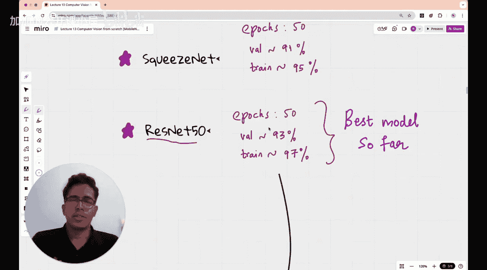

#  014：MobileNet - 口袋里的深度学习

在本节课中，我们将学习MobileNet，了解它如何使深度学习模型变得非常小巧，从而能够在手机或物联网设备等手持设备上运行。

在深入探讨MobileNet架构和实现之前，我们先简要回顾一下本课程迄今为止尝试过的模型及其在数据集上的表现。欢迎来到本节课。

## 概述：为何需要轻量级模型？🤔

MobileNet的价值主张在其名称中不言自明：它是一种可以放入手机等手持设备的神经网络。这种需求是自然产生的。

当深度学习科学家致力于构建越来越深的神经网络时，不可避免地产生了大型模型。例如，拥有1.38亿参数的VGG模型需要512MB的存储空间，这使得在树莓派或手机等小型设备上存储和进行推理变得非常困难，尽管其准确率很高。

随后出现的Inception V1模型更小且性能良好，ResNet 50虽然不是非常小的模型，但性能极佳。从2012年的AlexNet到2016、2017年，这些模型不断发展。

但问题在于，如前所述，大型模型需要更多存储空间，推理时间也更长。这意味着对于需要在小型设备上运行的实时应用来说，部署VGG、Inception、ResNet等模型非常困难，并且会导致设备电量快速耗尽。因此，我们需要轻量级架构。

然而，轻量级架构的问题是准确率可能不高。研究人员的初始目标是找到一个体积合理且准确率尚可的架构。本节课我们将看看MobileNet如何实现这一目标。

MobileNet由谷歌于2017年提出，其论文在arXiv上发表，目前已有超过32,000次引用，这显示了该论文的重要地位。论文标题为“MobileNets: Efficient Convolutional Neural Networks for Mobile Vision Applications”，其价值主张在标题中已直接体现。

## 课程回顾：我们走过的路 🔄

在具体探讨MobileNet如何实现小型化和高效率之前，让我们先简要回顾一下本课程至今的内容。如果您已经熟悉，可以跳过此部分。

我们从一个五类花卉分类数据集开始，包含蒲公英、玫瑰、向日葵等类别，每类约1000张图像。

1.  **线性模型**：我们从一个简单的线性模型开始。将RGB三通道图像展平后，连接到一个具有五个输出节点的全连接层。输出层使用Softmax激活函数将输出转换为概率分布。
    *   该模型的训练准确率约为20-45%，验证准确率为35-40%，损失值在10到20之间。

2.  **带隐藏层的模型**：我们尝试了包含128个节点的隐藏层，并使用ReLU激活函数。
    *   结果训练准确率相似（40-45%），但损失值降低了一个数量级（1-2）。这表明模型预测的置信度提高了，但分类准确率未显著提升。

3.  **正则化**：由于观察到训练准确率通常比验证准确率高约10%，我们推断存在过拟合。因此，我们实施了批量归一化、Dropout和早停等正则化技术。
    *   这使验证准确率提升至50-60%，训练准确率达到65-70%。

4.  **迁移学习**：意识到从头训练难以达到高准确率后，我们转向迁移学习。首先使用ResNet 50架构（未进行大量超参数调优）。
    *   结果获得了100%的训练准确率和80%的验证准确率，表明存在过拟合，但相比之前结果已有很大提升。

5.  **探索经典CNN架构**：我们的目标是按时间顺序体验各种CNN模型，而非将单一模型优化到极致。
    *   **AlexNet (2012)**：训练10个周期，获得95%训练准确率和90%验证准确率，效果出色。
    *   **VGG16**：训练50个周期，获得75%训练准确率和85%验证准确率，存在欠拟合迹象。
    *   **Inception V1 (GoogLeNet)**：训练50个周期，准确率未达AlexNet水平。
    *   **SqueezeNet**：训练50个周期，获得95%训练准确率和91%验证准确率。该模型非常小巧，仅120万个参数。
    *   **ResNet 50**：训练50个周期，获得97%训练准确率和93%验证准确率。这是我们目前在本课程中看到的最佳模型，其残差连接架构非常巧妙。

至此，我们已了解了追求高准确率大型模型与设备资源限制之间的矛盾，这为引入MobileNet做好了铺垫。

## MobileNet的核心创新：深度可分离卷积 🧠

上一节我们回顾了模型大小与性能的权衡。MobileNet的核心突破在于引入了一种名为**深度可分离卷积**的新型卷积操作，它极大地减少了计算量和参数数量。

标准卷积同时处理空间维度（图像的高和宽）和通道维度。深度可分离卷积将这个过程分解为两个独立的步骤：

1.  **深度卷积**：每个输入通道使用一个独立的卷积核进行空间滤波。输入和输出通道数相同。
    *   假设输入特征图尺寸为 `D_F × D_F × M`，卷积核尺寸为 `D_K × D_K × 1`，输出为 `D_F × D_F × M`。
    *   计算成本约为：`D_K * D_K * M * D_F * D_F`

2.  **逐点卷积**：使用1x1的卷积核混合深度卷积输出的通道信息，以生成新的特征表示。
    *   输入尺寸为 `D_F × D_F × M`，使用N个1x1xM的卷积核，输出为 `D_F × D_F × N`。
    *   计算成本约为：`M * N * D_F * D_F`

**总计算成本**约为：`D_K * D_K * M * D_F * D_F + M * N * D_F * D_F`

与标准卷积的计算成本 `D_K * D_K * M * N * D_F * D_F` 相比，深度可分离卷积的计算量减少了约：
`1/N + 1/(D_K^2)`

例如，当使用3x3卷积核（`D_K=3`）时，计算量可减少约8到9倍，同时参数量也大幅下降。

## MobileNet架构详解 🏗️

基于深度可分离卷积，MobileNet构建了一个高效的架构。以下是其关键组成部分：

*   **整体结构**：MobileNet主体由28层构成（不包括平均池化层和全连接层）。它几乎全部使用深度可分离卷积（除了第一层是标准卷积）。
*   **下采样**：通过在某些深度可分离卷积层中设置步长为2来实现空间下采样。
*   **宽度乘子**：这是一个超参数α（0<α≤1），用于均匀地减少每一层的通道数，从而进一步控制模型大小和计算量。新的通道数变为 `α * M` 和 `α * N`。
*   **分辨率乘子**：这是另一个超参数ρ，用于降低输入图像的分辨率，从而减少内部特征图的大小，进一步降低计算成本。

通过组合深度可分离卷积、宽度乘子和分辨率乘子，MobileNet能够在准确率和效率之间提供灵活的权衡，以适应不同的设备限制。

## 总结与展望 📚

本节课我们一起学习了MobileNet，一个专为移动和嵌入式视觉应用设计的轻量级卷积神经网络。

我们首先回顾了本课程中尝试过的多种模型，从简单的线性模型到复杂的ResNet，理解了模型大小、计算成本与准确率之间的挑战。接着，我们深入探讨了MobileNet提出的核心解决方案——**深度可分离卷积**，它通过将标准卷积分解为深度卷积和逐点卷积两步，大幅降低了计算量和参数量。最后，我们了解了MobileNet的整体架构及其通过宽度乘子和分辨率乘子进一步调节模型复杂度的机制。

MobileNet的成功在于它巧妙地平衡了效率与性能，使得在资源受限的设备上运行先进的深度学习模型成为可能，为计算机视觉在移动端的普及奠定了基础。