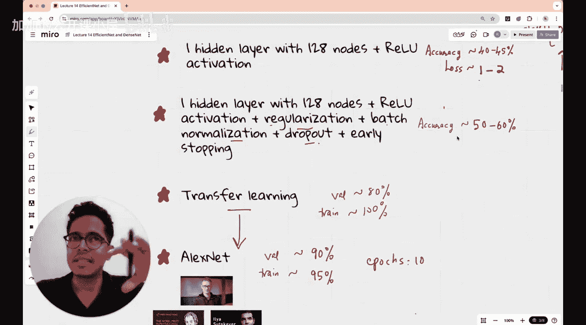

#  015：DenseNet与EfficientNet - CNN的持续进化之路 🚀

在本节课中，我们将学习两种重要的卷积神经网络架构：DenseNet和EfficientNet。我们将了解它们如何通过创新的连接方式和缩放策略，解决传统CNN面临的问题，并实现更高效、更强大的性能。课程最后，我们将在Google Colab上实现这两种网络，并在五类花卉数据集上评估其表现。

## 课程回顾与架构分类 📚

上一节我们介绍了ResNet等经典架构，本节中我们来看看如何对已学的网络架构进行分类。在深入学习DenseNet和EfficientNet之前，我们先简要回顾一下本课程已涵盖的内容。

我们一直在使用五类花卉数据集（雏菊、蒲公英、玫瑰、向日葵、郁金香）进行实验。课程从最简单的线性模型开始，该模型将RGB三通道图像展平后，通过全连接层直接输出五类预测，未使用激活函数，仅在最后计算Softmax概率分布。该模型准确率仅为14%-45%，损失在10-20之间，效果不佳。

随后我们引入了包含128个节点的隐藏层和ReLU激活函数。这使损失降低了一个数量级，但并未显著提升分类准确率。模型预测变得更“自信”，但分类结果并未改变。同时，我们观察到随着训练轮次增加，训练准确率上升而验证准确率停滞，出现了轻微的过拟合现象。

在探索各种神经网络架构的过程中，你可能会思考如何对它们进行分类。神经网络架构可分为**模块化架构**和**非模块化架构**。我们将讨论已学架构中哪些是模块化的，以及单个模块的形态。然后，我们将把已学的VGG、AlexNet、ResNet-50等架构归类到这两种类型中。

## 追求更优的CNN 🎯

正如我们在前几节课讨论的，深度学习研究者（尤其是计算机视觉领域）的目标是构建“更好”的CNN。“更好”通常意味着在保持性能的前提下，模型更小。模型“小”可以指参数数量少，或网络架构的文件体积小。

例如，VGG是一个庞大的网络，拥有1.38亿参数。而SqueezeNet将其显著降低了两个数量级，体积压缩至约1.2MB。然而，寻找更优CNN的探索从未停止，至今仍在继续。

像VGG或AlexNet这样的经典CNN，其主要焦点是**增加网络深度**，并训练这些非常深的网络。当时的普遍共识是，更深的CNN能更好地学习图像数据中的特征模式。因此，增加深度并设法让模型高效训练以提高准确率，是经典CNN架构的主要目标。

## 深度带来的挑战与ResNet的解决方案 ⚙️

随后人们意识到，当神经网络规模（尤其是深度）增加时，会出现**梯度消失**问题。在CNN训练中，梯度下降的每次迭代，其参数更新大多发生在靠近输出的深层，而非浅层。这个问题被ResNet（残差神经网络）架构非常巧妙地解决了。我们在之前课程中讨论过ResNet，其引入的**跳跃连接**（Skip Connections）是一项革命性创新。

但问题在于，更深或更宽的模型会带来一些效率低下的问题。例如，GoogleNet（Inception）的单个模块就包含多个并行的卷积滤波器（1x1, 3x3, 5x5卷积）。因此，需要对CNN架构进行**更好的缩放**和**更好的连接性**。

所谓“更好的连接性”，是指如何将信息从初始层高效地传递到最终层。因为当信息从初始层到达最终层时，它已经经过了中间所有的隐藏层，这可能导致信息丢失或发生巨大变换，从而产生信息冗余。DenseNet如何高效地解决这个问题，将是本节课前半部分的重点。

## DenseNet：密集连接卷积网络 🔗

DenseNet的核心思想非常简单：让**每一层都与其后续的所有层直接连接**。2017年提出的DenseNet论文《Densely connected Convolutional Networks》至今已有约54,000次引用，影响力巨大。

其架构设计如下：初始层连接到紧邻的下一层，同时也连接到第三层，甚至直接连接到最终层。这模仿了ResNet的跳跃连接思想，但又不完全相同。这种设计允许将先前层学习到的特征高效地传递给所有后续层。无论某一层学到了什么特征，它都能被高效地传递到其后的每一层，直至最终输出层。

观察最终输出层（或输出层之前的那一层），你会发现它接收来自之前所有卷积层或卷积块的信息。这显然促进了特征的高效学习。从直觉上讲，如果你想将信息从初始层传递到最终层，最直接的方法就是在它们之间建立一条连接。同时，这也有助于缓解梯度消失问题，因为初始层对输出的影响可以通过这些直接连接反映出来，这与传统的、顺序连接的VGG网络不同。

## EfficientNet：复合模型缩放 📈

在本节课后半部分，我们将讨论EfficientNet。它允许研究者同时缩放输入图像的分辨率、网络的宽度以及网络的深度，这几乎是一种三维的神经网络缩放策略。EfficientNet的核心就是提出了这种高效的三维复合缩放方法。

## 实践与比较 🧪

对于这两种神经网络架构，我们都将在Google Colab上实现，并在五类花卉数据集上比较其准确率，同时也会与之前尝试过的所有架构进行对比。这些架构相对轻量，我们还会在课程最后对比它们与之前讨论的所有架构在参数量、层数等方面的差异。

以下是本节课的核心内容总结：
*   **DenseNet** 通过密集连接，确保每一层都能接收前面所有层的特征图，促进了特征重用，缓解了梯度消失。
*   **EfficientNet** 通过系统化地平衡网络深度、宽度和输入分辨率三个维度，实现了更高效的模型缩放。

本节课中，我们一起学习了DenseNet和EfficientNet这两种重要的CNN改进架构。理解了DenseNet如何通过密集连接增强特征传播，以及EfficientNet如何通过复合缩放策略来系统化地优化模型性能。接下来，我们将动手实现它们，并观察其在具体数据集上的表现。