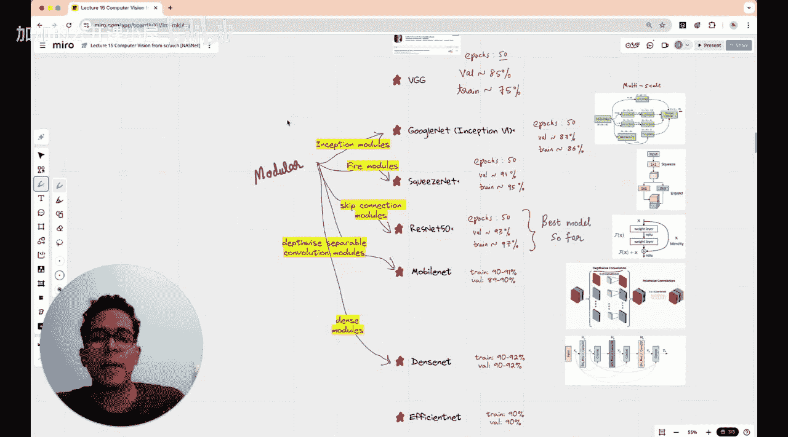

#  016：使用神经网络寻找优秀CNN架构 - NASNet


在本节课中，我们将学习一种名为NAS（神经架构搜索）的著名CNN架构构建方法。我们将探讨其核心思想，并动手实现一个预训练的NASNet模型来分类花朵图像，同时将其性能与我们之前学过的其他架构进行比较。

## 神经架构搜索（NAS）的诞生 🧠

上一节我们回顾了多种由人类精心设计的CNN架构。本节中，我们来看看一个革命性的想法：让神经网络自己设计架构。

在2012年AlexNet赢得ImageNet竞赛后，深度学习领域涌现了VGG、Inception（GoogleNet）、ResNet等多种架构。这些架构都包含了人类的巧思与大量试错。

2017年，Google Brain团队提出了一个问题：能否使用一个神经网络来设计另一个神经网络？由此诞生了神经架构搜索（NAS）方法。他们使用循环神经网络（RNN）来生成构建CNN所需的模块，其成果就是NASNet。

然而，通过计算搜索最优神经网络架构的计算成本非常高。例如，Google在2017年找到他们提出的架构，动用了约500个GPU运行了四天。这超出了本课程的范围。

因此，本节课我们将不运行搜索算法，而是直接实现他们已搜索出的NASNet Large架构，并评估其在五类花朵数据集上的表现。

## 课程进展回顾 📚

在深入NASNet之前，我们先快速回顾一下本课程的进展，这有助于将所学架构清晰分类。

我们始于五类花朵数据集（雏菊、蒲公英、玫瑰、向日葵、郁金香）。这是一个五分类问题。

1.  **线性模型**：我们从最简单的模型开始，仅将RGB图像展平后接入全连接层和5节点输出层，末端使用Softmax函数。训练准确率约40-45%，验证准确率约35-40%，损失值在10-20之间。

2.  **带隐藏层的浅层神经网络**：我们添加了一个含128个神经元并使用ReLU激活函数的隐藏层。准确率提升不大（约40-45%），但损失值下降了一个数量级。这表明模型预测变得更自信，尽管正确预测的数量未显著增加。同时我们观察到过拟合迹象。

3.  **引入正则化**：为了对抗过拟合，我们实施了批量归一化、Dropout和早停等正则化技术。这使验证准确率提升至50-60%，训练准确率在某些情况下达到70-75%。

4.  **转向迁移学习**：对从头训练的结果不完全满意，我们决定转向迁移学习，并从此将框架从TensorFlow Keras切换到PyTorch。我们首先尝试了ResNet15（未精细调参），获得了100%的训练准确率和80%的验证准确率，这证实了迁移学习的有效性。

5.  **按历史顺序实现经典架构**：
    *   **AlexNet**：训练10个周期，验证和训练准确率均达到约95%，效果很好。
    *   **VGG16**：训练50个周期，获得85%的验证准确率和75%的训练准确率。训练准确率更低是因为VGG参数量巨大（1.38亿），训练不足导致欠拟合。
    *   **GoogleNet**：训练50个周期，获得87%的验证准确率和86%的训练准确率。其核心是**Inception模块**，能同时使用1x1、3x3、5x5卷积来学习**多尺度特征**。

值得注意的是，GoogleNet、ResNet、MobileNet等我们尝试过的架构都是**模块化架构**。这意味着整个CNN由重复的、设计好的基础模块堆叠而成。

## NASNet的核心思想与架构 🔬

了解了模块化设计后，我们来看看NASNet如何将这一理念与自动搜索结合。

NASNet的核心思想是：使用一个控制器（通常是RNN）来递归地生成描述神经网络架构的字符串。这个字符串定义了如何组合卷积、池化等基础操作来形成一个“单元”。搜索算法的目标是找到在验证集上性能最好的单元结构。

NASNet架构由两种单元重复堆叠构成：
*   **常规单元**：保持特征图尺寸。
*   **降采样单元**：将特征图的高和宽减半，同时增加通道数。

以下是构建一个NASNet单元（简化示意）可能涉及的步骤：

```python
# 伪代码示意：控制器RNN生成架构决策
# 例如，决定当前层要采用哪种操作（Op）并与之前的哪层（Hidden State）连接
for step in range(num_steps):
    # 控制器根据当前状态做出决策
    operation = controller_rnn.predict_operation()
    connect_from = controller_rnn.predict_connection()
    # 根据决策构建计算图
    new_tensor = apply_operation(previous_tensors[connect_from], operation)
    previous_tensors.append(new_tensor)
```

最终，通过强化学习等方法优化控制器RNN，使其生成的架构能最大化验证准确率。搜索出的NASNet单元结构比人工设计的更为复杂和密集。

## 实现与评估NASNet 🌼

现在，我们将使用PyTorch中预训练的NASNet Large模型，并在五类花朵数据集上进行迁移学习。

以下是实现的关键步骤概述：

1.  **加载预训练模型**：从`torchvision.models`加载`nasnetalarge`，并冻结其所有参数。
2.  **修改分类器**：替换模型最后的全连接层，使其输出5个类别。
3.  **准备数据**：使用与之前课程相同的图像预处理和加载流程。
4.  **训练**：只训练新替换的分类器层。
5.  **评估**：计算模型在训练集和验证集上的准确率与损失。

我们将把NASNet的性能与之前实现的AlexNet、VGG16、GoogleNet、ResNet等架构进行对比。由于NASNet是自动搜索出的、参数量巨大的先进架构，我们预期它能取得非常有竞争力的结果。

## 总结 🎯

本节课我们一起学习了神经架构搜索这一前沿概念。我们了解到，NAS通过让一个RNN控制器自动搜索最佳模块组合来构建CNN，从而减少了对人类专家经验的依赖。虽然完整的搜索过程计算代价极高，但其成果（如NASNet）展示了自动化机器学习（AutoML）的巨大潜力。

我们回顾了从简单线性模型到复杂模块化架构（如Inception、ResNet）的演进历程，并亲自动手实现了预训练的NASNet模型来解决问题。通过对比不同架构的性能，我们能够更直观地理解模型设计如何影响最终的学习效果。



神经架构搜索代表了深度学习模型设计自动化的重要一步，尽管其资源消耗问题仍待解决，但它为未来更高效、更智能的模型设计指明了方向。