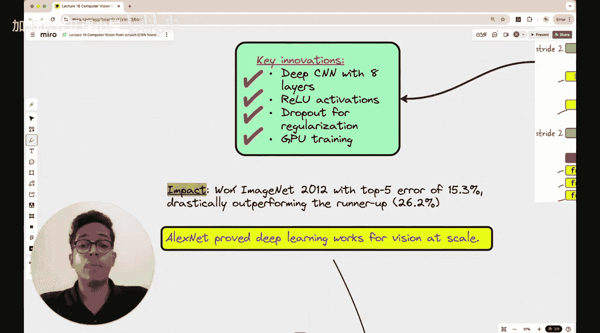

#  017：卷积神经网络与计算机视觉发展史（2010-2025）🚀

欢迎回到新的一课。本课是我们“计算机视觉从零开始”系列的一部分，但您无需担心任何背景知识，因为您几乎可以将其视为一门独立的课程。

在本节课中，我们将讨论计算机视觉领域发生的转变，特别是2010年至2020年期间的变化，并简要讨论过去五年计算机视觉领域的发展。

## 概述

大约一年前，您可能看到过Yann LeCun和Elon Musk在Twitter（现称X）上的争论。Elon Musk表示，他们的全自动驾驶汽车（FSD）已不再使用卷积神经网络（CNN），而Yann LeCun则质疑，如果不使用CNN，如何能在全自动驾驶汽车中实现实时的摄像头图像理解。

当时，关于传统CNN与视觉变换器（Vision Transformer）孰优孰劣的争论很多，人们在计算机视觉的背景下讨论了许多不同类型的模型。

您可能听说过ResNet、Inception、VGG、MobileNet等模型。ImageNet实际上是一个数据集，但我提到的其他许多模型都非常流行。然而，人们通常不知道如何将它们置于历史背景中：时间线是怎样的？这些模型最初为何被开发？它们取得了什么成就才变得如此流行？

因此，今天课程结束后，如果您能对从2010年代初开始的不同模型的演变有一个清晰的概念图，那将是本节课最大的收获。如果课程结束时您能做到这一点，我将非常高兴。

当我说按时间顺序演变时，我指的是类似这样的时间线：从1980年代、1990年代的手工模型开始，一直到今天的视觉变换器。本课不涉及任何编码，您可以放松身心，只需聆听这些不同模型演变的故事。如果您想记笔记，请随意。但我真正的意图是让您了解这些著名模型各自的相关性，以及计算机视觉是如何发展到我们今天在全自动驾驶汽车中看到的样子。那么，让我们开始吧。

## 模型演变时间线概览

在深入每个模型的具体细节之前，请先简要浏览一下这个时间线：

*   **1980年代至2010年**：手工设计的滤波器。
*   **2012年**：最著名的模型AlexNet问世。
*   **2014年**：VGG16和GoogLeNet出现。
*   **2015年**：ResNet-50问世。
*   **2016年**：DenseNet、SqueezeNet和YOLO v1出现。
*   **2017年**：NASNet、MobileNet v1出现。

如果您是完全的初学者，第一次听到这些名字，可能会觉得它们是一些随机的名称，不知道如何分类这些模型。我将为您提供一个非常好的概念图，帮助您理解这些模型的重要性：为什么开发了MobileNet？为什么这个神经网络架构的名字里有“Mobile”？为什么开发了ResNet？为什么这个名字里有“Re”？所有这些疑问都将在本课结束后得到解答。

## 第一部分：2012年之前——前深度学习时代

现在，让我们将计算机视觉的演变时间线划分为几个不同的部分。第一部分显然是在2012年之前，这是卷积神经网络兴起之前的时代。

在2012年之前，人们依赖于手工设计的滤波器。有许多手工设计的滤波器用于识别数据中的不同类型模式。在我们的计算机视觉课程系列中，我们已经接触过一些手工设计的滤波器。

例如，这个Sobel滤波器用于识别图像中形状的底部边缘。这是原始图像，包含圆形、正方形、三角形和菱形图案。Sobel滤波器是这个3x3的滤波器。

使用这个滤波器，我们可以检测到底部边缘。我们还讨论了如何将这些滤波器想象成光线：想象光线从负数区域射向正数区域，就像光线从底部射向顶部。如果这些形状从纸面上凸出，那么这些光线将照亮这些形状的底部边缘，这就是您在这里看到的。如果有人想要处理图像，无论出于什么原因想要检测底部边缘，就必须手工设计这样的滤波器。

我们还讨论了其他滤波器，比如用于检测轮廓的滤波器。轮廓意味着需要检测所有边缘。光线必须从外部径向向内照射，或者想象一个空心的环形形状向外和向内投射，想象光源位于空心环形内部，使得光线从内部径向向外照射，这样也可以照亮所有边缘。您可以看到这个滤波器中间是正数，外围是负数，就像光源在中间，照亮了所有边缘。这又是一个边缘检测滤波器，同样是手工设计的。这就是2012年之前的情况。

如果您看传统的机器学习模型，它们都是需要大量特征的模型，这些特征是手工设计的或手工工程化的特征，例如支持向量机、随机森林或决策树。支持向量机可用于二元分类，随机森林或决策树可用于多类分类。但归根结底，您需要特征及其值，以便可以将它们绘制在坐标轴上，或者使用特征和阈值来构建决策树的节点。

这就是传统的机器学习时代。当时还存在巨大的计算成本限制，即使在CPU上并行使用多个CPU进行计算也不容易。这使得训练深度神经网络非常困难。尽管神经网络的概念在2012年之前很久就出现了，但它并不突出，也没有被广泛用于计算机视觉任务，仅仅是因为训练一个计算机视觉模型来执行像猫狗分类这样的简单任务在当时一点也不容易。

## 第二部分：2012年——卷积神经网络的革命

正是在2012年，AlexNet被引入，这彻底改变了深度学习在计算机视觉领域的应用方式。

总而言之，我们目前看到的是计算机视觉的前深度学习时代。

现在我们将进入第二部分，即从2012年AlexNet开始的卷积神经网络革命。

AlexNet是由多伦多大学的一组研究人员提出的迄今为止最受欢迎的CNN架构。Alex是这篇论文的第一作者，这个神经网络就是以他的名字命名的。但您肯定会认出另外两位作者：一位是Geoffrey Hinton教授，他是2024年诺贝尔物理学奖得主，因发明人工神经网络而获奖；另一位是Ilya Sutskever，他是OpenAI的创始成员。

这篇论文目前有超过17万次引用，非常著名，引用率极高，所有这些研究人员现在都极其知名。

那么，AlexNet引入了哪些创新？它拥有一个包含八层的深度卷积神经网络。这些是AlexNet架构中使用的层：第一卷积层、第二层、第三层、第四层、第五层、第六层、第七层、第八层。中间有用于降低维度的最大池化层，还有展平操作。但归根结底，AlexNet有大约6000万个参数。他们同时引入了ReLU激活函数、用于正则化的Dropout，以及使用GPU进行并行处理以加速这些神经网络的训练。

AlexNet在2012年的ImageNet挑战赛中彻底击败了竞争对手，成为ImageNet 2012挑战赛的冠军。

为什么这如此重要？因为这是研究人员第一次毫无疑问地证明，深度神经网络架构可以被有效地训练，用于对复杂的图像数据进行良好的预测。

因此，AlexNet向研究人员明确表明，无需依赖手工设计的特征或滤波器。

## 总结

在本节课中，我们一起学习了计算机视觉从2010年到2025年的发展脉络。我们首先回顾了2012年前依赖手工特征和传统机器学习模型的前深度学习时代。接着，我们重点探讨了2012年AlexNet的出现如何开启了卷积神经网络（CNN）的革命，它通过深度架构、ReLU激活函数和GPU并行计算，证明了深度学习在图像任务上的巨大潜力。我们还简要浏览了后续几年出现的VGG、GoogLeNet、ResNet、MobileNet等关键模型的时间线，为理解它们各自解决的问题和背景奠定了基础。本节课的核心目标是帮助您建立起计算机视觉模型演变的“心智地图”，理解技术发展的内在逻辑与驱动力。