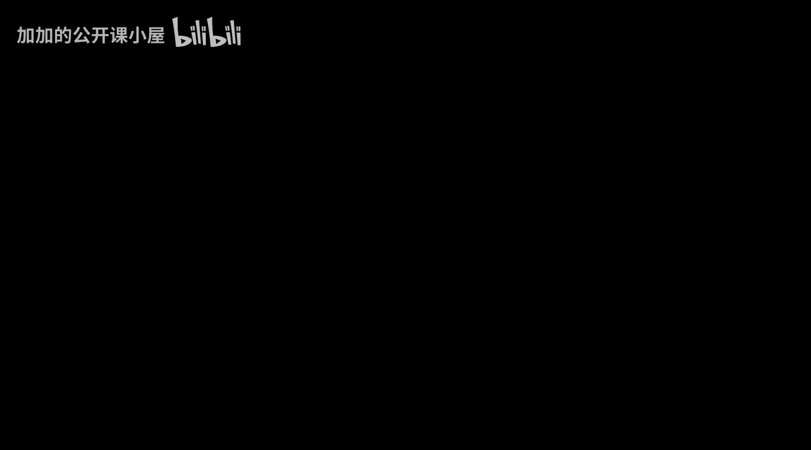
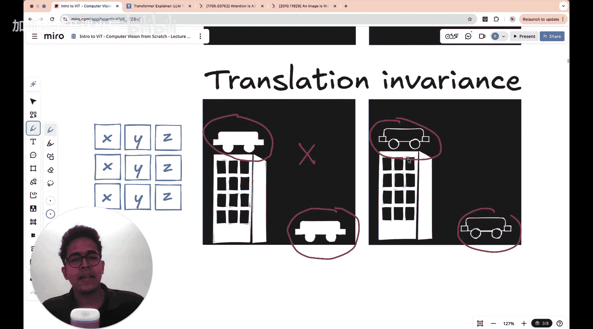

#  018：Vision Transformer (ViT) 入门 🧠



在本节课中，我们将要学习 Vision Transformer (ViT)。这是一种革命性的架构，它成功地将原本用于处理文本的 Transformer 模型应用到了计算机视觉领域，并取得了卓越的性能。

即使你从未听说过 Vision Transformer，或者听说过但不太清楚其工作原理，也无需担心，本教程正是为你准备的。这是“计算机视觉从零开始”系列的一部分，但即使你没有看过之前的课程，本节课也几乎可以独立学习。

我将今天的课程内容分为三个部分：
1.  首先，我们将讨论卷积神经网络（CNN）及其在图像特征识别方面的优势，以及 CNN 存在的一些问题，这些问题最终由 Transformer 架构解决。
2.  其次，由于 Transformer 是 Vision Transformer 架构的核心，我们需要深入理解 Transformer 是什么以及它是如何工作的。我们将花费相当一部分时间来讲解 Transformer 架构本身。
3.  最后，我们将进入今天课程的核心——Vision Transformer 架构。

如果你已经相当熟悉 CNN 和 Transformer 架构，可以直接跳到最后一部分。否则，建议你按顺序学习以获得完整的知识脉络。

今天，我们不会在 Google Colab 上实现 ViT 架构，这部分内容我留给了另一节单独的课程，届时我将展示 CNN 和 ViT 在特定数据集上的性能差异。

那么，让我们开始吧。

---

## 卷积神经网络（CNN）回顾与局限 🔍

上一节我们介绍了本课程的结构。本节中，我们来看看卷积神经网络（CNN）的基本原理及其局限性。

### 卷积操作

CNN 架构中的核心是卷积操作。这个过程相当简单：你有一张图像（例如一个二维图像，由一组绿色像素表示），一个滤波器（或称卷积核）会作用在这张图像上。这个滤波器是一个矩阵（例如一个 3x3 的矩阵）。

这个矩阵会在图像的不同区域上滑动，生成结果图像。例如，原始图像是 5x5，经过一个 3x3 的卷积操作后，结果图像可能是 3x3。这里还涉及“填充”（padding）的概念，即在图像边界添加额外的像素。另一个概念是“步长”（stride），它决定了滤波器在每一步卷积中滑动的像素数。

这个想法之所以具有革命性，是因为根据滤波器矩阵中的数值，它可以捕获原始图像中不同类型的特征。

CNN 扩展了这一思想，将卷积操作作为神经网络不同层的一部分。

### CNN 的成功与问题

卷积神经网络非常成功。自 2012 年 AlexNet 架构在 ImageNet 竞赛中获胜并展现出巨大潜力后，深度学习便成为计算机视觉实现的主要方式。在此之前，人们主要关注手工设计的滤波器。AlexNet 的出现彻底改变了深度学习领域。

随后，VGGNet 和 GoogLeNet 在 2014 年出现，分别获得竞赛的第二和第一名。2015 年，ResNet 问世，再次改变了深度学习在计算机视觉中的应用方式。

CNN 在检测图像模式方面非常强大，这使得它能够在包含上千个类别的图像上实现高精度分类。

然而，CNN 也存在一些问题，这些问题源于其背后的基本假设。

### CNN 的三个核心假设及其局限

以下是 CNN 的三个核心特征，它们在某些情况下会带来问题：**局部性**、**平移不变性**和**权重共享**。让我们从逻辑上理解它们的含义。

**1. 局部性**
CNN 假设在图像的小区域内可以找到重要的模式。所谓“小区域”，是指可以被小滤波器覆盖的区域。例如，对于一个 224x224 的图像，一个 3x3 的滤波器只覆盖了图像中非常小的一部分。这个假设认为，这些特征可以捕获局部模式。

**2. 平移不变性**
这个假设认为，如果一个滤波器旨在捕获某种特定特征，那么无论这个特征出现在图像中的哪个位置，该滤波器都能捕获它。CNN 假设这样做没有问题，但我会展示一个这可能成为问题的案例。

首先，我们看看滤波器如何工作。假设这是一个用于检测左侧边缘的 3x3 滤波器。你可以想象这个滤波器就像一束从左向右照射的光线。如果图像中有两个圆形物体，并且假设它们是略微凸出纸面的圆柱体，那么从左向右的光线会照亮这些形状的左边缘，形成一个半圆形的亮区。

这个“左侧边缘检测器”滤波器作用于图像时，就像光线照射在这些形状上一样。注意，这两个圆形的位置并不重要——一个在图像的左上角，一个在右下角——但同一个滤波器都能检测到它们的左边缘。在这个例子中，平移不变性不是问题。

但是，考虑下面这种情况。假设你有一个滤波器，它非常擅长识别汽车形状的物体轮廓。这是一个神奇的滤波器，我们不必深究其细节。重要的是，无论汽车出现在图片的哪个位置，这个滤波器都能检测到其特征。

例如，图中有一个汽车物体在地面上，另一个汽车物体在建筑物顶上。在这两种情况下，这个滤波器都能检测到汽车的轮廓。汽车的相对位置信息根本没有被纳入考虑。

有时这就是一个问题。假设任务是识别某物是否真实，你需要判断这是否是一张真实世界环境中的汽车图像。那么，汽车在建筑物顶上这种情况在现实生活中几乎永远不会发生。

但由于这些滤波器具有平移不变性，如果它旨在捕获所有类似汽车的边缘，它就不会关心这个汽车物体是在建筑物顶上还是在空中。然而在现实中，这些物体的相对位置很重要。在实际图像中，你不会发现汽车在建筑物顶上，通常汽车位于建筑物的底部。

那么，如何让神经网络学习到图像中的这种知识——如果图像中有两个物体，一个是建筑物，一个是汽车，通常汽车不会在建筑物顶上？这需要学习图像中相距较远的区域之间的特征关系。

---

## Transformer 架构详解 ⚙️

上一节我们探讨了 CNN 的局限性，特别是其在处理图像中长距离依赖关系时的不足。本节中，我们来看看 Transformer 架构，它是解决这一问题的关键，也是 Vision Transformer 的基础。

Transformer 最初是为自然语言处理任务设计的，其核心思想是使用“自注意力机制”来建立序列中所有元素两两之间的关系，无论它们相距多远。

### 自注意力机制

自注意力机制允许模型在处理一个元素（例如一个单词或一个图像块）时，关注输入序列中的所有其他元素，并动态地为每个元素分配不同的重要性权重。

其核心计算可以用以下公式表示：
**Attention(Q, K, V) = softmax(QK^T / √d_k) V**

其中：
*   **Q (Query)**：查询向量，代表当前要处理的元素。
*   **K (Key)**：键向量，代表序列中所有元素，用于与查询进行匹配。
*   **V (Value)**：值向量，包含序列中所有元素的信息，用于加权求和。
*   **d_k**：键向量的维度，用于缩放点积，防止梯度消失。

这个过程使得模型能够捕获序列内部的全局依赖关系。

### Transformer 编码器结构

一个标准的 Transformer 编码器层通常包含以下组件：
1.  **多头自注意力层**：并行运行多个自注意力机制，从不同子空间捕获信息。
2.  **前馈神经网络**：一个简单的全连接网络，对每个位置的特征进行独立变换。
3.  **残差连接与层归一化**：每个子层（自注意力和前馈网络）周围都使用残差连接，并进行层归一化，这有助于稳定训练并允许构建更深的网络。

以下是 Transformer 编码器层的简化表示：

```python
# 伪代码表示 Transformer 编码器层
class TransformerEncoderLayer:
    def forward(x):
        # 1. 多头自注意力 + 残差 & 层归一化
        attn_output = multi_head_attention(x, x, x) # Q, K, V 都来自 x
        x = layer_norm(x + attn_output)

        # 2. 前馈网络 + 残差 & 层归一化
        ff_output = feed_forward_network(x)
        output = layer_norm(x + ff_output)
        return output
```

正是这种能够建模序列中任意两个元素之间关系的能力，使得 Transformer 非常适合处理需要理解全局上下文的视觉任务，从而弥补了 CNN 在长距离依赖建模上的不足。

---

## Vision Transformer (ViT) 架构 🖼️➡️🧠

上一节我们深入了解了 Transformer 的工作原理。本节中，我们终于可以看看 Vision Transformer (ViT) 是如何巧妙地将 Transformer 应用于图像处理的。

ViT 的核心思想非常直观：**将一张图像视为一系列“图像块”的序列，然后像处理句子中的单词一样处理这些图像块。**

### ViT 工作流程

以下是 ViT 处理图像的主要步骤：

**1. 图像分块**
将输入图像分割成固定大小的小块（例如 16x16 像素）。假设输入图像是 224x224 分辨率，使用 16x16 的分块，你将得到 (224/16) * (224/16) = 196 个图像块。

**2. 图像块嵌入**
每个图像块被展平成一个向量，并通过一个可学习的线性投影层（全连接层）进行变换，生成“图像块嵌入”。这个嵌入向量的维度就是 Transformer 模型隐藏层的大小（例如 768 维）。

**3. 添加位置编码**
由于 Transformer 本身不考虑输入的顺序，而图像块的空间位置信息至关重要，因此需要向每个图像块嵌入中添加“位置编码”。位置编码是一个与嵌入向量维度相同的向量，它包含了该图像块在原始图像中的位置信息（如第几行、第几列）。这使模型能够理解图像块之间的空间关系。

**4. 添加分类令牌**
在序列的开头，额外添加一个可学习的“[CLS]”令牌（分类令牌）。这个令牌经过 Transformer 编码器处理后，其对应的输出向量将用于整个图像的分类任务。

**5. Transformer 编码器**
将包含图像块嵌入、位置编码和分类令牌的完整序列输入到一个标准的 Transformer 编码器堆栈中。编码器通过自注意力机制让所有图像块（包括分类令牌）相互交换信息，从而学习图像的全局表示。

**6. 分类头**
最后，取出分类令牌对应的输出向量，通过一个小型的多层感知机（MLP，即全连接网络）进行分类，得到最终的图像类别预测。

### 架构示意图与公式

整个过程可以概括为以下步骤：

令 **X** 为输入图像，将其划分为 N 个图像块 `[x_p1, x_p2, ..., x_pN]`。
1.  对每个图像块进行线性投影：**z_0 = [x_cls; E*x_p1; E*x_p2; ...; E*x_pN] + E_pos**
    *   `x_cls` 是可学习的分类令牌。
    *   **E** 是图像块投影矩阵。
    *   **E_pos** 是位置编码。
2.  将序列 `z_0` 输入 L 层 Transformer 编码器：**z_l' = MSA(LN(z_{l-1})) + z_{l-1}**， **z_l = MLP(LN(z_l')) + z_l'**
    *   `MSA` 是多头自注意力。
    *   `LN` 是层归一化。
    *   `MLP` 是前馈网络。
    *   `l` 从 1 到 L。
3.  取最后一层分类令牌的输出 `z_L^0`，通过分类头（MLP）得到预测：**y = MLP_Head(LN(z_L^0))**

通过这种方式，ViT 摒弃了 CNN 的卷积和池化操作，完全依赖 Transformer 的自注意力机制来建模图像中所有区域之间的全局关系，从而能够更好地理解图像的上下文和不同部分之间的复杂交互。

---

## 总结 📝

在本节课中，我们一起学习了 Vision Transformer (ViT) 的完整知识脉络。

我们首先回顾了卷积神经网络（CNN）的成功与其内在的局限性，特别是其局部感受野和平移不变性假设在处理图像全局上下文和长距离依赖关系时的不足。

接着，我们深入探讨了作为 ViT 基石的 Transformer 架构，重点讲解了其核心——自注意力机制，它能够建立序列中任意两个元素之间的联系。

最后，我们详细解析了 Vision Transformer 的架构。其核心创新在于将图像分割为小块序列，并像处理自然语言一样，通过添加位置编码和分类令牌，利用标准的 Transformer 编码器对其进行处理。这使得模型能够捕获图像的整体上下文信息，在许多视觉任务上超越了传统的 CNN。



ViT 的成功证明了自注意力机制在视觉领域的强大潜力，为计算机视觉开辟了一条新的道路。