#  019：从零开始用PyTorch实现Vision Transformer 🚀

在本节课中，我们将从零开始，使用PyTorch实现一个简单的Vision Transformer模型。我们不会使用任何预训练架构，所有代码都将由我们自己定义。我们将使用一些实用的PyTorch库来简化流程，但模型的训练将完全从零开始。为了简化任务，我们将使用著名的MNIST手写数字数据集，将其作为一个10分类问题来处理。

即使你对Vision Transformer完全没有概念，也可以跟随本教程一起编码。本教程对初学者非常友好。课程分为两部分：第一部分将简要讨论Vision Transformer的理论、工作原理，并快速浏览Transformer架构本身。我们还将讨论基于文本的Transformer（如GPT）与用于图像的Vision Transformer之间的区别。但本节课的主要目的是实际编码，我将逐行编写代码，以便你能以相同的节奏跟随。我将使用Google Colab进行编码，因此你可以轻松开始，无需任何先决条件。

现在，让我们开始学习。

## 理论概述 📖

上一节我们介绍了本课程的目标，本节中我们来看看Vision Transformer的基本概念。

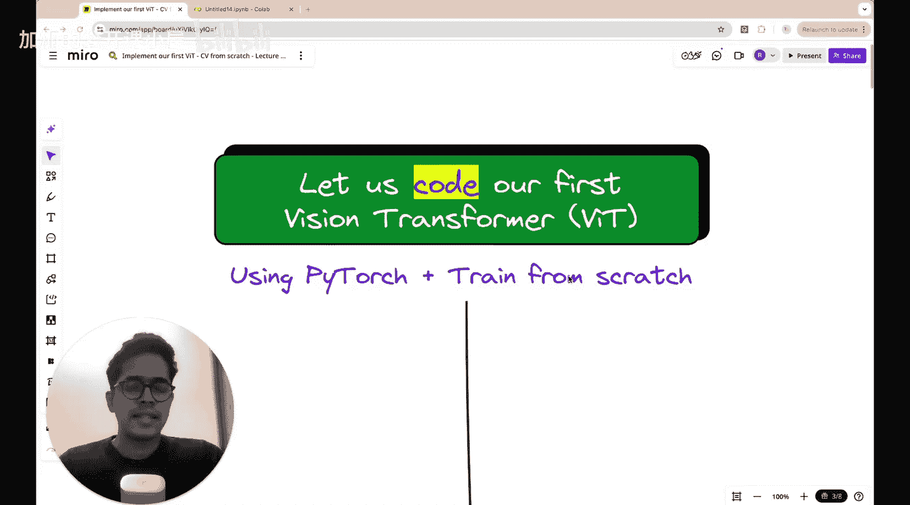

Vision Transformer的概念由Google的一个团队在题为《An Image is Worth 16x16 Words》的论文中提出。该论文展示了将Transformer架构应用于图像识别任务的方法。

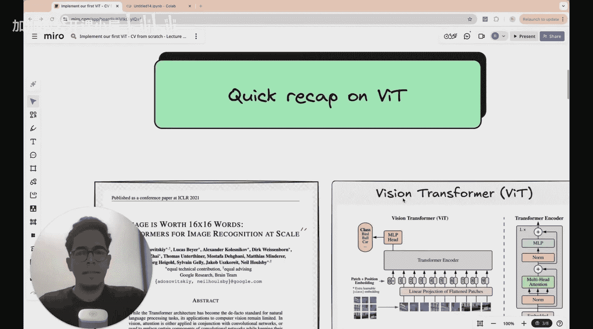

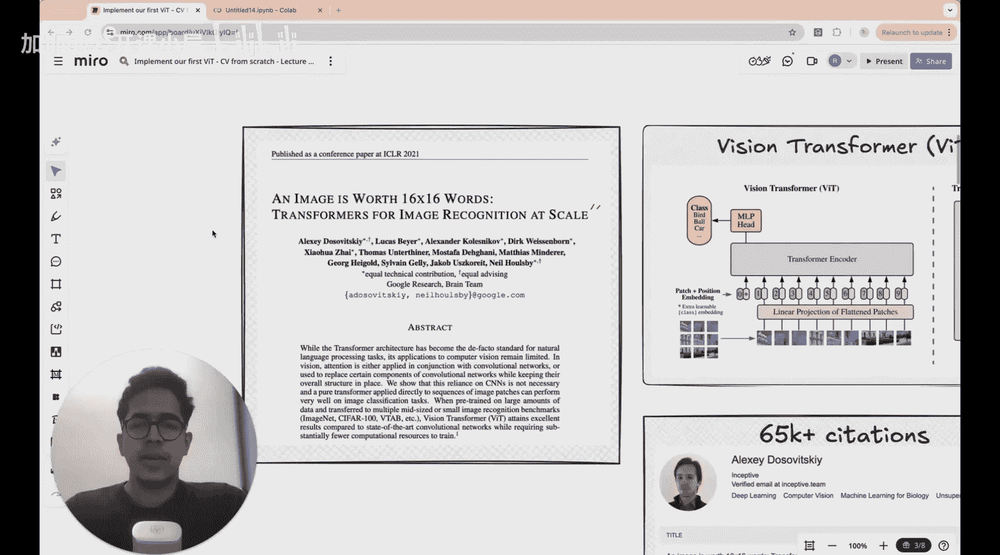

Transformer架构本身则是在2017年的论文《Attention Is All You Need》中提出的，同样出自Google的另一个团队。看到Google AI研究能产出如此多相似的论文，确实令人惊叹。

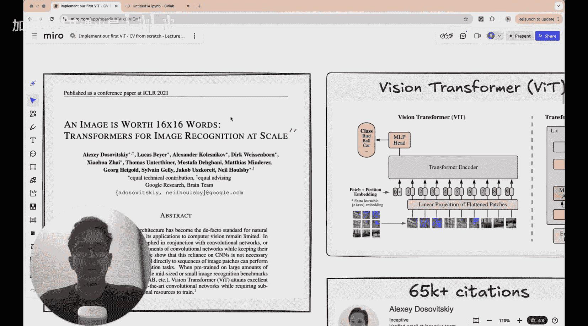

在深入Vision Transformer架构之前，我们先来看论文中描述其工作原理的著名图示。我将把这个复杂的架构分解成易于理解的部分，所以不必担心它看起来令人生畏。

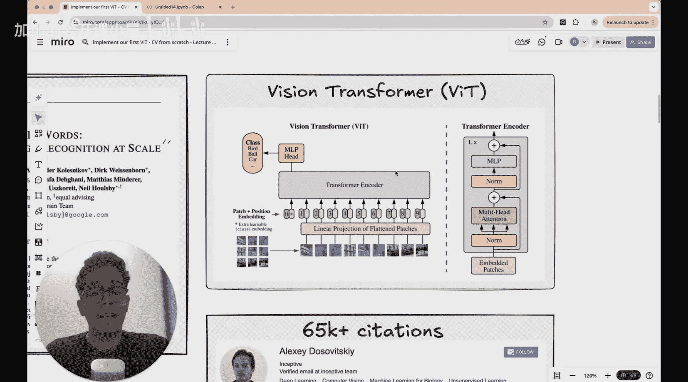

《Attention Is All You Need》论文已有约17-18万次引用，而这篇2020年发表的Vision Transformer论文也有约6.5万次引用。你可以在arXiv上查阅这些论文。

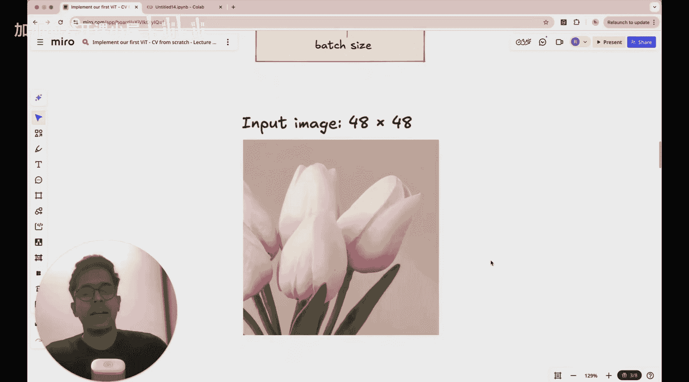

## 核心思想：图像分块 🧩

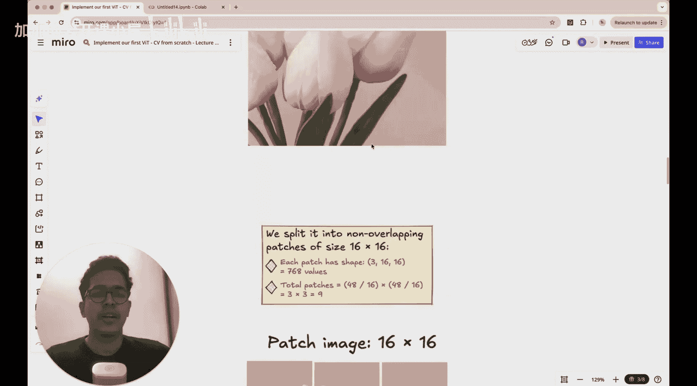

上一节我们了解了Vision Transformer的起源，本节中我们来看看其核心思想。

基本思想如下：在常规的基于文本的Transformer架构中，你将句子分割成**词元**，可以将其想象为单词。而在Vision Transformer中，输入是图像。你需要通过将图像分割成称为**图像块**的部分来对图像进行“词元化”。

例如，假设输入图像是48像素 x 48像素。你可以将其分割成多个块。假设我们使用16x16的块大小，那么你将得到9个这样的块。计算方法是：长度方向 48 / 16 = 3，宽度方向 48 / 16 = 3，所以总共是 3 x 3 = 9 个块。

因此，就像在基于文本的Transformer中句子被分割成固定数量的词元一样，在Vision Transformer中，输入图像被分割成多个图像块（这里是9个）。块的数量取决于你选择的块大小和原始图像的尺寸。

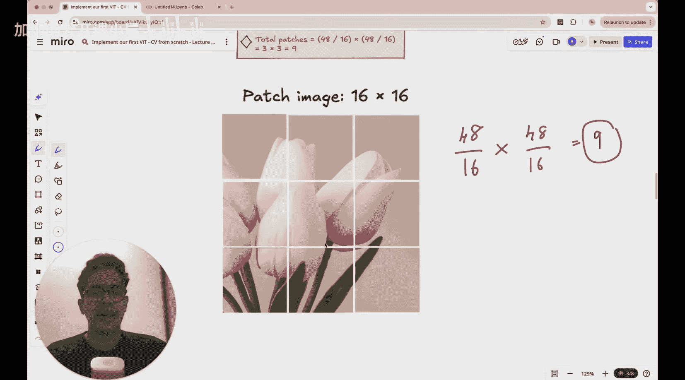

## 输入维度与CLS令牌 🔢

上一节我们了解了如何将图像分块，本节中我们来看看这些块如何输入到Transformer中。

现在，我们来看看这些块如何被输入到Transformer架构中。这里的Transformer架构与我们在GPT等模型中看到的并无不同。让我们快速浏览一下。我制作了一个详细但简单的图示，展示了适用于图像的Transformer架构。

首先，我们将图像转换为图像块。在这个例子中，我们有9个块。如果我们查看每个输入的维度，它看起来像 `(1, 9, 768)`。
*   **1**：这是**批量大小**。有时我们可能一次处理多个图像。如果一批处理4张图像，批量大小就是4。
*   **9**：这代表**图像块的数量**，即单张图像被分割成的子图像数量。
*   **768**：这是**每个块的像素数**，也称为**嵌入维度**。计算方式是：每个块是16x16像素，并且有3个颜色通道（RGB）。所以，`16 * 16 * 3 = 768`。我们正是将这些图像块转换成某种向量表示，就像在基于文本的GPT中将单词嵌入成向量表示一样。

除了这些输入数据，我们还会添加一个额外的向量，称为**CLS令牌**（分类令牌）。在基于文本的GPT架构中，我们使用最后一个词元来预测下一个单词。但在这里，我们不是要预测下一个图像块（至少在分类任务中这没有意义）。我们想要预测的是：这张整体图像代表什么？例如，如果我们进行10分类，我们想要一个概率分布来判断这张图像很可能是哪个数字。

这个CLS令牌将用于执行分类任务。它被添加到输入词元（即图像块）的开头。在原论文的图示中，你可以看到图像被分割成块（图中显示为9个块），然后这些块的向量表示与位于位置0的CLS令牌一起被输入。

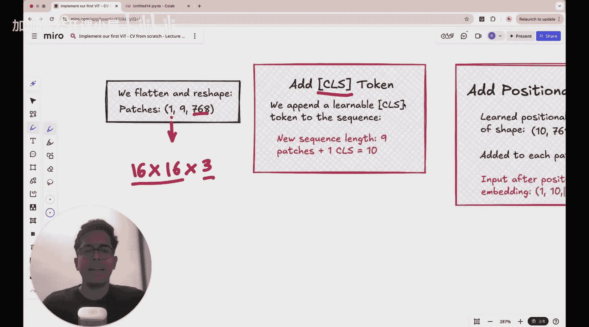

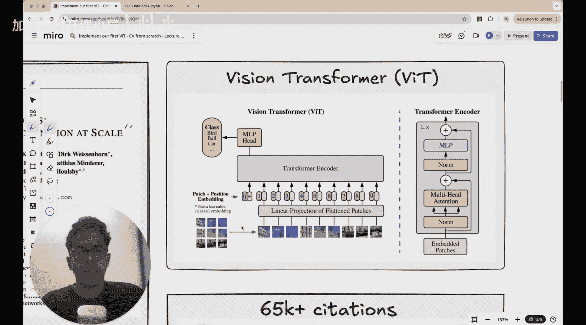
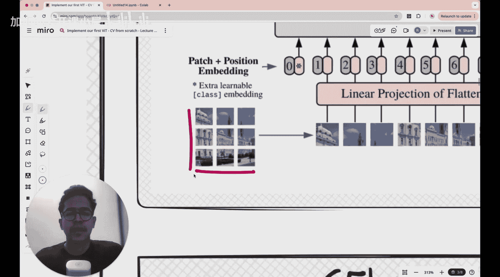

## 位置编码 📍

上一节我们介绍了CLS令牌，本节中我们来看看另一个关键概念：位置编码。

在基于文本的Transformer中，除了词元的向量表示，我们还会添加**位置编码**，用以表示该词在句子中的位置。这一点至关重要，因为单词的顺序决定了句子的含义。

考虑以下两个句子：
1.  `All dogs are animals.`
2.  `All animals are dogs.`

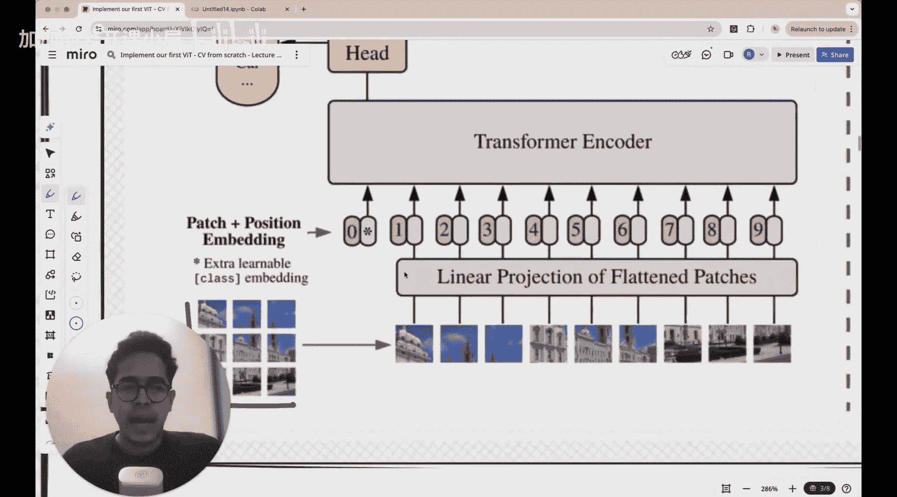

如果你将这些句子分割成单词（暂时忽略空格），两个句子包含的四个单词完全相同。但这两个句子的含义截然不同。为了捕捉含义，你必须知道这些单词在句子中的相对位置。

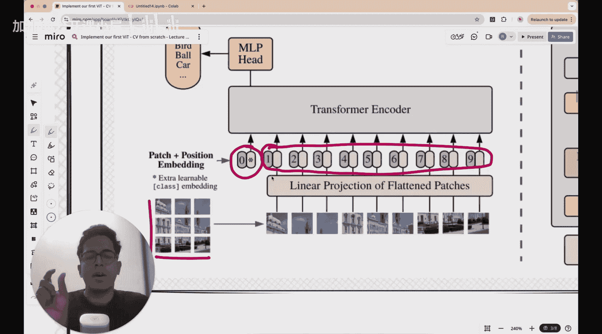

这就是为什么在单词（如“dogs”或“animals”）的向量嵌入之外，你还要添加与该单词位置对应的向量嵌入。例如，在第一个句子中，“dogs”位于位置1（假设从0开始计数）。那么，“dogs”的最终向量表示就是其原始单词向量与位置1向量的和。这个合成向量既包含了“dogs”这个词的信息，也包含了它在序列中处于位置1的信息。

基于文本的Transformer是这个原理，Vision Transformer也是如此。对于图像块，我们也需要添加位置编码，因为图像块在原始图像中的空间位置（例如，左上角、中间、右下角）包含了重要信息。模型需要知道这些块是如何排列的，才能理解完整的图像。

## 总结 🎯

本节课中，我们一起学习了Vision Transformer的基本概念。我们了解到：
1.  Vision Transformer将图像分割成固定大小的**图像块**，作为输入词元。
2.  每个图像块被线性投影为一个**嵌入向量**。
3.  在输入序列的开头添加一个特殊的**CLS令牌**，用于最终的分类任务。
4.  向嵌入向量中添加**位置编码**，以保留图像块的空间位置信息。
5.  处理后的序列（CLS令牌 + 图像块嵌入 + 位置编码）被送入标准的Transformer编码器中进行处理。

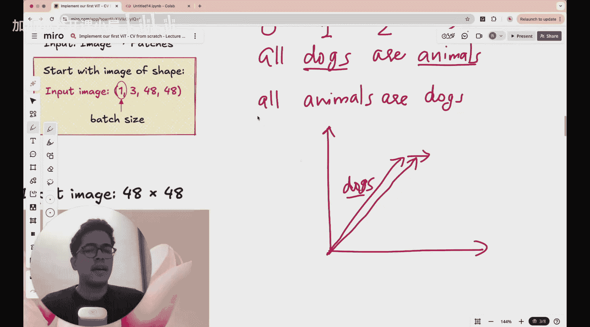

这些核心思想使得Transformer这一强大的序列处理架构能够成功地应用于计算机视觉任务。在接下来的实践部分，我们将把这些理论转化为具体的PyTorch代码。