#  020：课程介绍与计算机视觉概述 🎯

在本节课中，我们将学习计算机视觉训练营的课程安排、讲师的背景介绍，以及计算机视觉从传统方法到深度学习演变的简要历史。我们还将探讨计算机视觉在不同领域的实际应用。

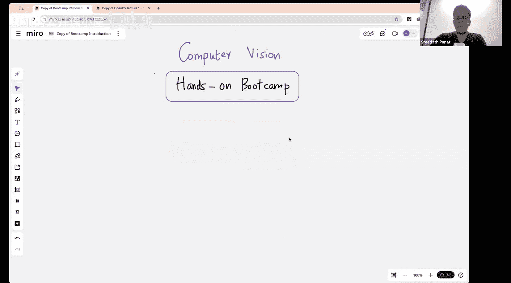

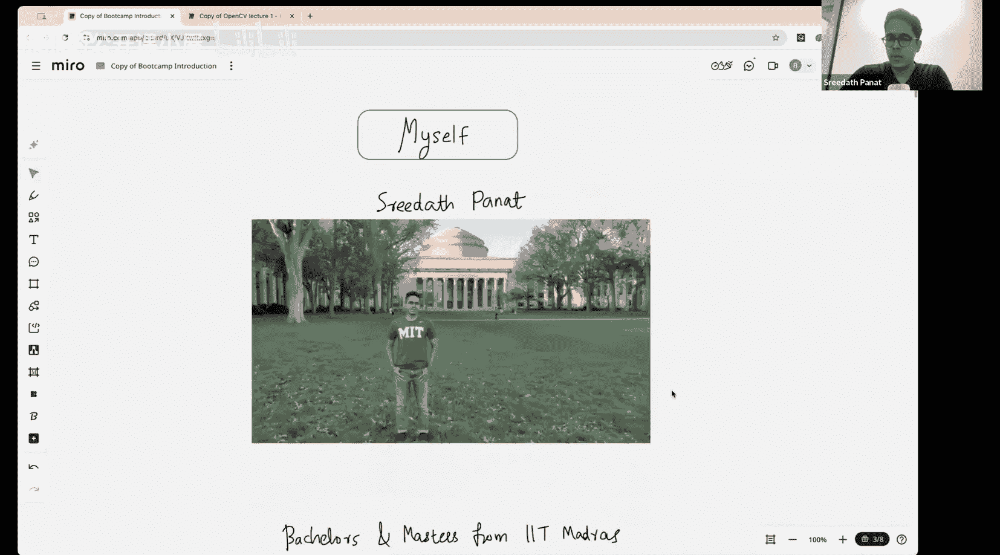

欢迎参加本次计算机视觉实战训练营。本次训练营有非常具体的议程，我将说明我们将具体涵盖哪些内容、课程面向的人群以及您能从中获得什么。

首先，我花一点时间做一下自我介绍。我的名字是 Sa Panard。

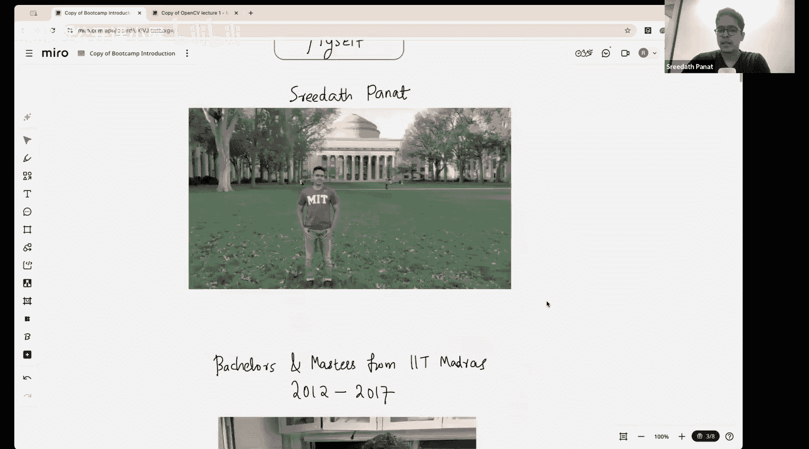

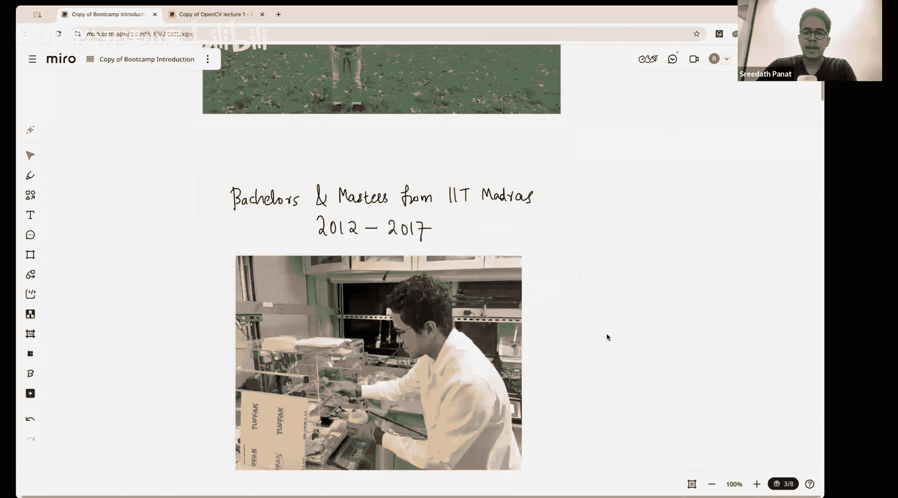

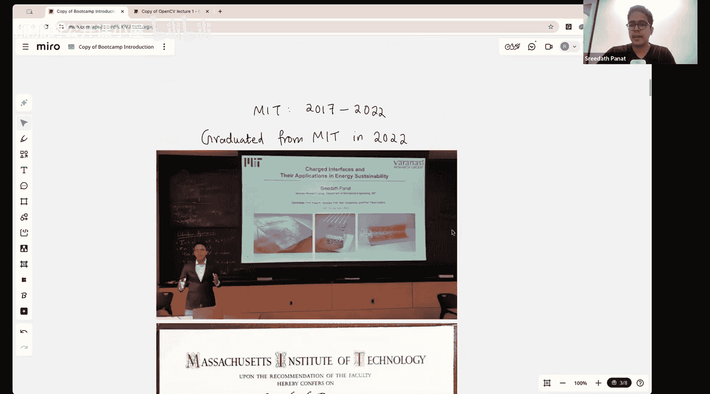

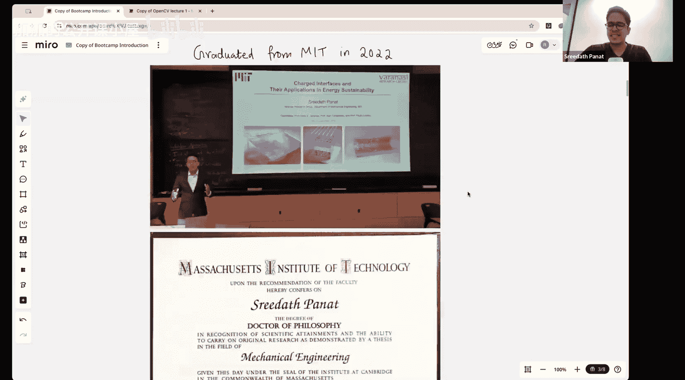

我是 Visra AI Labs 的联合创始人之一。

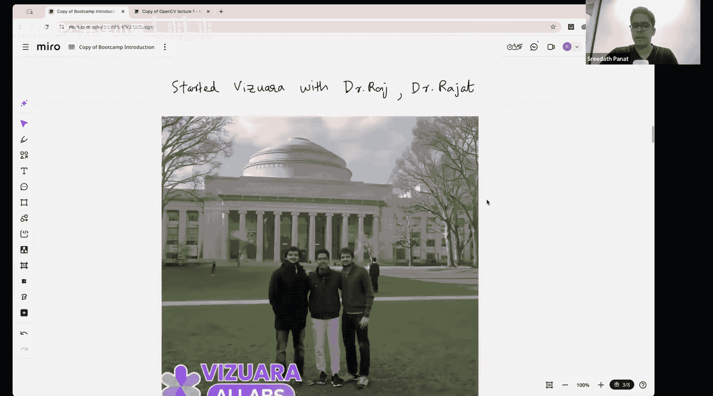

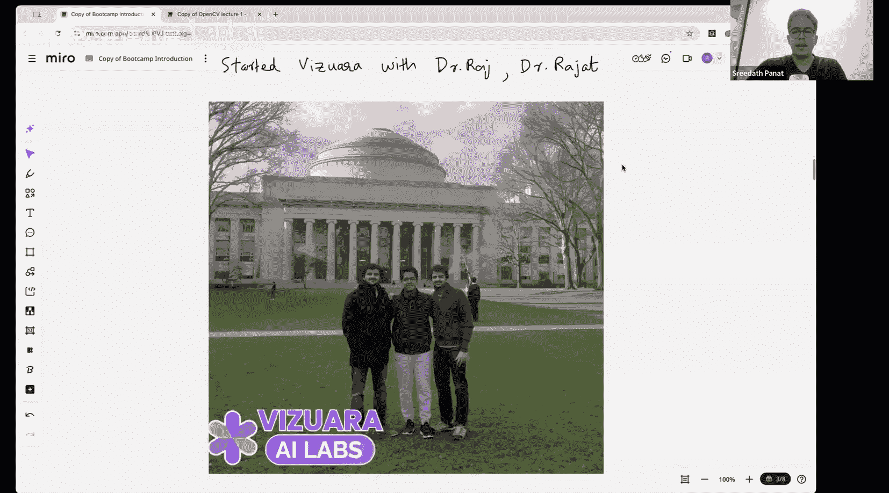

我于2012年至2017年在 IIT Madras 完成本科教育。毕业后，我于2017年至2022年在麻省理工学院攻读博士学位。我的博士研究主要涉及界面工程，也涉及一些电气工程、机器学习和机器人技术，这是一个融合了多个不同领域的跨学科领域，我度过了非常愉快的时光。

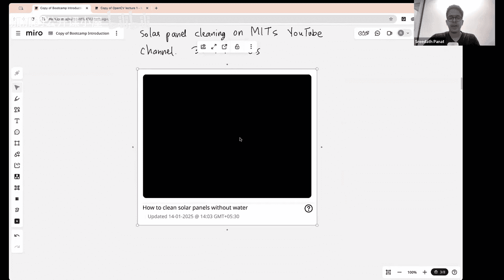

在攻读博士学位期间，或者说稍早一些时候，我和 Raj Rajathan 决定一起工作。您可能通过 LinkedIn 或我们的 YouTube 频道熟悉他们。

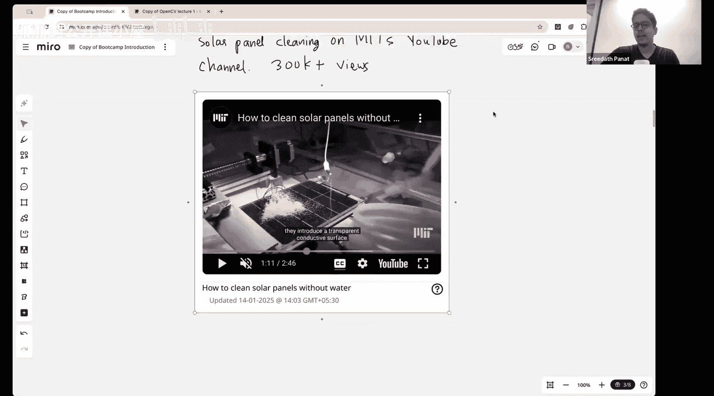

我们决定创立 Biswarra，旨在人工智能领域开展多项工作。

如果您感兴趣，可以观看这个视频。这是一个关于我博士论文工作的三分钟视频，发布在麻省理工学院的 YouTube 频道上，目前已有近30万次观看。我的基本工作是建造一个自清洁太阳能电池板，它可以清除灰尘并自我清洁，恢复因灰尘积累而损失的近95%到98%的功率输出。因为在沙漠环境中，灰尘积聚在太阳能电池板上会显著降低效率。这是一个无水、静电自清洁的机器人系统，可以在不需要一滴水的情况下清洁太阳能电池板。

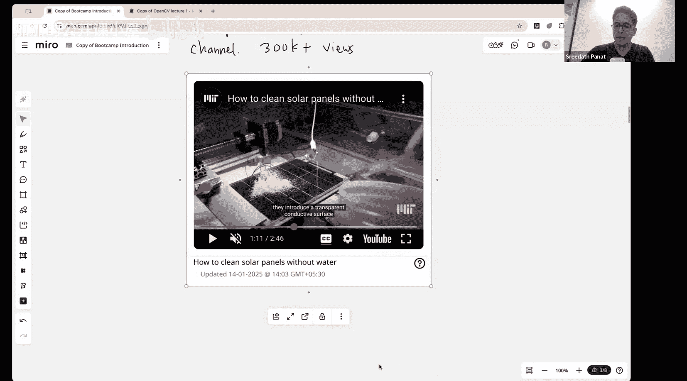

有趣的是，在进行这个项目时，机器学习不经意间进入了视野。因为存在一个叫做“除尘电压”的概念。除尘电压是指需要施加每厘米多少伏特的电压来排斥电荷，并排斥特定尺寸（例如30微米或50微米）的颗粒。灰尘颗粒有不同的尺寸。

这个除尘电压完全取决于颗粒尺寸。但如何知道颗粒尺寸呢？您不可能用显微镜检查太阳能电池板每个区域的颗粒尺寸。那么，一个明智的做法是什么？我购买了一个非常便宜的相机，可以获得50倍到100倍的放大倍率。它不如专业显微镜好，但可以稍微放大，并在一帧图像中给我提供数千个灰尘颗粒。

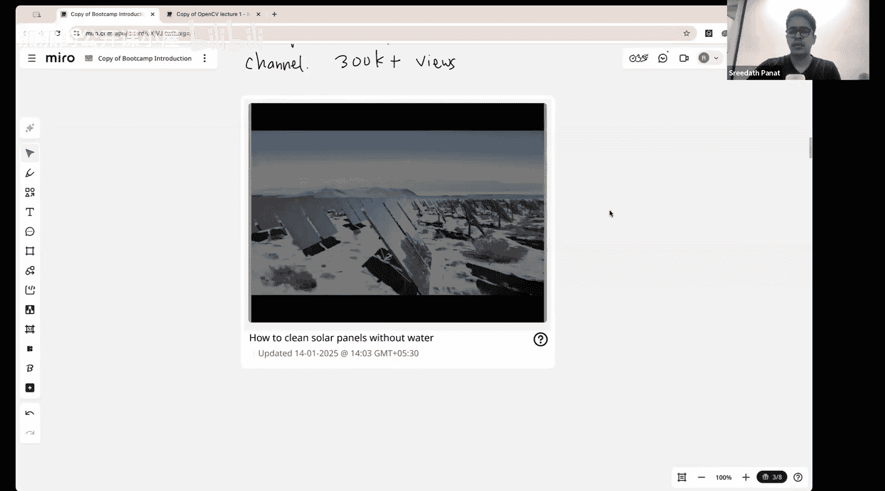

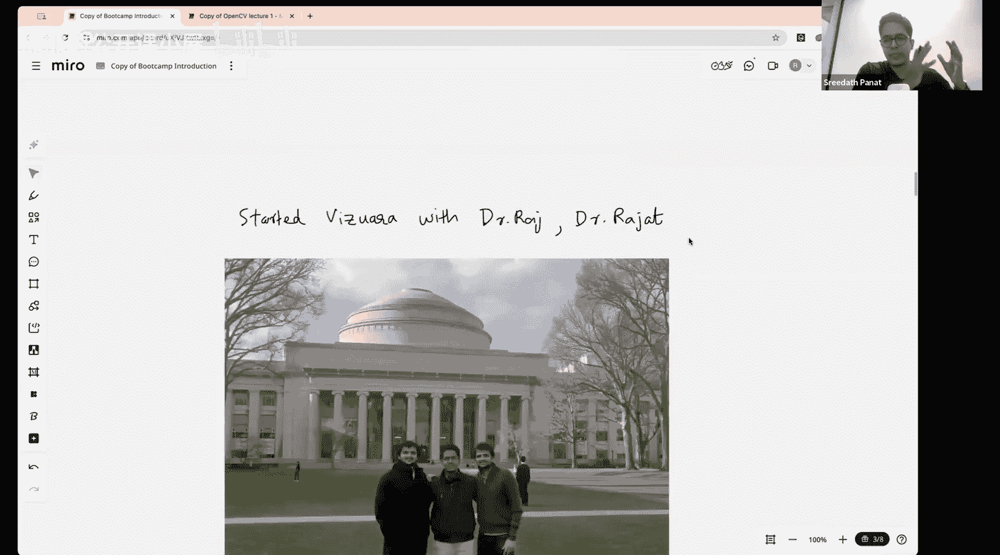

现在，我想从这一帧图像中获得灰尘颗粒的尺寸分布，特别是其平均值和标准差，以便我知道大多数颗粒属于哪个尺寸范围，从而可以施加相应的除尘电压，无论是10千伏、12千伏还是15千伏。

您会怎么做？您会去数吗？您会在每个颗粒周围拟合圆形并测量平均尺寸分布吗？不会。这就是机器学习，特别是计算机视觉，发挥作用的地方。我实现了一个卷积神经网络，可以实时处理来自摄像头的图像，然后将灰尘颗粒尺寸分类到不同的范围，例如30微米范围、50微米范围等。基于此，我的自主太阳能电池板清洁器可以决定施加多大的电压。这是计算机视觉，特别是深度学习在计算机视觉中，应用于一个完整的动手物理实验装置和产品的一个有趣案例。

我想与您分享这个案例，因为我非常确定参加本次课程的人背景各异，不仅仅是计算机科学。我相信你们来自不同的背景，比如机械工程，有些人可能来自计算机科学，有些人可能来自完全不同的非工程背景。您可能想知道为什么深度学习计算机视觉与您相关。它之所以相关，正是我想通过这个例子向您展示其相关性。计算机视觉领域已经渗透到各个行业的不同领域，我将在今天的讲座中展示一些示例行业。

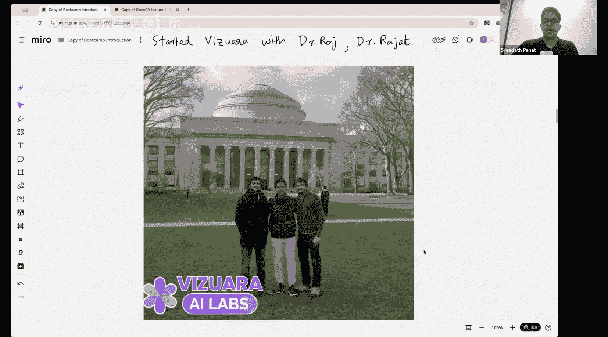

这只是我的介绍。我还想再提一个小故事，关于我最初在传统计算机视觉方面的研究尝试。这是十多年前，当我还是本科生时，我们正在研究一个分类米粒的问题。如果表面上有一堆米粒，有很多不同的品种，比如巴斯马蒂米、茉莉香米、意大利米等等，有几十个品种的米粒。

平均而言，这些米粒有一个平均尺寸，存在一个分布，但尺寸因米粒品种而异。米粒在表面上的配置方式有很多种。有时可能很稀疏，分布得图像上只有几粒米；或者可能堆在一起，很多米粒相互接触。那时，尽管深度学习已经略微进入视野（得益于我们稍后会讨论的 AlexNet），但与深度学习无关的传统计算机视觉方法仍然很突出。

我们当时试图做的是类似椭圆拟合的事情。假设您有一个看起来像这样的米粒。

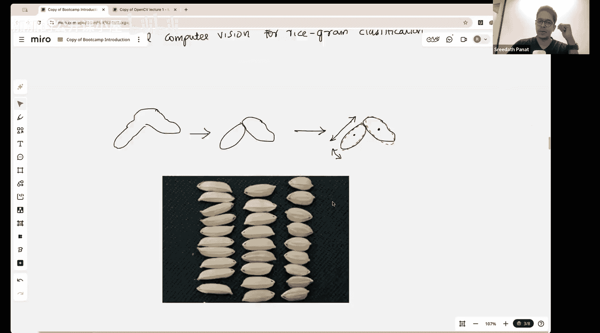

实际上，在图像中，当您执行某种阈值处理时（即将图像转换为纯黑或纯白图像），您可能会注意到像这样的形状，它们并不代表实际的米粒。可能发生的情况是两个米粒相互接触。因此，您必须首先找出在什么条件下，什么算法可以检测到两个米粒何时接触，因为它们的轮廓将只是一个单一的形状。

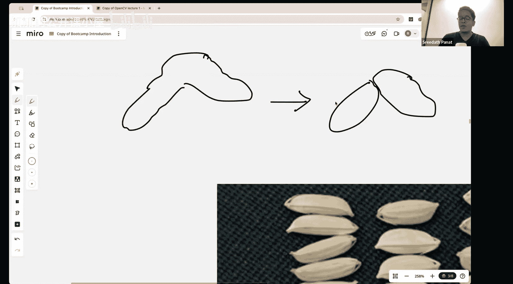

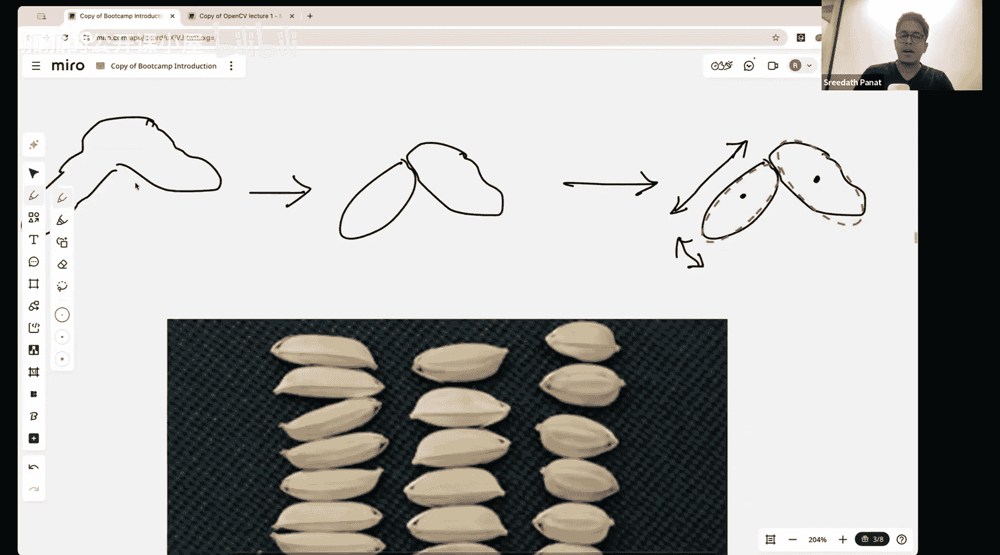
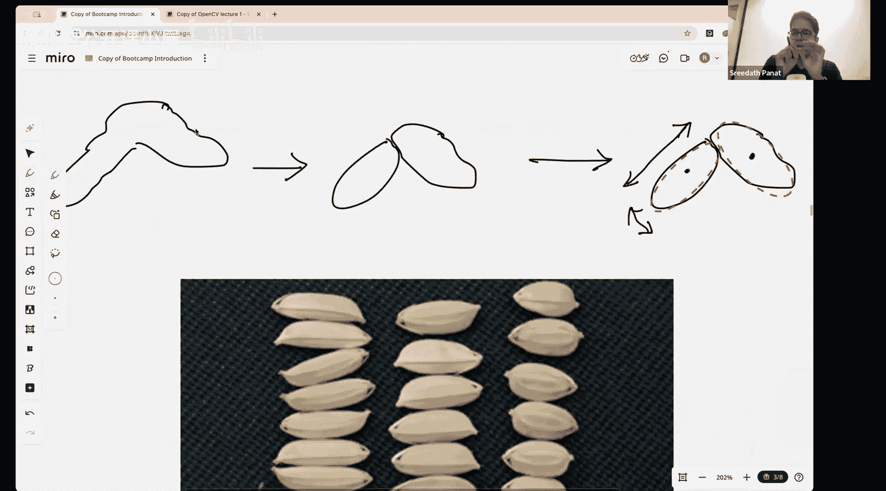

然后，将这些形状分割成两个不同的形状，找到这些形状的质心或几何中心并拟合椭圆，接着计算这个椭圆的长轴和短轴长度，然后绘制尺寸分布图。例如，长轴可能是 B，短轴可能是另一个值。然后，相似品种的米粒，比如某种米，可能分布在这里。

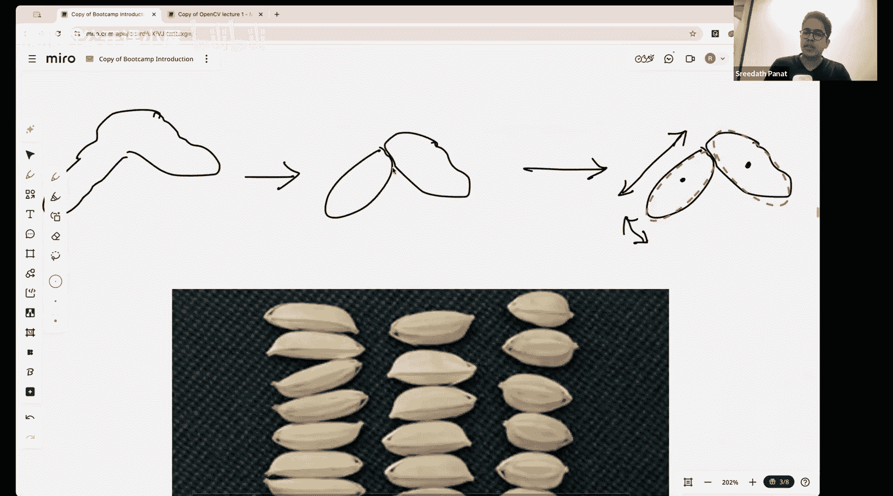
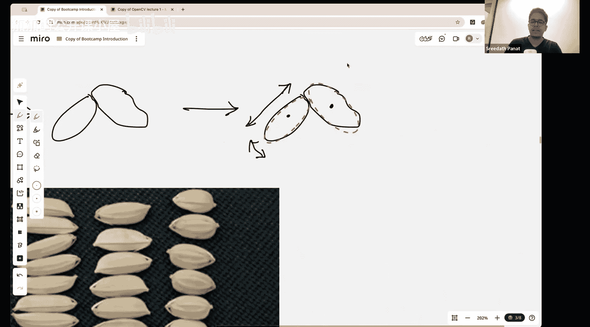

而另一种米可能分布在那里。

这是一个纯粹的传统计算机视觉方法，与深度学习无关，神经网络甚至不在考虑范围内。但现在众所周知，这也可以用神经网络来完成。但好处是，这项工作让我们很好地接触了当时机器视觉和计算机视觉中正在发生的各种技术。这项工作被第九届国际机器视觉会议接受，该会议在法国尼斯举行。

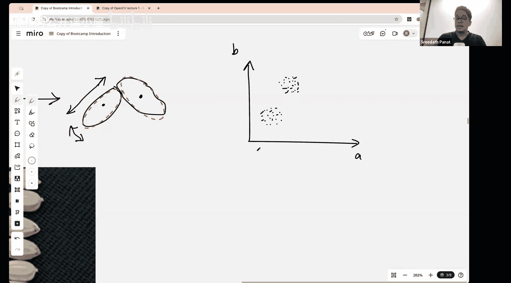
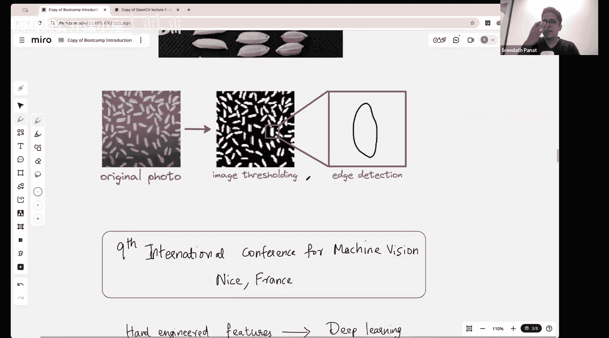

当我们在那次会议上展示我们的工作时，我们清楚地意识到，研究界在不久的将来将完全转向基于深度学习的计算机视觉方法，没有人会再研究手工设计的特征。我非常幸运能够几乎实时地经历这一重大转变。

当然，在计算机视觉或计算机科学更深入的社区中，已经发生了其他转变。AlexNet 是2012年发表的论文，首次展示了可以使用深度神经网络在大型图像数据集上进行训练，他们甚至使用了 GPU 进行训练。它首次展示了可以利用并行计算使一切变得更快。如果您看英伟达的股价，其上涨不能完全归因于单一事件，但如果可以，那么这将是其中之一，即 AlexNet 的提出。Alex 是该论文的第一作者，还有 Geoffrey Hinton 教授，他因在神经网络方面的工作获得了2024年诺贝尔物理学奖，以及 Ilya Sutskever，他是 OpenAI 的创始人之一。

这一切都发生在2012年，然后人们逐渐开始从工作中消除手工设计的特征。

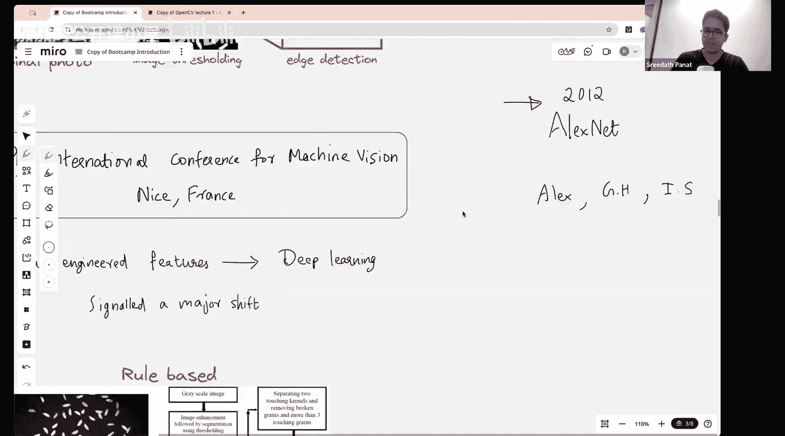

那么，手工设计的特征是如何工作的呢？因为我们知道，在卷积神经网络中，它们使用一种叫做卷积滤波器的东西。滤波器很重要，只是人类不定义滤波器的值，它是在深度学习过程中通过反向传播学习得到的。

但是，在此之前，这个滤波器到底对图像做了什么？如果您有一张图像和一个滤波器，会发生什么？

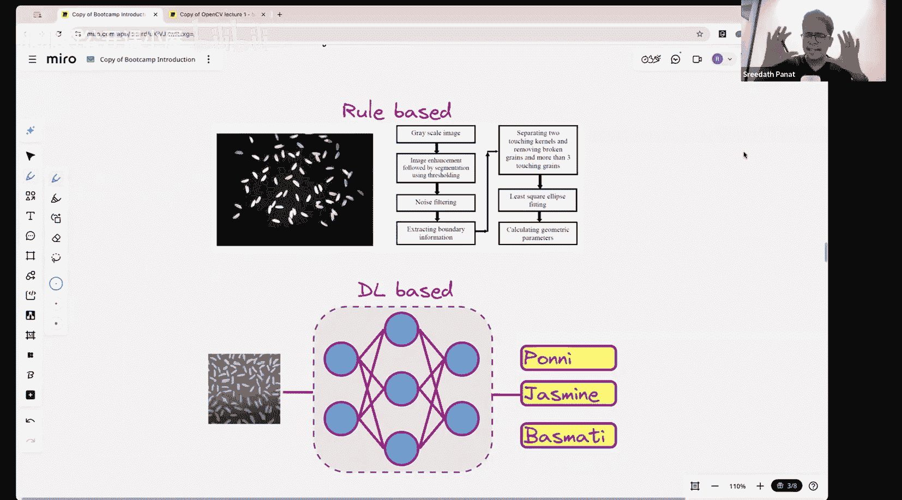

---

本节课中我们一起学习了本次计算机视觉实战训练营的课程目标与讲师背景，并通过两个具体案例（自清洁太阳能板与米粒分类）了解了计算机视觉从依赖手工特征的传统方法到基于数据驱动学习的深度学习方法的演变历程。我们还简要提到了推动这一转变的关键事件（如AlexNet的提出），为后续深入学习奠定了基础。