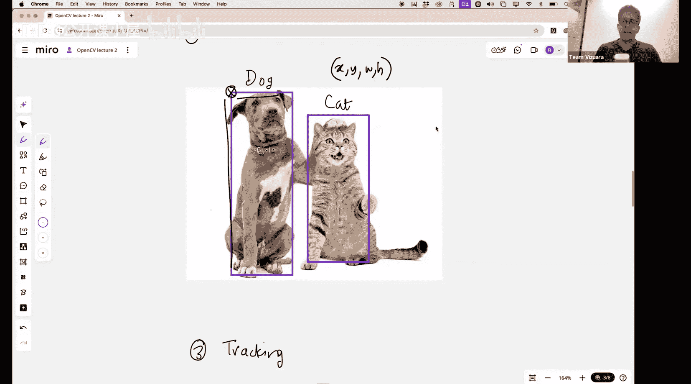
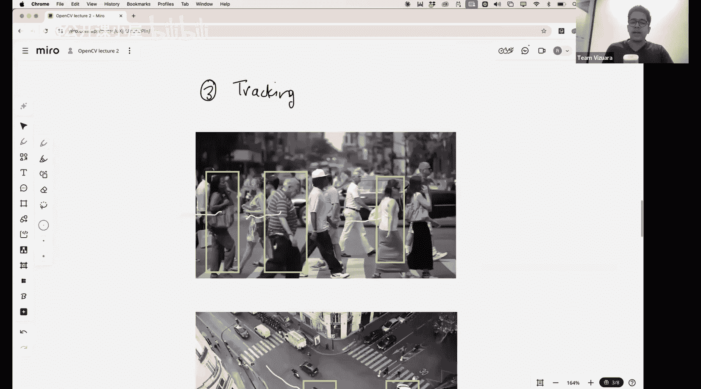
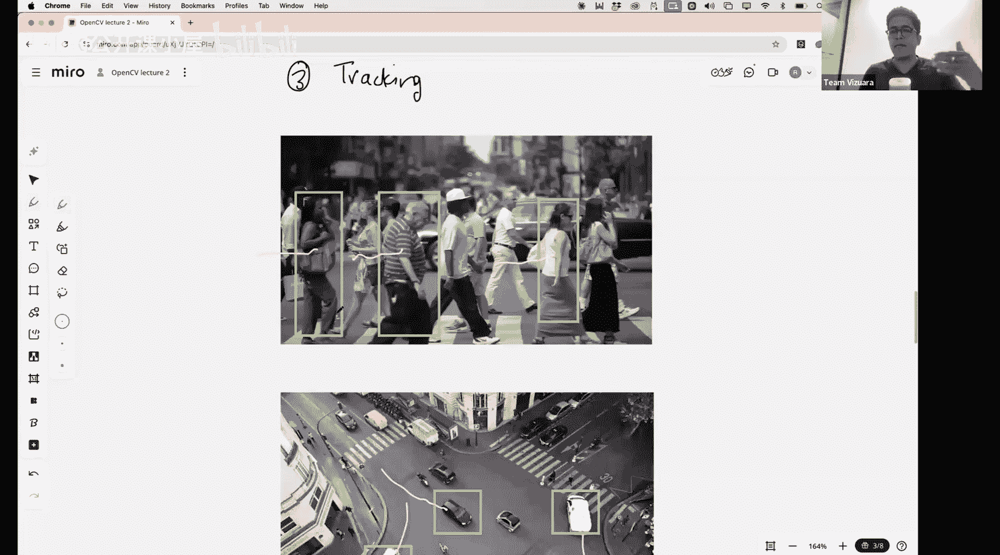
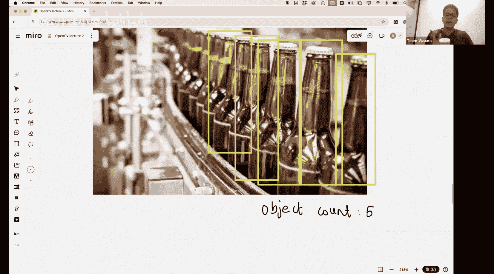
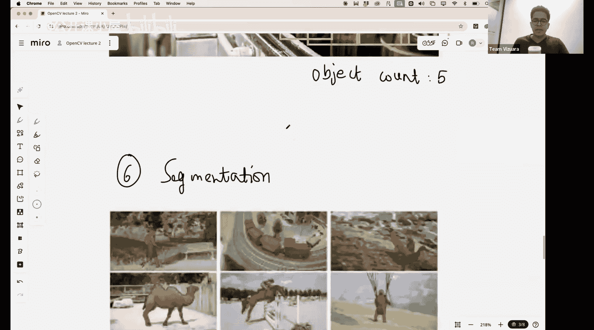
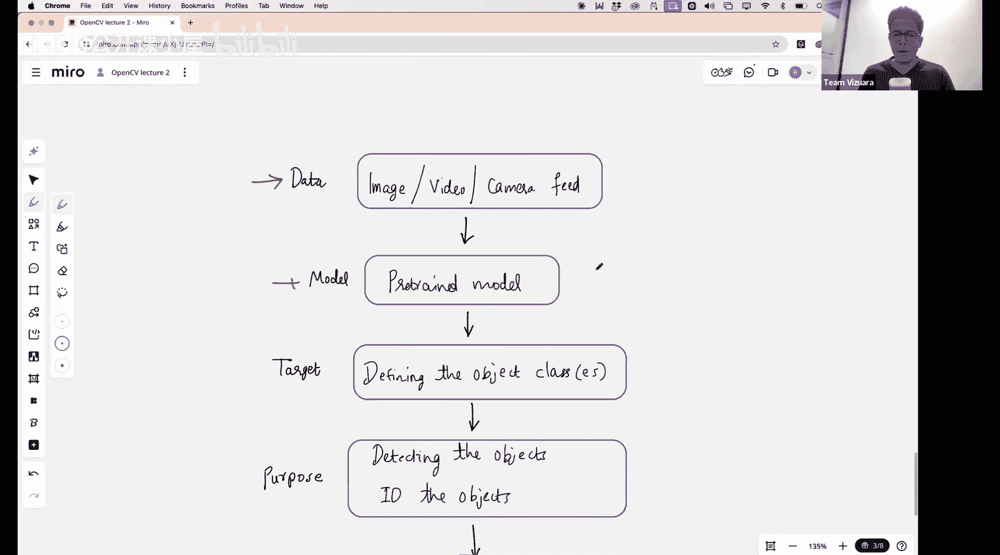

#  021：目标追踪与计数

在本节课中，我们将学习如何使用OpenCV和预训练的YOLO模型，构建从单目标检测到多目标追踪与计数的完整应用。我们将涵盖目标检测、追踪、计数以及分割的基本概念和实现方法。

上一节我们介绍了OpenCV库，并讨论了滤波器及其原理。最后，我们构建了一个简单的“防盗检测”算法，它基于纯逻辑，通过比较帧间像素簇的差异来工作。

本节中，我们将使用预训练的深度学习模型构建更复杂的应用。虽然今天不会深入讲解这些模型的细节（这将在训练营后续部分专门介绍），但我们将动手实现以下功能。

以下是本节课将要构建的应用列表：
*   **单目标检测**：在图像或视频流中，检测并标注单个目标。
*   **多目标检测**：扩展单目标检测，同时检测并标注多个目标。
*   **目标追踪**：为检测到的目标分配唯一ID，并在连续帧中保持该ID，以追踪其运动轨迹。
*   **目标计数**：基于目标追踪，统计视频中出现的独特目标数量。
*   **目标分割**：区分检测与分割，并初步实现像素级的语义分割。

目标可以是人、动物或任何物理实体。我们将使用来自网络（如YouTube）的视频或图像作为数据。使用的模型是YOLOv8，这是一个高效的预训练实时目标检测算法。整个实现将基于OpenCV框架。

在开始之前，我们需要明确几个核心计算机视觉任务的区别：**图像分类**、**目标检测**、**目标追踪**、**目标计数**和**图像分割**。

**图像分类**是最简单的任务。给定一张图像，算法将其整体归类为N个类别中的一个。例如，在猫狗二分类中，算法会输出图像是猫的概率（如99%）。这通常通过一个末端带有Softmax分类器的卷积神经网络（CNN）实现。

**目标检测**则包含两个任务：分类和定位。对于一张包含多个目标（如猫和狗）的图像，算法需要预测每个目标周围的**边界框**及其类别概率。边界框由四个参数定义：左上角坐标 `(x, y)`、宽度 `w` 和高度 `h`。算法会输出类似“边界框位置为 `(x, y, w, h)`，框内目标为‘狗’，置信度98%”的结果。YOLO就是用于生成这些边界框的算法。

**目标追踪**关注的是目标在连续帧间的运动。它为每个检测到的边界框分配一个唯一ID。例如，一个人被分配ID=3。在后续帧中，即使目标移动，算法也应确保对应此人的边界框ID仍为3，不应改变。通过追踪边界框的**质心**（中心点，计算公式为 `(x + w/2, y + h/2)`），可以可视化目标的运动轨迹。

**目标计数**可以基于目标追踪来实现。通过统计整个视频序列中出现过的不同ID数量，即可得到经过的目标总数。例如，如果视频中总共出现了15个不同的ID，那么目标计数就是15。这种方法可用于传送带系统计数等场景。

**图像分割**与检测有本质不同。分割不是画一个粗糙的边界框，而是要在像素级别上识别出属于特定目标的所有像素，并将其从背景中分离出来。例如，精确勾勒出骆驼的轮廓，而不是用一个矩形框住它。这被称为语义分割，我们将在后续课程中深入探讨。

现在，让我们回顾一下本节的整体设置。我们将处理图像、视频或摄像头实时流数据。核心模型是YOLOv8。整个实现将搭建在OpenCV框架之上。

本节课中，我们一起学习了目标检测、追踪、计数和分割的基本概念，并了解了如何使用YOLOv8和OpenCV来构建这些应用。从单目标识别到多目标运动分析，这些技术是构建更高级计算机视觉系统的基础。