#  022：使用R-CNN、Fast R-CNN和Faster R-CNN进行目标检测 🎯

在本节课中，我们将学习目标检测领域的一个里程碑系列模型：R-CNN及其演进版本。我们将从最基础的想法出发，理解为什么需要“区域提议”，并详细探讨R-CNN、Fast R-CNN和Faster R-CNN的工作原理。课程内容将尽可能简单直白，确保初学者能够跟上。

---

## 课程概述与背景

我们正处于课程的第二部分，将讨论基于卷积神经网络（CNN）的目标检测方法。R-CNN系列模型主要用于目标检测，而它的一个变体——Mask R-CNN，还可用于图像分割任务。

需要提醒大家的是，本课程的主要目的之一是教授能够进行图像分割的技术。图像分割是指精确检测出物体的边界轮廓。而一个更简单的版本是目标检测，即用一个**边界框**将物体框出来。

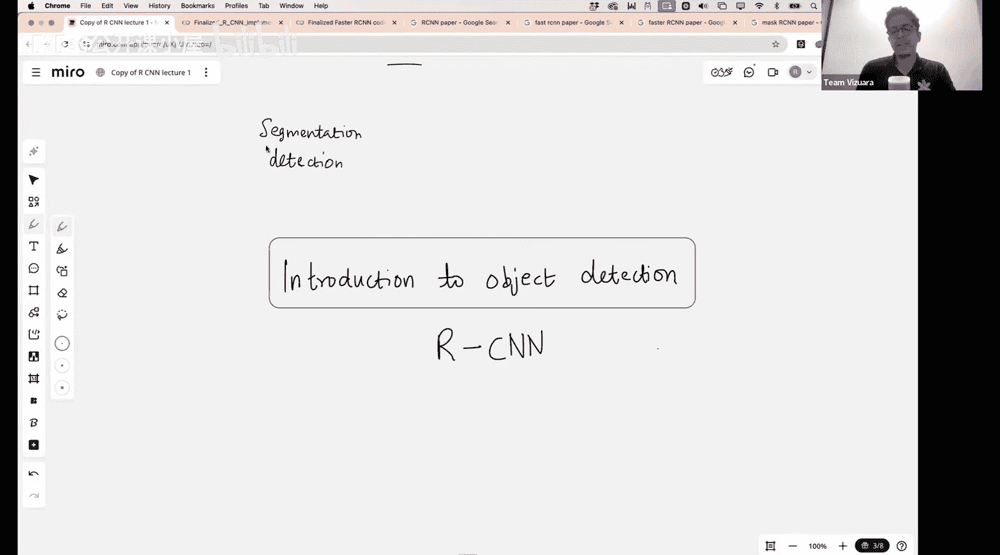

在之前的几节课中，我们看到了如何使用YOLO实现目标检测，但并未深入探讨模型本身的工作原理，我们主要关注了最终结果和代码实现。今天，我们将深入细节，了解这些目标检测或图像分割模型究竟是如何被开发出来的，其背后的理论是什么。我们将从R-CNN开始。

## 从基础想法到R-CNN的诞生

R-CNN中的“R”代表“区域”（Regions）。接下来，我将解释为什么CNN会与“区域”这个术语关联在一起。这里的CNN指的是简单的卷积神经网络。

让我们退一步思考。假设我们回到2012或2013年，也就是大约10到12年前。如果我们要开发一个目标检测算法，可能会怎么做？因为AlexNet已经在2012年提出，所以到2012年，图像分类对我们来说已经可以轻松完成。

现在，我们讨论的是2013或2014年。那时我们已经知道如何使用LeNet或VGG等模型很好地完成图像分类。但现在的目标是**检测**图像中你感兴趣的物体所在的像素区域。

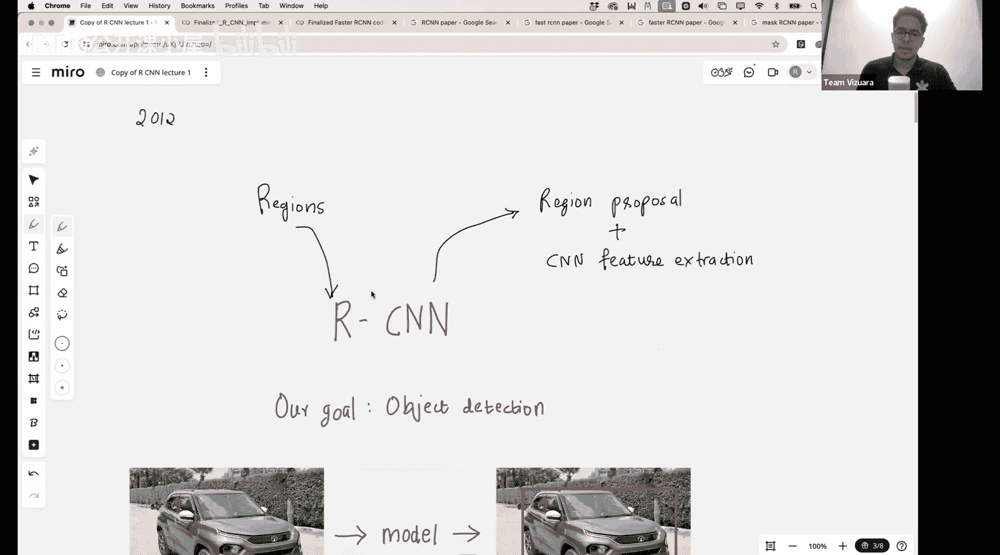

假设你有一张包含汽车的图片，你的目标是以一定的概率百分比检测出汽车周围的边界框。

那么，目标就是得到类似这样的结果：一个边界框和一个置信度分数。如果你要构建这样的系统，没有任何额外思路，你可能会尝试的最基础的算法是什么？

问题是：如果你正在构建一个基础算法，用于检测可能包含特定物体（可能是汽车、猫或狗）的边界框，你会怎么做？

在你思考的同时，我也会说出我的想法。最简单的方法可能是这样的：你随机取一个矩形框，它可能框住一些物体，有时是背景，有时是物体的一部分。

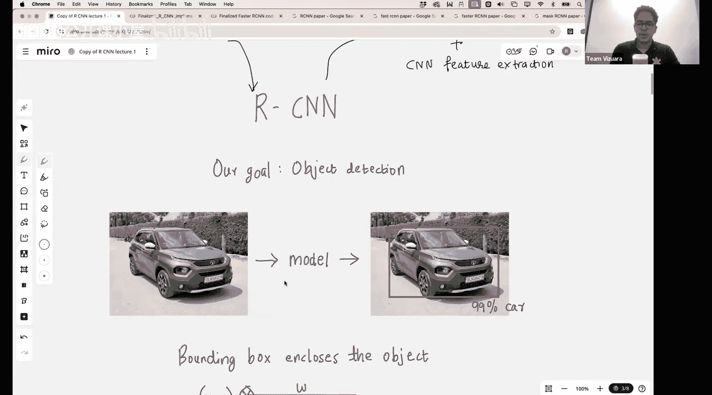
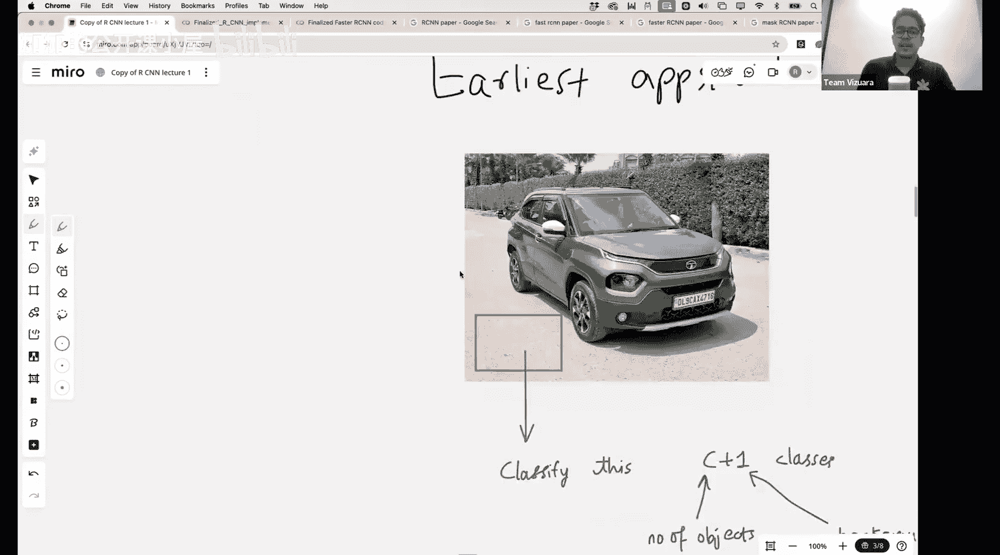

然后，假设你尝试进行一个两类分类，其中一类是汽车，另一类是卡车。更准确地说，你将这个随机生成的矩形区域内的像素子集分类为 **`C + 1`** 个类别中的一个（C个物体类别 + 1个背景类）。例如，一类对应汽车，一类对应卡车，另一类对应背景。

如果你有AlexNet，你可以轻松地对这个区域进行分类。显然，AlexNet可能会说这既不是汽车也不是卡车，而很容易将其分类为背景。这样，你随机搜索了一个矩形区域，并以很高的确定性发现它既不是卡车也不是汽车，而是背景。

但是，请思考一下，这样的矩形框有多少种可能性？假设图像的实际宽度是 **`W`**，实际高度是 **`H`**。

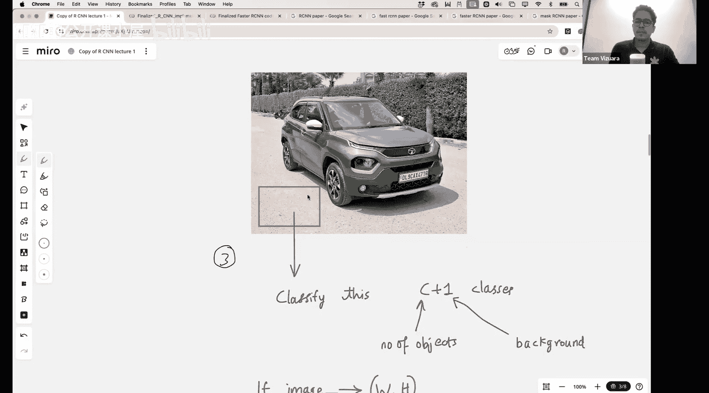

再假设你的小矩形框的宽度是 **`w`**，高度是 **`h`**。

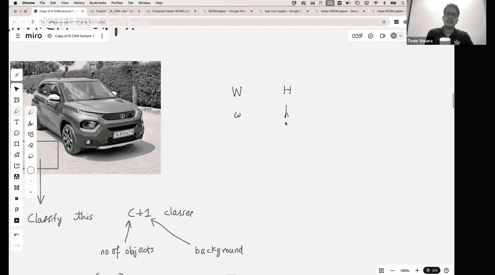

那么，你基本上可以将这个矩形框放在很多位置。在不改变宽度和高度本身的情况下，同一个矩形框可以放在这里、那里，可以向上移动，可以放在任何地方。

实际上，在宽度方向上，你有 **`(W - w + 1)`** 个可能的位置来放置这个矩形框。

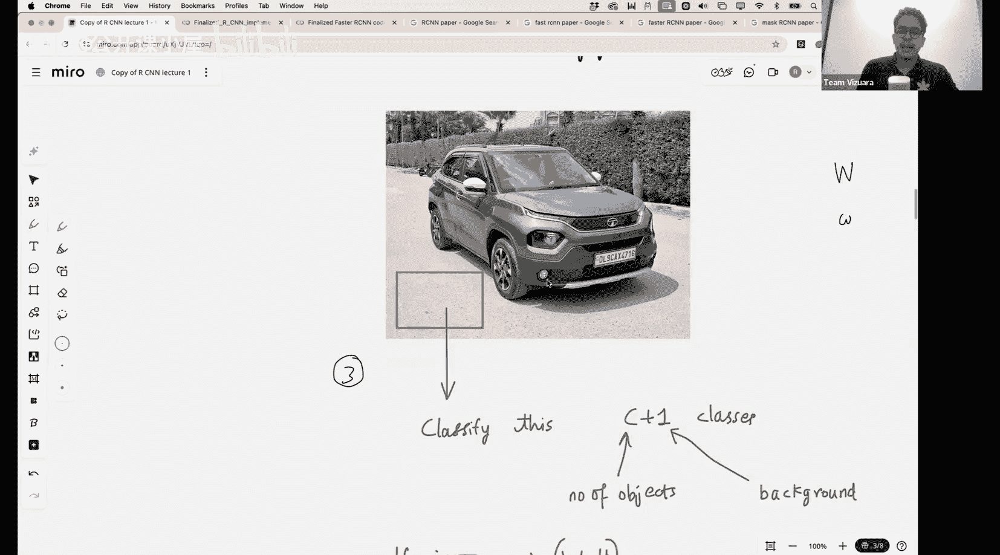

同样地，在高度方向上，你有 **`(H - h + 1)`** 个可能的位置。

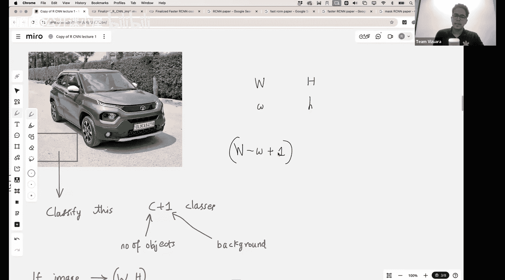

由于沿x轴和y轴的放置是相互独立的，你可以简单地将这两个数相乘。因此，你有 **`(W - w + 1) * (H - h + 1)`** 种方式将这个矩形框放置在图像的任意位置。

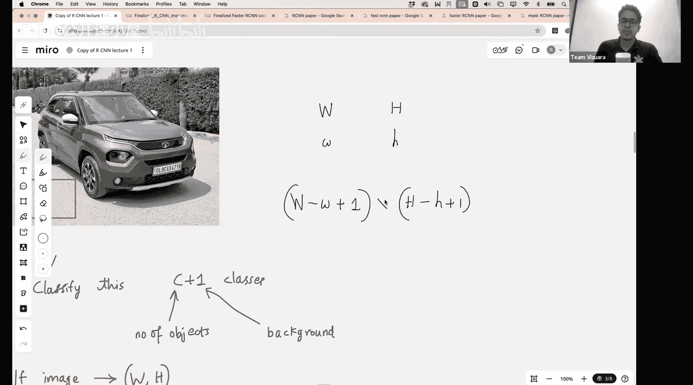

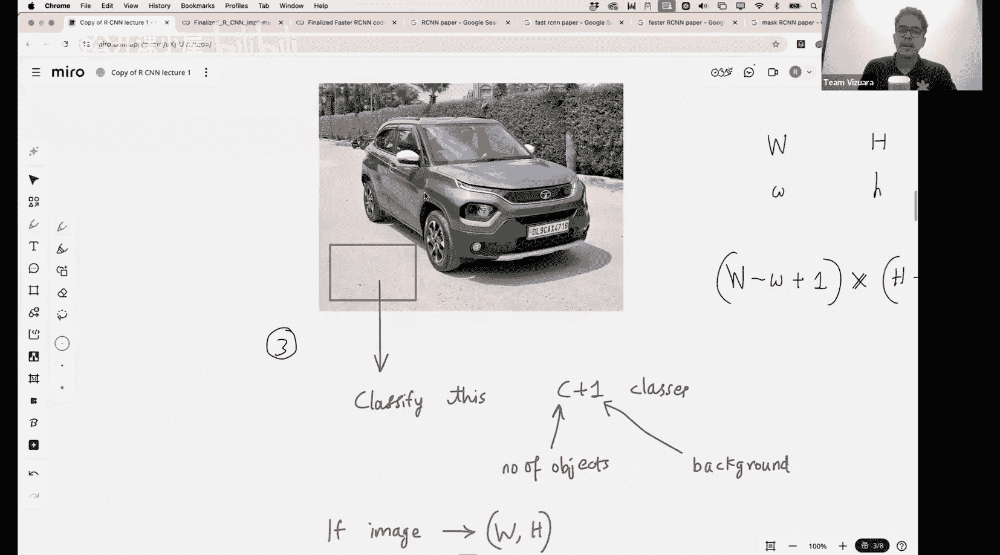

但这还不是全部。矩形框本身的宽度和高度也有无数种可能。宽度可以在 **`1`** 像素到 **`W`** 像素之间，高度可以在 **`1`** 像素到 **`H`** 像素之间，因为图像的最大高度是H，最大宽度是W。

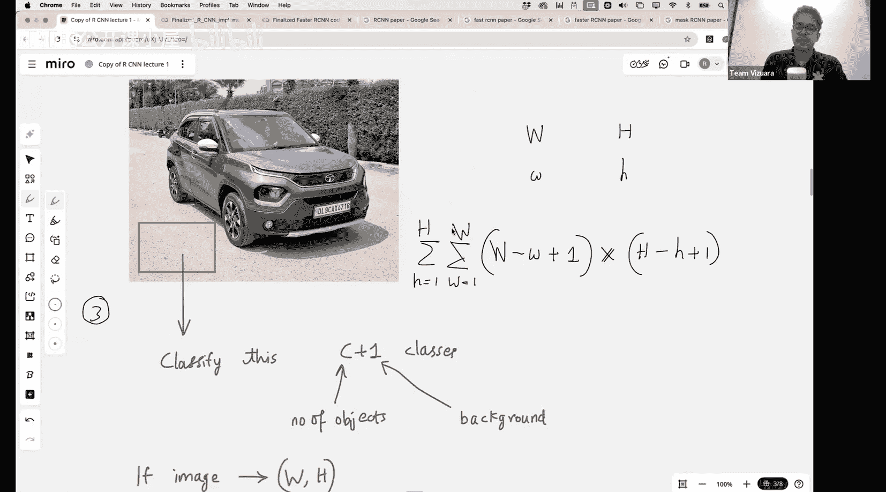

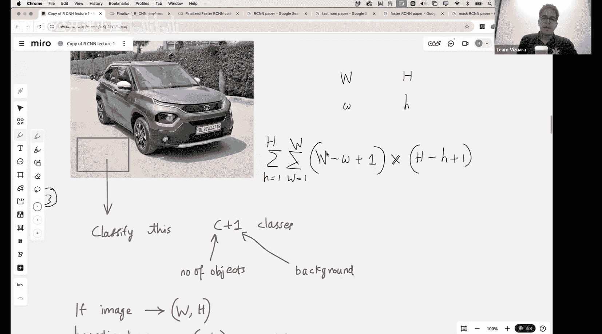

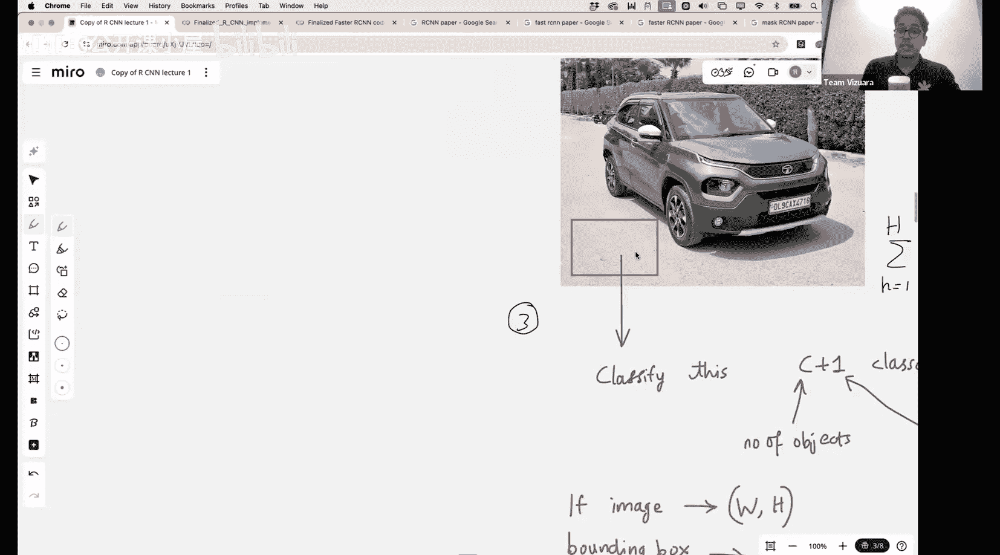

现在，如果你看看像这样可能的总矩形框数量，它是巨大的。这里我做了一个计算：假设你的图像宽度是224像素，高度是224像素，你现在面对的是近 **`6.35亿`** 个框。6.35亿个矩形框。

你的目标物体可能就在这些框里。所以基本上，你现在要对这6.35亿个框进行二分类（实际上是三分类：卡车、汽车或背景）。这效率太低了，因为搜索所有6.35亿个框没有任何意义。

那么，下一个最好的办法是什么？你只搜索**一部分框**，只考虑那些你认为可能有目标物体的框，对吗？这些框被称为**提议区域**。

所以，假设我神奇地告诉你：在这张汽车图片中，不要看所有的矩形框。你的目标物体很可能在这个矩形框里，或那个，或那个。我为你提出了有限数量的矩形框，比如2000个，而不是6亿个。我告诉你，这些提议区域有更高的可能性找到物体。现在，你只需要检查这2000个矩形框，你的计算量就变得合理多了。

这正是R-CNN所做的。“R”代表区域。你不是查看整个图像，而只是查看图像中一些提议区域，以判断感兴趣物体是否存在。

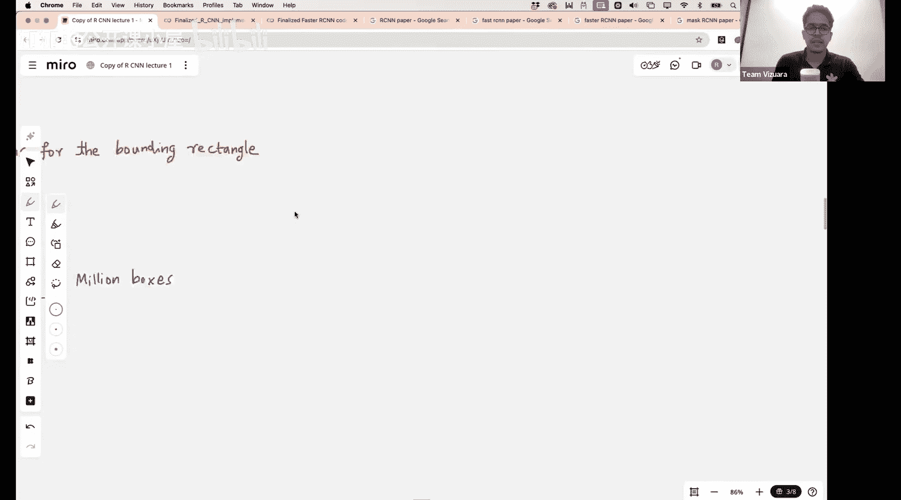

现在，希望你能理解搜索所有可能性与搜索部分可能性之间的区别。

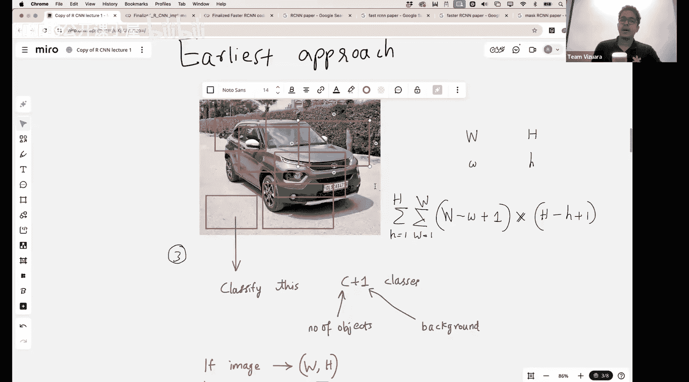

## R-CNN的工作流程

首先，你有一张图片。这张图片可能不是正方形的，但我们在R-CNN架构中使用的大多数CNN都需要正方形输入。

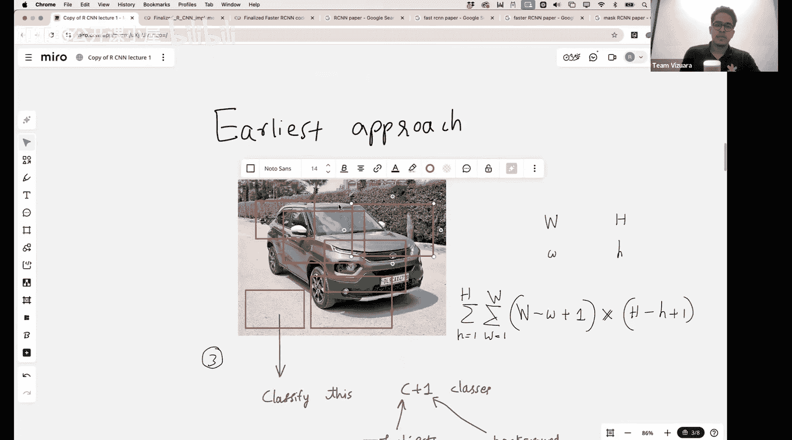

因此，这张RGB图像将被转换为正方形。例如，如果它是224x440，它将被裁剪或重塑为224x224。此外，因为存在红色、绿色和蓝色通道，所以最终输入维度是 **`224 x 224 x 3`**。正如你所知，图像由像素值表示。红色通道将有224x224个值，每个像素值范围从0到255，绿色和蓝色通道也是如此。

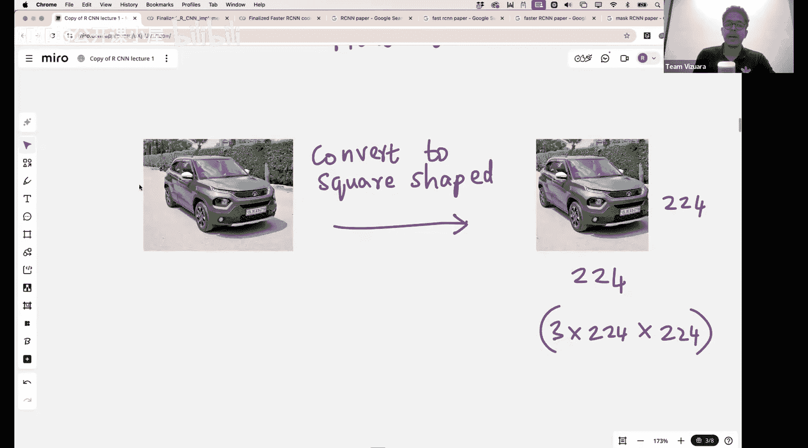
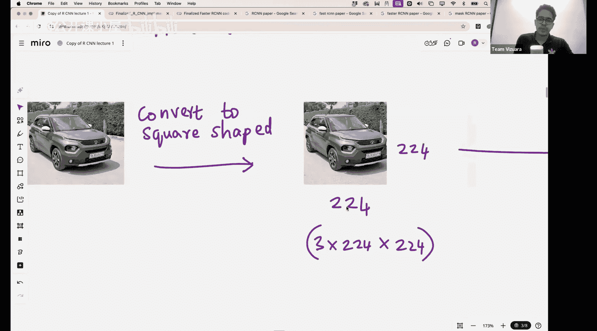
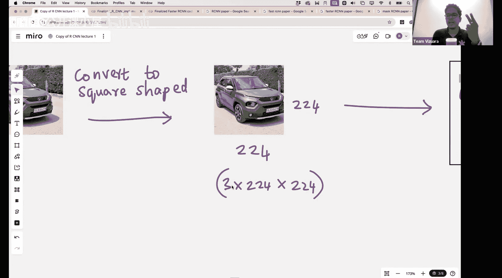

然后你做什么？然后你执行一个步骤，以某种方式神奇地获得那些提议的矩形区域，也就是那2000个矩形框。

那么，如何获得这些区域呢？为此，有一些基于手工设计逻辑的算法。

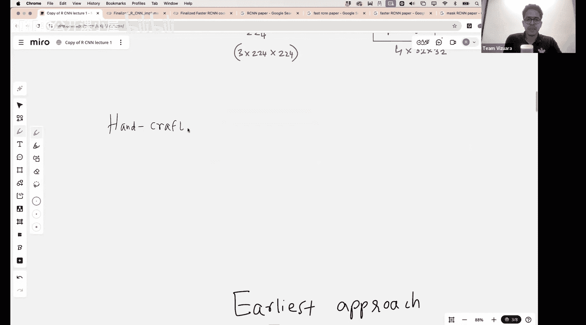

在识别这2000个潜在候选区域时，没有涉及深度学习。你看的是具有相似像素值的像素簇。

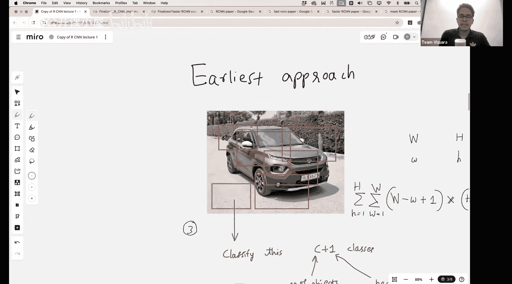

例如，这里的所有像素都有相似的颜色值，比如某种棕色或灰色。所有这些像素可能有一些绿色值。仅仅通过观察可能具有相似颜色的像素簇，你就可以识别或提议一些区域，对吗？还有其他方法，比如利用像素值来定义物体的几何形状。

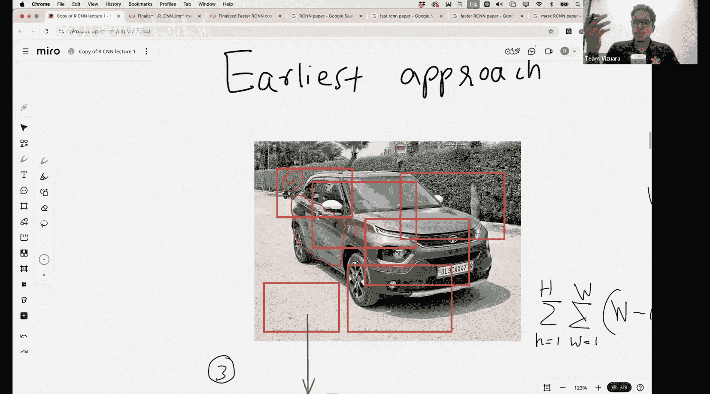

---

## 本节总结

在本节中，我们一起探讨了目标检测的基础挑战：从海量的可能区域中定位物体是极其低效的。由此，我们引入了**区域提议**的核心概念，即先通过一些快速算法（非深度学习）生成少量可能包含物体的候选框，从而将搜索空间从数亿个减少到数千个。这正是R-CNN（Region-based Convolutional Neural Network）名称中“R”的由来，也是其高效性的关键第一步。下一节，我们将具体看看R-CNN如何利用这些提议区域进行精确的分类和定位。