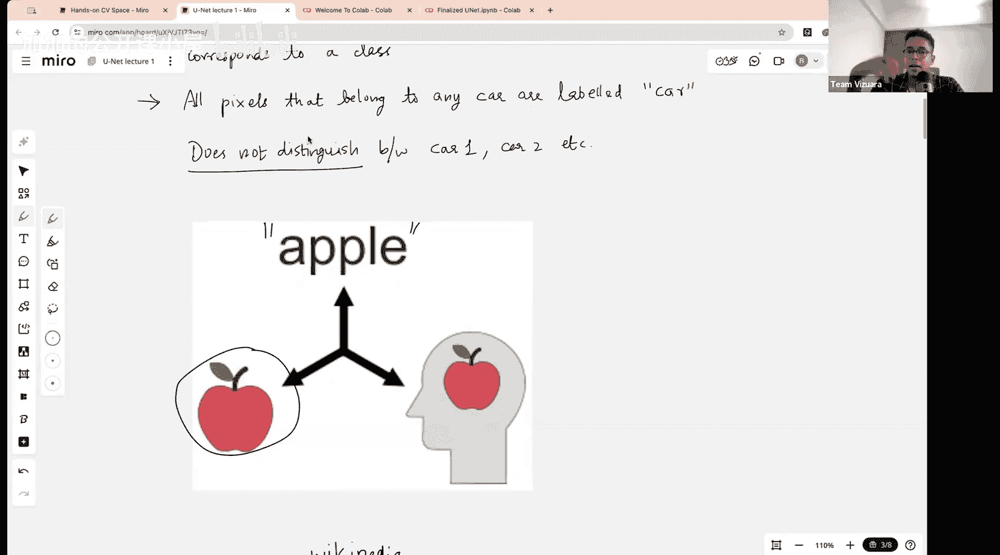
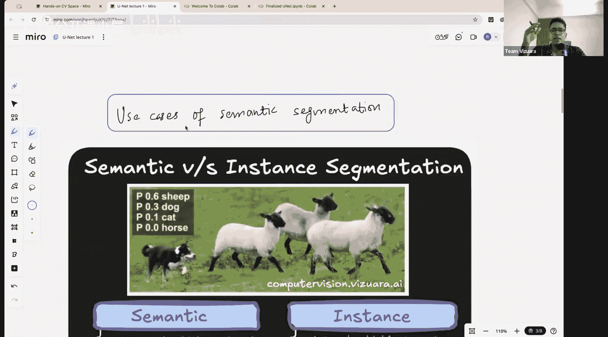
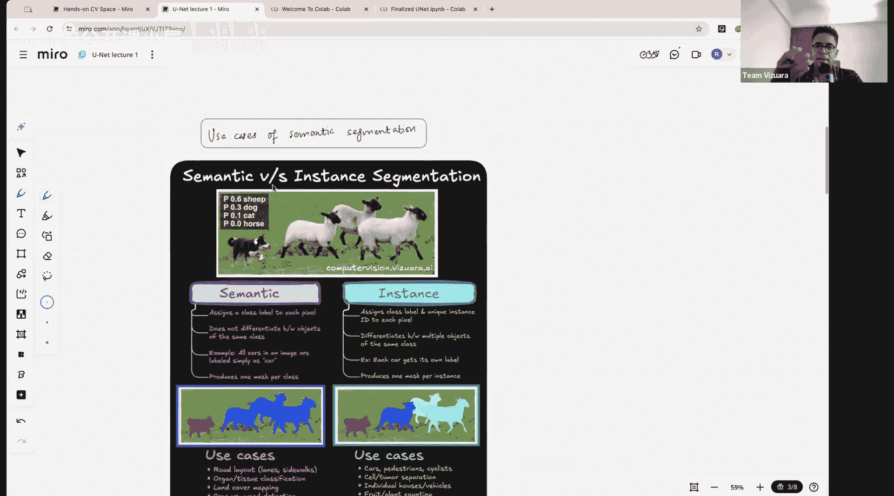
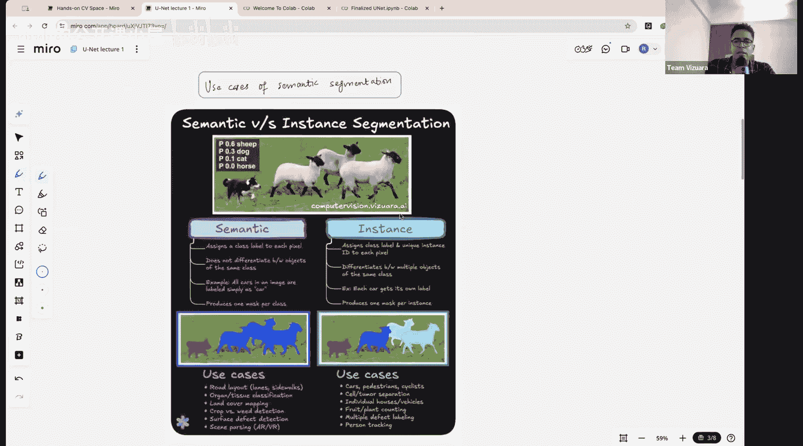
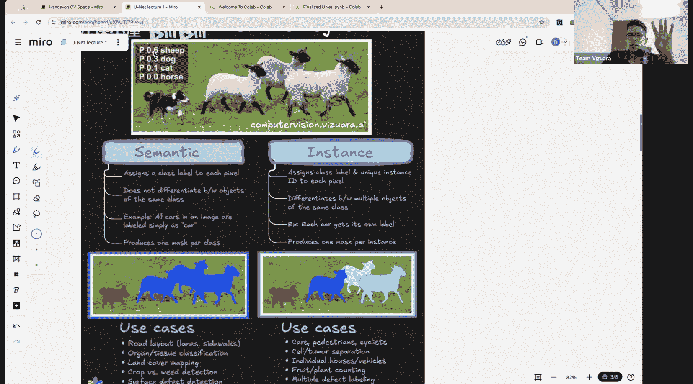
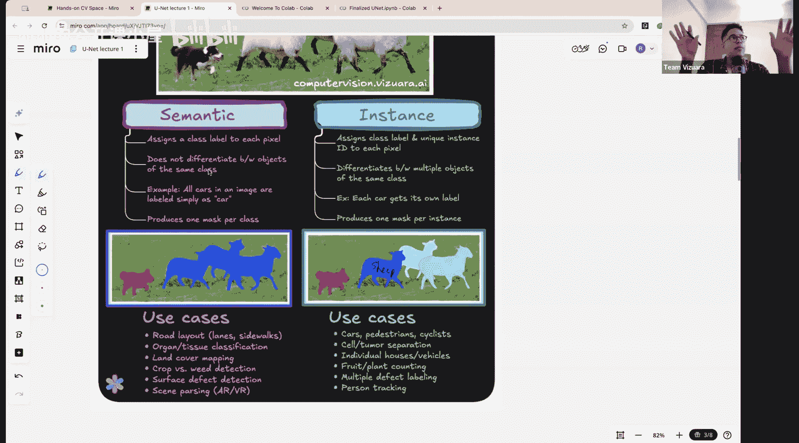
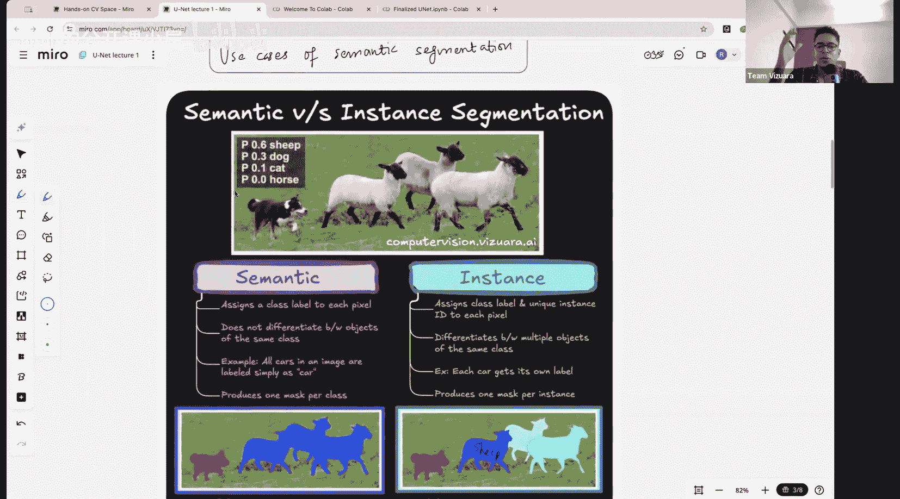
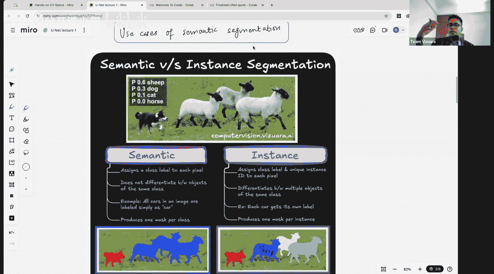
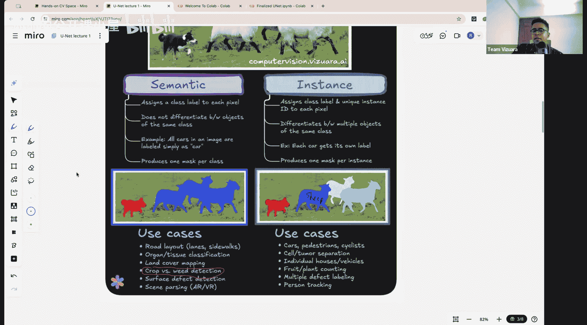
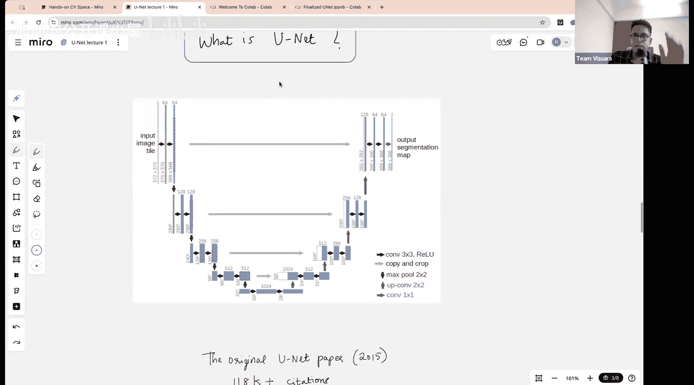

#  024：改变分割领域的2015年模型 🔬

在本节课中，我们将学习UNet架构。UNet是一种出色的架构，在生成式AI，特别是图像生成应用中也会遇到。它是一个更广泛的架构，最初应用于生物医学成像，后来完全转变为扩散模型等技术的支柱之一。今天我们将深入探讨UNet，详细讨论其工作原理的理论，最后像往常一样，我们将为特定数据集实现UNet，训练它，并尝试进行推理。

UNet用于语义分割，因此我首先会简要讨论一下本讲座中讨论的语义分割与之前在使用Mask R-CNN时研究的实例分割之间的区别。让我们开始吧。

## 语义分割与实例分割

在语义分割中，基本思想是图像中的每一个像素都有一个类别。如果一张图像有224x224像素，那么每个像素都会被分配一个类别。如果只是检测一个物体，比如图像中有一辆车，那么每个像素要么是车的概率，要么是背景的概率，这就像一个二元分类。

语义分割最终得到的输出与我们在Mask R-CNN中讨论的掩码有很多相似之处。例如，如果我们观察的物体是一辆车，我们将得到一个看起来像**掩码1**和**掩码2**的输出。这就像输出有两个通道，第一个通道是掩码1，第二个通道是掩码2。在掩码1中，物体以外的所有部分都是白色，物体本身是深色。在掩码2中，你会得到物体本身的掩码，这意味着背景不会被高亮显示，而是物体会被高亮显示。

我们还将讨论在这种情况下如何精确计算损失，因为在语义分割中，基本思想是构建一个掩码，使其形状与感兴趣物体的形状完全相同。在讨论UNet架构之前，“语义”这个词意味着，如果你在看“苹果”这个词，或者在看一张苹果的图片，或者在想象一个苹果，最终这些事物都指向同一个含义，只是它们以不同的方式表示：一种是文本，另一种是图像，另一种是你大脑中的某种表征。因此，语义分割意味着你从对象含义的角度来看待它，比如所有这些像素可能都属于“汽车”这个类别，并且你不区分汽车1、汽车2等。只要一个像素是汽车，在叠加掩码时，它就会被分配一个类别或一种颜色。

现在，让我们将分割分为实例分割和语义分割。这张图很好地捕捉了这一点。请看我们在上一讲中做的实例分割：如果这是输入图像，你基本上有四个物体：三只羊和一只狗。但只有两个类别：狗和羊。在实例分割中，我们尝试在每个物体实例周围绘制边界框，并可以定义唯一的实例ID。如果使用Mask R-CNN，我们还会生成像这样的掩码。这里发生的情况是，每个物体都被单独确定，但它们属于同一类别。所以这就像羊1、羊2、羊3。我们在这里显示的三种不同颜色代表了这样一个想法：尽管这三个物体属于同一类别，但它们是该类别的三个不同实例，而狗是完全不同的类别，显然也是一个完全不同的实例。

在语义分割中，情况非常不同。你不在乎不同的实例，只在乎它是否属于A类或B类。

## 语义分割的应用场景

你可能会想，这在哪里有用？在展示用例之前，我想问：你认为语义分割实际上可能在哪里有用？因为看起来实例分割更好，因为它不仅能区分类别，还能区分同一类别内的不同实例。那么，为什么你认为语义分割可能有用？在什么类型的应用中？想想看，例如，你有一张大脑或其他器官的MRI图像，你想区分所有癌变的组织。你不在乎是组织1还是组织2，你只希望所有癌变组织在图像中以一种颜色分割，所有其他正常组织以另一种颜色显示。你不在乎分离这些实例，只在乎它是否癌变。这是语义分割有用的一个例子。

另一个例子是，假设我们有一个管道，管道中有裂缝或缺陷，或者任何有缺陷的制造产品。你不在乎逐个分离这些缺陷实例，你只想知道在X百分比的总面积上，有多少缺陷存在。在这种情况下，语义分割也更有用。

以下是语义分割的一些用例：
*   如果你有一张航空地图或卫星地图，就像有人在聊天中提到的，如果你只是想调查土地，并且只关心将河流区域、农业区域与居民区等分割成地图上的不同颜色，那么语义分割就很有用。你不在乎识别单个房屋，也不在乎识别单个农田，你只关心将整个农田映射到一个单一的类别。
*   在农业中，如果你想简单地区分作物和杂草，这也非常相关。例如，我之前展示的Blue River公司，他们在检测到杂草时喷洒，在检测到作物时不喷洒。在那里，如果是基于图像的分割，你也不在乎单独识别出每株杂草，你只想知道有多少杂草。

因此，两者都有许多不同的用例。并不是说一个比另一个优越，只是用例完全不同。例如，在肿瘤检测中，将肿瘤分离成不同的ID并不关键，但你希望整体了解它；或者在航空或卫星成像中也是如此。

## UNet架构简介

UNet的全部目的是执行语义分割。默认情况下，它不执行实例分割。因此，从这个意义上说，它与Mask R-CNN所做的非常不同。在我看来，UNet架构要优雅得多，你很快就会明白为什么。它更优雅、更简单，并且具有与各种生成式AI模型完全相同的架构。

我现在展示的这张图就是UNet架构，我们将深入探讨它。首先，UNet之所以如此命名，是因为它的形状像一个“U”。现在，这可以分成两部分：如果我画一条这样的线，这里的一切是编码器部分，这里的一切是解码器部分。编码器部分负责从输入图像中提取特征，而解码器部分负责将这些特征上采样回原始图像大小，以生成分割掩码。

在接下来的部分中，我们将详细讨论编码器和解码器的每个组件，包括卷积层、池化层和上采样操作。我们还将讨论跳跃连接，这是UNet的一个关键特性，它允许将编码器中的特征图与解码器中相应层的特征图连接起来，从而帮助保留空间信息。

最后，我们将讨论损失函数，通常是用于分割任务的交叉熵损失或Dice损失，并展示如何训练UNet模型。我们还将简要介绍如何对训练好的模型进行推理，以生成新的分割掩码。

通过本课程的学习，你将能够理解UNet的工作原理，并能够自己实现和训练一个UNet模型用于语义分割任务。