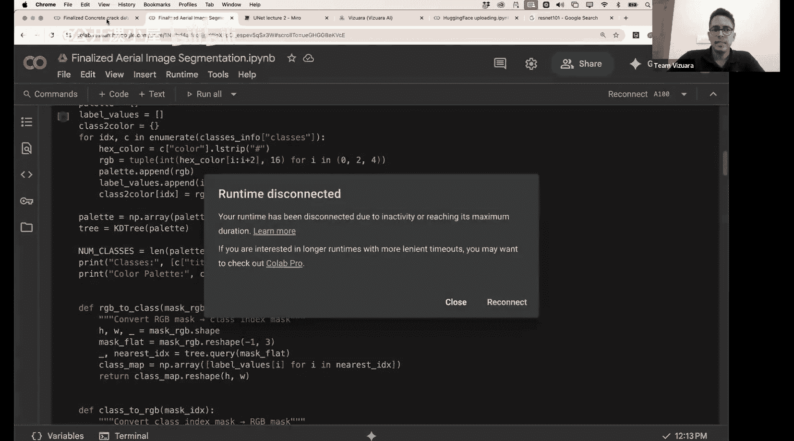
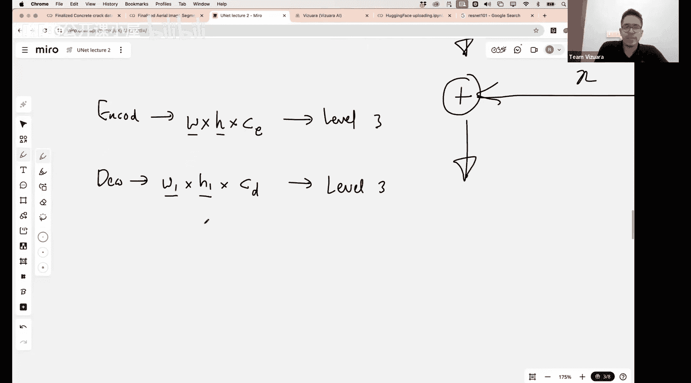

#  025：UNet++、残差UNet与注意力UNet

在本节课中，我们将继续深入学习UNet及其几种变体。我们将专注于图像分割任务，并动手为两个不同的数据集编写UNet模型代码。此外，我们还会将训练好的模型权重发布到Hugging Face平台，以便任何人都能使用该模型进行推理。如果你还不熟悉Hugging Face，我们也会进行简要介绍。

## 课程概述

上一节课我们详细探讨了UNet的架构。本节课，我们将首先快速回顾UNet的核心结构，然后简要介绍三种重要的UNet变体：UNet++、注意力UNet和残差UNet。尽管原始的UNet论文（2015年发表）在引用量和影响力上远超这些变体，但了解这些改进有助于我们理解架构设计的演进思路。最后，我们将进入实践环节，编写UNet模型代码。

## UNet架构回顾

首先，让我们快速回顾一下标准UNet的架构。UNet主要由四个部分组成，其结构高度对称。

1.  **编码器**：位于架构左侧。它接收输入图像（例如灰度图），并经过一系列卷积和最大池化操作。卷积操作（通常无填充）会逐步减小图像的空间尺寸（每次约减少2个像素），而池化操作则直接将空间维度减半。编码器的目标是提取并压缩特征，使信息变得尽可能抽象。
2.  **瓶颈层**：位于编码器末端，是特征图空间尺寸最小、通道数最多的层。例如，输入从572x572开始，到达此处可能变为30x30，但拥有1024个通道。
3.  **解码器**：位于架构右侧。它通过上采样和卷积操作，逐步将特征图的空间尺寸恢复至原始输入大小。
4.  **跳跃连接**：这是UNet的关键。它们将编码器每一层的特征图直接与解码器对应层的特征图进行拼接。这确保了在抽象化过程中丢失的细节信息（如物体边界）能够传递到解码器，帮助生成更精确的分割结果。

标准UNet通常包含四个层级（不包括瓶颈层），每个层级在编码器和解码器中都有对应结构，并通过跳跃连接相连。这种编码器-解码器加跳跃连接的架构，后来也被广泛应用于生成式AI模型（如Stable Diffusion）中。

## UNet变体简介

接下来，我们简要看看三种UNet的改进架构。它们主要围绕跳跃连接和特征融合方式进行创新。

### UNet++

UNet++ 的主要改进在于跳跃连接的设计。在标准UNet中，跳跃连接是直接的、无处理的。

而在UNet++中，编码器和解码器对应层之间增加了密集的连接块（图中圆圈表示），这些块包含卷积等操作。

**核心差异**：
*   UNet++的跳跃连接路径上存在中间卷积层，对编码器传来的特征进行进一步处理，而非直接传递。
*   网络结构更加密集，形成了类似网格的连接。

**优势与代价**：
*   **优势**：更密集的连接使得梯度在反向传播时路径更多，可能有助于缓解梯度消失问题，并在某些任务（如生物医学图像分割）上获得更高精度。
*   **代价**：由于参数和计算量增加，训练速度会更慢。

**输出与推理**：
在训练时，UNet++会利用图中所有绿色节点（包括中间跳跃连接路径的输出）进行深度监督，即每个节点的输出都会与真实分割掩码计算损失，共同优化模型。
在推理（预测）时，通常只使用最右侧解码器末端（即图中 `X0,4`）的输出作为最终的分割结果。

### 残差UNet

从名称可知，残差UNet引入了类似ResNet的残差连接思想。

在ResNet中，一个残差块学习的是输入`x`与目标映射`H(x)`之间的残差`F(x) = H(x) - x`，其输出为 `F(x) + x`。这种结构让网络可以轻松地学习恒等映射，极大地缓解了深层网络中的梯度消失问题。

**在UNet中的应用**：
残差UNet将这种思想融入UNet的块结构中。它可能修改了编码器和解码器中的基础卷积块，使其变为残差块。同时，跳跃连接的处理方式也可能从**拼接**变为**逐元素相加**，这要求编码器和解码器对应层的特征图通道数必须相同。

**核心思想**：通过引入残差连接，使得网络更容易训练，尤其对于非常深的UNet变体，有助于保持梯度的有效流动。

### 注意力UNet

注意力UNet的核心是在跳跃连接中引入注意力机制。

在标准UNet中，编码器的所有特征都通过跳跃连接同等地传递给解码器。然而，并非所有编码器特征都对解码器当前要重建的区域同等重要。

**注意力门机制**：
注意力UNet在跳跃连接路径上添加了一个“注意力门”。该门接收来自解码器上一层的特征（作为查询，Query）和来自编码器的对应层特征（作为键和值，Key/Value）。
通过计算，它会生成一个注意力权重图，该图会突出显示编码器特征中对解码器当前任务更重要的空间位置，并抑制不相关或噪声区域的特征。然后，用这个权重图对编码器特征进行加权，再传递给解码器。

**主要目的**：让模型在融合特征时能够“聚焦”于更相关的区域，从而可能提升分割边界精度，并减少无关背景信息的干扰。

## 总结

本节课我们一起回顾了UNet的经典编码器-解码器架构及其关键的跳跃连接。随后，我们探讨了三种重要的UNet变体：
*   **UNet++**：通过密集的跳跃连接和深度监督，构建了更复杂、连接更丰富的网络，可能提升精度但增加计算成本。
*   **残差UNet**：将ResNet的残差学习思想引入UNet，旨在改善深层网络的训练稳定性和梯度流动。
*   **注意力UNet**：在跳跃连接中引入注意力机制，使模型能够自适应地关注与当前解码任务最相关的编码器特征区域。

这些变体都是在原始UNet强大基础之上的有益探索，它们针对特征融合、梯度传播或特征选择等不同方面进行了优化。理解这些设计思路，将帮助我们在面对具体分割任务时，更好地选择或设计合适的模型架构。在接下来的实践环节，我们将动手实现一个标准的UNet模型。