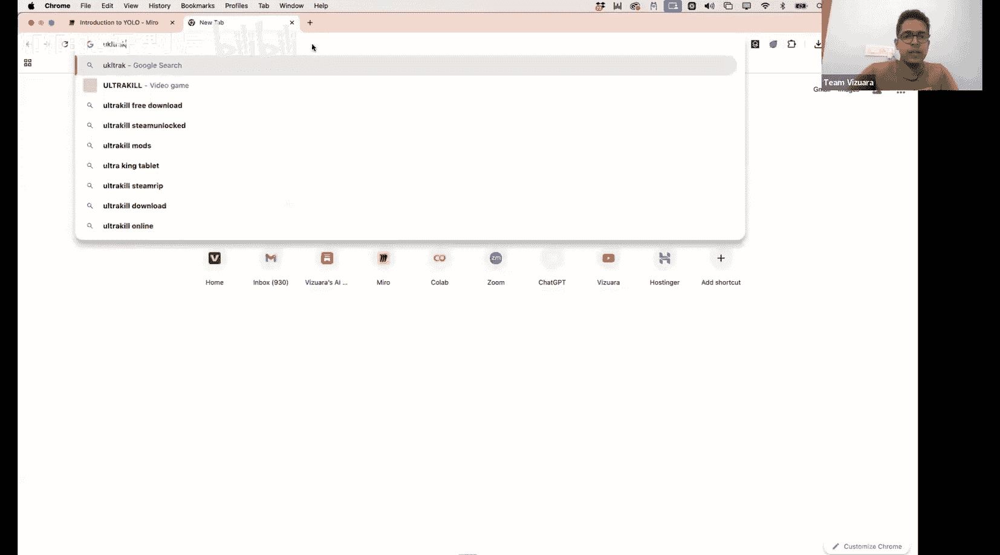
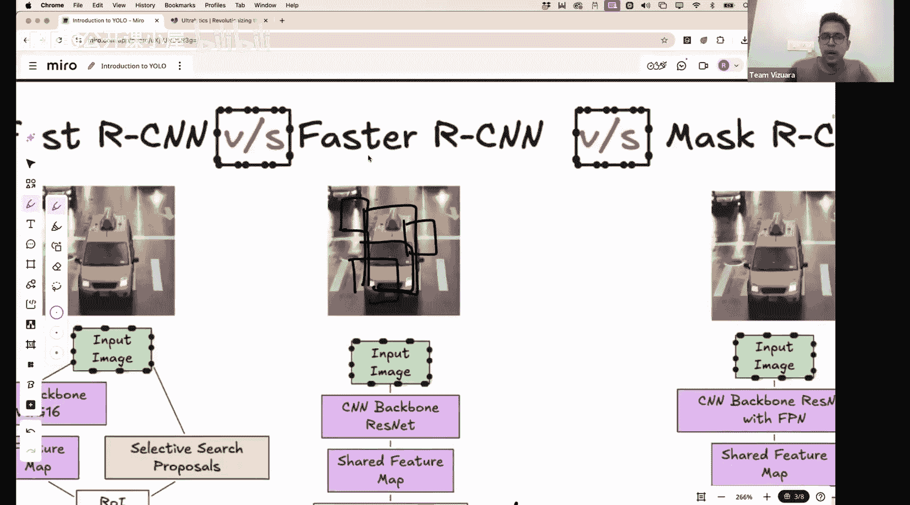

#  026：YOLO算法初探 🎯

在本节课中，我们将学习YOLO（You Only Look Once）算法。YOLO是我个人最喜欢的物体检测模型之一。在本计算机视觉训练营中，我们已经介绍过包括R-CNN及其变体在内的几种模型，并讨论了物体检测、实例分割与语义分割的区别。我们还曾使用U-Net实现过分割。YOLO则非常不同，在我看来，它的架构要简单得多，并且能够以近乎实时的速度和相当不错的准确率处理物体。我们曾在早期关于OpenCV的课程中实现过YOLO V8的nano模型。今天，我们将深入探讨YOLO的工作原理理论，以及如何为特定应用实现它。

## 什么是实时物体检测？⚡

所谓实时物体检测，是指如果我们的模型能够每秒处理大约24到30帧图像，并在这些帧中检测出物体，那么我们就可以称其为实时物体检测模型。YOLO存在不同的版本，我们之前使用的是V8版本。今天我们将讨论原始YOLO架构的结构。当然，YOLO模型架构本身也存在变体。有些模型无法处理24到30帧，每秒只能处理大约15帧；而有些模型每秒可以处理大约155帧，这些才是能够进行实时物体检测的模型。

YOLO可以用于视频监控。你可能在网上看到过不同公司关于物理安全系统的视频，其中检测到有人进入私人领地并实时反馈给计算机系统，扬声器发出警报。YOLO也可以用于自动驾驶汽车，当然，自动驾驶汽车不仅仅依赖YOLO，但YOLO可以用于一些基本的物体检测和标注。在疫情期间，我曾读到过新闻，人们实现了基于YOLO的实时人群监控系统。不过，YOLO在检测拥挤图像或帧中的大量人群时也存在某些局限性，我们也会在今天的课程中讨论。

## “只看一次”的含义 🤔

你可能会自然产生一个疑问：这里说“只看一次”，这是否意味着其他架构需要看图像不止一次？是的，它们确实如此。我们也会简要提及这一点，这在之前的R-CNN课程中已经讨论过。

YOLO的基本目标是用一种称为边界矩形的东西来标注图像中的物体。这些边界矩形给出了物体在整个图像中的局部位置。物体本身会有类别，如人类、狗、柱子，并且会有一个与之相关的置信度分数。

那么，YOLO究竟是如何构建这个矩形的？它如何决定某物是人、狗还是马？它又是如何构建置信度分数的？我们也将深入探讨这些内容。

## YOLO的起源与影响 📜

原始的YOLO论文堪称传奇，目前已被引用超过65,000次。论文的第一作者是Joseph Redmon。可以说，自YOLO被引入以来，这篇论文彻底改变了物体检测的实现方式。现在甚至有更现代的YOLO版本，例如V11，我想V12也已经发布，但一些最新的YOLO模型没有官方论文。有一家名为Ultralytics的公司，我们在之前的课程中简要讨论过，该公司提供了许多不同的预训练YOLO模型，可用于物体检测。我相信还有其他非官方的YOLO模型，预训练于各种标注的图像类别。

## 性能对比：速度与精度 ⚖️

现在，这个表格展示了YOLO的速度和准确性与其他一些模型的比较。首先，我们来看这两个指标：mAP和FPS。FPS就是每秒帧数，表示该模型每秒可以处理多少视频帧。如果FPS大于24，就可以称之为实时。所有被标记为“低于实时”的模型，其每秒帧数通常都小于24。而这里列出的所有模型都具有更高的每秒帧数处理能力。

mAP代表平均精度均值。你可能会想，既然有“平均”这个词，为什么还需要“均值”？平均精度就是在不同召回率值下得到的精度。我不想深入mAP的细节，只是为好奇的观众简单说明：你可以计算模型在不同召回率下的精度，然后取平均值，这就是平均精度。如果你的图像中有多个类别，如狗、猫、马、人，你可以取所有不同类别的平均精度的均值，这个值就叫做平均精度均值。这个数字表明你的模型在平均意义上以良好准确率检测各种物体的能力。你可以看到YOLO的准确率相当不错，达到63.4。这个截图来自原始的YOLO论文。你也可以将其与其他模型进行比较。在这里，你可以看到R-CNN、Fast R-CNN、Faster R-CNN这些我们之前讨论过的模型。事实上，你会发现Faster R-CNN的准确率比YOLO略高，但它们的处理速度都极慢，每秒只能处理0.5或7帧。

因此，YOLO的主要优势在于，你可以在不牺牲太多准确性的情况下，获得近乎实时的处理速度。请记住这一点：当考虑YOLO的用例时，就是在需要速度且不想过多牺牲准确性的场景。

## YOLO之前的技术 🔄

在实现YOLO（只看一次）之前，人们确实需要看不止一次。具体是如何实现的呢？主要有两种不同类型的技术。

最原始的技术是使用滑动窗口检测器。假设我们有一个人的图像，目标是构建一个能识别照片中人类的检测器或滤波器。我们可以构建不同类型的滤波器，当以图像形式绘制时，这些滤波器可以查看人体形状的各种抽象特征。通过将这个滤波器在图像的整个区域上移动，可以突出显示某些区域，这些区域存在或不存在人的概率非常高。这是过去人们为提取可能找到人、猫或其他物体的局部区域而构建手工特征图的一种方式。显然，这不涉及任何深度学习，这不是基于深度学习的技术，更像是手工工程。但我们过去详细讨论过的CNN则非常不同。

让我提醒你一下，以Faster R-CNN为例。在这个整体架构中，一个称为区域提议网络的神经网络会提议大约300个矩形区域。这300个矩形可能分布在这里、那里，它会提议不同的矩形作为可能找到图像的候选区域。Faster R-CNN模型的目的是对这些矩形进行分类。