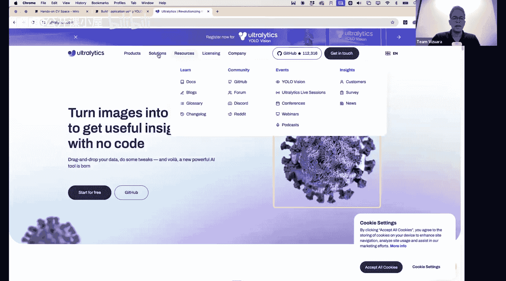
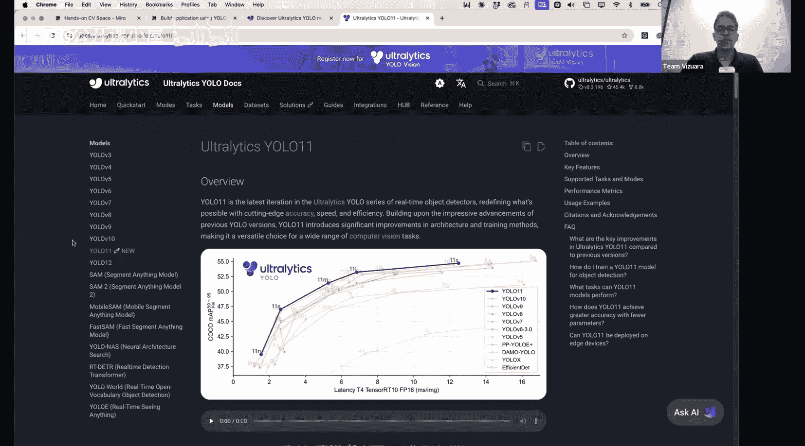
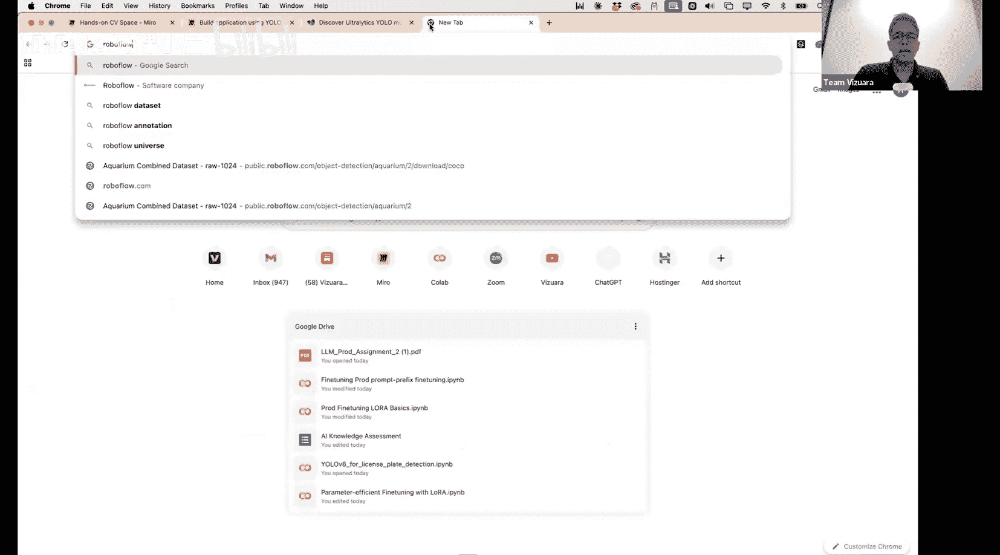
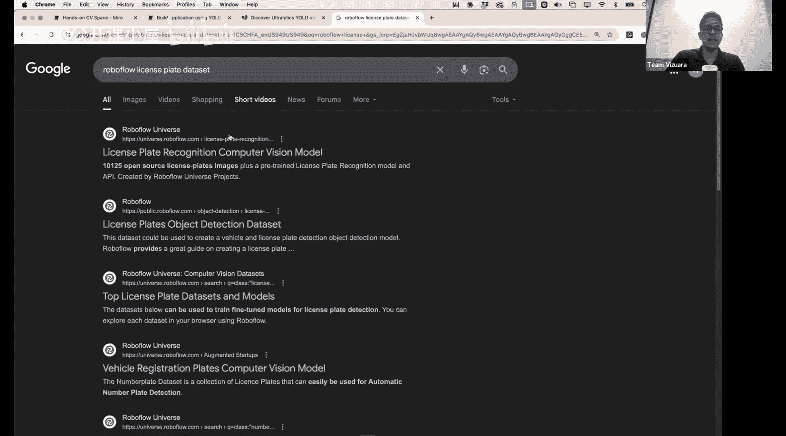
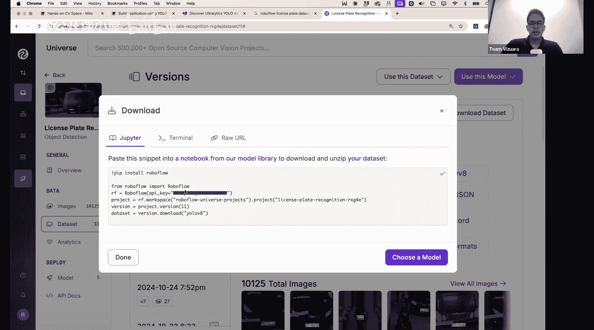
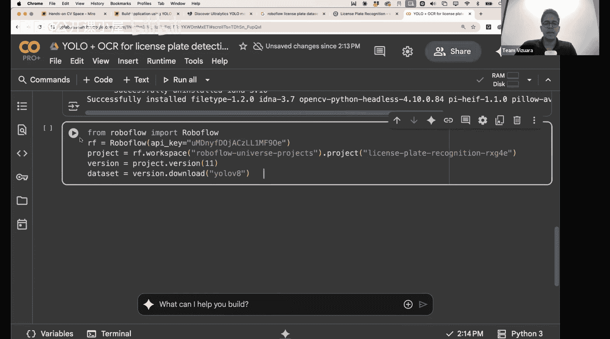

#  027：YOLO + OCR 车牌识别项目 🚗📸

在本节课中，我们将学习如何构建一个实用的车牌识别系统。我们将结合YOLO目标检测和OCR光学字符识别技术，从视频流中自动检测车辆并读取其车牌号码。

上一节我们介绍了YOLO的理论基础，本节我们将动手实践，构建一个完整的项目。

## 项目概述与架构

车牌识别系统的基本流程如下：输入一个视频，视频每秒包含约30帧图像。我们的目标是在图像中定位车牌对象，并获取其边界框。最终，我们希望输出车牌上的实际号码，例如“GX15 OGJ”。

我们将遵循以下架构：
1.  使用一个预训练的YOLO模型。
2.  在车牌数据上对该模型进行微调。
3.  保存微调后的模型权重。
4.  使用OCR技术读取边界框内的字符，并根据数据集特点添加特定约束。

以下是实现步骤的详细列表：

*   **微调的必要性**：我们使用的预训练YOLOv8模型基于COCO数据集训练，该数据集包含80个对象类别，但其中不包含“车牌”类别。因此，原始模型无法直接检测车牌，必须进行微调。
*   **所需数据**：微调需要带标注的数据。具体来说，我们需要车牌图像以及对应的边界框坐标（中心点、宽度和高度）。
*   **数据来源**：我们将使用Roboflow平台上的一个公开车牌数据集。
*   **开发环境**：模型的微调部分计算量较大，我们将在Google Colab上利用GPU加速完成。推理部分则可以在本地VS Code环境中运行。

## 第一步：准备数据与微调YOLO模型

现在，我们开始准备数据并微调YOLO模型。

首先，访问Roboflow平台并找到车牌数据集。选择最新版本的数据集，并选择YOLOv8格式进行下载。平台会提供一段包含API密钥的下载代码。

接着，在Google Colab中新建一个笔记本。将Roboflow提供的下载代码粘贴到单元格中并运行。这段代码会安装必要的库并将数据集下载到Colab环境中。

以下是核心代码示例：
```python
# 安装Roboflow库（通常只需运行一次）
!pip install roboflow



# 从Roboflow下载数据集（使用您自己账户生成的代码）
from roboflow import Roboflow
rf = Roboflow(api_key="YOUR_API_KEY")
project = rf.workspace("WORKSPACE").project("PROJECT_NAME")
dataset = project.version(VERSION_NUMBER).download("yolov8")
```



代码运行后，数据集将被下载到指定目录。接下来，我们就可以使用这个数据集来加载预训练的YOLOv8模型并进行微调。

## 第二步：模型微调与保存

我们将加载预训练的YOLOv8模型，并在下载的车牌数据上进行微调。

以下是微调模型的核心代码：
```python
from ultralytics import YOLO

# 1. 加载预训练模型（例如YOLOv8n）
model = YOLO('yolov8n.pt')

# 2. 在数据集上训练（微调）模型
results = model.train(
    data=f'{dataset.location}/data.yaml', # 数据集配置文件路径
    epochs=50,                            # 训练轮数
    imgsz=640,                            # 输入图像尺寸
    device='cuda'                         # 使用GPU加速
)
```

训练完成后，需要保存微调后的模型权重，以便后续推理使用。
```python
# 3. 保存最佳模型权重
best_model_path = './runs/detect/train/weights/best.pt'
# 这个 best.pt 文件就是我们可以用于后续推理的模型
```

## 第三步：使用OCR读取车牌文本





获得车牌边界框后，我们需要提取框内的文本。这里使用OCR技术。我们以`pytesseract`库为例。

首先，需要从边界框坐标中裁剪出车牌区域图像。
```python
import cv2
from PIL import Image
import pytesseract

# 假设 `frame` 是视频帧，`x1, y1, x2, y2` 是车牌边界框坐标
license_plate_roi = frame[y1:y2, x1:x2]

# 将OpenCV图像转换为PIL图像，供Tesseract使用
license_plate_image = Image.fromarray(cv2.cvtColor(license_plate_roi, cv2.COLOR_BGR2RGB))



# 使用Tesseract进行OCR识别
text = pytesseract.image_to_string(license_plate_image, config='--psm 8')
print(f"识别到的车牌号: {text.strip()}")
```
**注意**：实际应用中，可能需要对图像进行预处理（如灰度化、二值化、去噪）并调整Tesseract的配置参数（如`--psm`模式），以提高不同场景下的识别准确率。

## 项目总结

本节课中，我们一起构建了一个完整的车牌识别项目。我们首先解释了为何需要对预训练的YOLO模型进行微调，然后从Roboflow获取了标注数据集。接着，我们在Google Colab上完成了模型的微调并保存了权重。最后，我们介绍了如何使用OCR库从检测到的车牌区域中提取文字信息。



这个项目展示了如何将目标检测与OCR技术结合，解决一个实际的计算机视觉问题。你可以将此流程应用于其他类似的检测与识别任务中。