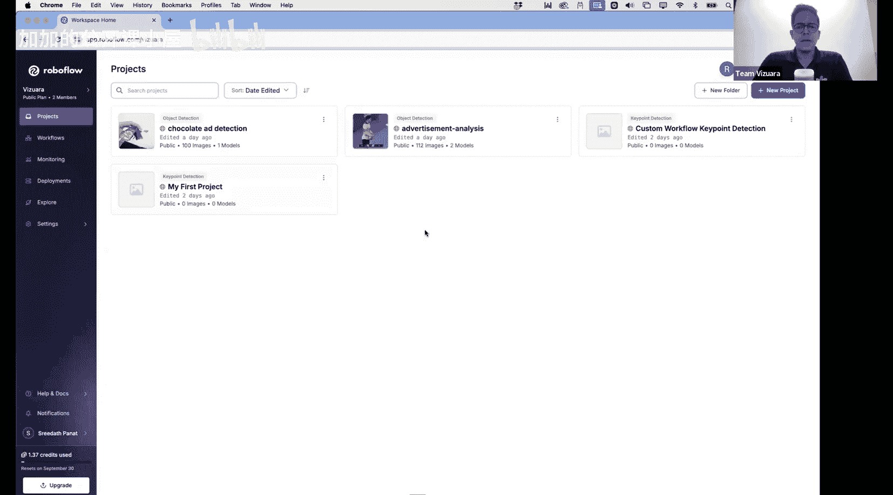
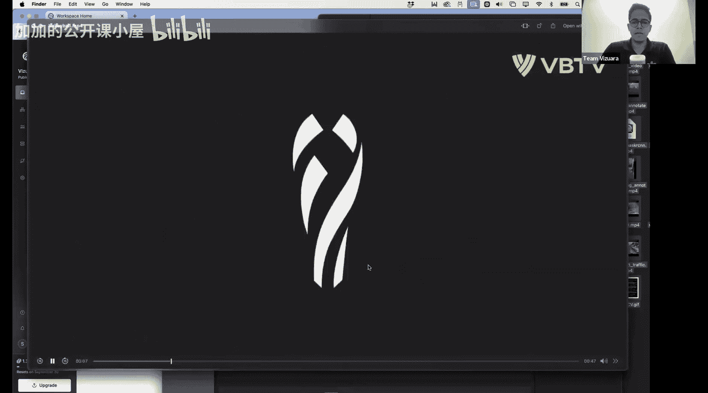
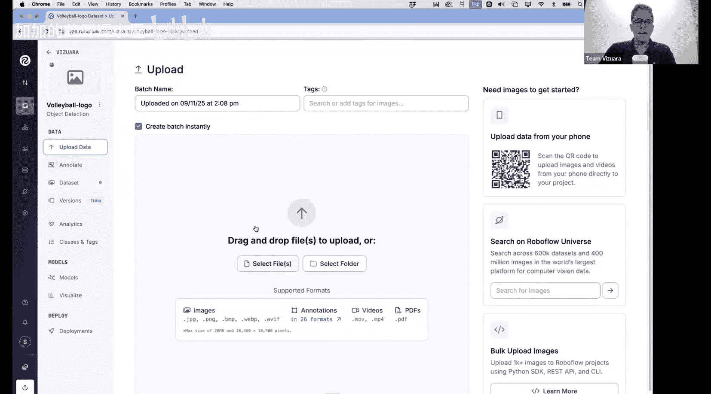
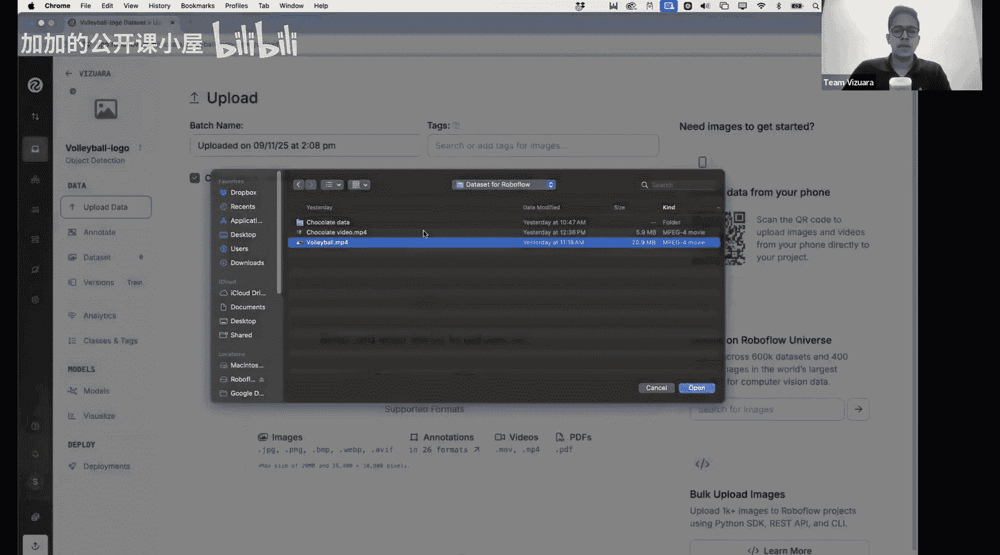
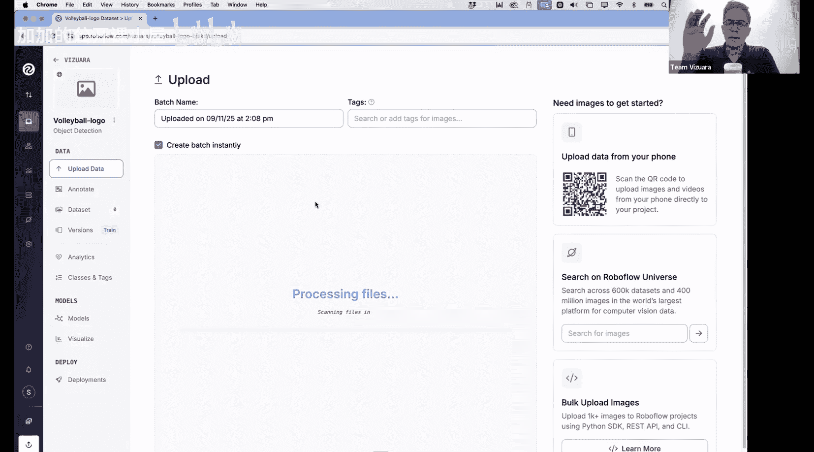
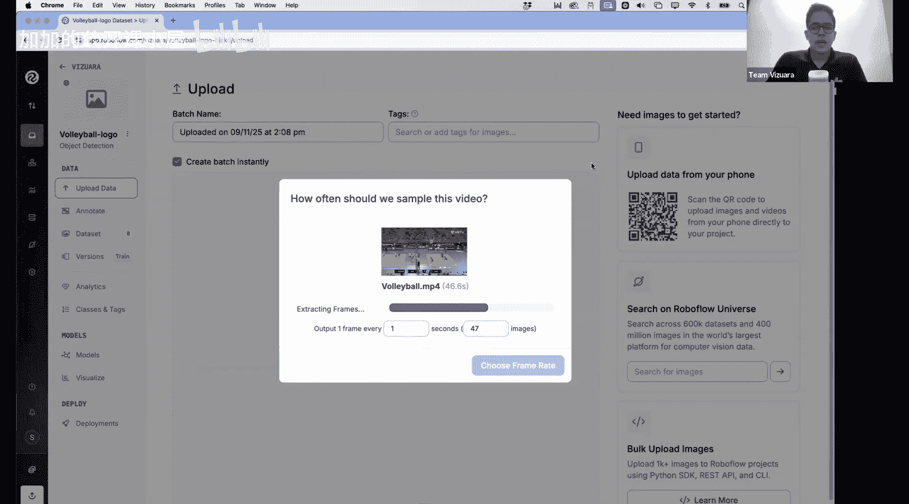
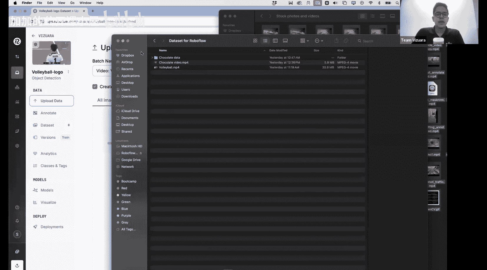
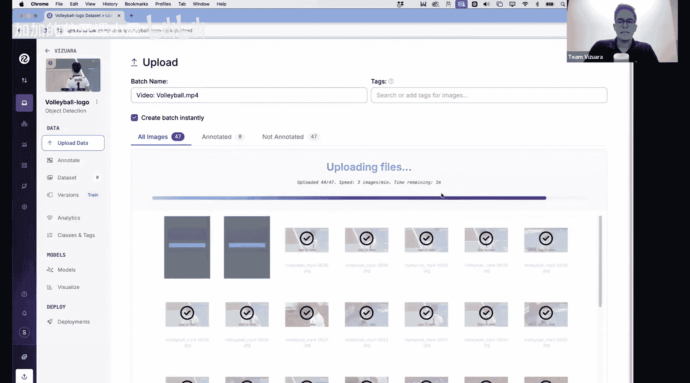
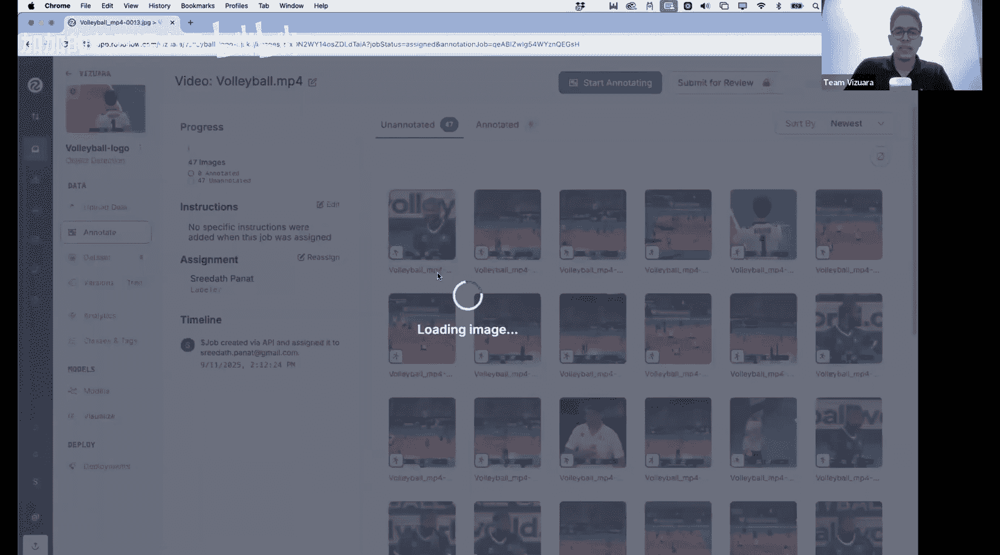

#  028：构建端到端计算机视觉流水线的最佳方式 🚀

在本节课中，我们将学习如何使用Roboflow平台，构建一个完整的端到端计算机视觉应用流水线。我们将从创建和标注数据集开始，涵盖数据预处理、模型训练与微调、性能监控，直至模型测试与部署的全过程。

Roboflow是一个功能强大的平台，它允许用户从创建数据集和标注开始，构建端到端的计算机视觉应用。平台能自动将数据分割为训练集、验证集和测试集，并支持创建数据的不同版本。用户可以选择任意模型在此数据上进行训练，也可以选择预训练模型进行微调。在微调过程中，可以通过动态图表观察模型精度随训练轮次的变化。最后，模型微调完成后，可以进行测试和部署。这是一个非常便捷的端到端流水线构建平台。

首先，我建议所有人访问Roboflow.com网站。我们将一起构建这个项目。今天的课程部分内容将专注于图像标注。由于我只有一个人，无法独自完成所有标注，因此我需要大家的帮助。我会分享链接并详细说明需要做什么。

## 准备工作

第一件事是使用您的Google账户或GitHub账户登录。我已经使用我的Google账户登录了。

在今天的课程中，我们计划做几件事。首先是讨论如何具体地构建和标注数据集。如果我们正在构建一个目标检测流水线，我们知道数据集可以是视频的帧，也可以是独立的图像，而标注则是边界框。

## 项目构思与目标设定

假设我们有一段这样的视频。我这里有一个名为“volleyball”的视频。您能看到这个视频画面吗？您能看到这个排球视频吗？

这基本上是一场随机排球比赛的片段。但请注意这些广告。假设我是一名广告商，我的目的是在球员的队服上赞助广告，或者是在场地周围的广告牌上投放广告，比如您在这些广告牌上看到的“Mikasa”品牌。

这些广告的目的是在屏幕上投影时（例如，当有人在电视上观看直播时）获得最大的屏幕可见度。因此，作为广告商，我的目标是优化，或者说，至少查看我的品牌标志是否在屏幕时间中显示了X百分比，以及我的标志占据了屏幕面积的多少。尽管这个标志在物理上很大，但当观众实际在屏幕上观看时，也许这位球员的队服标志对观众来说实际上更大。

对于广告分析来说，假设您是一家公司，客户来找您说：“嘿，我想对你们这场特定的排球比赛进行一些分析，以便分析哪种类型的标志被投影得最多。” 完成此任务的首要任务是拥有一个目标检测模型，其中的目标就是这些标志本身。因此，第一件事是，我们需要将整个视频转换为不同的帧，然后通过绘制边界矩形将这些帧转换为带标签的数据集，之后我们将使用该数据集来训练一个YOLOv8或YOLOv11模型。之后，如果我们上传一个新视频，希望我们能在新视频上获得标注。

为了简化，我们将只针对两个标志：一个是这个“Mave”标志（我希望您能看到这个红色标志），另一个是这个“Mikasa”标志。有时它会被站在前面的人挡住。我们只跟踪这两个标志，仅为了简化。

我们甚至可以进一步简化，只跟踪一个标志，也许我们应该尝试一下。但无论如何，整个流程的第一步是将视频转换为帧。您不需要外部软件来完成这个。接下来，我将在Roboflow中创建一个新项目。

## 在Roboflow中创建项目

点击“New Project”。这是一个目标检测项目，我将项目名称设为“volleyball_logo”。在这里，我想检测标志，我输入“logos”，输入什么并不重要。

目前我在Roboflow上使用的是免费计划，所以我认为我还不能创建私有项目，但这没关系，这反正不是一个高风险项目。

这样就创建了一个空项目。在左侧，您可以看到一系列选项：上传数据、标注数据。“数据集”指的是您已创建的带标注的数据集。“版本”是您可以创建模型的不同版本。“分析”将在模型训练过程中向您展示一些信息。我们将看到所有这些内容。第一步是上传数据。

## 上传并处理视频数据

我将点击并选择文件上传。然后选择这个视频。这里我正在上传数据集。首先，我要向您展示的是一个简单的流水线，这个流水线在训练中表现很好，但在测试中表现不佳。

这个视频大约有45秒。如果我每秒选取一帧，我将得到大约46-47张图像。Roboflow允许您选择任意帧率。如果您选择每秒帧数较多，总输出会非常大，反之亦然。因此，我选择每秒一帧，这样我将总共有47张图像。基于这个帧率，Roboflow现在正从这个MP4视频中提取帧，提取完成后，将上传到Roboflow服务器。

现在不用担心跟着我一起做，因为我会与大家分享这个项目工作区，以便大家都能协助我进行标注。就像我们都在同一家公司工作，有一个巨大的数据集需要处理，我们将任务拆分给每个人一样。今天我们将做完全相同的事情。一旦上传完成，我会告诉您该做什么。

与此同时，我想向您展示另一个视频。这是另一个类似YouTube短视频的视频，我不确定为什么它现在打不开了，之前是能播放的，但我们会解决的。这是一个包含一堆巧克力的视频，我想要一个算法，每当巧克力出现在图像或视频中时，能用边界矩形标注出不同的巧克力品牌。

好的，这里Roboflow正在上传图像，速度相当快。一旦上传完成，它将显示有47张图像未标注，0张已标注，这意味着我还没有开始标注。

## 开始数据标注

首先，我将向您展示一两个图像的样本标注，然后邀请大家一起参与标注，以便我们能快速共同完成这项工作。

请给我一点时间完成上传。

好的，上传已完成。如您所见，这里是不同的帧。到目前为止很简单。这里您可以看到几个选项：“自己标注”、“与我的团队一起标注”、“自动标注整个批次”。“自动标注”是指如果您已经有一个训练好的模型可以预测此案例的边界矩形，您可以使用自动标注器。否则，这里有一个选项是“雇佣外包标注员”，Roboflow本身会以一定的费用指派人员来标注我们的数据集。

我最初选择的是“自己标注”。这里我正在创建一个标注任务。最初，您可以看到所有图像都被分配为训练数据集。点击任意图像，这将单独打开该图像。

我们不需要做太多，只需要做以下操作：您看到这个矩形选项，只需在标志周围绘制一个矩形。假设我只对识别这个“Mave”标志感兴趣，不关心其他标志。然后在这里，我将其命名为“logo”，这个默认名称就足够了。现在，我只需保存。

---

**本节课总结**

在本节课中，我们一起学习了如何使用Roboflow平台启动一个端到端的计算机视觉项目。我们从项目构思开始，明确了为排球比赛视频中的广告标志构建目标检测模型的目标。接着，我们在Roboflow上创建了新项目，上传了视频并将其自动提取为图像帧，为后续的标注工作做好了准备。最后，我们初步了解了Roboflow的标注界面，并完成了第一张图像的标注示例。在接下来的课程中，我们将继续进行数据标注、数据集版本管理以及模型训练等步骤。