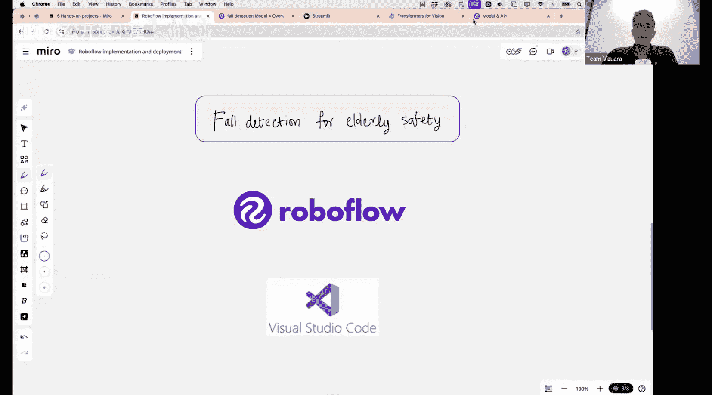
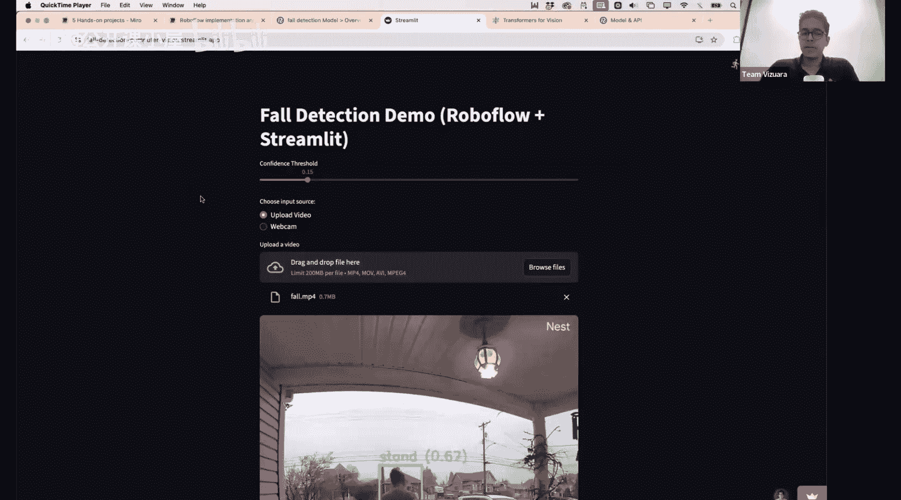
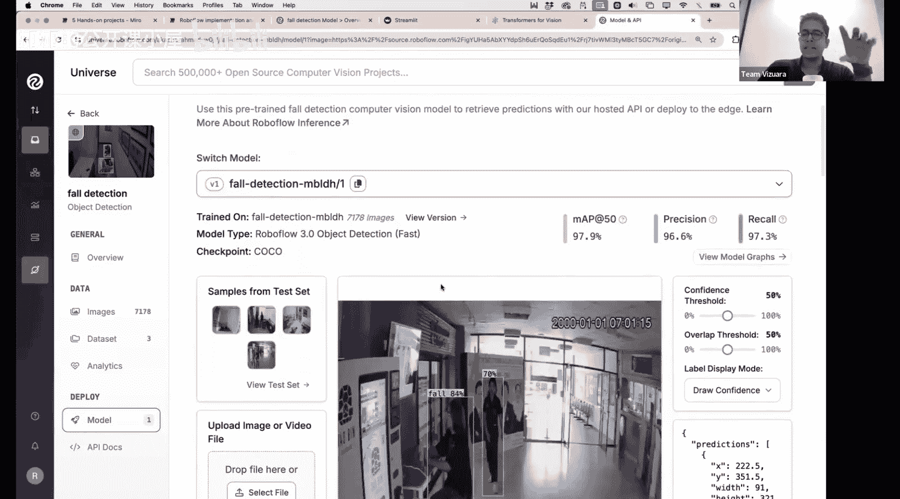

#  029：构建并部署跌倒检测模型

在本节课中，我们将学习如何利用Roboflow平台上的现有模型，构建一个完整的计算机视觉应用，并将其部署为可供任何人使用的网络服务。我们将以“跌倒检测”这一具体项目为例，展示从模型选择、本地推理到应用部署的完整流程。

上一讲我们简要介绍了Roboflow及其功能，并尝试了协作标注图像。本节中，我们将直接使用一个预训练好的模型，并专注于如何将其部署成一个实用的应用程序。

## 探索Roboflow Universe

首先，我想向大家展示Roboflow一个非常强大的功能——Roboflow Universe。访问 `universe.roboflow.com` 网站，向下滚动，你会看到一个名为“热门类别”的区域。

以下是该平台的核心特点：
*   **领域广泛**：点击“查看全部”，你可以看到涵盖几乎所有能想象到的领域的计算机视觉数据集和模型。
*   **公开资源**：例如，点击“航空”领域，它会展示由其他用户创建并公开的已标注数据集和模型。
*   **数据与模型一体**：许多条目不仅包含数据集，还附带了训练好的模型。你可以直接使用这些模型进行推理。

以这个“能源航空数据集”为例，它可能包含关于油田、变电站、风力发电机等的图像。页面会显示数据集的原始图像数量，这些图像会经过随机旋转、裁剪等增强处理，因此实际的训练数据量会远大于此。

关键点在于，这里提供了**模型**。点击模型，你可以看到数据集和已有的标注（例如，绝缘子的分类：破损 vs 正常）。对于预训练模型，你可以直接使用它：上传你的图片或视频，模型就会给出预测结果，包括边界框的坐标（x, y, 宽度, 高度）、物体类别以及置信度。

## 本节实践项目：跌倒检测

在今天的第二部分，我们将动手构建一个具体的项目：老年人跌倒检测。对于独居或行动不便的老年人，跌倒是一个重大风险，可能导致髋部骨折等严重伤害，甚至危及生命。如果事发地点有监控摄像头，我们可以构建实时检测系统，在跌倒发生时立即预警。

首先，我来展示一下我们将要构建的应用成品。这是一个基于Streamlit搭建的公开网页应用。

该应用允许用户设置一个**置信度阈值**，用于决定显示哪些预测结果。用户可以选择上传视频文件。上传后，应用会逐帧处理视频（由于模型托管在Roboflow，处理并非严格实时，速度稍慢）。模型会识别视频中的人物，并用边界框标出，同时预测其状态属于“站立”还是“跌倒”类别，并附上置信度分数。

当视频中的人物滑倒时，模型能够检测到“跌倒”事件。处理完成后，用户可以下载带有标注框的已处理视频，方便查看和演示。

## 技术实现方案

我们将使用以下工具来构建这个应用：
1.  **Roboflow**：用于寻找带有标注的跌倒检测数据集及其预训练模型。
2.  **本地推理脚本**：我们将通过Roboflow提供的API调用模型，并在本地（例如使用Visual Studio Code）编写代码进行初步推理测试。这能帮助我们在部署前确保一切运行正常。
3.  **Streamlit**：一个能快速将Python脚本转化为交互式Web应用的框架。我们将把本地脚本转换成Streamlit应用，并公开部署，使其真正可用。

接下来，我将逐步演示如何操作。

## 第一步：在Roboflow Universe中找到模型

首先，访问 `universe.roboflow.com`。在搜索框中输入“fall detection”。

在搜索结果中，你会发现不同用户创建的项目，其图像数量各异。我们将使用一个包含约7,8100张图像（增强后会更多）的数据集所对应的预训练模型。

这个模型已经训练完成，你可以看到它的一些预测示例。虽然当前演示中标签似乎有误（将站立预测为跌倒，反之亦然），但模型的评估指标（如平均精度）表现良好，且数据集规模较大，因此模型本身是可靠的。我们稍后会看到如何修正这个显示问题。

## 如何使用这个模型？

我们可以直接在Roboflow页面上使用该模型进行单张图片的测试。但我们的目标是构建一个能处理视频的独立应用。因此，我们需要通过编程方式调用它。

本节课中我们一起学习了如何利用Roboflow Universe的丰富资源，快速定位并获取预训练模型。我们明确了构建一个跌倒检测应用的目标，并规划了通过Roboflow API进行本地推理，再使用Streamlit进行部署的技术路线。在接下来的步骤中，我们将具体实现代码编写和应用部署。