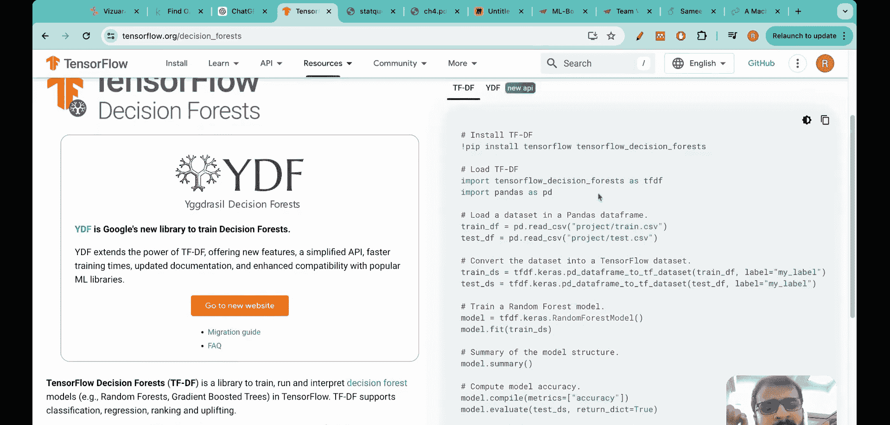
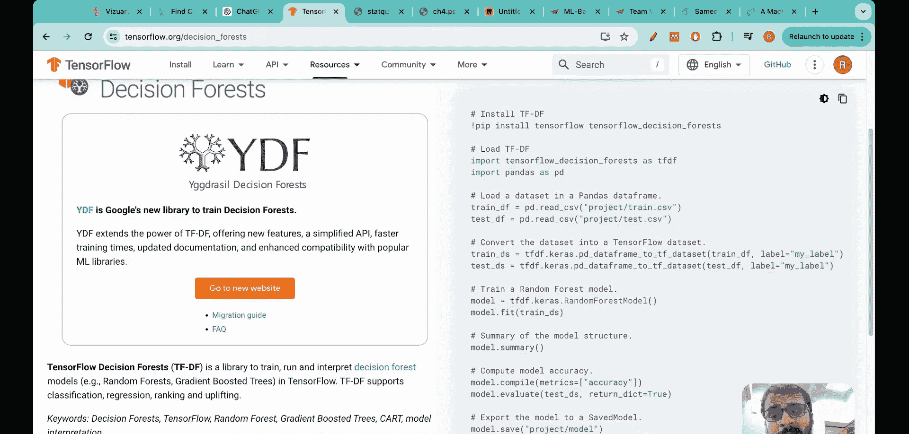
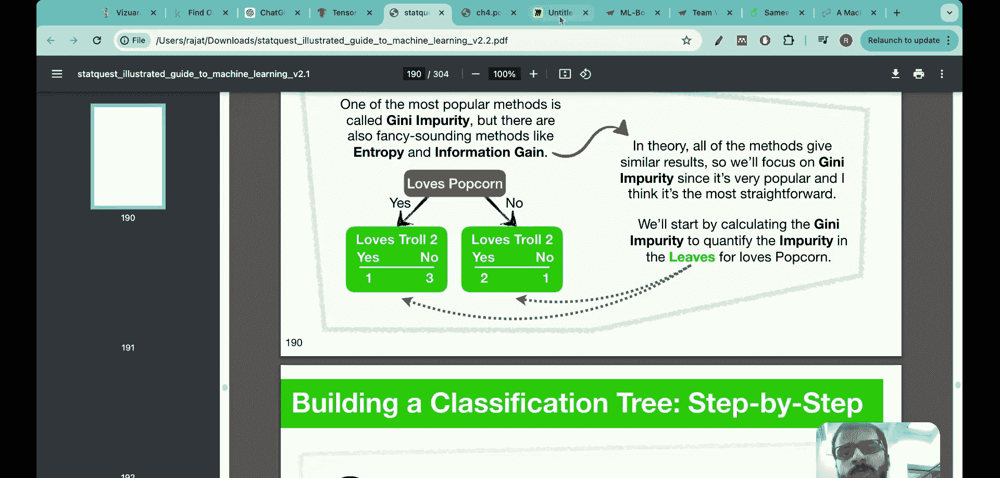
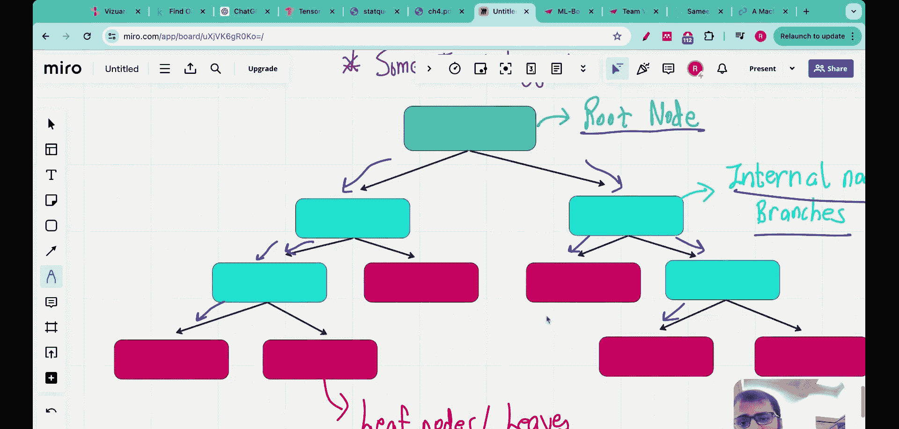

#  001：什么是决策树？

在本节课中，我们将要学习决策树的基本概念。决策树是机器学习中一项重要且直观的技术，常用于解决分类和回归问题。我们将从泰坦尼克号生存预测这个经典案例入手，了解决策树的应用场景和基本结构。

泰坦尼克号沉船事故中，许多人因船只沉没而不幸丧生。这也是一个非常流行的机器学习项目，初学者通常在Kaggle等网站上完成这个项目，并将其添加到简历中。

用于解决这个特定问题的技术就是决策树。

问题本身相当简单。船上有各种各样的人，他们属于不同的年龄、性别。不仅如此，人们还属于不同的经济阶层，例如有些人富有，有些人贫穷。基于所有这些变量，目标是预测哪些人会在泰坦尼克号灾难中幸存，哪些人不会。

决策树是机器学习中最重要的技术之一。我正在创建的这套名为“从零开始构建决策树”的系列教程，将教你关于决策树所需了解的一切。

让我们开始吧。我是Raj Daneer博士，于2022年从麻省理工学院毕业，获得机器学习博士学位。从那时起，我们的使命就是让所有人都能接触到人工智能，这套系列教程是该使命的一部分。

这套系列教程将全部围绕决策树展开，但我会以正确的方式教你。首先，让我稍微激发一下你对决策树的兴趣。如果你访问Kaggle这个网站并搜索决策树数据集，你会发现使用决策树可以解决各种各样的问题，例如使用传感器数据进行机器故障预测、银行营销、员工离职预测、乳腺癌诊断、银行营销活动数据集、药物分类、员工满意度调查数据、亚马逊商业研究、员工流失、酒店预订取消等。事实上，还有大量其他数据集，例如我提到的泰坦尼克号数据、二手车价格预测等。许多机器学习问题都可以使用决策树来解决。

不仅在项目中，即使在工业界，决策树算法也被广泛应用。我问过ChatGPT，决策树算法通常在哪些行业实施。你会发现它们被用于金融行业进行信用评分、欺诈检测；用于医疗保健进行诊断、治疗和患者结果预测；用于市场营销和销售进行客户细分、预测客户是否会购买产品；并且还用于许多其他行业。事实上，我有一些在初创公司工作的朋友，他们经常告诉我，无论生成式人工智能多么热门，为公司带来收入的机器学习算法是决策树、随机森林和梯度提升。因此，我相信这足以激发你对这套系列教程的好奇心，并从这个介绍视频开始。在这个视频中，我将简要概述我们将在本系列中学到什么，并涵盖第一讲，专门介绍什么是决策树。

在你产生兴趣之后，下一个问题是如何开始学习决策树？许多学生的做法是直接从TensorFlow开始，他们使用现成的TensorFlow代码，可能只需10行代码，甚至在泰坦尼克号等项目上就能获得很好的结果。

问题在于，通过这种方法，你将无法了解决策树的基础构建模块。有许多重要的构建模块，例如基尼不纯度是一个构建模块，熵和误分类错误是其他构建模块。我们将以正确的方式学习决策树，一步步构建决策树。首先，我们将从零开始构建，然后我也会向你展示Python的实践演示。

我关注了一个名为Stat Quest的频道，这是一个非常出色的频道，也是制作本系列讲座的灵感来源之一。

让我们开始今天的讲座。在今天的讲座中，我们的议程是看一个简单的概念，即决策树到底是什么。

然后，在本讲座结束时，我也会告诉你，你可以从这套系列教程中期待什么，以及我们将遵循的议程。

让我们看看最简单的决策树。决策树从一个陈述开始，然后有一些决策点。陈述是：你想学习决策树吗？如果是，那么你可以继续观看视频；如果否，则不要观看这个视频。

这就是最简单的决策树。😊，从这个决策树中，你可以看到决策树的构建模块。通常有一个陈述，例如“你想学习决策树吗？”，然后有一个决策，因此会分支成两个部分：如果是，则执行这个动作（观看此视频）；如果否，则不要观看此视频。

这是机器学习中最简单、最直观的概念之一。所以，这是一个简单的决策树。很好，但决策树本身有两种类型。第一种决策树是分类树，第二种决策树是回归树。许多学生犯的另一个错误是，他们认为决策树只有一种类型，即分类树，但实际上回归问题也可以用决策树来解决。

这两者有什么区别？我们之前看到的例子，“你想学习决策树吗？如果是，观看此视频；如果否，不要观看此视频”，这是关于分类到不同类别的。因此，这是一个分类决策树的例子。另一方面，在回归决策树中，你预测的是数值。例如，这是我构建的一个样本，陈述仍然是“你想学习决策树吗？”，如果是，那么我预测你的年龄在15到40岁之间；如果否，那么我预测你的年龄小于15岁。

你可以看到，这里也有一个陈述，并分支成两个部分。但在这里，我实际上是在预测数值，而不仅仅是“是”或“否”的分类，对吧？所以这就是为什么它是一个回归问题的例子。事实上，你看到的所有这些数据集上的例子，可能是分类或回归问题，而决策树是解决这两类机器学习问题的强大技术。因此，了解这两种决策树之间的区别对你来说很重要。

然后，让我实际演示一个我构建的简单分类树，用于预测患者患糖尿病的风险。我从一个陈述开始：如果年龄小于或等于45岁。你考虑一个人，查看他们的年龄。如果年龄小于或等于45岁（如果你选择“是”），那么你检查他们的体重。这是一个年轻人，你检查他们的体重。如果体重小于60公斤，很好，这是低风险。但如果是一个年轻人，体重大于60公斤，那么这个人有中度糖尿病风险。另一方面，让我们看看决策树的另一边。如果我对“年龄小于或等于45岁”的回答是“否”，这意味着这个人年龄较大。现在已经确定这个人年龄较大。如果他们的体重小于或等于70公斤（这意味着我们走这条路径），那么他们处于中度风险。但如果这个人年龄较大，并且体重大于或等于70公斤，那么这意味着这个人有更高的糖尿病风险。

所以，分类决策树就是这样构建的，它们可以尽可能长。这被称为决策树的深度，即我进行多少次分割。

在查看一个非常好的实际例子之前，我想介绍一些术语，以便这些术语能一直伴随着你。这是“从零开始构建决策树”系列中一个相当简单的术语，但重要的是现在就要正确理解它，以免以后犯错。

在开始时提出的陈述，例如“年龄小于或等于45岁吗？”或者在这个例子中“你想学习决策树吗？”，这被称为**根节点**，即开始时提出的陈述。然后，这里所有用蓝色显示的块被称为**内部节点**。为什么？因为内部节点有一个传入箭头和一个传出箭头。如果你看所有这些蓝色方框，它们都有一个传入箭头和一个传出箭头。看这个，它有一个传入箭头和一个传出箭头；看这个，它有一个传入箭头和一个传出箭头。所以这些既有信息传入也有信息传出的节点被称为内部节点或分支节点。

然后是第三个术语。看那些用红色显示的块，它们都只有传入箭头，没有传出箭头。看这个。

本节课中我们一起学习了决策树的基本概念。我们了解到决策树是一种用于分类和回归的机器学习技术，结构上由根节点、内部节点和叶节点组成。我们从泰坦尼克号预测的例子出发，看到了决策树的实际应用价值，并区分了分类树与回归树的不同。在接下来的课程中，我们将深入了解决策树的构建模块，并学习如何从零开始实现它。