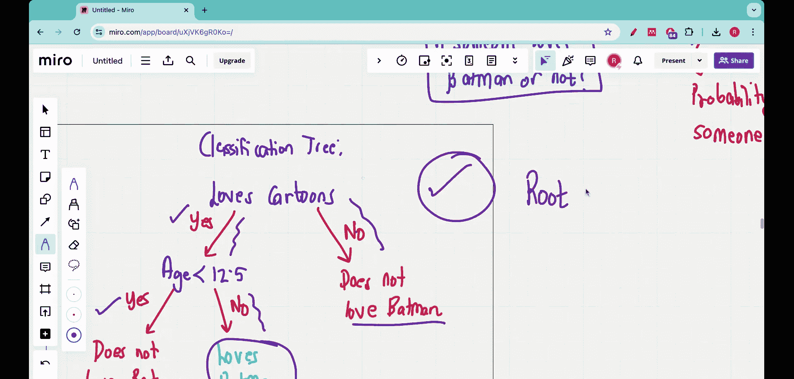

#  002：开始构建决策树 🚀


在本节课中，我们将开始完全从零构建一个分类决策树。我们将使用一个包含离散和连续数据的示例数据集，并学习如何构造一个能完美分类数据的决策树。

## 概述

上一节我们介绍了决策树的定义、基本结构（根节点、内部节点、叶节点）以及分类树与回归树的区别。本节中，我们来看看如何从一份具体的训练数据出发，动手构建一个分类决策树。

## 数据集介绍

以下是用于构建决策树的训练数据。我们收集了7个人的信息，包含三个特征和一个目标变量：

| 人员 | 爱看电影？ | 爱看卡通？ | 年龄 | 爱蝙蝠侠？ |
| :--- | :--- | :--- | :--- | :--- |
| 1 | 是 | 是 | 7 | 否 |
| 2 | 是 | 是 | 18 | 是 |
| 3 | 是 | 否 | 50 | 否 |
| 4 | 否 | 是 | 12 | 否 |
| 5 | 否 | 是 | 35 | 是 |
| 6 | 否 | 否 | 83 | 否 |
| 7 | 否 | 是 | 38 | 是 |

我们的目标是：当遇到一个新的人，已知他/她是否爱看电影、是否爱看卡通以及年龄时，预测此人是否爱蝙蝠侠。

这个数据集混合了离散数据（是/否）和连续数据（年龄）。接下来，我们将探讨为什么传统的逻辑回归方法在此可能不适用，并展示决策树如何能更好地解决这个问题。

## 为何不使用逻辑回归？

逻辑回归是一种常用于分类任务的回归技术。但在这个例子中，它可能表现不佳。

让我们以“年龄”特征为例进行说明。将年龄绘制在X轴，将“爱蝙蝠侠”的概率（0为否，1为是）绘制在Y轴。根据训练数据，我们得到以下点：
*   年龄7、12、50、83 → 概率为0（不爱蝙蝠侠）。
*   年龄18、35、38 → 概率为1（爱蝙蝠侠）。

如果尝试用逻辑回归拟合一条S型曲线，它可能如下图所示。虽然能正确分类年轻和中年群体，但对于年龄50和83的样本，曲线预测的概率接近1，这与事实（他们不爱蝙蝠侠）完全不符。

**逻辑回归曲线无法很好地拟合这种非单调、分段的数据模式**，导致对部分样本分类错误。

## 决策树解决方案

与逻辑回归不同，决策树可以构建出完美分类此训练数据的模型。以下是一个最优的决策树结构：

```
如果 (爱看卡通？ == 是) {
    如果 (年龄 < 12.5) {
        预测：不爱蝙蝠侠
    } 否则 {
        预测：爱蝙蝠侠
    }
} 否则 {
    预测：不爱蝙蝠侠
}
```

让我们验证这个决策树：
1.  **人员1**：爱卡通=是，年龄=7 (<12.5) → 预测“否”，匹配。
2.  **人员2**：爱卡通=是，年龄=18 (>12.5) → 预测“是”，匹配。
3.  **人员3**：爱卡通=否 → 直接预测“否”，匹配。

作为练习，你可以用这个树结构验证数据集中所有7个人的结果，会发现它都能正确分类。

## 核心问题

现在，我们面临构建决策树的核心问题：**如何自动地从数据中得出这样的树结构？**
具体需要思考：
1.  根节点应该选择哪个特征进行提问？（本例中是“爱看卡通？”）
2.  对于连续特征（如年龄），如何确定最佳的分割点（如12.5）？
3.  构建树的停止条件是什么？

这些正是我们接下来几节要解决的关键问题。

## 总结

本节课中我们一起学习了：
1.  介绍了一个用于构建分类决策树的示例数据集。
2.  通过图示说明了逻辑回归在处理此类混合数据时的局限性。
3.  展示了一个能完美分类数据的决策树结构，并进行了验证。
4.  提出了构建决策树过程中需要解决的核心问题，为后续学习如何自动选择特征和分割点奠定了基础。



在下一节，我们将深入探讨决策树构建的核心算法：如何量化特征的好坏并选择最佳分割点。