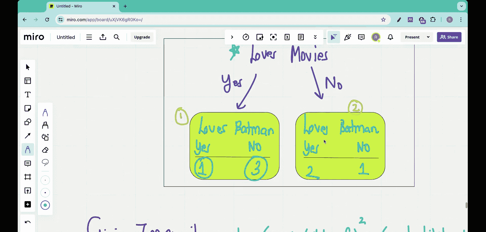

#  003：基尼不纯度是什么？ 🤔

在本节课中，我们将深入学习基尼不纯度。我们也会简要了解熵，但课程重点将放在基尼不纯度上。我们将学习如何量化决策树中节点的“不纯度”，从而科学地选择最佳分割问题。

## 概述

在上一节中，我们开始构建一个分类树，并提出了一个关键问题：**如何决定在根节点应该问哪个问题？** 我们有一个包含“是否爱看电影”、“是否爱看卡通”、“年龄”和“是否爱蝙蝠侠”的数据集。我们的目标是构建一棵树，能根据前三个特征准确预测一个人是否爱蝙蝠侠。

直观上，我们比较了“爱看电影”和“爱看卡通”这两个问题。我们发现，询问“爱看卡通”能得到一个“纯”的叶子节点（所有回答“否”的人都不爱蝙蝠侠），而询问“爱看电影”得到的两个叶子节点都是“不纯”的（混合了爱和不爱蝙蝠侠的人）。因此，“爱看卡通”似乎是更好的根节点问题。

但是，直觉需要量化。本节我们将学习两种量化不纯度的方法：**基尼不纯度**和**熵**。我们将重点学习基尼不纯度，并计算两个问题的基尼不纯度值，数值更低的问题将被选为根节点。

## 基尼不纯度详解

基尼不纯度衡量的是一个数据集中类别混合的程度。一个完全“纯”的节点（所有样本都属于同一类别）的基尼不纯度为0。一个类别均匀混合的节点具有最高的基尼不纯度。

基尼不纯度的计算公式如下：

**Gini = 1 - Σ (p_i)²**

其中，`p_i` 是数据集中第 `i` 个类别出现的概率。

让我们将这个公式应用到我们的例子上。

### 计算“爱看电影”问题的基尼不纯度

“爱看电影”这个问题将数据集分成了两个子集（叶子节点）。

**对于第一个叶子节点（回答“是”）：**
*   总人数：4人
*   爱蝙蝠侠（是）：1人
*   不爱蝙蝠侠（否）：3人
*   概率 `p_yes` = 1/4 = 0.25
*   概率 `p_no` = 3/4 = 0.75

计算该叶子节点的基尼不纯度：
Gini_leaf1 = 1 - (0.25² + 0.75²) = 1 - (0.0625 + 0.5625) = 1 - 0.625 = **0.375**

**对于第二个叶子节点（回答“否”）：**
*   总人数：3人
*   爱蝙蝠侠（是）：2人
*   不爱蝙蝠侠（否）：1人
*   概率 `p_yes` = 2/3 ≈ 0.667
*   概率 `p_no` = 1/3 ≈ 0.333

计算该叶子节点的基尼不纯度：
Gini_leaf2 = 1 - (0.667² + 0.333²) ≈ 1 - (0.444 + 0.111) ≈ 1 - 0.555 ≈ **0.445**

现在，我们需要计算整个“爱看电影”问题的**加权平均基尼不纯度**。权重是每个叶子节点样本数占总样本数的比例。

*   总样本数 N = 7
*   叶子节点1的权重 = 4/7 ≈ 0.571
*   叶子节点2的权重 = 3/7 ≈ 0.429

**“爱看电影”问题的总基尼不纯度**为：
Gini_movies = (0.571 * 0.375) + (0.429 * 0.445) ≈ 0.214 + 0.191 ≈ **0.405**

### 计算“爱看卡通”问题的基尼不纯度

接下来，我们用同样的方法计算“爱看卡通”问题的基尼不纯度。

**对于第一个叶子节点（回答“是”）：**
*   总人数：4人
*   爱蝙蝠侠（是）：3人
*   不爱蝙蝠侠（否）：1人
*   概率 `p_yes` = 3/4 = 0.75
*   概率 `p_no` = 1/4 = 0.25

计算该叶子节点的基尼不纯度：
Gini_leaf3 = 1 - (0.75² + 0.25²) = 1 - (0.5625 + 0.0625) = 1 - 0.625 = **0.375**

**对于第二个叶子节点（回答“否”）：**
*   总人数：3人
*   爱蝙蝠侠（是）：0人
*   不爱蝙蝠侠（否）：3人
*   概率 `p_yes` = 0/3 = 0
*   概率 `p_no` = 3/3 = 1

计算该叶子节点的基尼不纯度：
Gini_leaf4 = 1 - (0² + 1²) = 1 - (0 + 1) = **0**

这是一个完全纯的节点。

计算加权平均基尼不纯度：
*   叶子节点3的权重 = 4/7 ≈ 0.571
*   叶子节点4的权重 = 3/7 ≈ 0.429

**“爱看卡通”问题的总基尼不纯度**为：
Gini_cartoons = (0.571 * 0.375) + (0.429 * 0) ≈ 0.214 + 0 = **0.214**

## 比较与选择

现在我们已经得到了两个问题的量化不纯度：
*   **“爱看电影”的基尼不纯度：0.405**
*   **“爱看卡通”的基尼不纯度：0.214**

**基尼不纯度越低，说明分割效果越好。** 比较两个数值，0.214 < 0.405，这证实了我们的直觉：“爱看卡通”是比“爱看电影”更好的根节点分割问题。

通过计算基尼不纯度，我们将选择最佳分割点的过程从直觉判断转变为可量化的数学比较。

## 关于熵的简要说明

除了基尼不纯度，熵是另一种常用的不纯度度量方法。熵的概念来源于信息论，它衡量的是系统的混乱程度。一个纯节点的熵为0。熵的计算公式为：

**Entropy = - Σ (p_i * log₂(p_i))**

在实践中，基尼不纯度和熵通常能产生非常相似的树。选择哪一种有时取决于具体实现或微小的性能差异。基尼不纯度的计算稍快一些，因为它不涉及对数运算。

## 总结

在本节课中，我们一起学习了如何量化决策树中的不纯度。

1.  我们首先回顾了需要量化比较不同分割点（问题）的必要性。
2.  我们深入学习了**基尼不纯度**，其公式为 **Gini = 1 - Σ (p_i)²**，用于衡量一个节点中类别的混合程度。
3.  我们通过代码演示般的步骤，计算了“爱看电影”和“爱看卡通”两个问题的加权平均基尼不纯度。
4.  通过比较数值（0.405 vs 0.214），我们科学地得出结论：**“爱看卡通”应作为根节点的问题**，因为它能带来更低的不纯度，即更好的分类效果。
5.  最后，我们简要介绍了另一种度量方法——熵，并指出它与基尼不纯度在实践中的相似性。

现在，我们已经掌握了选择根节点问题的关键工具。在下一节中，我们将探讨如何处理像“年龄”这样的连续数值特征，并完成我们决策树的构建。