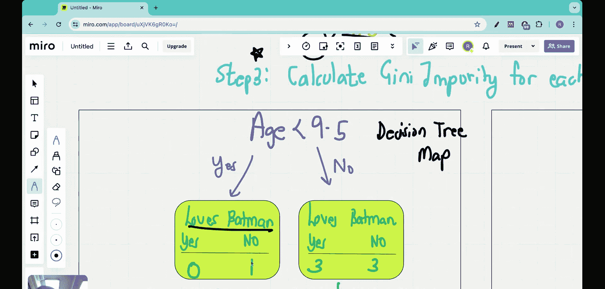

#  004：数值数据的基尼不纯度

在本节课中，我们将学习如何为数值型数据计算基尼不纯度。上一节我们介绍了基尼不纯度的数学定义和可视化，并将其与熵进行了比较。本节我们将重点探讨当特征（如年龄）是数值时，如何应用基尼不纯度来选择最佳分割点。

首先，让我们回顾一下我们试图解决的问题。我们有一个包含七个人的训练数据集，记录了他们对三个问题（是否爱看电影、是否爱看卡通片、年龄）的回答，以及他们是否喜欢蝙蝠侠。我们的目标是根据这些信息，构建一个决策树来预测一个新来的人是否喜欢蝙蝠侠。

在之前的课程中，我们已经为“爱看电影”和“爱看卡通片”这两个分类问题计算了基尼不纯度，并得出结论：“爱看卡通片”作为根节点比“爱看电影”更优。然而，我们还没有考虑数值特征“年龄”。本节我们将学习如何为“年龄”这个数值特征计算基尼不纯度。

处理数值特征与处理分类特征的过程有所不同。以下是计算数值特征基尼不纯度的步骤。

## 步骤一：排序数值特征

首先，需要将数值特征的值从低到高进行排序。在我们的数据中，年龄列已经是升序排列：7, 12, 18, 35, 38, 50, 83。如果你的数据未排序，这是必须完成的第一步。

## 步骤二：计算相邻行的平均值

接下来，计算排序后相邻数据点的平均值。这为我们提供了潜在的分割阈值。

以下是计算过程：
*   7 和 12 的平均值是 9.5
*   12 和 18 的平均值是 15
*   18 和 35 的平均值是 26.5
*   35 和 38 的平均值是 36.5
*   38 和 50 的平均值是 44
*   50 和 83 的平均值是 66.5

因此，我们得到六个潜在的分割点：9.5, 15, 26.5, 36.5, 44, 66.5。

## 步骤三：为每个分割点计算基尼不纯度

现在，我们需要为每一个潜在的分割点计算基尼不纯度。基尼不纯度的公式为：

**Gini = 1 - (p_yes)² - (p_no)²**

其中，`p_yes` 和 `p_no` 分别代表在给定分割下，节点中“是”和“否”类别的比例。

我们将以第一个分割点 **9.5** 为例进行演示。我们提出的问题是：“年龄是否小于 9.5？”

根据这个条件，数据被分为两部分：
*   **左分支 (年龄 < 9.5)**：只有年龄为7的数据点。对应的“爱蝙蝠侠”标签是“否”。所以，左分支的类别分布是：`p_yes = 0/1 = 0`, `p_no = 1/1 = 1`。
*   **右分支 (年龄 >= 9.5)**：包含年龄为12, 18, 35, 38, 50, 83的数据点。对应的标签是：否, 是, 是, 是, 否, 否。所以，右分支的类别分布是：`p_yes = 3/6 = 0.5`, `p_no = 3/6 = 0.5`。

现在计算每个分支的基尼不纯度：
*   **左分支基尼不纯度**：`Gini_left = 1 - (0)² - (1)² = 0`
*   **右分支基尼不纯度**：`Gini_right = 1 - (0.5)² - (0.5)² = 1 - 0.25 - 0.25 = 0.5`

一个分割点的总体基尼不纯度是左右分支基尼不纯度的加权平均，权重是各分支样本数占总样本数的比例。

**总基尼不纯度 = (左分支样本数 / 总样本数) * Gini_left + (右分支样本数 / 总样本数) * Gini_right**

对于分割点9.5：
*   总样本数 = 7
*   左分支样本数 = 1
*   右分支样本数 = 6
*   **总基尼不纯度 = (1/7)*0 + (6/7)*0.5 ≈ 0.429**

我们需要对步骤二中得到的每一个潜在分割点（15, 26.5, 36.5, 44, 66.5）重复上述计算过程。

## 步骤四：比较并选择最佳分割点

完成所有分割点的计算后，我们会得到每个分割点对应的总体基尼不纯度。**基尼不纯度越低，意味着该分割点产生的子集“纯度”越高，分类效果越好。**

因此，我们会选择能产生最小总体基尼不纯度的那个分割点，作为对“年龄”这个特征的最佳分割方式。

通过比较“爱看电影”（基尼不纯度0.405）、“爱看卡通片”（基尼不纯度0.214）以及“年龄”的最佳分割点所对应的基尼不纯度，我们就能最终确定哪个特征应该放在决策树的根节点。数值最小的特征将获得最高优先级。

本节课中，我们一起学习了为数值型特征计算基尼不纯度的完整流程。这个过程包括排序数据、计算相邻值平均值作为候选分割点、为每个分割点计算加权基尼不纯度，并最终选择不纯度最低的分割点。掌握了这个方法，我们就能公平地比较分类特征和数值特征，从而科学地构建决策树的每一个节点。