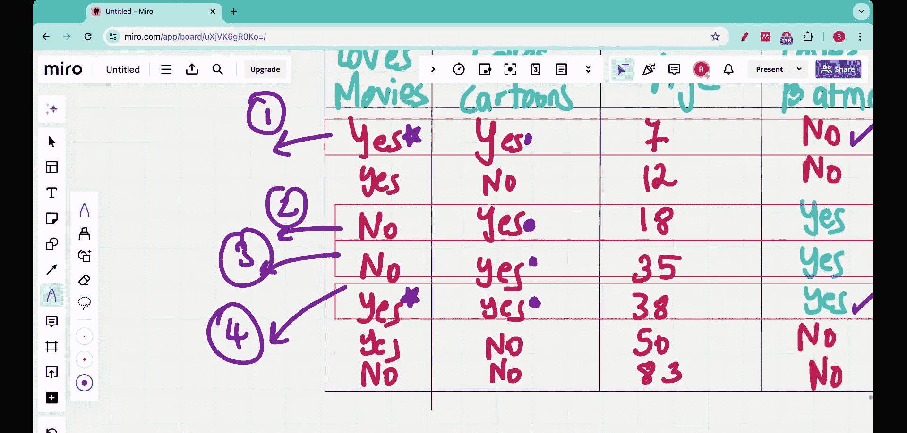

#  005：完成分类决策树的构建 🎯

在本节课中，我们将完成分类决策树的构建。这是一个从两到三节课前开始的系列过程的收尾工作。

## 概述

我们将使用一个具体的训练数据集，通过计算基尼不纯度来决定决策树每个节点的最佳划分问题，从而完成整个决策树的构建。

## 问题回顾

我们收集了七个人的数据，询问了三个问题：
1.  你喜欢看电影吗？
2.  你喜欢看卡通吗？
3.  你的年龄是多少？

基于这三个问题的答案，我们的目标是预测一个人是否喜欢蝙蝠侠。这是一个分类问题，我们将通过从头构建一个决策树来解决它。

上一节我们介绍了基尼不纯度的概念，并确定了决策树的根节点。本节中我们来看看如何确定后续的内部节点和叶节点。

## 当前进度

在上一讲中，我们通过计算基尼不纯度，确定了第一个问题（根节点）应该是“喜欢卡通吗？”。其基尼不纯度最低，为 **0.214**。

决策树目前的状态如下：
*   如果回答“是”，则有4个人进入左分支（其中3人喜欢蝙蝠侠，1人不喜欢）。
*   如果回答“否”，则有3个人进入右分支（所有人都不喜欢蝙蝠侠）。

右分支的叶节点已经是“纯”的（类别一致），因此无需进一步划分。左分支的叶节点是“不纯”的（类别混合），需要继续划分。

## 确定下一个内部节点

现在，我们需要决定在左分支（回答“喜欢卡通”）的4个人中，接下来应该问哪个问题：“喜欢电影吗？”还是“年龄？”。

我们将再次使用基尼不纯度作为衡量标准，为这两个候选问题分别计算基于当前4人子集的基尼不纯度。

以下是计算过程：

### 1. 基于“喜欢电影吗？”的划分

我们为这4个人创建决策树映射。

*   **“喜欢电影”为“是”的分支**：有2人。其中1人喜欢蝙蝠侠，1人不喜欢。
    *   基尼不纯度计算公式为：`Gini = 1 - (p_yes^2 + p_no^2)`
    *   此处，`p_yes = 0.5`, `p_no = 0.5`
    *   计算得：`Gini_yes = 1 - (0.5^2 + 0.5^2) = 0.5`

*   **“喜欢电影”为“否”的分支**：有2人。其中2人喜欢蝙蝠侠，0人不喜欢。
    *   此处，`p_yes = 1`, `p_no = 0`
    *   计算得：`Gini_no = 1 - (1^2 + 0^2) = 0`

接下来，计算该问题（“喜欢电影吗？”）的**加权基尼不纯度**：
`Weighted Gini = (分支样本数 / 总样本数) * Gini_分支1 + (分支样本数 / 总样本数) * Gini_分支2`
`Weighted Gini_movies = (2/4)*0.5 + (2/4)*0 = 0.25`

### 2. 基于“年龄”的划分（简化示例）

为了简化教程，我们假设对“年龄”这个连续变量进行了二分处理（例如，以某个阈值为界）。假设经过计算，其加权基尼不纯度为 **0.3**（此处为示例值，实际计算需确定最佳分割点）。

## 比较与选择

比较两个候选问题的加权基尼不纯度：
*   “喜欢电影吗？”：**0.25**
*   “年龄”：**0.3**

“喜欢电影吗？”这个问题的加权基尼不纯度更低。因此，我们选择它作为决策树的下一个内部节点（在“喜欢卡通=是”的分支上）。

## 构建决策树

现在我们可以扩展我们的决策树：
1.  **根节点**：喜欢卡通吗？
    *   **否** -> 叶节点：预测为“不喜欢蝙蝠侠”。
    *   **是** -> 进入下一个节点。
2.  **内部节点**：喜欢电影吗？
    *   **否** -> 叶节点：预测为“喜欢蝙蝠侠”（根据当前子集）。
    *   **是** -> 叶节点：预测结果混合（1喜欢，1不喜欢）。

注意，在“喜欢电影=是”的分支，我们得到了一个不纯的叶节点（1是，1否）。理论上，如果我们需要一个完全纯的树，可以继续用“年龄”等剩余特征对这个节点进行划分，直到所有叶节点纯或达到停止条件（如最大深度）。本例中，我们仅演示核心构建过程，在此停止。

## 总结

本节课中我们一起学习了如何完成决策树的构建。我们回顾了问题，确认了根节点，并重点演示了如何为不纯的分支确定下一个最佳划分特征。通过计算和比较不同特征划分后的加权基尼不纯度，我们选择了能使不纯度降低最多的特征（“喜欢电影吗？”）作为内部节点，从而逐步完善了决策树的结构。这个过程可以递归进行，直到构建出完整的分类模型。