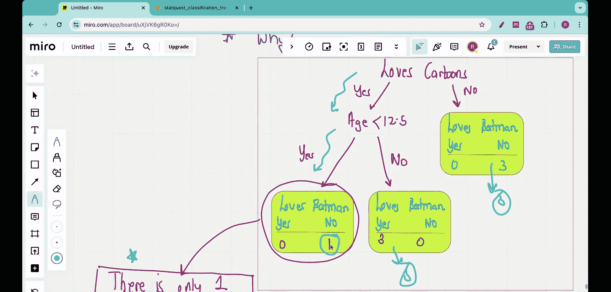

#  006：分类树剪枝概述 🌳


在本节课中，我们将学习决策树中的一个关键概念——剪枝。我们将探讨为何一个在训练数据上表现完美的模型，在测试数据上可能表现糟糕，并理解如何通过剪枝来避免过拟合，提升模型的泛化能力。

## 问题背景与回顾

上一节我们介绍了如何从零构建一个完整的分类决策树。本节中，我们来看看这个看似完美的模型在实际应用中可能遇到的问题。

我们一直使用的训练数据集如下，它收集了7个人的信息，目标是基于他们是否爱看电影、是否爱看卡通以及年龄，来预测他们是否喜欢蝙蝠侠。

| 爱看电影？ | 爱看卡通？ | 年龄 | 喜欢蝙蝠侠？ |
| :--- | :--- | :--- | :--- |
| 是 | 是 | 7 | 否 |
| 是 | 是 | 12 | 是 |
| 是 | 是 | 18 | 是 |
| 否 | 是 | 35 | 是 |
| 是 | 否 | 38 | 否 |
| 否 | 否 | 50 | 否 |
| 是 | 是 | 83 | 是 |

基于此数据，我们之前构建了最优分类树，其结构如下：

1.  首先询问：“你是否爱看卡通？”
    *   如果回答“否”，则预测为“不喜欢蝙蝠侠”。
    *   如果回答“是”，则进入下一步。
2.  接着询问：“你的年龄是多少？”
    *   如果年龄 `< 12.5`，则预测为“不喜欢蝙蝠侠”。
    *   如果年龄 `>= 12.5`，则预测为“喜欢蝙蝠侠”。

此决策树在训练数据上达到了100%的准确率。

## 泛化问题：训练 vs. 测试

然而，机器学习模型的核心目标不仅是拟合训练数据，更要能**泛化**到未见过的测试数据上。

现在，让我们用以下三个新的测试样本来检验模型的泛化能力：

| 测试人员 | 爱看电影？ | 爱看卡通？ | 年龄 | 真实喜好 |
| :--- | :--- | :--- | :--- | :--- |
| 1 | 是 | 是 | 6 | 喜欢 |
| 2 | 是 | 是 | 7 | 喜欢 |
| 3 | 否 | 否 | 9 | 不喜欢 |

以下是模型对测试数据的预测过程与结果：

*   **测试人员1**：爱卡通（是）→ 年龄6岁（<12.5）→ 预测为“不喜欢”。（**预测错误**）
*   **测试人员2**：爱卡通（是）→ 年龄7岁（<12.5）→ 预测为“不喜欢”。（**预测错误**）
*   **测试人员3**：不爱卡通（否）→ 直接预测为“不喜欢”。（**预测正确**）

模型在三个测试样本中错了两个，**测试准确率仅为33%**，这与100%的训练准确率形成了巨大反差。

## 过拟合分析

为什么会出现如此严重的性能下降？让我们分析决策树的结构。

问题出在“爱卡通=是 且 年龄<12.5”这个叶节点上。回顾训练数据，只有**一个**样本（年龄7岁，不喜欢蝙蝠侠）落入了这个分支。模型仅仅依据这一个样本，就为所有符合该条件的人做出了“不喜欢蝙蝠侠”的预测。

这导致了**过拟合**：模型过度学习了训练数据中的细节（甚至可能是噪声），而未能捕捉到更普遍的规律。因此，当遇到同样符合该条件但真实喜好不同的新样本（测试人员1和2）时，模型做出了错误判断。

## 解决方案：剪枝

为了解决过拟合问题，我们需要引入**剪枝**技术。剪枝的核心思想是：**简化模型，牺牲一部分训练精度以换取更好的泛化能力**。

具体到我们的例子，一个直接的剪枝策略是：**剪掉那个基于单个样本的、不可靠的叶节点**。

剪枝后的决策树如下：

1.  首先询问：“你是否爱看卡通？”
    *   如果回答“否”，则预测为“不喜欢蝙蝠侠”。
    *   如果回答“是”，则**直接预测为“喜欢蝙蝠侠”**。

我们移除了对年龄的判断，整个“爱卡通=是”的分支现在直接输出一个统一的预测。

## 剪枝效果验证

让我们用剪枝后的树重新评估测试数据：

*   **测试人员1**：爱卡通（是）→ 预测为“喜欢”。（**预测正确**）
*   **测试人员2**：爱卡通（是）→ 预测为“喜欢”。（**预测正确**）
*   **测试人员3**：不爱卡通（否）→ 预测为“不喜欢”。（**预测正确**）

剪枝后的模型在测试集上达到了**100%的准确率**！虽然它在训练集上可能不再完美（例如，会错误预测那个7岁的训练样本），但其泛化到新数据的能力得到了显著提升。

以下是剪枝前后的核心逻辑对比：

*   **剪枝前（过拟合）**:
    ```python
    if loves_cartoon == “否”:
        prediction = “不喜欢”
    else: # loves_cartoon == “是”
        if age < 12.5:
            prediction = “不喜欢” # 仅基于1个样本
        else:
            prediction = “喜欢”
    ```
*   **剪枝后（泛化更好）**:
    ```python
    if loves_cartoon == “否”:
        prediction = “不喜欢”
    else: # loves_cartoon == “是”
        prediction = “喜欢” # 合并分支，简化规则
    ```

## 总结



本节课中我们一起学习了决策树剪枝。我们首先看到了一个在训练集上完美但在测试集上表现很差的模型，这揭示了**过拟合**问题。通过分析，我们发现问题源于模型基于**极少样本**（本例中为1个）做出了过于具体的决策。为了解决这个问题，我们引入了**剪枝**，通过移除不可靠的分支来简化模型。最终，剪枝后的模型虽然训练精度有所下降，但**测试精度（泛化能力）** 得到了根本性改善。记住，一个好的机器学习模型的目标是泛化，而非仅仅记忆训练数据。