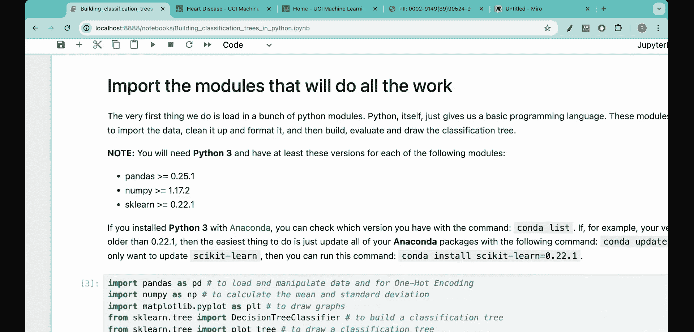

#  007：使用Python从头构建完整分类树 🚀


在本节课中，我们将学习如何从零开始，使用Python构建一个完整的分类决策树。我们将以一个真实且有影响力的医学问题——预测心脏病——作为贯穿始终的案例，将之前学习的基尼不纯度、熵、剪枝等概念付诸实践。

---

## 理解问题与数据 📊

上一节我们介绍了本系列的目标，本节中我们来看看我们将要解决的具体问题。

我们的核心目标是：**使用决策树模型，根据患者的13项特征，预测其是否患有心脏病**。这意味着，对于任何新患者，只要我们收集到这13项数据，模型就能给出患病风险的预测。

在着手解决任何机器学习问题之前，充分理解问题本身和数据至关重要。我们的数据来源于UCI机器学习仓库中的克利夫兰心脏病数据集，最初记录于1989年的一篇医学论文中。

以下是数据集中每个变量的含义。理解这些变量有助于后续处理分类数据、调试问题，并增加对问题的直觉。

*   **age**: 患者年龄（岁）。
*   **sex**: 患者性别（1=男性，0=女性）。
*   **cp**: 胸痛类型（1-4，值越高表示越典型的心绞痛）。
*   **trestbps**: 静息血压（毫米汞柱）。
*   **chol**: 血清胆固醇水平（毫克/分升）。
*   **fbs**: 空腹血糖是否 > 120 mg/dl（1=是，0=否）。
*   **restecg**: 静息心电图结果（0-2）。
*   **thalach**: 运动达到的最大心率。
*   **exang**: 运动是否诱发心绞痛（1=是，0=否）。
*   **oldpeak**: 运动相对于休息引起的ST段压低。
*   **slope**: 峰值运动时ST段的斜率（0-2）。
*   **ca**: 荧光透视显影的主要血管数量（0-3）。
*   **thal**: 铊扫描结果（3=正常，6=固定缺陷，7=可逆缺陷）。
*   **hd** (目标变量): 是否患有心脏病（0=无，1=有）。

我们的任务就是基于前13个特征，预测最后一个目标变量 `hd`。

---

## 第一步：导入必要的库 📦

在Python中查看或处理数据之前，我们首先需要导入必要的工具库。以下是构建决策树项目常用的库。

```python
import pandas as pd      # 用于数据处理和分析
import numpy as np       # 用于数值计算
import matplotlib.pyplot as plt # 用于数据可视化
from sklearn.model_selection import train_test_split # 用于拆分训练集和测试集
from sklearn.tree import DecisionTreeClassifier, plot_tree # 用于构建和可视化决策树
from sklearn.metrics import accuracy_score, classification_report # 用于评估模型性能
```

`pandas` 和 `numpy` 是处理数据的基石。`sklearn` 提供了构建和评估决策树模型的完整工具链。

---

## 第二步：加载与探索数据 🔍

库准备就绪后，下一步就是将数据加载到Python环境中并进行初步探索，以了解数据的基本情况。

```python
# 假设数据文件名为 'heart_disease.csv'，并位于当前目录
data = pd.read_csv('heart_disease.csv')

# 查看数据的前几行，了解数据结构
print("数据前5行：")
print(data.head())

# 查看数据的基本信息，包括列名、非空值数量和数据类型
print("\n数据信息：")
print(data.info())

# 查看数据的统计摘要
print("\n数据统计描述：")
print(data.describe())
```

运行这些代码可以帮助我们确认数据是否成功加载，检查是否有缺失值，并了解各特征的数值分布范围。

---

## 第三步：数据预处理 🧹

原始数据通常不能直接用于模型训练。数据预处理的目标是清理数据并将其转换为适合算法的格式。

以下是常见的预处理步骤：

1.  **处理缺失值**：检查并决定是删除缺失行，还是用均值、中位数或众数填充。
    ```python
    # 检查缺失值
    print(data.isnull().sum())
    # 假设我们用该列的均值填充缺失值（以‘age’列为例）
    # data['age'].fillna(data['age'].mean(), inplace=True)
    ```

2.  **处理分类变量**：决策树算法通常需要数值输入。对于像 `sex`、`cp` 这样的分类变量，如果它们已经是数字编码（如0/1），则可以保留。对于字符串类型的分类变量，需要使用`pd.get_dummies()`进行独热编码。
    ```python
    # 如果‘thal’是字符串类型，进行独热编码
    # data = pd.get_dummies(data, columns=['thal'], drop_first=True)
    ```

3.  **分离特征与目标变量**：将我们要预测的列（目标变量）与其他列（特征）分开。
    ```python
    X = data.drop('hd', axis=1)  # 特征矩阵
    y = data['hd']               # 目标变量向量
    ```

4.  **划分训练集与测试集**：将一部分数据留出，用于最终评估模型的泛化能力，避免过拟合。
    ```python
    X_train, X_test, y_train, y_test = train_test_split(X, y, test_size=0.2, random_state=42)
    ```
    这里，`test_size=0.2` 表示20%的数据用作测试集，`random_state` 确保每次运行拆分结果一致。

---

## 第四步：构建初步决策树 🌱

数据准备完成后，我们可以构建第一个决策树模型。这是一个基线模型，帮助我们了解数据的基本可分性。

```python
# 初始化决策树分类器，先使用默认参数
clf_baseline = DecisionTreeClassifier(random_state=42)

# 在训练集上训练模型
clf_baseline.fit(X_train, y_train)

# 在训练集和测试集上进行预测
y_train_pred = clf_baseline.predict(X_train)
y_test_pred = clf_baseline.predict(X_test)

# 计算准确率
train_accuracy = accuracy_score(y_train, y_train_pred)
test_accuracy = accuracy_score(y_test, y_test_pred)

print(f"训练集准确率: {train_accuracy:.4f}")
print(f"测试集准确率: {test_accuracy:.4f}")
```

如果训练集准确率远高于测试集准确率，说明模型可能**过拟合**了，它过于复杂，记住了训练数据的噪声，而非一般规律。

---

## 第五步：优化决策树 ✂️

初步的树往往过于复杂。优化（或“剪枝”）的目的是简化模型，提高其泛化到新数据的能力。主要方法是通过超参数控制树的生长。

以下是关键的超参数及其作用：

*   **`max_depth`**: 树的最大深度。限制深度能有效防止过拟合。
*   **`min_samples_split`**: 节点分裂所需的最小样本数。值越大，树越简单。
*   **`min_samples_leaf`**: 叶节点所需的最小样本数。可以平滑模型。
*   **`max_leaf_nodes`**: 最大叶节点数量。
*   **`criterion`**: 分裂标准，可选 `'gini'`（基尼不纯度）或 `'entropy'`（信息增益）。

我们可以尝试不同的参数组合，并选择在测试集上表现最好的一个。

```python
# 尝试一个经过剪枝的树
clf_pruned = DecisionTreeClassifier(max_depth=5, min_samples_split=10, random_state=42)
clf_pruned.fit(X_train, y_train)

y_test_pred_pruned = clf_pruned.predict(X_test)
test_accuracy_pruned = accuracy_score(y_test, y_test_pred_pruned)

print(f"剪枝后测试集准确率: {test_accuracy_pruned:.4f}")

# 可以查看更详细的评估报告
print("\n分类报告：")
print(classification_report(y_test, y_test_pred_pruned))
```

通过比较剪枝前后的测试集准确率，我们可以判断优化是否有效。

---

## 第六步：可视化决策树 📈

可视化决策树能帮助我们理解模型是如何做出决策的，哪些特征最重要。

```python
plt.figure(figsize=(20,10))  # 设置画布大小
plot_tree(clf_pruned,
          feature_names=X.columns,  # 特征名称
          class_names=['No Disease', 'Disease'], # 类别名称
          filled=True,        # 用颜色填充节点
          rounded=True,       # 圆角节点
          fontsize=10)
plt.title("优化后的心脏病预测决策树")
plt.show()
```

从树形图中，我们可以清晰地看到从根节点开始，模型根据哪些条件（如 `thalach > 152.5`）将患者划分到不同的分支，直至得出最终诊断。

---

## 总结 🎯

本节课中，我们一起完成了一个完整的机器学习项目流程，使用Python从头构建了一个心脏病预测的分类决策树。我们经历了以下关键步骤：

1.  **理解问题与数据**：明确了预测目标，并深入了解了13个临床特征的含义。
2.  **环境准备**：导入了必要的Python库。
3.  **数据加载与探索**：将数据载入程序并查看了其概况。
4.  **数据预处理**：为模型训练准备好了干净、格式正确的数据。
5.  **构建基线模型**：用默认参数建立了第一棵树，作为性能基准。
6.  **优化模型**：通过调整超参数（如 `max_depth`）对树进行剪枝，以提升泛化能力。
7.  **评估与可视化**：评估了模型性能，并可视化树结构以解释其决策过程。



这个过程不仅适用于心脏病预测，也是解决大多数分类问题的通用蓝图。核心思想是：从理解业务开始，用代码实现数据处理和模型构建，并通过迭代优化使模型既准确又可靠。