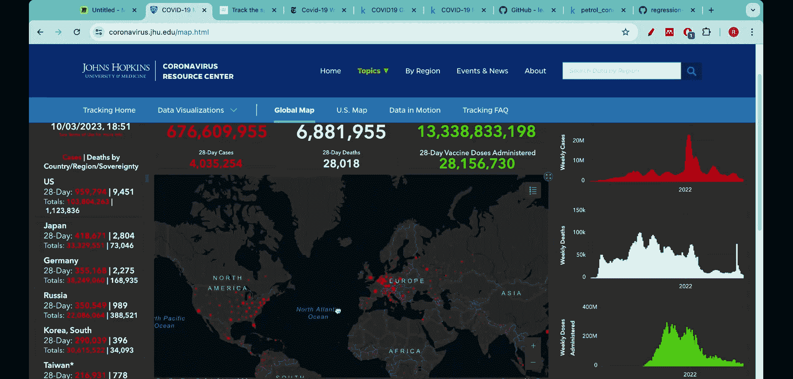
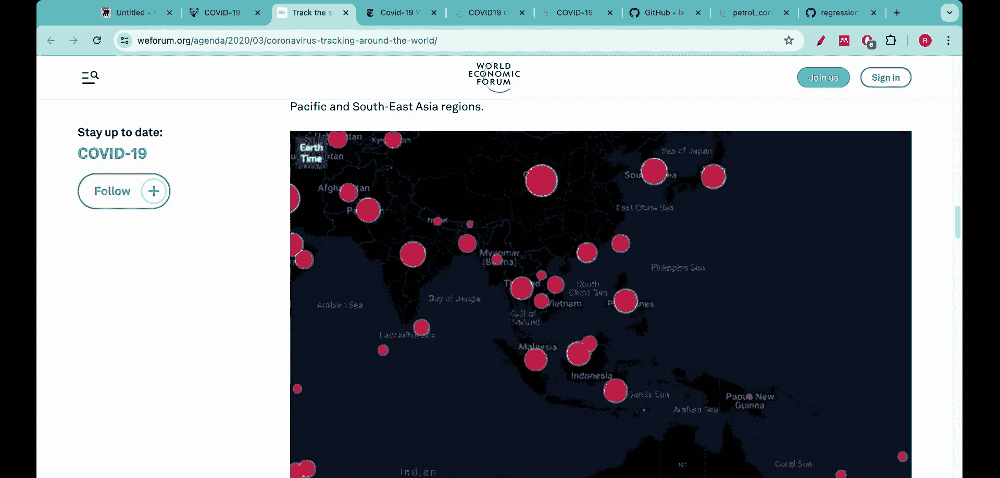

#  008：什么是回归树？ 🌳

在本节课中，我们将要学习决策树的另一个重要应用——回归树。我们将了解它与分类树的区别，探索其适用场景，并通过一个药物剂量与效果的例子来直观理解其工作原理。

在过去的五到六节课中，我们深入探讨了分类树。我们不仅从零开始构建了完整的分类树，还用Python将其代码实现。本节中，我们来看看决策树的另一个强大分支：回归树。

我曾一度认为分类是决策树的唯一用途，并不知道决策树同样可以用于回归任务。实际上，回归树在许多现实世界的回归问题中非常有用且具有影响力。让我们看一些例子。

这是著名的约翰·霍普金斯大学COVID-19病例数据仪表盘。观察图中的红点，可以看到感染病例的集中区域。

事实上，包括世界经济论坛在内的许多知名机构都将其转化为动态动画，以展示感染的传播过程。观察这个动画，可以看到红点如何演变：从中国开始，然后世界各地逐渐出现大片红色区域，这意味着感染规模在全球范围内缓慢扩大。

《纽约时报》为此维护了一个非常出色的数据集。在这里，你可以看到感染病例在世界各大洲的变化情况，存在多个峰值。图中颜色最深的热点区域表示该地区病例数最多。你甚至可以绘制人均病例数或人均死亡数，会发现某些区域颜色非常深，这表明COVID-19对该地区产生了巨大影响。

当COVID-19蔓延时，政府机构和政策制定者迫切需要预测本周、下周以及未来几周的感染病例数，因为这个预测将直接影响他们实施的政策，例如口罩强制令、封锁政策、封锁持续时间以及哪些区域必须佩戴口罩。因此，预测变得至关重要，而Kaggle平台在其中扮演了重要角色。在疫情期间，Kaggle发起了多项挑战。

这里你可以看到“COVID-19全球预测挑战”，许多人提交了他们的解决方案。这个挑战本质上是一个预测任务：目标是预测随时间变化的感染病例数。挑战描述是：预测全球不同地区累计确诊的COVID-19病例数。

他们提供了训练数据和用于提交的测试数据，参赛者需要提交自己的预测方案。人们提出了多种解决方案，但非常有趣的是，回归树也被用于构建这些解决方案。我原本以为人们会使用最小二乘法、梯度提升或神经网络等复杂的机器学习算法，但回归树同样被用于提出解决方案。你可以看到这个解决方案被标记为星标，意味着它被许多人引用和赞赏。

我会在视频的信息区分享这个笔记本文档链接。这里我只想说明，回归树甚至可以用于解决像COVID-19大流行这样具有重大影响的现实问题。因此，你在本节课中学到的知识将对你极为有益。

不仅仅是这个问题，在GitHub和Kaggle上，你还会发现许多使用回归树完成的项目。例如，有一个著名的汽油消耗数据集。

该数据集包含诸如汽油税、高速公路里程、人口等不同特征，最终目标是预测汽油消耗量。事实证明，回归树被广泛用于解决这个问题。正如我现在展示的，它在Kaggle上也可用，人们为此编写了许多代码。

如果你现在在GitHub上搜索“回归树”，无论是在本讲座之后还是期间，你都会找到大量使用回归树本身完成的项目。

因此，本节课的目的是首先让你从根本上理解什么是回归树，然后，类似于我们处理分类树的方法，我们将从零开始构建一个完整的回归树，并用Python编写代码。

那么，让我们开始今天的课程。首先，我想告诉你为什么回归树是有益的，尤其是在存在许多其他回归方法（如最小二乘法、普通最小二乘法等）的情况下。我发现的一个主要原因是，回归树处理非线性数据的能力远优于其他回归方法。

让我解释一下我的意思。看这个数据集，它看起来几乎是线性的，虽然有一些噪声，但我们可以清楚地看到有一条直线可以拟合这些数据。对于这样的数据集，传统的回归方法非常有效，你可以直接使用它们。但是，非线性数据呢？如果数据是这样的：这里有一簇点，那里有一簇点，然后这里和那里也各有一簇。尝试在这里拟合一条直线，无论你用哪条直线，都无法很好地拟合这种非线性数据。正是在这类数据中，回归树实际上极其有益和有用。

在今天的讲座中，让我们理解什么是回归树，以及它们能解决什么类型的问题。从下一讲开始，我们将着手构建回归树。

再次说明，我参考了StatsQuest频道的讲座材料。我将这些材料提炼成了构建模块，但我非常喜欢这个频道，所以在此注明出处。

我们要解决的问题是这样的：我们有一个训练数据，其中Y轴是药物有效性，X轴是药物剂量。想象一个数据，其中药物剂量以百分比表示（如10%、20%、30%、40%等），Y轴是药物有效性百分比。目标是量化剂量水平与药物有效性之间的关系，这样，每当遇到一个新的人（例如，给一个新的人服用药物时），你能否根据他们服用的药物剂量来预测药物的有效性？这就是我们试图解决的主要问题。

假设数据集看起来像这样。现在请专注于黄色的点，暂时忽略橙色的线或橙色文字，只看黄色的点。

这就是我们当前的数据集。在X轴上，我们有药物剂量，在Y轴上，我们有药物有效性百分比。

如果你专注于黄色的数据点，首先可以看到它们似乎是成簇的，看起来完全不像线性数据。事实上，如果你试图用一条直线来拟合这些数据，那将是一个非常糟糕的主意，因此你也不能使用传统的回归方法。

让我擦掉这条直线，以便我能更清楚地描述这个数据集的更多特征。

我已经擦掉了它，这样我们可以更清晰地可视化数据集。显然，传统的标准线性回归将是一个糟糕的选择。另一种思考方式是：无论在哪里出现高数值的点（比如这些点），其左右两侧总是伴随着低数值的点。这是数据集不适合线性回归的完美指示或完美体现，你可以看到这种以非线性方式呈现的簇状分布。

为了解决这个问题，我们将使用回归树。事实证明，对于解决这类问题，回归树比传统的最小二乘法要好得多。

回归树的另一个优点是它们也非常易于解释和使用。

我告诉你的关于回归树的第一个优点是，与其他回归方法相比，它们能以更好的方式处理非线性数据。但还有另一个优点，那就是：与所有决策树一样，它们在本质上非常易于解释。我真正尊重和喜欢决策树的一点是，与神经网络等其他方法不同，回归树具有高度的可解释性。你可以查看一棵回归树，并提出诸如“为什么答案是这样？”或“为什么解决方案的行为是这样？”的问题。这就像照亮了通常被视为“黑箱”的机器学习。

很好，那么让我们使用回归树。我们的目标是：给定一个新的剂量，我们能否实际找出该剂量的有效性？我们拥有这个训练数据。如果我们遇到一个不在训练集中的新数据点...

本节课中我们一起学习了回归树的基本概念、其相对于传统线性回归在处理非线性数据方面的优势，以及它在现实世界问题（如疫情预测）中的应用价值。我们还通过一个具体的药物剂量预测例子，直观地理解了回归树要解决的问题类型。在接下来的课程中，我们将开始动手从零构建回归树。