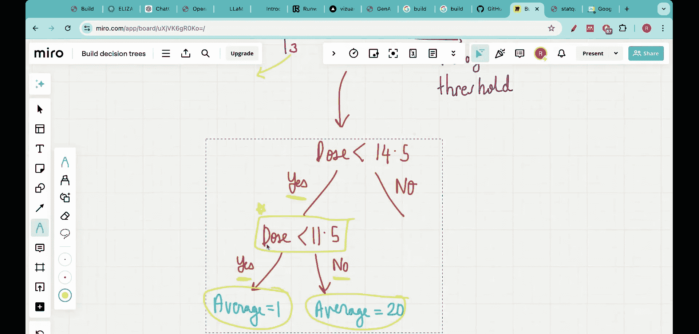

#  010：完成回归树的构建

在本节课中，我们将继续从零开始构建回归树。上一节我们确定了决策树的根节点，本节我们将完成整个决策树的构建，学习如何为每个分支节点选择最佳分割阈值。

## 回顾与目标

上一节我们开始构建一个回归树来解决一个具体问题：根据药物剂量预测药效百分比。我们收集了约20-25名患者的数据，这些数据点呈现非线性关系，因此传统的回归模型（如普通最小二乘法）难以处理，而回归树是解决此类问题的理想算法。

我们的目标是：给定训练数据，构建一个使用药物剂量预测药效的回归树。最终，我们希望得到一棵优化后的树，其结构如下：首先根据“剂量是否小于14.5”进行判断，然后根据“剂量是否大于等于25”和“剂量是否大于等于23.5”进行后续判断。这棵树能很好地拟合图中的所有数据点。

上一节我们通过计算**残差平方和**，确定了根节点的最佳分割阈值为 **剂量 < 14.5**。残差平方和的计算公式为：
`SSR = Σ(实际值 - 预测值)²`
其中，预测值在节点内是数据点目标值的平均值。SSR值越低，代表该分割产生的误差越小。

目前，决策树仅确定了根节点，我们尚不清楚“是”和“否”分支之后的结构。本节课将完成这些部分的构建。

## 构建左分支（剂量 < 14.5）

当根据根节点（剂量 < 14.5）进行分割后，数据点被分为左右两部分。我们将左侧部分标记为 **L**，右侧部分标记为 **R**。首先，我们处理左侧分支（L）。

左侧分支包含6个数据点，其剂量值均小于14.5。为了进一步划分这个分支，我们需要像为根节点所做的那样，为这6个点寻找最佳分割阈值。

以下是具体步骤：
1.  我们依次考虑不同的候选阈值（例如，剂量 < 3, < 5, < 7, ..., < 11.5）。
2.  对于每个候选阈值，我们计算其对应的残差平方和。
3.  选择使残差平方和最小的阈值作为该节点的分割点。

我们对这6个点计算了不同阈值下的SSR，并绘制了SSR随阈值变化的曲线。结果显示，当阈值为 **剂量 < 11.5** 时，SSR值最低，即误差最小。

因此，在左侧分支（“是”分支）中，下一个分类问题应为“剂量是否小于11.5”。如果答案为“是”，则进入一个叶节点，其预测值为该分支内数据点药效的平均值（计算得1）；如果答案为“否”，则进入另一个叶节点，其预测值为对应数据点药效的平均值（计算得20）。

## 识别问题与剪枝

然而，这里存在一个问题。让我们仔细查看由“剂量 < 11.5”为“否”（即剂量在11.5到14.5之间）所定义的数据桶。在原始数据图中，这个区间内实际上只有一个数据点。

当一个节点分割后产生的子节点包含的数据点非常少（例如只有1个）时，继续分割可能导致**过拟合**——模型过度学习了训练数据中的噪声，而降低了泛化到新数据的能力。为了避免这种情况，我们通常需要设置一个停止条件，例如**最小叶子节点样本数**。这意味着，如果分割后某个子节点包含的数据点数量低于预设的最小值（例如5个），我们就停止在该节点继续分割，并将其直接作为叶节点。

因此，对于当前情况，由于“剂量在11.5到14.5之间”这个分支只包含1个数据点，少于最小叶子节点样本数，我们不应该在此处继续分割。这个分支应直接成为一个叶节点，其预测值就是该单一数据点的药效值。

## 构建右分支（剂量 >= 14.5）

现在，让我们回到根节点的右侧分支（R），即那些剂量大于等于14.5的数据点。

我们采用相同的流程来构建这个分支：
1.  聚焦于右侧分支的所有数据点。
2.  为这些点计算不同分割阈值下的残差平方和。
3.  选择SSR最小的阈值作为该节点的分割点。

计算结果表明，对于右侧分支，最佳分割点是 **剂量 < 25**。在此阈值下，我们可以进一步将数据分为两部分。

## 完成决策树构建

遵循上述原则（寻找最小SSR的分割点，并应用最小叶子节点样本数规则以防止过拟合），我们最终可以构建出完整的决策树。

其最终结构如下：
1.  **根节点**：剂量 < 14.5？
    *   **是** -> 进入左分支。
        *   由于左分支在进一步分割时，其中一个子节点数据量过少，因此根据剪枝原则，左分支最终形成一个叶节点（或经过适当合并后的节点）。
    *   **否** -> 进入右分支。
2.  **右分支节点**：剂量 < 25？
    *   **是** -> 进入分支。
        *   在此分支内，继续寻找最佳分割点，发现是 **剂量 < 23.5**。
        *   根据“剂量 < 23.5”再次分割，直到所有分支满足停止条件（如达到最小叶子节点样本数），形成叶节点。
    *   **否** -> 进入分支。
        *   此分支数据也可能继续分割或直接成为叶节点，取决于其数据量和SSR计算。

通过递归地应用“计算SSR -> 选择最佳分割 -> 检查停止条件”这一过程，我们最终得到了那棵能够有效拟合数据、同时通过剪枝避免过拟合的优化回归树。

## 总结

本节课中，我们一起完成了回归树的构建。我们学习了如何为决策树的每个节点选择最佳分割阈值，核心方法是**最小化残差平方和**。同时，我们引入了**剪枝**的概念，通过设置如**最小叶子节点样本数**这样的停止条件来防止模型过拟合。整个过程从根节点开始，递归地分割数据，直到满足停止条件，最终形成一棵完整的、可用于预测的回归决策树。