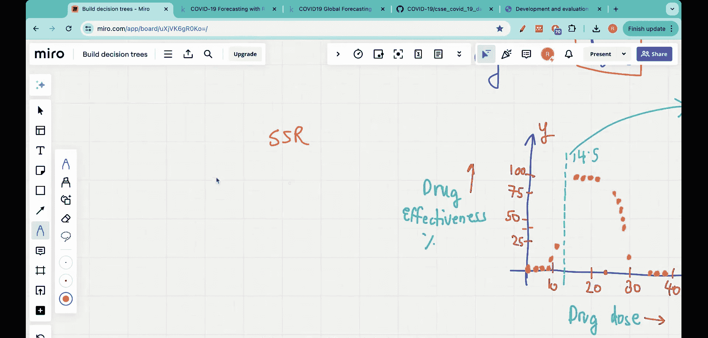

#  011：多特征回归树 🌳

在本节课中，我们将学习如何构建一个包含多个特征的回归树。我们将使用一个包含药物剂量、患者年龄和性别三个特征的数据集，来预测药物的有效性百分比。

## 概述

在之前的课程中，我们学习了如何基于单一特征（药物剂量）构建回归树来预测药物有效性。然而，现实世界的数据分析通常涉及多个特征。本节课，我们将扩展这一概念，探讨当输入特征不止一个时，如何构建回归树模型。

## 问题背景与数据

我们面临的问题是：当一位新患者来到诊所时，我们已知其药物剂量、年龄和性别，需要基于已有的训练数据预测其药物有效性百分比。

以下是训练数据的一个样本：

| 剂量 | 年龄 | 性别 | 药物有效性 (%) |
| :--- | :--- | :--- | :------------- |
| 10   | 35   | 男   | 45             |
| 20   | 28   | 女   | 60             |
| 15   | 50   | 男   | 30             |
| 25   | 40   | 女   | 70             |

我们的目标是建立一个模型，能够根据新患者的这三个特征，输出一个预测的药物有效性百分比。

## 构建多特征回归树的步骤

上一节我们明确了问题与数据。本节中，我们来看看构建多特征回归树的具体步骤。核心思想是依次评估每个特征，找到最佳分割点。

### 第一步：评估第一个特征（剂量）

首先，我们暂时忽略年龄和性别特征，仅使用药物剂量来构建树。我们将剂量与药物有效性的关系绘制成散点图。

为了决定树的根节点（即第一个分割点），我们使用**残差平方和**作为评估指标。其公式为：

**SSR = Σ(实际值 - 预测值)²**

以下是确定最佳剂量分割阈值的步骤：

1.  对排序后的剂量值，依次计算相邻数据点剂量值的平均值，作为候选阈值（例如：剂量 < 5， 剂量 < 7， 剂量 < 14.5 等）。
2.  对于每个候选阈值，将数据分为“左”（小于阈值）和“右”（大于等于阈值）两组。
3.  分别计算左右两组数据药物有效性的平均值，作为该组的预测值。
4.  计算每组中所有数据点的实际值与组预测值之差的平方和，并将左右两组的SSR相加，得到该阈值下的总SSR。
5.  选择总SSR最小的那个剂量阈值作为根节点的分割点。

在本例中，计算发现阈值 **剂量 < 14.5** 能产生最小的残差平方和，因此被选为基于剂量特征的根节点分割条件。

### 第二步：纳入第二个特征（年龄）

在根据剂量完成第一次分割后，我们得到两个数据子集。接下来，我们需要在每个子集上重复上述过程，但此时可以考虑所有特征（剂量、年龄、性别）。

对于“剂量 < 14.5”这个左子集：
1.  我们分别评估用“年龄”和“性别”进行进一步分割的效果。
2.  计算使用不同年龄阈值或按性别（男/女）分割后产生的SSR。
3.  同样，选择能使该子集SSR降低最多的特征和分割点。

对于“剂量 >= 14.5”的右子集，也进行完全相同的操作。

### 第三步：纳入第三个特征（性别）及后续分割

性别是一个分类变量，其分割方式与数值型特征（剂量、年龄）不同。对于性别，分割直接基于类别，例如“性别 == 男”和“性别 == 女”。

在每个节点选择分割时，算法会在所有可用特征（剂量、年龄、性别）的所有可能分割点中，挑选出能够最大程度降低SSR的那一个。这个过程会在每个新生成的子节点上递归进行，直到满足停止条件（例如，节点中数据点少于某个最小值，或SSR的减少量小于某个阈值）。

## 总结

本节课中，我们一起学习了如何从零开始构建一个多特征回归树。关键步骤包括：
1.  **依次评估特征**：从第一个特征开始，寻找最佳分割点以最小化残差平方和。
2.  **递归分割**：在生成的每个数据子集上，重复评估所有特征，选择最佳分割。
3.  **处理混合类型特征**：同时处理数值型特征（如剂量、年龄）和分类型特征（如性别）。
4.  **以误差最小化为目标**：整个构建过程的核心是不断寻找能够最大程度降低预测误差（SSR）的分割方式。

通过这种方法，我们可以构建出一个能够综合考虑多个特征、并捕捉它们与目标变量之间复杂非线性关系的决策树模型。