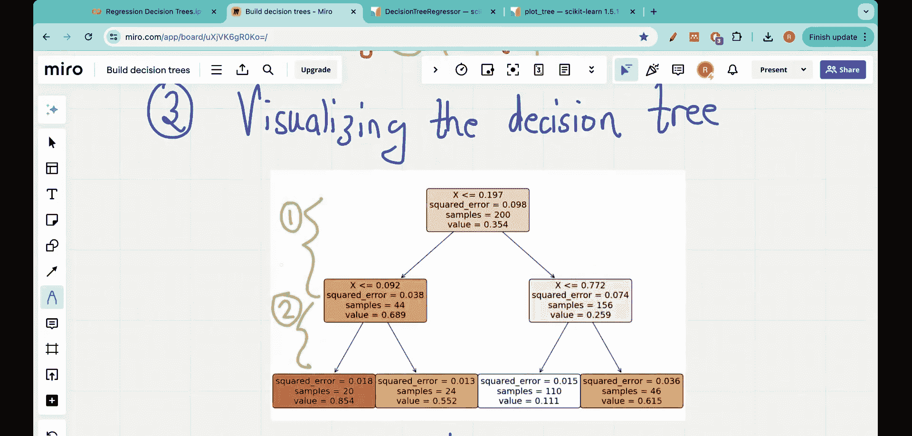

#  012：在Python中构建完整的回归决策树 🚀


在本节课中，我们将学习如何从零开始，使用Python代码构建一个完整的回归决策树。我们将回顾回归树的基础概念，并逐步实现代码，最终可视化生成的决策树。

## 概述

在之前的几节课中，我们学习了回归决策树的基础知识，理解了诸如**残差平方和**等核心概念，并了解了回归树如何处理单特征和多特征数据。本节课我们将把这些理论知识付诸实践，用Python编写一个完整的回归决策树模型。

## 第一步：导入必要的包

在开始编写代码之前，我们需要导入必要的Python库。以下是构建决策树所需的核心包。

```python
from sklearn.tree import DecisionTreeRegressor
import numpy as np
import matplotlib.pyplot as plt
```

我们主要使用三个库：
*   **`sklearn.tree`**：用于创建决策树模型。
*   **`numpy`**：用于数学计算和数组操作。
*   **`matplotlib.pyplot`**：用于数据可视化。

## 第二步：准备数据集

我们将使用一个带有噪声的二次函数数据集来演示。这样做的目的是模拟现实世界中数据的复杂性。

```python
# 生成带有噪声的二次函数数据
np.random.seed(42)
m = 200
X = np.random.rand(m, 1)
y = 4 * (X - 0.5) ** 2
y = y + np.random.randn(m, 1) / 10
```

这段代码生成了200个数据点。其基础关系是 `y = 4 * (x - 0.5)^2`，然后我们添加了高斯噪声 `np.random.randn(m, 1) / 10` 来模拟真实数据的不确定性。

我们可以将数据可视化：

```python
plt.figure(figsize=(6, 4))
plt.plot(X, y, "b.")
plt.xlabel("$x_1$", fontsize=18)
plt.ylabel("$y$", fontsize=18, rotation=0)
plt.title("带有噪声的二次函数训练集")
plt.axis([0, 1, -0.2, 1])
plt.grid(True)
plt.show()
```

## 第三步：拟合决策树模型

使用`scikit-learn`库，拟合一个回归决策树模型非常简单。核心是使用 `DecisionTreeRegressor` 类。

以下是构建和训练模型的关键代码：

```python
# 创建决策树回归器实例，并设置最大深度为2
tree_reg = DecisionTreeRegressor(max_depth=2, random_state=42)
# 使用数据拟合模型
tree_reg.fit(X, y)
```

在这两行代码中：
1.  `DecisionTreeRegressor(max_depth=2)` 创建了一个回归决策树对象，并限制其最大深度为2，以防止过拟合。
2.  `tree_reg.fit(X, y)` 命令模型根据提供的 `X`（特征）和 `y`（目标值）学习决策规则。

`DecisionTreeRegressor` 有许多参数可以调整模型行为，例如：
*   **`criterion`**: 分裂标准，默认为 `'squared_error'`（均方误差）。
*   **`max_depth`**: 树的最大深度。
*   **`min_samples_split`**: 内部节点再分裂所需的最小样本数。
*   **`min_samples_leaf`**: 叶节点所需的最小样本数。

如果不指定这些参数，`scikit-learn` 将使用默认值。例如，不指定 `max_depth` 和 `min_samples_leaf` 可能导致树生长得非常深，直到每个叶节点只包含一个样本，这通常会导致过拟合。

## 第四步：可视化决策树

模型训练完成后，理解其决策过程非常重要。我们可以使用 `sklearn.tree` 模块中的 `plot_tree` 函数来可视化树结构。

```python
from sklearn.tree import plot_tree

plt.figure(figsize=(10,6))
plot_tree(tree_reg, feature_names=["x1"], rounded=True, filled=True)
plt.show()
```

生成的树形图将显示：
*   **根节点和内部节点**：显示分裂条件（例如 `x1 <= 0.197`）。
*   **叶节点**：显示该节点最终的预测值（`value`）。
*   **颜色深浅**：通常表示节点的“纯度”或样本浓度。

根据我们设置的 `max_depth=2`，这棵树将包含一个根节点、两个内部节点和三个叶节点。第一层是深度1，其子节点是深度2，由于深度限制，树在此停止生长。

## 总结

本节课我们一起学习了构建回归决策树的完整流程：
1.  **导入库**：引入了 `sklearn`, `numpy`, `matplotlib`。
2.  **准备数据**：创建了一个带有噪声的模拟数据集。
3.  **训练模型**：使用 `DecisionTreeRegressor` 拟合数据，并理解了关键参数如 `max_depth` 的作用。
4.  **可视化树**：通过 `plot_tree` 函数直观地查看模型的决策路径。



通过这个实践，你不仅掌握了用Python快速构建回归树的方法，也加深了对树如何通过一系列规则分割数据来做出预测的理解。这是理解更复杂集成模型（如随机森林、梯度提升树）的重要基础。