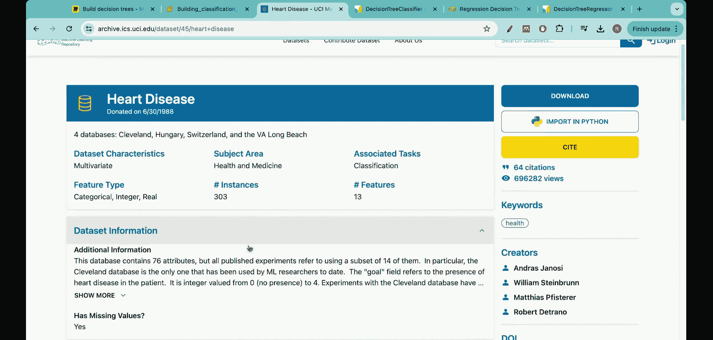

#  013：回归树与分类树总结 📊

在本节课中，我们将回顾并总结本系列课程中学习的所有关键概念。我们将快速梳理分类树与回归树的核心知识，为面试或复习提供一个清晰的概览。

## 决策树概述 🌳

决策树可以看作由两部分组成：一个**陈述**和一个需要做出的**决策**。这个定义会递归应用。例如，基于一个陈述做出决策后，根据该决策的结果，又会引出进一步的决策，如此循环，树的结构会随着决策的增多而变得越来越深。

事实上，生活中的许多决策都可以构建成决策树。例如，“我想看这部电影吗？”（是/否），如果选择“是”，那么“这部电影是什么类型？”，之后可以在每个类别下继续细分。这就是决策树最简单的定义。

## 决策树的类型 📝

决策树主要有两种类型：**分类树**和**回归树**。许多学生在学习决策树时，可能认为它只用于分类任务，这是一个误解。实际上，决策树在回归任务中也是非常强大的技术。

### 分类树

分类决策树的主要目的是将数据划分到不同的类别中。例如，一个简单的问卷问题：“你想学习决策树吗？”，它可以分成两个分支：“是”或“否”。如果选择“是”，你可以继续观看本视频；如果选择“否”，你可以暂停或不观看。这就是一个最简单的分类树例子。

理解了这一点，你可以联想到许多现实生活中的分类问题。例如，根据患者数据判断其是否患有心脏病；区分图片中是猫还是狗；判断脑部扫描中是否存在肿瘤；自动驾驶汽车判断前方物体是人还是车。所有这些都可以看作是分类问题，并可以使用分类决策树来解决。

### 回归树

另一方面，回归决策树用于预测**数值**。例如，“你想学习决策树吗？”如果“是”，那么你的年龄可能在15到40岁之间；如果“否”，那么你的年龄可能小于15岁。在这个例子中，我们预测的是年龄这个数值。

同样，理解了回归树的概念，你可以想到其广泛的应用场景。例如，根据药物剂量、患者年龄、性别等多个特征来量化药物的有效性水平，这就是在预测一个数值。股票市场是另一个例子，X轴是时间，Y轴是股价（一个数值），回归决策树也可以用于此类任务。

在本系列课程中，前6-7讲我们深入探讨了分类树，而后6-7讲则详细介绍了回归树。

## 分类树的核心概念 🔑

在学习分类树时，我们首先花了大量时间理解**树是如何分裂的**。例如，如何决定根节点、中间节点和叶节点？为此，分类树使用了一些关键指标。

以下是分类树中使用的两个主要指标：

1.  **基尼不纯度**：这是分类错误的一种度量。其核心目标是**最小化**基尼不纯度。其公式为：
    `Gini = 1 - Σ(p_i²)`，其中 `p_i` 是第 `i` 个类别的概率。

2.  **熵**：这是另一种衡量系统混乱度或不确定性的指标。其核心目标同样是**最小化**熵。其公式为：
    `Entropy = -Σ(p_i * log2(p_i))`。

这两种度量都可以用于分类任务。在Python代码中，构建分类树时你可以选择使用哪种指标。虽然两者都有人使用，但通常更倾向于使用基尼不纯度。两者有很多相似之处，例如，当真实概率为0.5时，两者的值都达到最高。

构建分类树的主要目的（或者说优化的主要目标），就是在建树过程中尽可能降低基尼不纯度或熵。

在Python中，构建分类树非常简单，使用 `DecisionTreeClassifier` 命令。你需要指定X数据和y数据来拟合这个分类树。在底层，Python使用的是**CART算法**（分类与回归树）。对于分类树，该算法试图最小化基尼不纯度或熵；对于回归树，则最小化另一个指标（稍后会提到）。

在Python的 `DecisionTreeClassifier` 函数中，你可以通过 `criterion` 参数指定标准为“gini”（基尼不纯度）或“entropy”（熵），还有一个选项是“log_loss”。通常，基尼不纯度是最常用的。

有时面试中可能会问到基尼不纯度和熵的区别。答案是：它们都是用于寻找误差度量的优秀指标，有很多相似之处，但基尼不纯度通常更受青睐，因为它基于概率的平方计算，不涉及对数运算，有时能带来更好的结果（尽管并非所有问题都如此）。通常可以两种方法都尝试一下。

## 分类树的进阶主题 🚀

随着课程的深入，在分类树部分我们还探讨了两个非常重要的主题。

第一个是**代价复杂度剪枝**。剪枝，顾名思义就是“修剪”或“减少”。代价复杂度剪枝旨在减少树的长度或深度。

你可能会想，为什么剪枝是必要的？为了回答这个问题，在本系列课程的实践部分，我们使用Python解决了一个实际问题，并完整地构建和可视化了分类树。在那个问题中，我们使用了303名患者的真实数据，包含13个新变量，来演示整个过程。

第二个重要主题是**交叉验证与测试**。这是评估模型性能、防止过拟合的关键步骤。

## 总结 📚

本节课我们一起回顾了决策树系列的核心内容。我们首先明确了决策树的基本结构，然后区分了其两大类型：用于预测类别的**分类树**和用于预测数值的**回归树**。在分类树部分，我们重点学习了决定树如何分裂的关键指标——**基尼不纯度**和**熵**，以及如何在Python中实现。最后，我们还简要提到了**代价复杂度剪枝**和**交叉验证**这两个构建稳健模型的重要技术。希望这个总结能帮助你巩固知识，为后续学习或面试做好准备。