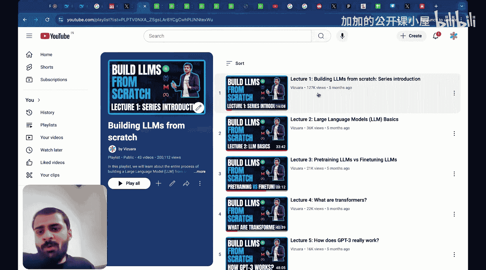
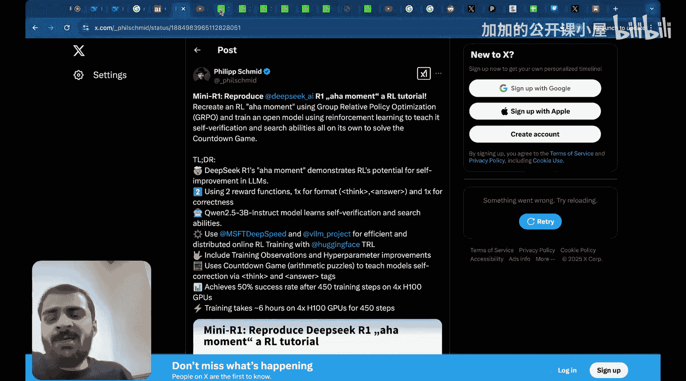
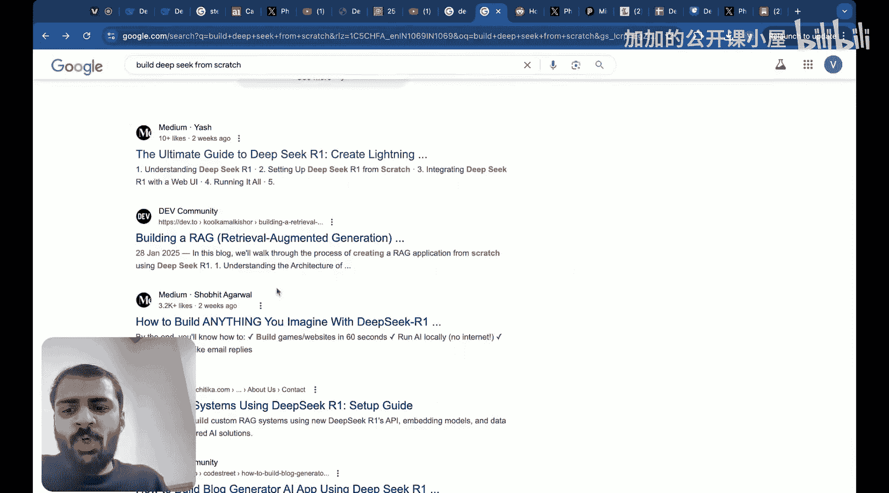

#  001：系列介绍

## 概述

在本系列课程中，我们将从零开始，完整地构建DeepSeek模型。我们将深入探讨其架构的每一个组成部分，不仅理解其工作原理，还将通过代码实现和数学推导来掌握每个细节。通过本系列学习，你将能够独立构建DeepSeek的各个模块，并深刻理解其背后的数学原理。

## 我的探索之旅

上一节我们概述了本系列的目标，现在让我们回顾一下我决定创建这个系列的心路历程。

这一切始于DeepSeek R1的发布。当时，我看到这个模型的表现令人惊叹，但由于每周都有大量新模型涌现，我最初认为这只是一个很快就会消失的浪潮。我查看了他们的网站，但没有进一步深入研究。

然而，情况很快变得令人震惊。一则LinkedIn帖子指出，DeepSeek导致美国科技公司市值蒸发了2万亿美元。原因是中国的DeepSeek构建了一个能与OpenAI最佳模型匹敌的推理AI模型，而且成本仅为百分之一，更重要的是它是开源的。

DeepSeek不仅构建成本更低，运行成本也更低。这不仅是技术问题，也涉及政治层面——硅谷是否失去了AI优势？DeepSeek引发了所有这些疑问，它比OpenAI便宜约27倍，开源且许可宽松，这令人惊叹。

随后，许多国家开始行动。例如，印度发布了构建国家首个基础模型的提案。人们突然意识到，如果中国能以比美国更少的资源做到这一点，为什么其他国家不能呢？这引发了广泛讨论。

这激起了我的好奇心。我开始大量搜索关于DeepSeek的信息。我一直喜欢从零开始构建事物，之前发布的“从零构建LLM”系列已有约40-45个视频，受到了广泛关注。

我看到一篇帖子，有人尝试复现DeepSeek V2，虽然只是一个小教程，但这激发了我的想法：为什么不尝试从零构建DeepSeek？或者至少理解DeepSeek每个模块是如何从零构建的？

我开始进行研究，意识到DeepSeek R1并非该公司首次发布的产品。以下是DeepSeek的发展时间线：

*   2024年1月：DeepSeek LLM论文
*   2024年1月：DeepSeek Coder
*   2024年3月：区域语言模型
*   2024年4月：DeepSeek Math（关于数学推理）
*   2024年6月：DeepSeek V2
*   2024年6月：DeepSeek Coder V2
*   2024年7月：DeepSeek V3
*   2025年1月：DeepSeek R1论文

DeepSeek V3真正震撼了所有人，这是最终导致2025年1月DeepSeek R1论文发表的基础模型。这背后是一年甚至更长时间的研究积累。

所有这些论文中的创新都让我渴望深入理解。我清楚知道传统LLM是如何构建的，但DeepSeek是在传统LLM模型和架构基础上的一次革命，我想学习关于它的一切。

## 现有学习材料的局限

上一节我们了解了DeepSeek的发展历程，本节我们来看看我在寻找学习材料时遇到的挑战。

很自然地，我首先在YouTube上搜索“deepseek from scratch”。我能找到一些视频，比如一个20分钟的视频约有150万次观看，另一个21分钟的视频也有大量观看。但所有这些视频要么10分钟，要么15分钟，还有一个只有8分钟。这完全不是我想要的。

我想知道DeepSeek每个部件是如何从零构建和组装的细节。就好像我想自己造一辆跑车，却只被展示一段5分钟的跑车外观介绍视频。这不是我想要的。我需要一个能解释数学细节、从零展示代码、并带我走过每个构建模块的视频，就像我为“从零构建LLM”做的那样，但在YouTube上我找不到任何这样的内容。

然后我开始在谷歌上搜索。我看到很多人在用DeepSeek构建应用。基于现有东西构建应用固然可以，但我不想只做这个。我想能够自己构建DeepSeek。在我看来，真正的力量在于此，而不是在已有事物之上构建应用。

我再次在网上搜索“build deepseek from scratch”，看到了一些论坛和文章，比如“DeepSeek R终极指南”，但这里仍然是在使用DeepSeek R来构建应用。

## 本系列课程的结构与目标

上一节我们看到了现有材料的不足，本节中我将介绍如何组织本系列课程，以及你能从中获得什么。

我计划录制一个庞大的系列，包含25、30甚至更多视频。在这些视频中，我将教你DeepSeek架构的每一个构建模块。所谓“教”，我指的不是仅仅展示博客或高层次概念，而是编写代码并推导每个方面的数学细节。

通过这些视频讲座，你将能够自己构建每一个DeepSeek模块。你也将能够构建架构和建模部分。

在本系列中，我计划涵盖三个主要方面：

1.  带你经历我尝试寻找DeepSeek学习材料的过程，以及我如何理解构建DeepSeek的整个旅程。
2.  展示我如何划分不同的主题来制作这个系列。
3.  展示你在完成整个系列后能够达到的水平。

我相信，目前世界上没有太多工程师能够自己构建DeepSeek的每一个方面，并理解其背后的数学原理。所谓数学，我指的是展示和推导每一个矩阵乘法。

完成本系列后，你将成长为这样一位工程师。你将成为一个基础扎实、能够构建DeepSeek模型或架构的工程师。哪个组织会不想要这样的工程师呢？

通过Vizuara频道，我将为你提供这些知识。在Vizuara频道上，我们已经有许多关于机器学习、深度学习和从零构建大语言模型的系列课程。我希望你也能充分享受这个系列。

## 总结

本节课中，我们一起学习了本系列课程的起源和目标。我们回顾了DeepSeek的崛起如何激发了深入理解其内部机制的需求，探讨了现有学习材料在深度和细节上的不足，并概述了本系列将如何通过代码实现和数学推导，带你从零开始完整构建DeepSeek模型。在接下来的课程中，我们将深入每个构建模块，打下坚实的基础。