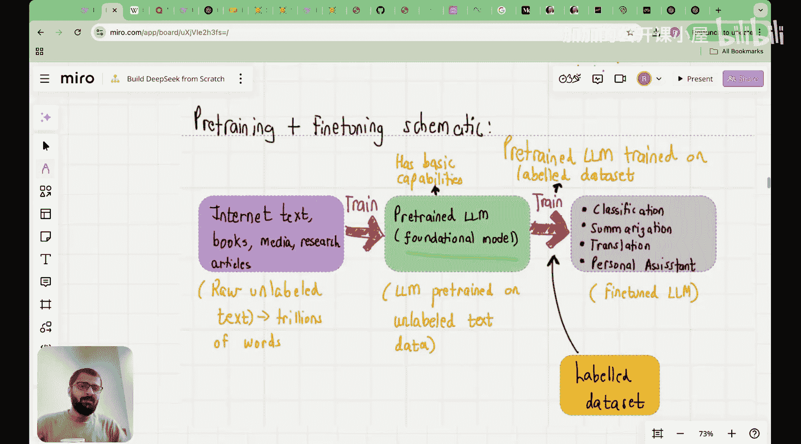

#  002：DeepSeek基础


在本节课中，我们将要学习三个核心内容。首先，我们将明确DeepSeek究竟是什么。其次，我们将探讨是什么让DeepSeek如此特别，以及其背后的技术细节。最后，我们将了解本系列课程的整体学习计划与主题顺序。

## 什么是DeepSeek？🤔

首先，DeepSeek是一家构建大语言模型的中国公司。在深入探讨之前，让我们先快速了解大语言模型的基本概念。

你们可能都使用过ChatGPT。例如，我可以向ChatGPT提问：“为我制定一个去意大利的旅行计划。” 随后，ChatGPT会生成一份旅行计划。这就是一个大语言模型。

但需要记住的核心是：大语言模型本质上是一个引擎，它接收一个词序列，然后给出下一个最可能出现的词的概率。当这些词被组合起来时，就形成了我们看到的句子。

因此，大语言模型本质上是预测下一个词的**概率引擎**。这是首先要记住的关键点。

以下是一个简单的代码示例，用于演示模型预测的概率性质：

```python
# 示例：使用模型预测下一个词的概率
# 输入句子：“经过多年努力，你的付出将带你”
# 模型会输出多个可能的后续词及其概率
```

例如，对于句子“经过多年努力，你的付出将带你”，模型可能会预测“走向成功”的概率最高，但也会为“到达远方”、“进入新阶段”等词分配一定的概率。虽然你看到的答案似乎是确定的，ChatGPT显得非常自信，但请记住，在底层，每个词的生成都基于概率，我们通常选择概率最高的词。

在置信度高的预测中，下一个词的概率分布在对数尺度上通常呈现这样的形态：第一个词的概率非常高，随后概率急剧下降。

## 大语言模型中的“大”意味着什么？📈

简单来说，对于“大”并没有一个确切的定义。但本质上，存在一种关于模型规模的**缩放定律**。最早揭示这一点的论文之一是GPT-3的论文。

GPT-3论文《Language Models are Few-Shot Learners》证明，当模型参数规模增加到1750亿时，无论是单样本还是少样本学习，模型性能都得到了显著提升。这标志着我们跨越了规模壁垒，从13亿、130亿参数最终达到了1750亿参数。一旦跨越这个规模壁垒，大语言模型就开始展现出惊人的特性。

从历史上看，从1950年代到2020年，神经网络参数数量呈指数级增长。近年来，语言模型主导了这一增长趋势，参数规模目前已达到约1万亿。

为什么我们如此关心模型规模并不断增大它？因为人们观察到，随着语言模型规模的增加，会出现所谓的**涌现行为**或**涌现特性**。

这些特性在较小模型中不存在，但在较大模型中显现。例如，在执行算术、单词重组等任务时，当模型规模（或等效的计算能力）超过某个临界点后，模型性能会突然提升。模型开始学习新事物，展现出神奇的特性。

尽管模型仅仅是在“预测下一个词”的任务上进行训练，但当LLM的规模超过特定大小后，模型就能展现出翻译、总结、语法检查等能力。这就是为什么业界竞相构建越来越大的模型。像OpenAI、Anthropic这样的公司甚至公开表示，他们目前就是在追求规模，因为仍有希望，也许在达到10万亿或100万亿参数后，LLM会展现出我们目前完全未知的特性。

## 大语言模型与传统NLP模型的区别 🔄

需要指出的是，LLM与早期的NLP模型不同。早期的NLP模型本质上是为特定任务（如语言翻译）设计的。而由于我们刚刚看到的涌现特性，大语言模型能够执行广泛的任务，例如翻译、总结、事实核查、语法检查等，正如你们可能已经在ChatGPT中探索过的那样。

一个关键点是，早期的语言模型甚至无法根据自定义指令写一封电子邮件，而这对于现代大语言模型来说是轻而易举的任务。

## 核心架构：Transformer 🏗️

到目前为止，我们已经看到大语言模型确实随着规模增大而变得更好，并发展出涌现特性。另一个需要注意的点是，这场语言革命的核心是被称为**Transformer**的架构。

如果你不知道Transformer架构是什么，不用担心，我们将在本系列课程中涵盖。本质上，有一篇名为《Attention Is All You Need》的论文介绍了Transformer架构。从图示看，它有点复杂，要真正理解Transformer架构需要几节课的时间。但本质上，这就是驱动语言模型的“秘密配方”，我们将学习它，所以请放心。

## 构建大语言模型的两个阶段 🛠️

最后，我想提到的是，当我们说创建一个大语言模型时，它涉及两个阶段。

第一阶段是**预训练阶段**。在这个阶段，我们没有带标签的数据集，但模型可以自行创建训练数据和标签，这被称为**自回归阶段**。因此，经过预训练的模型也被称为**基础模型**。

为了进行预训练，我们通常从互联网、教科书、媒体、研究文章等渠道汇集海量数据。例如，GPT-2就是在Reddit帖子、书籍、维基百科文章、开放网络语料库等数据上训练的。然后，这个庞大的语言模型就在这海量数据上进行训练。这种训练成本高达数百万美元，随着LLM规模的增大，甚至可能花费数千万乃至数亿美元。



请记住，在预训练之后，模型具备了基本能力。此后，我们通常需要对模型进行**微调**。

---


本节课中，我们一起学习了DeepSeek的基本概念。我们明确了DeepSeek是一家构建大语言模型的公司，探讨了大语言模型作为概率引擎的本质，以及模型规模与涌现特性之间的重要关系。我们还了解了驱动现代语言模型的Transformer核心架构，并概述了构建大语言模型所需的预训练和微调两个关键阶段。在接下来的课程中，我们将深入这些技术细节，一步步构建起对DeepSeek的完整理解。