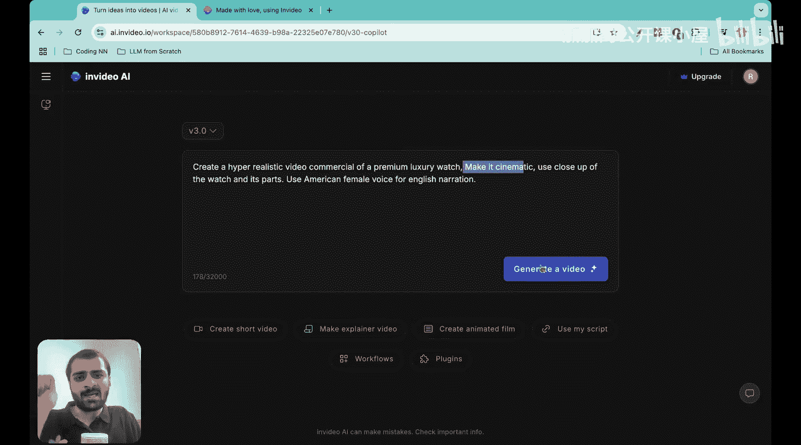
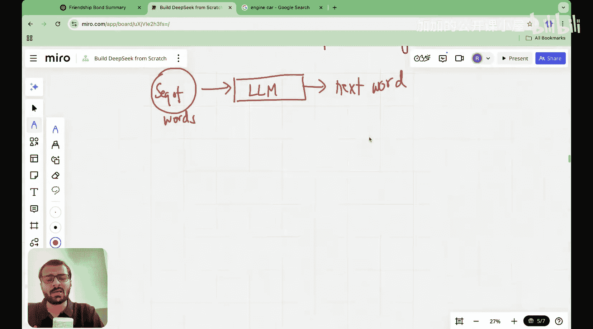

#  003：一小时理解LLM架构 🏗️

在本节课中，我们将要学习大型语言模型（LLM）的核心架构。我们将跟随一个“词元”的旅程，了解它从输入到输出所经历的完整过程。理解这个基础架构，是后续学习DeepSeek创新技术（如多头潜在注意力）的关键前提。

## 课程概述

大家好，我是Raj Duneja博士，于2022年从麻省理工学院获得机器学习博士学位。我是“从零开始构建DeepSeek”系列课程的创建者。

在开始之前，我想介绍一下本系列的赞助商和合作伙伴——V AI。我们都深知基础内容和从底层构建AI模型的价值。V AI的理念与我们的原则非常相似，让我来展示一下。

这是V AI的网站。凭借一个小型工程团队，他们构建了一款出色的产品，你可以仅通过文本提示来创建高质量的AI视频。

如你所见，我输入了一个文本提示：“创建一个超写实的豪华手表视频广告，使其具有电影感”。点击生成视频后，很快我就得到了这个令人惊叹的高写实度视频。

这个视频让我着迷的是它对细节的关注。看这里，质量和纹理简直不可思议，而这一切都来自一个简单的文本提示。这就是V AI产品的力量。你刚才看到的精彩视频的支柱，是V AI的视频创作流程，他们正在从第一性原理重新思考视频生成和编辑。

为了试验和调整基础模型，他们拥有印度最大的H100和H200集群之一，并且也在试验B200。V AI是印度发展最快的AI初创公司，为世界而建，这也是我如此认同他们的原因。好消息是，他们目前有多个职位空缺，你可以加入他们优秀的团队。更多详情我将在下方描述中发布。

大家好，欢迎来到“从零开始构建DeepSeek”系列的这一讲。

在上一讲中，我们学习了本系列课程将划分的四个阶段。

第一阶段将是DeepSeek背后的创新架构。这就是这里的阶段一。

第二阶段是训练方法本身，即强化学习的兴起，以及他们如何依赖强化学习，通过基于规则的奖励系统来教授模型复杂推理。

第三阶段是GPU优化技巧，例如他们如何使用NVIDIA的并行线程执行（PTX）或QR等。

第四阶段是他们的模型生态系统本身。他们并没有止步于仅仅构建一个拥有6710亿参数的庞大模型，而是将这个大型模型“蒸馏”成了一个规模约为15亿参数的更小模型。这本质上就是第四阶段。

我们将依次学习第一阶段、第二阶段、第三阶段和第四阶段。而在今天的讲座中，我们将从第一阶段开始，即DeepSeek背后的创新架构，以及是什么使其如此高效。

其架构的两个主要方面促成了DeepSeek的高效性。首先是**多头潜在注意力（MLA）**，它使注意力机制本身更高效。其次是**专家混合（MoE）**，这意味着尽管参数数量是6710亿，但并非所有参数同时处于激活状态，实际上只有大约370亿参数是激活的。本质上，部分参数像灯泡一样被关闭，部分被开启。这使得模型在计算上极其高效，不需要的参数被关闭，需要时则被突然开启并开始工作。此外，我们还将学习多词元预测、量化和旋转位置编码。

因此，我想教给大家的第一件事就是多头潜在注意力。我在思考如何准确地教授这个概念，因为它本身相当高级。如果你搜索“多头潜在注意力”，你会看到一些讨论此事的博客文章。它们确实会谈论多头注意力是什么。

如果你向下滚动，你会看到这只是博客文章的一页，他们从多头查询注意力、分组查询注意力开始，讲到旋转位置编码，然后有一个关于多头潜在注意力的小节。这对于刚开始探索DeepSeek是什么的人来说，几乎不可能理解。因此，我不想采用那种仅仅通过简单讲座、并假设你已具备先验知识来解释MLA的方法。

相反，正如我在系列开始时提到的，我希望使这个讲座系列非常深入。因此，我将通过一个四部分的过程来解释多头潜在注意力。

首先，我们将理解LLM本身的架构，这将是今天讲座的主要目的。我相信，如果没有对LLM架构的直觉理解，就不可能理解潜在注意力。

其次，我们将理解为什么需要自注意力，以及自注意力机制本身是什么。

理解了自注意力之后，我们将理解自注意力如何演变为多头注意力，以及拥有多个注意力头意味着什么。这是这里的第三个方面。

然后，第四个方面本质上是键值缓存。接着，我们将理解多头注意力如何工作，并且它确实工作得很好。但之后，我们可以开始做些什么来提高多头注意力的效率，使其计算更快，并确保存储在内存中的参数数量减少。这时，键值缓存就登场了。

只有当你真正理解了键值缓存，你才会慢慢开始理解多头潜在注意力。因此，在键值缓存之后，我们才会去理解MLA。

但在我们继续学习MLA本身之前，我将投入大量时间来为你们建立这前四个概念的基础。我提到的许多博客文章都假设你已经熟悉这些内容。

在“从零开始构建DeepSeek”系列中，我们有43讲来解释这些不同方面的所有内容。在这个系列中，我不会讲得那么深入。例如，今天我只用一讲来介绍LLM架构，而在“从零开始构建LLM”系列中，这需要三到四讲。

我的目标是向你解释这些知识，同时也确保刚开始观看本系列的初学者也能跟上。因此，我面临的挑战是为本系列专门制作一套新的讲义，因为我试图在一小时内解释一个概念，但同时也想确保在这个过程中不会让初学者掉队。

所以，我为解释这些不同的概念制作了一整套新的讲义。好了，我希望每个人都理解了我们将如何理解多头潜在注意力的流程。

今天，我们的主要目标是理解LLM的架构。因此，在今天讲座之后，你们所有人都应该对当一个词或一个词元进入LLM时会发生什么，有一个心理地图或视觉路线图。

首先，让我解释一下LLM的架构意味着什么。如果你输入一个句子或一系列单词，我们已经看到，当一系列单词输入到LLM时，LLM本质上做的是预测下一个词，或者更准确地说，预测下一个词元。

因此，一个LLM或大型语言模型可以被视为一个**下一个词元预测引擎**。就像一个引擎，如果我搜索“引擎汽车”并复制一张图片，或者让我现在复制一张好图片。

## 总结

本节课中，我们一起学习了大型语言模型（LLM）的基础架构概述。我们明确了本系列课程将分为四个阶段：创新架构、训练方法、GPU优化和模型生态系统。我们了解到，理解LLM的整体工作流程——即其作为一个“下一个词元预测引擎”的本质——是深入学习其核心组件（如多头潜在注意力）的必要前提。在接下来的课程中，我们将以此为基础，逐步拆解LLM内部的各个关键模块。