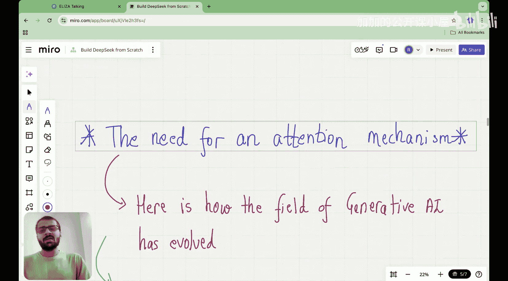
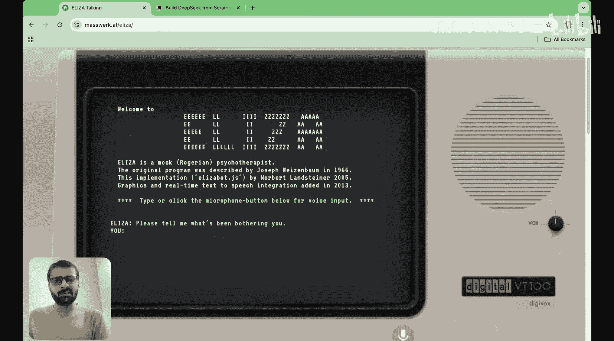
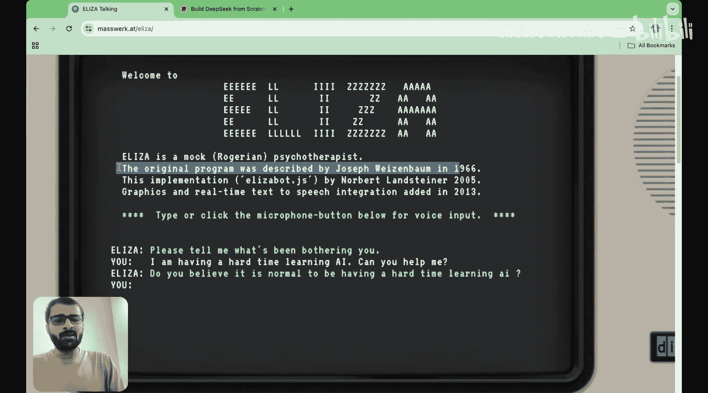
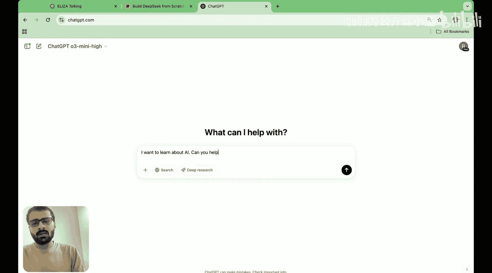

#  004：注意力机制

在本节课中，我们将要学习一个非常重要的概念：注意力机制。我们将探讨为什么需要注意力机制，以及它如何成为大型语言模型（LLM）性能提升的关键。

在上一节中，我们介绍了LLM的整体架构，并了解了token在模型中的“旅程”。本节中，我们来看看旅程中最核心的一环——注意力机制。

## 课程回顾与目标

首先，让我们快速回顾一下本系列课程至今为止的内容。

在名为“DeepSeek基础”的两节课前，我们探讨了DeepSeek架构的四个阶段，或者说本系列课程将涵盖的四个阶段：
1.  DeepSeek架构中的创新
2.  训练方法
3.  GPU优化技巧
4.  模型生态系统

在上一节“LLM架构”中，我们开始深入第一阶段。我们的主要目标是，在接下来的两到三节课中，开始理解多头潜在注意力（Multi-Head Latent Attention, MLA），这是DeepSeek架构中的第一个主要创新。然而，为了理解MLA，我们不能直接开始研究这个概念，我们需要循序渐进地接近它。

我们首先了解了LLM本身的架构。我们看到LLM的架构大致如下：它有三个部分，首先是输入部分，然后是处理器部分，最后是输出部分。每个部分本质上由不同的构建模块组成。

因此，我们认识到，要真正理解LLM这个“引擎”如何工作，我们需要打开引擎，看看里面有什么，以及LLM本质上如何学会预测下一个token或下一个单词。如果你把这个类比想象成汽车的运动，我们看到，如果你给汽车加油，汽车本质上就会移动。类似地，对于LLM来说，“燃料”是你作为输入提供给LLM引擎的单词序列，而输出则是下一个单词或下一个token的预测。这就是为什么我们也称LLM为“下一个token预测引擎”。

这个引擎拥有大量的参数，GPT-3有1750亿个参数，GPT-4可能有大约1万亿个，而最近发布的GPT-4.5可能有大约5到10万亿个。

为了真正理解这个引擎如何工作，我们打开了这个黑匣子，并研究了这三个方面。但我没有直接向你解释这三个方面，我告诉你，如果你把自己放在一个token或单词的位置上，想象自己经历不同的阶段会怎样。所以，如果你是一个token，首先你会被分配一个token ID（你的徽章），然后你会被分配一个token嵌入向量，接着你被分配一个位置嵌入向量。token嵌入和位置嵌入相加，就得到了你的“制服”——输入嵌入。

同样，你的邻居们也有他们的“制服”或输入嵌入。你们所有人一起登上开往Transformer的列车。每个Transformer块都有多个组件，例如归一化层、多头注意力层、Dropout层、跳跃连接、又一个归一化层、前馈神经网络和另一个Dropout层，最后是另一个跳跃连接。这只是一个Transformer块。像这样的Transformer块有很多个，可能是12、24、96个等等。所以，作为一个穿着“制服”（输入嵌入）的token，你必须经历所有这些Transformer块。然后当你出来时，会经过一个归一化层，最后是一个输出层。在这个输出层中，如果你是一个768维的向量，你将被映射或向上投影到一个50000维的向量中。为什么是50000？因为那是词汇表的大小，这本质上帮助我们选择下一个token。

这就是一个token在LLM架构中经历的整个生命周期。在今天的课程中，我们将重点关注整个架构中的一个单一环节，那就是**多头注意力**。我希望你能理解多头注意力在哪个环节发挥作用。在token经历的所有这些步骤中，多头注意力出现在Transformer块内部，并且在这个特定的Transformer块中，它出现在归一化层之后。

所以今天我们将理解多头注意力，但要做到这一点，我们首先需要理解什么是注意力本身，以及为什么需要注意力机制。为什么我们开始谈论“注意力”这个术语？为什么它在最近变得如此流行？

因此，我们今天的目标是引出“自注意力”这个概念。我们今天不会看到自注意力机制的数学原理。今天的目标是尝试理解为什么我们首先需要注意力，以及为什么它对于大型语言模型来说是一个如此巨大的改变。

试想一下，在token经历的所有这些步骤中，最重要的步骤位于Transformer块内部，位于Transformer块的一个步骤中，那就是**注意力**。这就是为什么我在这里用不同的颜色标记了它。这个训练块本质上赋予了LLM所有使其在理解语言方面表现出色的特性。

为了真正理解注意力如何工作，我为你创建了这节单独的课程，在其中我们尝试引出对注意力机制的需求。

在理解为什么我们需要注意力以及它如何改变了这个领域之前，让我们先深入了解一下生成式AI领域本身。让我们回顾一下它的历史，我相信这对于理解注意力机制至关重要。

## 生成式AI简史

在20世纪60年代，有一个名为Eliza的聊天机器人。你可以把它看作是最早的自然语言处理聊天机器人之一，它被设计成一名治疗师。如果你问它“请告诉我是什么困扰着你”，我可以说“我在学习上遇到了困难，你能帮我吗？”它会回答“你认为遇到困难是正常的吗？是的。”你看，它并不是很有帮助，但请记住那是20世纪60年代，在当时这被认为是一场革命。最初的程序由约瑟夫·魏泽鲍姆在1966年描述。

将这与现在的ChatGPT进行比较，我们说“我想学习AI，你能帮我吗？”ChatGPT会提供详细、连贯且有用的回答。

## 注意力机制的必要性

现在，让我们回到核心问题：为什么需要注意力机制？

为了理解这一点，我们需要考虑语言模型在处理序列数据（如句子）时面临的挑战。在注意力机制出现之前，模型（如循环神经网络RNN）在处理长序列时存在信息衰减的问题。句子开头的单词信息很难传递到句子末尾，这限制了模型理解长距离依赖关系的能力。

注意力机制的核心思想是，允许模型在处理序列中的每个元素时，“关注”序列中所有其他元素的信息。这就像你在阅读一个句子时，会根据当前正在读的单词，有选择地回忆或关注句子中之前出现过的相关单词。

以下是注意力机制带来的关键优势：

1.  **解决长距离依赖问题**：模型可以直接访问序列中任何位置的信息，无论距离多远。
2.  **并行计算**：与RNN的顺序处理不同，注意力计算可以并行化，极大地提高了训练速度。
3.  **更好的上下文理解**：模型能够动态地权衡序列中不同部分的重要性，从而更准确地理解上下文。

## 注意力机制的核心思想

想象一下，你正在阅读一段复杂的文本。为了理解当前句子的含义，你的大脑会不自觉地回顾前文，寻找相关的名词、动词或概念。注意力机制在神经网络中模拟了这一过程。

在技术层面，注意力机制通过计算一个“注意力分数”矩阵来实现。对于输入序列中的每个元素（例如，一个单词的嵌入向量），模型会计算它与序列中所有其他元素（包括它自己）的关联程度。这个关联程度就是注意力分数。然后，模型根据这些分数对序列中所有元素的信息进行加权求和，得到一个“上下文向量”。这个上下文向量包含了与当前处理元素最相关的信息。

一个简化的注意力计算可以表示为：

**注意力输出 = Softmax( (查询向量 * 键向量^T) / sqrt(维度) ) * 值向量**

其中：
*   **查询向量**：代表当前我们想要计算注意力的位置。
*   **键向量**：代表序列中所有位置，用于与查询向量计算相关性。
*   **值向量**：包含序列中所有位置的实际信息。
*   **Softmax**：将计算出的分数转换为概率分布，确保权重和为1。

这个过程允许模型为序列中更相关的位置分配更高的权重。

## 从注意力到自注意力

在Transformer架构中，我们使用的是**自注意力**。这意味着，查询向量、键向量和值向量都来自同一个输入序列。自注意力允许序列中的每个位置关注同一序列中的所有位置，从而捕捉序列内部的依赖关系。

在下一节课中，我们将深入探讨自注意力机制的数学细节，并了解它如何扩展为“多头”形式，使模型能够同时从不同的表示子空间中学习信息。

## 总结

本节课中，我们一起学习了注意力机制的必要性和核心思想。我们回顾了LLM的架构，并指出注意力机制是Transformer块中赋予模型强大语言理解能力的关键组件。我们通过对比历史聊天机器人和现代LLM，看到了注意力机制带来的革命性进步。注意力机制通过允许模型动态关注输入序列的任何部分，有效解决了长距离依赖问题，并实现了高效的并行计算，为当今大型语言模型的成功奠定了基础。

在下一节中，我们将正式进入自注意力机制的数学世界，并开始构建多头注意力的完整图景。