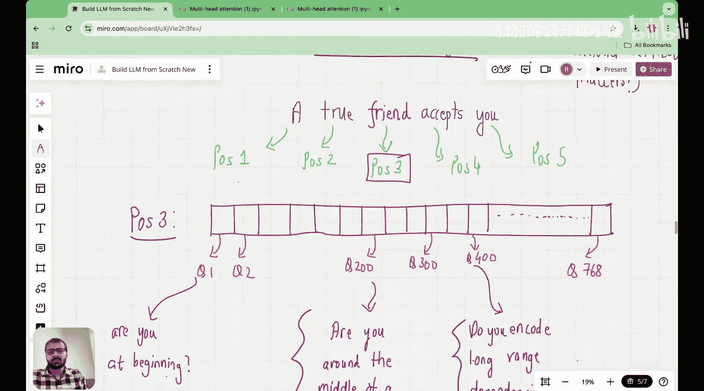

#  005：理解带可训练权重的自注意力机制 🧠

在本节课中，我们将学习自注意力机制的核心部分：如何通过可训练的权重矩阵来计算注意力分数。我们将从输入嵌入向量开始，一步步推导出最终的上下文向量。

---

## 概述

在上一讲中，我们探讨了为什么需要引入注意力机制，以及为什么简单的点积运算不足以捕捉词语间的复杂关系。本节我们将深入探讨解决方案：引入可训练的查询（Query）、键（Key）和值（Value）权重矩阵。我们将通过一个具体的例子，可视化并理解从输入嵌入到上下文向量的完整计算过程。


---

## 回顾：从输入嵌入到上下文向量

上一节我们介绍了LLM的架构，并探讨了引入注意力的必要性。自注意力机制的主要目标是将输入嵌入向量转换为更丰富的**上下文向量**。

输入嵌入向量编码了词语的含义及其在序列中的位置信息，但不包含该词与序列中其他词的关系信息。而上下文向量则包含了词语的含义、位置以及它与其他词元的关系。

为了从输入嵌入向量得到上下文向量，我们曾直觉地尝试使用点积，但发现其能力有限。例如，在句子“The dog chased the ball, but it could not catch it.”中，对于查询词“it”，我们需要机制能区分出“it”指的是“ball”而不是“dog”。简单的点积无法捕捉这种区别。


因此，我们引入了**可训练的权重矩阵**。其核心思想是：既然我们无法手动设计出完美的注意力计算公式，不如将这个复杂的任务交给可以通过训练学习的权重矩阵。

---

## 引入可训练权重矩阵

具体做法是，我们不直接对输入嵌入向量进行点积运算，而是先将它们投影到不同的向量空间。这是通过乘以不同的可训练权重矩阵来实现的。

以下是三个核心的可训练权重矩阵：
*   **查询权重矩阵 (W_Q)**：用于将当前关注的词（查询）投影到查询向量空间。
*   **键权重矩阵 (W_K)**：用于将序列中所有其他词（用于被查询）投影到键向量空间。
*   **值权重矩阵 (W_V)**：用于生成最终用于聚合的信息向量。

继续之前的例子，对于查询词“it”：
1.  我们不直接使用“it”的输入嵌入向量，而是将其乘以查询权重矩阵 `W_Q`，得到**查询向量 (q_it)**。
2.  对于候选词“dog”和“ball”，我们将其输入嵌入向量分别乘以键权重矩阵 `W_K`，得到它们的**键向量 (k_dog, k_ball)**。
3.  计算注意力分数时，我们取查询向量 `q_it` 与各个键向量（`k_dog`, `k_ball`）的点积。这个分数决定了对于查询“it”，应该给予“dog”和“ball”多少注意力。

我们称这些矩阵为查询、键和值，是为了符合学术文献的通用术语。本质上，这是一种将学习复杂关系的任务“外包”给神经网络的巧妙方法：我们随机初始化这些权重矩阵，期望模型在训练完成后，能自动学会如何为不同的词元分配合适的注意力。

---

## 分步计算流程演示

本节中，我们来看一个具体的分步计算过程。我们将以序列“The next day is bright”为例，演示如何将输入嵌入向量转换为上下文向量。请记住，在进入注意力机制之前，这些输入嵌入已经是词嵌入（Token Embedding）和位置嵌入（Positional Embedding）的总和。

假设我们的输入嵌入维度是 `d_model = 4`，并且为了简化，我们使用较小的维度进行演示。以下是序列中每个词元的输入嵌入向量（示例值）：

```
The:   [1.0, 0.5, -0.2, 1.2]
next:  [0.3, 1.2, 0.8, -0.5]
day:   [-0.7, 0.9, 1.1, 0.4]
is:    [1.1, -0.3, 0.2, 0.9]
bright:[0.5, 1.0, -0.1, 0.7]
```

### 步骤1：定义可训练权重矩阵

首先，我们随机初始化三个权重矩阵：`W_Q`, `W_K`, `W_V`。假设我们想要的查询/键/值向量维度 `d_k = 3`。那么权重矩阵的形状应为 `(d_model, d_k) = (4, 3)`。

以下是示例初始化（在真实训练中，这些值会通过反向传播更新）：
```python
import numpy as np

d_model = 4
d_k = 3

# 随机初始化权重矩阵
W_Q = np.random.randn(d_model, d_k) * 0.1  # 例如: [[0.1, -0.05, 0.02], ...]
W_K = np.random.randn(d_model, d_k) * 0.1
W_V = np.random.randn(d_model, d_k) * 0.1
```

### 步骤2：计算查询向量、键向量和值向量

对于序列中的每一个词元，我们使用其输入嵌入向量 `x_i` 分别与三个权重矩阵相乘，得到对应的查询向量 `q_i`、键向量 `k_i` 和值向量 `v_i`。

计算公式为：
*   **q_i = x_i · W_Q**
*   **k_i = x_i · W_K**
*   **v_i = x_i · W_V**

以下是“The”这个词元的计算示例（使用伪代码表示）：
```python
x_the = np.array([1.0, 0.5, -0.2, 1.2])
q_the = np.dot(x_the, W_Q) # 结果是一个 (3,) 的向量，例如 [0.12, -0.08, 0.15]
k_the = np.dot(x_the, W_K)
v_the = np.dot(x_the, W_V)
```
我们对序列中的每个词元都执行此操作，最终会得到五个查询向量、五个键向量和五个值向量。

### 步骤3：计算注意力分数

现在，我们为序列中的每一个词元（作为查询）计算它对所有词元（包括自己）的注意力分数。以“day”作为查询为例：

1.  获取“day”的查询向量 `q_day`。
2.  获取序列中所有词元（The, next, day, is, bright）的键向量 `[k_the, k_next, k_day, k_is, k_bright]`。
3.  计算 `q_day` 与每一个键向量的点积。这五个点积结果就是“day”对于序列中每个词的**原始注意力分数**。

```python
# 假设 q_day 和所有 k 向量已计算好
raw_scores = []
for k_vector in all_key_vectors: # all_key_vectors 包含 k_the, k_next, ...
    score = np.dot(q_day, k_vector)
    raw_scores.append(score)
# raw_scores 可能类似于 [1.5, 0.8, 2.1, -0.3, 1.0]
```

### 步骤4：应用Softmax得到注意力权重

原始的注意力分数可能数值范围不稳定。我们使用Softmax函数将其转换为概率分布，即**注意力权重**。这些权重之和为1，表示在生成“day”的上下文时，分配给每个词元的信息比例。

公式为：
**Attention Weights_i = exp(score_i) / sum(exp(score_j)) for j in all positions**

```python
import numpy as np
raw_scores = np.array([1.5, 0.8, 2.1, -0.3, 1.0])
attention_weights = np.exp(raw_scores) / np.sum(np.exp(raw_scores))
# attention_weights 可能类似于 [0.18, 0.10, 0.48, 0.04, 0.20]
```
结果显示，对于查询“day”，模型赋予了“day”自身最高的权重（0.48），同时也从“The”（0.18）和“bright”（0.20）等词获取了相关信息。

### 步骤5：计算加权和得到上下文向量

最后，我们使用上一步得到的注意力权重，对所有词元的**值向量 (v_i)** 进行加权求和。这个加权和就是查询词“day”的**上下文向量 (c_day)**。

公式为：
**c_day = Σ (attention_weight_i * v_i)**

```python
# 假设 all_value_vectors 是包含所有 v_i 的列表
c_day = np.zeros(d_k) # 初始化一个零向量，维度与值向量相同
for i, weight in enumerate(attention_weights):
    c_day += weight * all_value_vectors[i]
# c_day 现在是一个 (3,) 的向量，融合了序列中所有词的信息
```
这个 `c_day` 向量比原始的“day”输入嵌入向量包含了更丰富的上下文信息，因为它聚合了根据注意力权重从序列中所有词元提取的相关特征。

我们对序列中的每个词元都重复**步骤3到步骤5**，就能为每个位置生成一个对应的上下文向量。

---

## 总结

本节课我们一起学习了自注意力机制中带可训练权重的核心计算流程。我们首先回顾了引入可训练权重的动机——为了捕捉词元间复杂的依赖关系。接着，我们详细介绍了查询、键、值三个权重矩阵的角色。

通过“The next day is bright”这个例子，我们一步步拆解了计算过程：
1.  使用 `W_Q`, `W_K`, `W_V` 将输入嵌入投影为查询、键、值向量。
2.  通过查询向量与所有键向量的点积计算原始注意力分数。
3.  使用Softmax函数将分数归一化为注意力权重。
4.  最后，用注意力权重对值向量进行加权求和，生成最终的上下文向量。



这个过程使得模型能够动态地、根据内容决定在编码每个词时应该关注序列中的哪些部分。在下一讲中，我们将以此为基础，探讨如何将多个这样的自注意力头组合起来，形成更强大的**多头潜在注意力机制**。