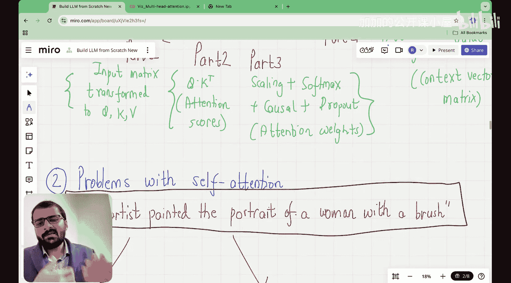

#  007：多头注意力机制的可视化解释

在本节课中，我们将要学习Transformer架构中的一个核心组件——多头注意力机制。我们将从回顾自注意力机制开始，逐步理解为什么需要引入“多头”的概念，并直观地解释其工作原理。

## 课程回顾

上一节我们介绍了因果注意力机制，它确保了模型在预测时只能看到当前及之前的信息。本节中，我们来看看如何从单一的自注意力机制扩展到更强大的多头注意力机制。

## 从自注意力到多头注意力

自注意力机制的主要目标是将输入嵌入向量转换为上下文嵌入向量。输入嵌入向量本身不包含关于相邻词元的信息，而自注意力机制则能捕捉一个词元与序列中所有其他词元的关系。

从输入嵌入矩阵到上下文嵌入矩阵的转换包含四个步骤：
1.  通过可训练的权重矩阵，将输入嵌入转换为查询、键、值矩阵。
2.  计算注意力分数（查询与键的点积）。
3.  对注意力分数进行归一化（缩放和Softmax），得到注意力权重。
4.  将注意力权重与值矩阵相乘，得到最终的上下文向量矩阵。

在因果注意力中，我们通过掩码确保每个词元只能关注到它自身及之前的词元。

## 自注意力机制的局限性

尽管自注意力机制非常强大，但它存在一个主要问题，而多头注意力机制正是为了解决这个问题而设计的。

为了说明这个问题，让我们看一个简单的句子示例：“艺术家用画笔描绘了一位女性的肖像”。

在这个句子中，词元“with”与多个其他词元存在不同的语义关系。例如：
*   “with”可能表示“肖像”是“带有”一位女性的。
*   “with”也可能表示“描绘”这个动作是“使用”画笔完成的。

单一的自注意力机制在计算“with”的上下文向量时，需要同时捕捉这两种（可能更多）不同类型的关系。这可能会使模型难以学习到清晰、独立的语义表示。

## 多头注意力机制的解决方案

多头注意力机制的核心思想是：与其让一个注意力头尝试学习所有类型的关系，不如使用多个注意力头，让每个头专注于学习一种特定类型的关系或模式。

以下是多头注意力机制的工作原理：

1.  **线性投影**：首先，模型使用不同的、可训练的权重矩阵，将输入嵌入分别投影到多组查询、键、值子空间。公式表示为：
    `多头查询 = 输入嵌入 * W_q_i` (对于头 i)
    `多头键 = 输入嵌入 * W_k_i`
    `多头值 = 输入嵌入 * W_v_i`

2.  **并行计算注意力**：每个注意力头独立地在其自己的投影子空间中执行完整的自注意力计算（包括缩放点积注意力和Softmax）。

3.  **拼接与最终投影**：将所有注意力头的输出上下文向量拼接起来，然后通过一个最终的可训练权重矩阵进行投影，将其映射回原始的嵌入维度。公式表示为：
    `多头注意力输出 = Concat(头1输出, 头2输出, ..., 头h输出) * W_o`

通过这种方式，不同的注意力头可以学会关注句子中不同方面的信息。例如，在之前的句子中，一个头可能专门学习“with”与“portrait”的修饰关系，而另一个头则学习“with”与“painted”的工具关系。

## 总结

本节课中我们一起学习了多头注意力机制。我们从回顾自注意力机制出发，指出了单一注意力头在捕捉复杂、多样语义关系时的局限性。多头注意力机制通过使用多组独立的注意力头，让模型能够并行地从不同子空间学习不同类型的关系，从而增强了模型的表示能力和性能。在下一讲中，我们将动手编写多头注意力机制的代码。