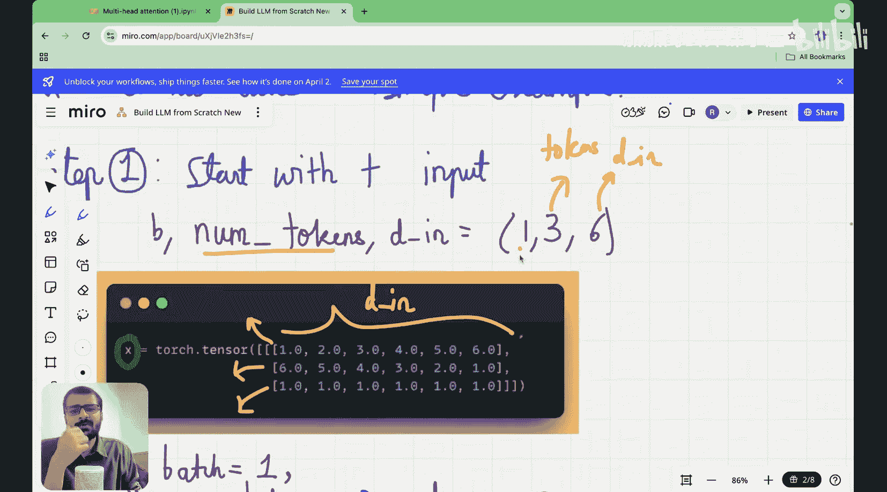

#  008：从零手写多头注意力机制

在本节课中，我们将深入学习多头注意力机制的具体实现。我们将从一个具体的输入矩阵出发，逐步进行数学推导，并最终将其映射到实际的Python代码中。通过本节课，你将彻底理解多头注意力机制内部的计算流程。

## 课程概述


上一节我们介绍了多头注意力机制的概念和优势，本节中我们来看看其具体的数学实现和代码编写。我们将使用一个具体的输入嵌入矩阵，逐步演示查询、键、值的分割，以及多个注意力头的计算与合并过程。

## 数学推导与代码实现

首先，我们定义输入嵌入矩阵。假设我们有一个批次大小为1的输入，包含3个令牌，每个令牌的嵌入维度为6。我们的输入矩阵 `x` 的形状为 `(1, 3, 6)`。


```python
import torch
# 定义输入嵌入矩阵
x = torch.tensor([[[1, 2, 3, 4, 5, 6],
                   [7, 8, 9, 10, 11, 12],
                   [13, 14, 15, 16, 17, 18]]], dtype=torch.float32)
print(f"输入矩阵 x 的形状: {x.shape}")
```

接下来，我们需要设定多头注意力的关键参数：输出维度 `d_out` 和注意力头的数量 `num_heads`。在本例中，我们设 `d_out = 4`，`num_heads = 2`。每个头的维度 `head_dim` 则为 `d_out / num_heads = 2`。

```python
d_in = 6  # 输入维度
d_out = 4 # 输出维度
num_heads = 2 # 注意力头数量
head_dim = d_out // num_heads # 每个头的维度，此处为2
```

多头注意力机制的核心步骤是将查询、键、值的线性变换矩阵分割成多个头。以下是实现这一过程的关键步骤：

1.  **定义可训练的权重矩阵**：首先，我们需要为查询、键、值定义三个可训练的线性变换矩阵 `W_q`, `W_k`, `W_v`。它们的形状均为 `(d_in, d_out)`。
2.  **计算查询、键、值向量**：将输入 `x` 分别与这三个权重矩阵相乘，得到初始的查询、键、值矩阵 `Q`, `K`, `V`。
3.  **分割多头**：将 `Q`, `K`, `V` 矩阵在最后一个维度（特征维度）上分割成 `num_heads` 份。这相当于为每个头创建了独立的 `Q`, `K`, `V` 子矩阵。

以下是分割多头的代码逻辑：

```python
# 步骤1: 定义可训练权重矩阵（此处为示例，使用随机初始化）
W_q = torch.randn(d_in, d_out)
W_k = torch.randn(d_in, d_out)
W_v = torch.randn(d_in, d_out)

# 步骤2: 计算查询、键、值向量
# x.shape = (batch, seq_len, d_in)
# 矩阵乘法后，Q/K/V.shape = (batch, seq_len, d_out)
Q = torch.matmul(x, W_q)
K = torch.matmul(x, W_k)
V = torch.matmul(x, W_v)

# 步骤3: 为多头操作重塑张量
# 目标形状: (batch, num_heads, seq_len, head_dim)
batch_size, seq_len, _ = x.shape
Q = Q.view(batch_size, seq_len, num_heads, head_dim).transpose(1, 2)
K = K.view(batch_size, seq_len, num_heads, head_dim).transpose(1, 2)
V = V.view(batch_size, seq_len, num_heads, head_dim).transpose(1, 2)
# 此时 Q/K/V.shape = (batch, num_heads, seq_len, head_dim)
```

完成分割后，每个头都可以独立计算注意力分数。对于第 `i` 个头，其注意力分数矩阵 `scores_i` 的计算公式为：

**scores_i = (Q_i @ K_i.T) / sqrt(head_dim)**

其中 `Q_i` 和 `K_i` 是第 `i` 个头的查询和键矩阵，`head_dim` 是键向量的维度，缩放操作是为了稳定梯度。

```python
# 计算注意力分数
# Q.shape = (batch, num_heads, seq_len, head_dim)
# K.shape = (batch, num_heads, seq_len, head_dim)
# 我们需要 K 在最后一个维度转置以进行矩阵乘法: K.transpose(-2, -1).shape = (batch, num_heads, head_dim, seq_len)
attention_scores = torch.matmul(Q, K.transpose(-2, -1)) / (head_dim ** 0.5)
# attention_scores.shape = (batch, num_heads, seq_len, seq_len)
```

得到注意力分数后，我们应用因果注意力掩码（确保当前位置只能关注到它自身及之前的位置）和Softmax函数，将其转换为注意力权重。

```python
# 创建因果注意力掩码（下三角矩阵）
mask = torch.tril(torch.ones(seq_len, seq_len)).view(1, 1, seq_len, seq_len)
# 将掩码中为0的位置（未来位置）的分数设置为一个极小的负数，这样在Softmax后权重接近0
attention_scores = attention_scores.masked_fill(mask == 0, float('-inf'))
# 应用Softmax得到注意力权重
attention_weights = torch.softmax(attention_scores, dim=-1)
# attention_weights.shape = (batch, num_heads, seq_len, seq_len)
```

随后，我们将每个头的注意力权重与其对应的值向量 `V_i` 相乘，得到该头的上下文矩阵 `context_i`。

**context_i = attention_weights_i @ V_i**

```python
# 计算上下文向量
context = torch.matmul(attention_weights, V)
# context.shape = (batch, num_heads, seq_len, head_dim)
```

最后一步是将所有头计算出的上下文矩阵合并起来。我们将 `context` 张量的形状从 `(batch, num_heads, seq_len, head_dim)` 转换回 `(batch, seq_len, d_out)`，即沿着头的维度进行拼接。

```python
# 合并多头输出
# 首先将 num_heads 和 head_dim 两个维度合并
context = context.transpose(1, 2).contiguous().view(batch_size, seq_len, d_out)
# 最终 context.shape = (batch, seq_len, d_out)
```

## 总结

本节课中我们一起学习了多头注意力机制从数学推导到代码实现的全过程。我们从定义输入嵌入矩阵开始，逐步完成了以下关键操作：

1.  设定输出维度和头数，并计算每个头的维度。
2.  通过线性变换得到查询、键、值矩阵，并将其分割成多个头。
3.  为每个头独立计算缩放点积注意力分数。
4.  应用因果掩码和Softmax函数得到注意力权重。
5.  将注意力权重与值向量相乘，得到每个头的上下文输出。
6.  将所有头的输出合并，形成最终的上下文矩阵。



这个过程使得模型能够从多个不同的子空间（即“视角”）并行地捕捉序列中元素之间的关系，从而获得比单头注意力更丰富、更强大的表征能力。理解这些步骤是掌握现代Transformer架构核心组件的基础。