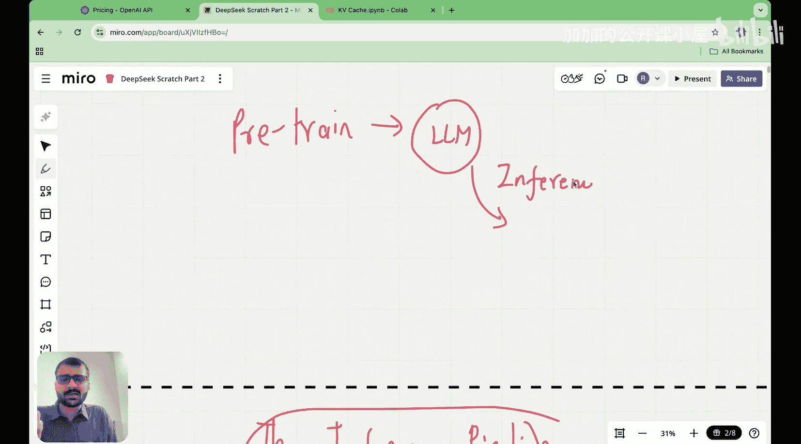
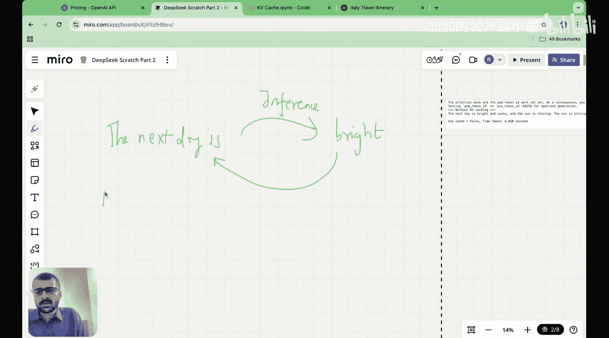

#  009：优势与劣势

在本节课中，我们将要学习Transformer架构中的一个关键优化技术——键值缓存。我们将从语言模型的推理过程开始，逐步理解为什么需要键值缓存，以及如何实现它。最后，我们也会探讨其局限性，为后续理解多头潜在注意力机制打下基础。


## 推理阶段的语言模型

上一节我们介绍了多头注意力机制，本节中我们来看看语言模型在实际使用（即推理）时是如何工作的。首先需要明确一个核心概念：键值缓存**仅**在语言模型的推理阶段发挥作用。

语言模型的使用分为两个主要部分：首先是预训练模型，获得一个参数固定的模型；然后是基于这个预训练模型进行推理，即根据输入预测下一个词元。例如，当你向ChatGPT提问时，你正处于推理阶段，模型正在逐个预测输出词元。


推理过程的核心是“下一个词元预测”。模型接收一个输入序列，通过前向传播计算，预测出下一个最可能的词元，然后将这个新词元添加回输入序列末尾，构成新的输入，再预测下一个词元，如此循环。

以下是这一过程的简化示意：
```python
# 伪代码示意推理循环
input_sequence = initial_prompt
while not generation_finished:
    next_token = model.predict(input_sequence) # 模型前向传播，预测下一个词元
    input_sequence.append(next_token) # 将新词元添加回输入
```

## 为何需要键值缓存？

理解了推理过程后，我们来看其中存在的计算效率问题。在标准的Transformer注意力机制中，每次预测新词元时，都需要为**整个当前输入序列**计算键（K）和值（V）向量。

假设序列长度为 `L`，注意力头的维度为 `d_k`。那么对于每个注意力头，键和值矩阵的形状为 `[L, d_k]`。在推理的每一步，当序列增加一个新词元（`L` 变为 `L+1`）时，都需要为所有 `L+1` 个词元重新计算K和V。这导致了大量的重复计算，因为旧词元（前 `L` 个）的K和V在之前的步骤中已经计算过了。

键值缓存的核心思想就是**缓存**这些已经计算过的键和值向量。这样，在预测新词元时，我们只需要为新加入的词元计算其对应的K和V，而直接从缓存中读取旧词元的K和V。这极大地减少了计算量。

其优势可以用一个公式来概括：
*   **无缓存时计算量**（每步）：`O((L+1)^2 * d_k)` （需要为所有词元重新计算并参与注意力计算）
*   **有缓存时计算量**（每步）：`O((L+1) * d_k)` （仅需为新词元计算K和V）

## 如何实现键值缓存？

现在我们来了解如何具体实现键值缓存。关键在于修改注意力层的前向传播逻辑，使其在推理时能够存储和复用历史状态。

以下是实现键值缓存的关键步骤：



1.  **初始化缓存**：在推理开始时，为模型每一层的每一个注意力头初始化一个空的键缓存和值缓存。
2.  **前向传播与缓存**：
    *   对于输入序列中的每个词元，模型正常计算其查询（Q）、键（K）、值（V）向量。
    *   将计算出的K和V向量**追加**到对应层和对应头的缓存中。
    *   注意力计算时，使用的K和V矩阵是**整个缓存的内容**（即所有历史词元加上当前新词元的K和V）。
3.  **增量解码**：在预测下一个词元时，只需要将**新词元**的输入向量传入模型。模型仅计算该新词元的Q、K、V，并将其K和V追加到缓存。然后使用更新后的完整缓存进行注意力计算，输出新词元的表示。


以下是一个高度简化的代码框架，展示其思想：

```python
class AttentionLayerWithKVCache:
    def __init__(self, d_model, n_heads):
        # ... 初始化投影矩阵等参数 ...
        self.k_cache = None # 键缓存
        self.v_cache = None # 值缓存

    def forward(self, x, use_cache=False):
        # x 是输入，在推理后期通常只有新词元的嵌入
        Q = self.w_q(x)
        K = self.w_k(x)
        V = self.w_v(x)

        if use_cache:
            if self.k_cache is None:
                # 第一次调用，初始化缓存
                self.k_cache = K
                self.v_cache = V
            else:
                # 非第一次调用，将新的K和V追加到缓存
                self.k_cache = torch.cat([self.k_cache, K], dim=1) # 沿序列维度拼接
                self.v_cache = torch.cat([self.v_cache, V], dim=1)
            # 使用完整的缓存作为当前步的K和V
            K = self.k_cache
            V = self.v_cache

        # 使用Q和（可能是缓存的）K、V计算注意力
        attention_output = self.compute_attention(Q, K, V)
        return attention_output
```

## 键值缓存的局限性

键值缓存虽然显著提升了推理速度，但也带来了一个重要的“阴暗面”——**内存消耗随上下文长度线性增长**。

缓存存储了序列中所有历史词元的键和值向量。因此，缓存占用的内存大小与序列长度（即上下文长度）成正比。公式表示为：
`缓存内存 ≈ 2 * 层数 * 头数 * 上下文长度 * d_k * 数据类型大小`

这正是像GPT-4这样支持更长上下文（例如32K）的模型服务成本更高的主要原因之一。更长的上下文意味着需要维护更大的键值缓存，消耗更多的GPU内存，从而增加了每次推理的计算资源成本。



本节课中我们一起学习了键值缓存。我们从语言模型的推理过程出发，理解了重复计算K和V导致的效率问题，进而引入了键值缓存作为解决方案，并分析了其实现原理。最后，我们也认识到键值缓存导致内存消耗随上下文窗口线性增长的局限性。正是为了克服这个局限性，DeepSeek等模型才引入了像“多头潜在注意力”这样更高级的优化技术。在接下来的课程中，我们将深入探讨这一机制。