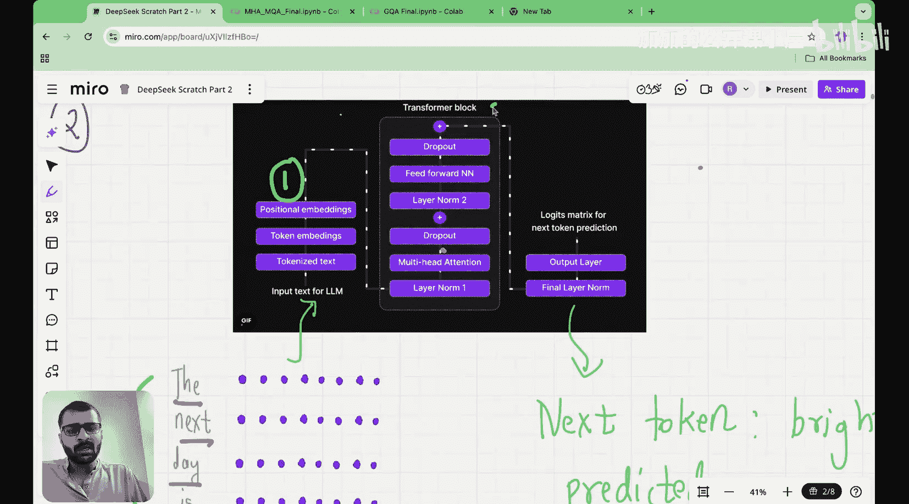
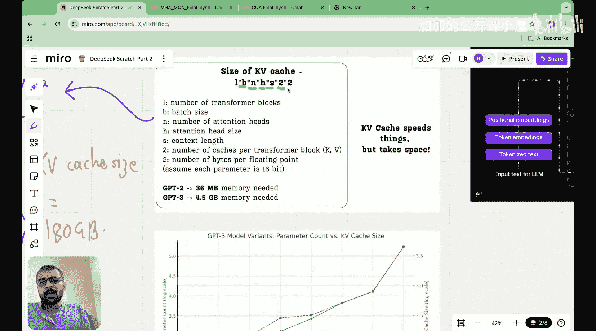
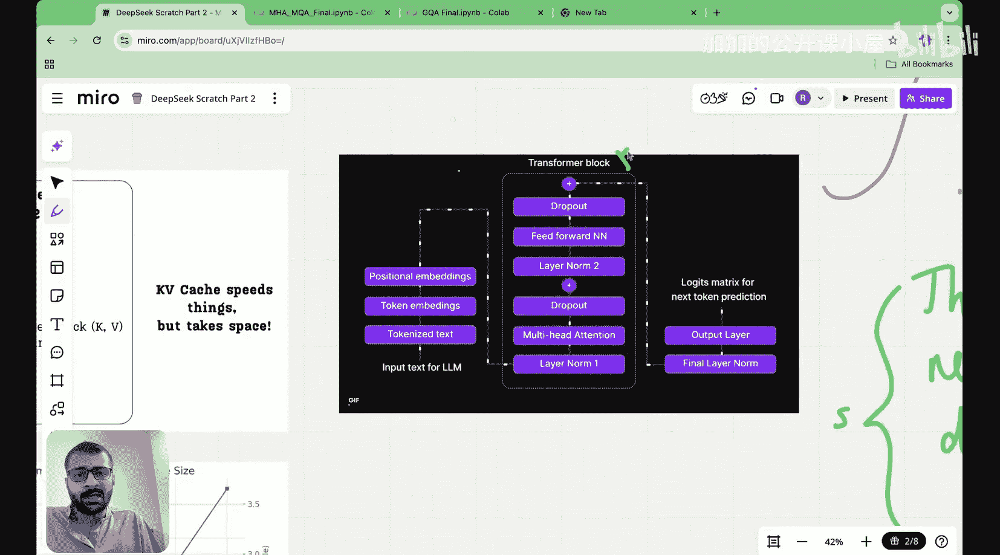
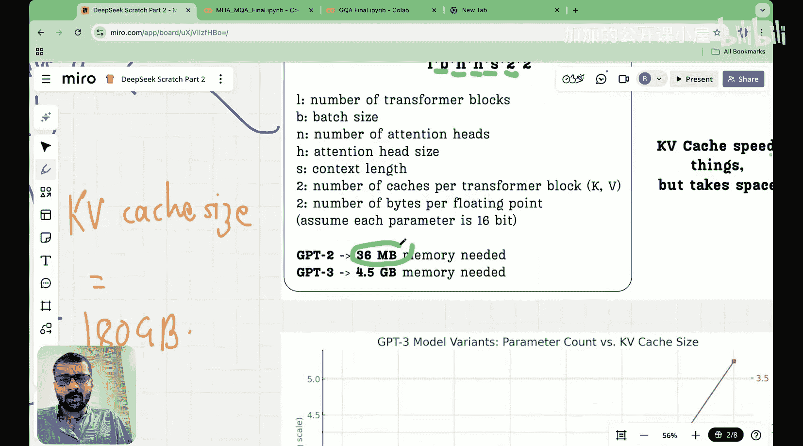

#  010：多查询注意力机制详解 | 处理KV缓存内存问题 第1部分

## 概述

在本节课中，我们将开始学习如何解决KV缓存带来的内存问题。我们将首先回顾KV缓存的概念，理解其优缺点，然后深入探讨多查询注意力机制，这是解决内存问题的关键技术之一。

---

## KV缓存回顾

上一节我们介绍了KV缓存。现在让我们快速回顾一下什么是KV缓存、为什么需要它、它的优点以及缺点。

这一切始于观察语言模型的推理流程。语言模型推理过程如下：首先有一个输入令牌序列。假设我们有四个令牌“the next day is”，然后需要预测下一个令牌，这是语言模型推理的主要任务。这个输入序列会经过整个架构，经过第一个数据预处理块，经过Transformer块，经过输出层，然后我们得到一个逻辑矩阵，通过它预测下一个令牌。

这里需要认识的一个关键点是：为了预测下一个令牌，我们只需要最后一个令牌的上下文向量。让我解释一下：一旦我们进入多头注意力层，我们就能得到最后一个令牌与所有其他令牌之间的注意力分数，这样我们就能得到最后一个令牌的上下文向量。这个上下文向量然后经过所有剩余的层，经过这些输出层，最终我们得到一个逻辑向量，对应于“is”，这是我输入序列中的最后一个令牌。这个逻辑向量是一个向量，如果词汇表大小为50,000，它就有50,000个参数。然后我选择具有最高值或最高概率的索引，然后找到对应于这个索引的令牌，这就是我的下一个令牌预测，即“bright”。

因此，LLM推理过程中需要记住的第一个关键见解是：为了获得下一个令牌预测，我只需要输入序列中最后一个令牌的上下文向量。我不需要其他上下文向量。这是第一个见解。

第二个见解是：假设“the next day is”是输入，“bright”是输出。现在这个“bright”被附加到我的输入中，成为我的新输入序列。所以新的输入序列是“the next day is bright”，它将再次通过整个架构，我们预测新的令牌。让我们看看当这个新的输入矩阵通过Transformer块时会发生什么，特别是当它通过多头注意力块时会发生什么。

在这里我们看到，我们将得到查询矩阵、键矩阵、值矩阵、注意力分数、注意力权重和上下文矩阵。但如果你仔细观察这些我标记的黑框，我在这里标记了一个黑框，在这里标记了一个黑框，在这里标记了一个黑框，在上下文矩阵中也标记了。

第二个关键认识是：所有这些黑框都已经在我的前一次迭代中计算过了。在我的前一次迭代的多头注意力中，我已经计算了所有这些查询、键、值，除了这里对应的新令牌的最后一行。我还没有计算那个。所以第二个认识是：我在这里做了很多重新计算，我可以存储一些东西吗？这就是缓存的想法出现的地方。

---

## 缓存机制详解

然后我们开始回溯以预测下一个令牌。我需要做的是根据这些输入预测下一个令牌。为了预测下一个令牌，我需要什么？我只需要对应于最后一个令牌的上下文向量。为了得到那个上下文向量，我只需要的是：我需要我的最后一个令牌的注意力权重乘以值矩阵。为了得到注意力权重，我需要注意力分数。为了得到注意力分数，我需要查询向量乘以键。

现在我标记在黑框中的所有东西都被缓存了。这意味着为了得到键矩阵，我将缓存我之前的键，我将缓存我之前的值，并且我只计算这个新行，我只计算这个新行。

因此，每当一个新的令牌进来时，我需要做的所有事情是：我必须找到对应于新令牌的查询向量，我必须找到对应于新令牌的键向量并将其附加到缓存键中，这样我就得到了总的键矩阵。我需要做的第三件事是：我必须找到新令牌的值向量，并且我必须将其附加到缓存值中。

然后我将查询与键转置相乘，从中得到注意力分数，得到注意力权重，将其与值矩阵相乘，这样我就得到了最后一个令牌的上下文向量。最后一个令牌的这个上下文向量将遍历剩余的旅程，然后它将预测我的下一个令牌。

所以你看到我们在这里做了什么：我们根本不重新计算值和键，我们从之前的迭代中存储它们，这就是缓存的想法，我们缓存键和值。

---

## KV缓存的优缺点

正如我们在上一讲中看到的，缓存带来的好处是它减少了我们需要做的计算量。如果你看这一行，当我们实现缓存时，我们需要做的计算量仅随输入令牌的数量线性增加。然而，如果你不做缓存，计算量会呈二次方增加。

所以实现KV缓存的一个好处是：它减少了我们需要做的计算量，最终降低了我们的成本，这对我们来说是件好事。

那么坏处是什么？KV缓存的坏处或丑陋之处在于：我们正在存储一些东西。就像每一块土地一样，拥有每一块土地，我们都必须付出代价。同样，对于存储在内存中的每一块数据，对于存储在内存中的每一个参数，我们都必须付出代价。

当你查看KV缓存时，需要存储的参数数量由这么多给出。

为什么是这么多？让我们先看一个Transformer块。假设我有四个令牌“the next day is”。假设这是我的四个令牌，每个令牌的维度是四。现在这个维度是注意力头的数量乘以头维度，所以是`n * H`。这里的行数等于我的上下文大小，所以是`s`。这只是一个批次。但如果我在多个批次中处理，那么这应该乘以`B`。这就是`B * n * s * H * s`的由来。这些是需要存储的参数数量。记住，如果这是键矩阵，将有一个值矩阵与之相伴，所以这将乘以二。然后我只是展示了一个Transformer块，语言模型中通常有多个Transformer块，所以这将乘以`L`，即Transformer块的数量。这个额外的“2”是每个浮点数的字节数。我假设每个存储的参数是16位，即2字节。所以KV缓存的大小由`L * B * n * H * s * 2 * 2`给出。

---

## 内存占用示例

如果你有GPT-2，那是36MB的内存。如果你有GPT-3，那是4.5GB的内存。

---

## 总结

本节课中我们一起学习了KV缓存的基本概念及其内存问题。我们回顾了KV缓存的工作原理，理解了它通过存储键值对来减少计算量的优点，同时也认识到它带来的显著内存开销。在下一节中，我们将深入探讨多查询注意力机制，这是解决KV缓存内存问题的关键技术之一。