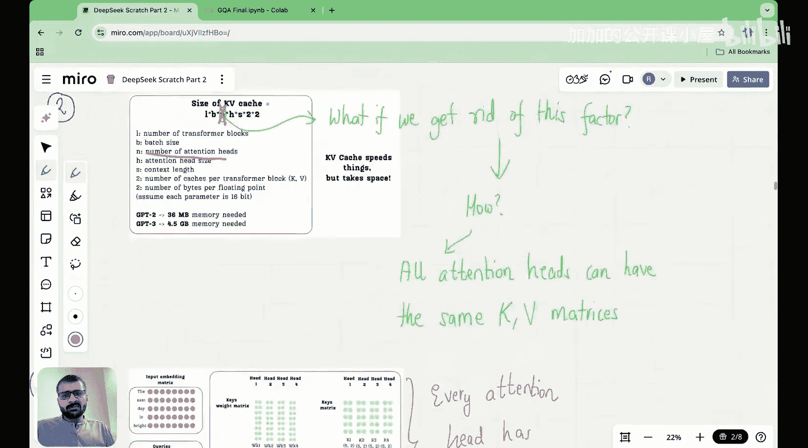

#  011：理解分组查询注意力 (GQA) 🧠

在本节课中，我们将要学习分组查询注意力。这是解决KV缓存内存问题的关键技术之一，也是通往DeepSeek所采用的多头潜在注意力（MHA）的重要一步。

## 课程概述

大家好，欢迎来到“从零构建DeepSeek”系列的下一个讲座。今天，我们将学习分组查询注意力。在上一讲中，我们开始学习可用于解决KV缓存内存问题的技术。我们学习的第一种技术是多查询注意力，而今天我们将学习分组查询注意力。


首先，让我们快速回顾一下在多查询注意力中学到的内容。

## KV缓存回顾与问题

本质上，一切都始于观察KV缓存。在推理过程中，我们缓存键矩阵和值矩阵，因此在预测下一个token时，无需反复进行重复计算。这就是KV缓存的主要思想。

尽管KV缓存提供了许多好处，例如它提供了输入token与计算时间之间的线性关系（如果不进行缓存，计算需求会随输入token数量呈二次方增长；而进行缓存，计算需求则呈线性增长，从而节省大量计算成本），但它也有一个我们在上一讲中学到的“阴暗面”：它占用了大量内存。


实际上，KV缓存的内存需求或大小随着Transformer块的数量、批处理大小、注意力头的数量、注意力头维度和上下文长度的增加而增长。

例如，对于GPT-2这样相对较小的模型，KV缓存仅为36MB。但对于GPT-3，KV缓存增长到4.5GB。对于像DeepSeek-R1或V3这样更大的模型，它使用了61个Transformer块。即使我们假设推理时批处理大小为1，注意力头数量为128，注意力头维度也为128，上下文长度为100,000。在这些参数下，DeepSeek模型的KV缓存大小变得高达400GB。

如果我们在内存中占用如此多的空间，它会减慢我们的计算速度，并且我们必须支付更多费用。想象一下，一家公司用这种普通的KV缓存变体构建了一个基础模型，该公司必须支付大量费用，因为它必须在推理期间存储大量参数，这自然增加了公司向客户收取的推理费用。但正如我们所知，DeepSeek的API调用推理成本非常低，低得令人难以置信。所以很明显，它没有使用这种普通的KV缓存变体，对吧？

因此，人们已经找到了解决KV缓存内存问题的方法，而最终的方法是DeepSeek实施的新创新：多头潜在注意力。但要达到这一点，还有另外两项创新：第一个是我们上一讲中学到的多查询注意力，今天我们将学习分组查询注意力。

## 多查询注意力 (MQA) 核心概念回顾

多查询注意力的关键概念非常简单。我们在上一讲中学到，在普通的多头注意力中，当我们查看可训练的键矩阵和可训练的值矩阵时，每个头本质上都有不同的值。因此，如果你查看头1、注意力头2、注意力头3或注意力头4，这些值彼此不同。这就是我使用的颜色编码所表示的：每个注意力头在WK和WV上都有不同的值。

现在，自然地，由于输入嵌入与WK和WV相乘得到键矩阵和值矩阵，当我们查看键矩阵K时，注意力头1的值与注意力头2的值非常不同，后者又与注意力头3和注意力头4的值不同，值矩阵也是如此。

现在，由于键矩阵和值矩阵的这些值对于不同的头是不同的，我们必须将所有值都存储在缓存中。因此，当我们缓存第一个头时，我们还必须缓存第二个头、第三个头和第四个头。类似地，对于值，我们必须分别缓存所有头。因此，如果你查看KV缓存大小的公式，你会发现它实际上随着注意力头数量的增加而增长：注意力头越多，我们需要存储的参数就越多。

在多查询注意力中，人们做了一个简单的技巧。他们说，如果在WK和WV矩阵中，我首先获取注意力头1的参数，然后为头2、头3和头4复制这些相同的参数，会怎么样？类似地，对于值，我获取头1的参数并为头2、头3和头4复制它。自然地，这也意味着在我的键矩阵K和值矩阵V中，我的注意力头1、头2、头3和头4的值将彼此完全相同。不同头之间的键值将没有差异，头1、头2、头3和头4将是相同的。现在，如果你查看值矩阵，V1的值将与V2、V3和V4的值相同。

因此，在多查询注意力中，键和值矩阵的注意力头都包含相同的信息，实际上是完全相同的参数。你可以想象取K1并复制它以形成K2、K3和K4，取V1并复制它以得到V1、V2、V3和V4。自然地，这样做的结果是，既然所有头的值都相同，我们只需要缓存或存储其中一个头。我们不需要存储所有不同头的矩阵，因为这些值字面上是相同的，对吧？因此，我们可以在KV缓存的大小中去掉注意力头数量n这个因子。

所以，当我们使用多查询注意力时，假设DeepSeek有128个注意力头，我们使用多查询注意力可以将KV缓存大小减少128倍，从400GB减少到仅3GB。

然而，尽管我们节省了KV缓存所需的内存存储量，但多查询注意力有许多缺点，主要缺点是它会导致显著的性能下降。主要原因如下图所示：



## 引入分组查询注意力 (GQA)

上一节我们回顾了多查询注意力的原理及其内存优势，但同时也看到了它可能导致性能下降。本节中，我们来看看分组查询注意力，它旨在在内存效率和模型性能之间取得更好的平衡。

分组查询注意力是多查询注意力和标准多头注意力之间的一个折中方案。其核心思想不是让所有注意力头共享**完全相同**的键和值（如MQA），也不是让每个头都有**完全不同**的键和值（如标准MHA），而是将多个注意力头**分组**，在组内共享键和值。

以下是分组查询注意力的工作原理：

1.  **分组**：将所有的 `h` 个查询头分成 `g` 个组。例如，如果有128个查询头，我们可以将它们分成8组，每组16个头。
2.  **共享键值**：在每个组内，所有查询头共享**同一套**键矩阵和值矩阵。这意味着，对于第 `i` 组，我们只有一个键变换矩阵 `WK_i` 和一个值变换矩阵 `WV_i`。
3.  **独立查询**：每个查询头仍然保留自己独立的查询变换矩阵 `WQ`。

用公式和代码来描述这个核心概念：

**公式描述：**
假设有 `h` 个查询头，分成 `g` 组，每组有 `h/g` 个头。
*   查询矩阵 `Q` 的维度为：`[batch_size, seq_len, h, d_k]`
*   键矩阵 `K` 的维度为：`[batch_size, seq_len, g, d_k]`
*   值矩阵 `V` 的维度为：`[batch_size, seq_len, g, d_v]`

在计算注意力时，属于第 `i` 组的 `h/g` 个查询头，都会与第 `i` 组的键 `K_i` 和值 `V_i` 进行计算。

**简化代码描述：**
```python
# 假设输入 x 的维度: [batch_size, seq_len, model_dim]
# h: 总查询头数， g: 组数， d_k: 每个头的键/查询维度

# 1. 线性变换得到查询、键、值
Q = linear_q(x)  # 形状: [batch_size, seq_len, h * d_k]
K = linear_k(x)  # 形状: [batch_size, seq_len, g * d_k]
V = linear_v(x)  # 形状: [batch_size, seq_len, g * d_v]

# 2. 重塑维度，分离出头和组
Q = Q.view(batch_size, seq_len, h, d_k)
K = K.view(batch_size, seq_len, g, d_k)
V = V.view(batch_size, seq_len, g, d_v)

# 3. 计算注意力分数 (以一组为例)
# 对于第 i 组，其查询是 Q[:, :, i*(h/g):(i+1)*(h/g), :]
# 其键是 K[:, :, i, :]，需要广播以匹配查询头的数量
# 注意力分数 = (Q_group_i @ K_group_i.T) / sqrt(d_k)
# 输出 = softmax(注意力分数) @ V_group_i

# 4. 将所有组的输出拼接起来
```

## GQA的优势

了解了GQA的基本结构后，我们来看看它带来的好处。GQA巧妙地结合了MQA和标准MHA的优点。

以下是分组查询注意力的主要优势：

*   **显著减少KV缓存**：与标准MHA相比，KV缓存大小减少了 `h/g` 倍。例如，如果 `h=128`, `g=8`，缓存大小减少为原来的1/16。这比MQA（减少为1/128）的压缩率低，但比标准MHA好得多。
*   **缓解性能下降**：与MQA相比，GQA通过保留多组不同的键和值，为模型提供了更多的表达能力和多样性。这通常能带来比MQA更好的模型质量，尤其是在需要复杂推理的任务上。
*   **灵活的权衡**：`g` 这个超参数提供了一个旋钮，允许我们在内存开销（KV缓存大小）和模型性能之间进行灵活的权衡。`g=1` 时退化为MQA（内存最优，性能可能受损）；`g=h` 时退化为标准MHA（性能最优，内存开销最大）。我们可以根据实际硬件约束和任务需求选择合适的 `g`。

## 总结


本节课中，我们一起学习了分组查询注意力。我们从回顾KV缓存的内存问题以及多查询注意力的解决方案开始，指出了MQA在节省内存的同时可能牺牲模型性能的缺点。然后，我们深入探讨了分组查询注意力，它通过将查询头分组并在组内共享键和值，在内存效率和模型表现力之间找到了一个更好的平衡点。我们了解了它的工作原理、核心公式/代码表示以及其主要优势。GQA是构建高效大型语言模型（如DeepSeek）的关键技术之一，为后续学习更高级的注意力变体（如多头潜在注意力）奠定了基础。