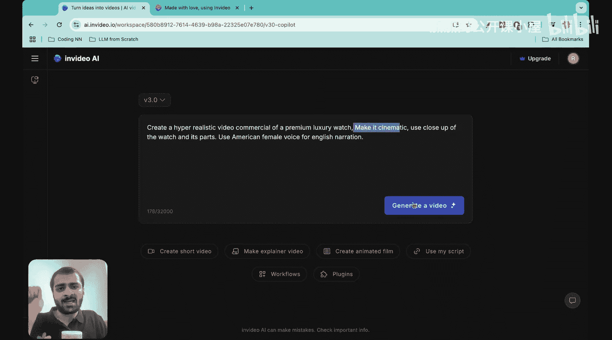
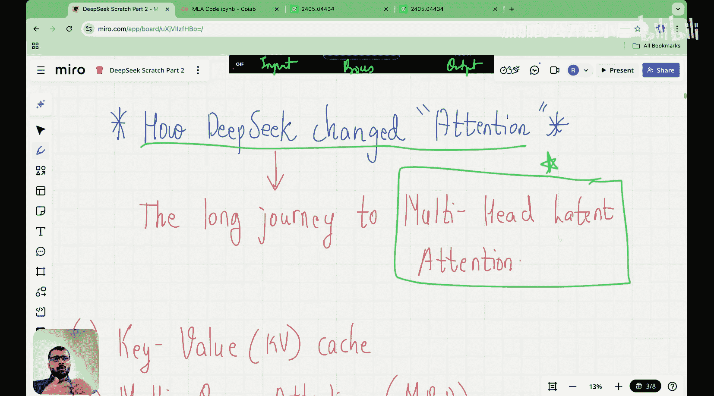
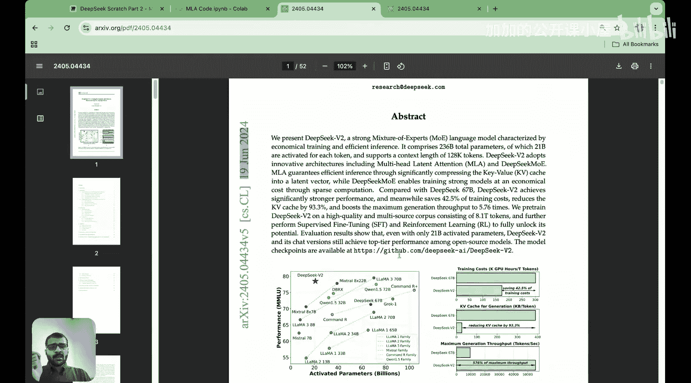
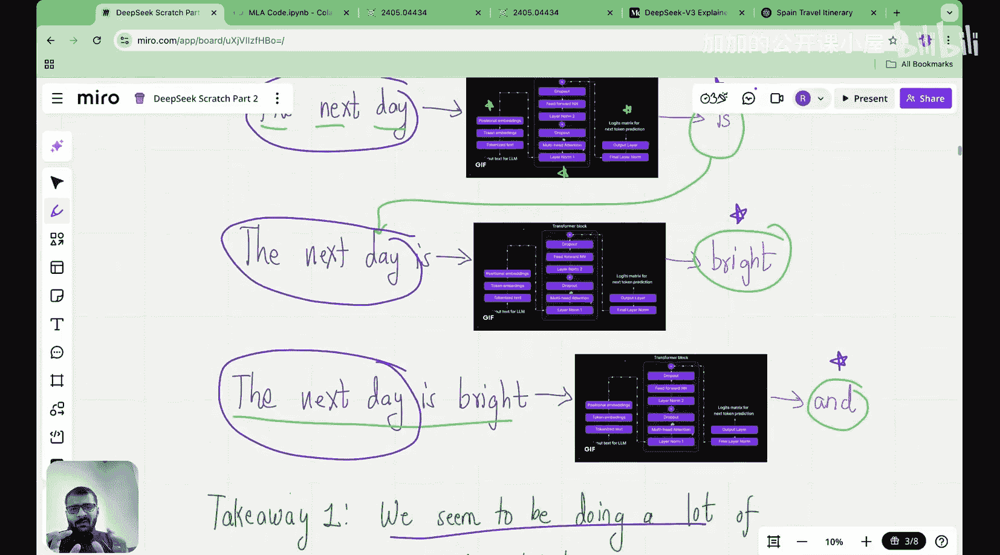
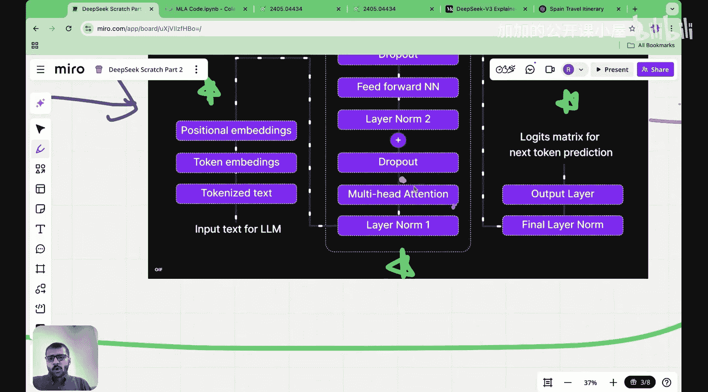
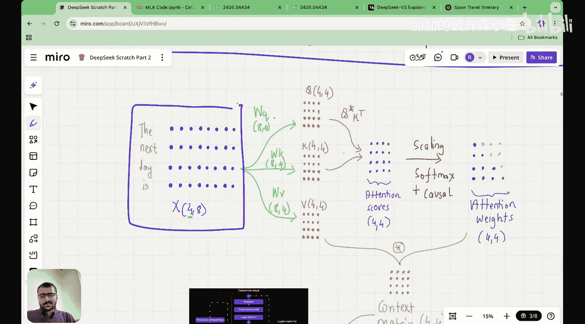

#  012：从零实现多头潜在注意力 🧠

在本节课中，我们将学习DeepSeek模型的核心创新之一——多头潜在注意力机制。我们将从基础概念开始，逐步理解它是如何通过改变注意力机制来显著提升模型效率并降低推理成本的。

---

## 课程概述

大家好，我是Raj Dunecker博士，于2022年从麻省理工学院获得机器学习博士学位，也是“从零构建DeepSeek”系列的创作者。

在开始之前，我想介绍一下本系列的赞助商和合作伙伴——V AI。V AI与我们秉持着相似的原则和理念，即从基本原理构建AI模型。让我展示一下他们的产品。

这是Inviideo AI的网站。凭借一个小型工程团队，他们构建了一个出色的产品，你可以仅通过文本提示创建高质量的AI视频。

例如，我输入一个文本提示：“创建一个超写实的豪华手表视频广告，并使其具有电影感”。点击生成视频后，很快我就得到了这个高度逼真的视频。

这个视频让我着迷的是它对细节的关注。看这里，质量和纹理都非常出色，而这一切都仅从一个文本提示创建。这就是Inviideo AI产品的力量。你刚才看到的精彩视频的支柱，是Inviideo AI的视频创作流程，他们正在从第一性原理重新思考视频生成和编辑。

为了实验和调整基础模型，他们拥有印度最大的H100和H200集群之一，并且也在试验B200。Inviideo AI是印度发展最快的AI初创公司，面向全球构建产品，这也是我与他们产生共鸣的原因。好消息是，他们目前有多个职位空缺，你可以加入他们优秀的团队。更多详情我将在下方描述中发布。

---

## 多头潜在注意力的重要性

大家好，欢迎来到“从零构建DeepSeek”系列的这一讲。

今天可能是本系列中最重要的课程之一，因为今天我们将看到DeepSeek如何通过发明多头潜在注意力机制，彻底改变了注意力机制，或者说重写了Transformer架构。

DeepSeek在其Transformer架构中实现更高效率的原因，以及他们在保持Transformer架构性能的同时成功减少KV缓存大小的原因，是DeepSeek变得如此流行且推理成本如此之低的主要原因之一。

而这一推理成本降低背后的主要创新，就是多头潜在注意力机制。这个在DeepSeek论文中创新的机制，实际上改变了Transformer架构的这个组件。

如果你看整个LLM的架构，有输入块、处理器块和输出块。他们引入的潜在注意力机制，改变了Transformer架构的这个方面，即多头注意力机制。

因此，今天我们将探索通往多头潜在注意力的漫长旅程，理解潜在注意力如何工作，并理解潜在注意力背后的直觉。我将在白板上从零开始详细展示每一个细节，以确保你不会对潜在注意力感到困惑。

---

## 深入DeepSeek V2论文

如果你查看2024年6月发布的DeepSeek V2论文，这里就是他们介绍多头潜在注意力架构的地方，并且这里提供了潜在注意力架构的示意图。

向下滚动，你会看到他们有多个潜在注意力机制的变体。今天我们将看到最简单的变体，他们称之为低秩键值联合压缩。在本系列后面的课程中，我们将看到解耦旋转位置嵌入的含义，但今天不会涉及。今天我们将看到多头潜在注意力的最简单版本。

浏览这篇论文时，你会看到他们有四个图示：多头注意力、分组查询注意力、多查询注意力，最后是多头潜在注意力。今天我们将快速学习前三种，最后再深入了解多头潜在注意力。

---

## 本讲计划

我之前已经在单独的课程中介绍过键值缓存、多查询注意力和分组查询注意力。但我知道可能有些人是第一次听这堂课，所以为了这些人，我将稍微快速地回顾所有这些概念，然后再进入多头潜在注意力。这样，这堂课本身就是一个自包含的讲座。

目前关于多头潜在注意力的可用资源存在的主要问题是，如果你搜索“多头潜在注意力”，你会找到像这样的博客文章。浏览这些博客文章，你会发现它们只有段落和这些令人难以置信难以理解的数学公式。没有任何内容是从零开始解释的，它不适合那些想从矩阵计算、矩阵乘法层面理解潜在注意力工作原理的人。本讲座旨在为所有那些想要打开机器学习黑匣子、理解其内部运作原理的人而准备。

我花了很长时间准备这堂课，但现在终于准备好了，让我们开始吧。

---

## 理解推理阶段

首先，我们必须理解什么是键值缓存，然后理解键值缓存的“阴暗面”，接着理解人们为解决键值缓存问题做了什么，即多查询注意力和分组查询注意力，最后我们将了解潜在注意力如何工作。

我们的故事始于语言模型的推理阶段。

假设预训练已经完成，现在我们处于推理阶段。在推理阶段，当你访问ChatGPT并输入一些内容时会发生什么？例如，你输入“为西班牙制定一个旅行计划”。ChatGPT或任何语言模型所做的，是每次预测一个令牌，这是推理的主要目的。在推理过程中，我们一次预测一个令牌。

假设输入令牌是“the”、“next”、“day”这三个。在推理过程中，我们必须预测下一个令牌。这三个令牌会经过整个LLM架构：它们经过数据预处理层、Transformer层，最后经过输出层。最终，我们在输出层得到逻辑矩阵，通过它我们可以预测下一个令牌。在这个例子中，假设下一个令牌是“is”。

这个下一个令牌随后被追加回输入序列，然后输入序列再次通过这个流程。请记住，当输入序列现在通过这个流程时，所有可训练的矩阵和参数都是固定的。然后我们得到下一个令牌，下一个令牌再次被追加回输入序列，整个输入序列再次通过整个流程，我们得到下一个令牌。这就是下一个令牌预测任务的工作方式。

现在，如果你仔细观察这个推理流程，你可能会直觉地意识到：我们是否在重复计算？因为这三个令牌为了预测“is”而经过了整个架构，然后这三个令牌为了预测“bright”又经过了整个架构，接着这三个令牌为了预测“and”再次经过了整个架构。

因此，我们故事的第一个要点是：在推理阶段，我们似乎在进行大量重复计算。这是第一点，请记住这一点。

---

## 可视化重复计算

现在，这是在直觉层面。我们可以做的是：可视化这些重复计算。具体来说，我想关注多头注意力块。请记住，在多头注意力块中发生的是：输入序列进入，我们得到输入嵌入向量，它们被转换为上下文向量。

让我们看看这个多头注意力块内部发生的计算，并检查是否存在重复计算。如果存在重复计算，那么我们将看看如何处理它。但直觉上，我们似乎在进行大量重复计算，对吧？让我们尝试量化这一点。

我有“the”、“next”、“day”、“is”这四个令牌，它们构成了我的输入嵌入矩阵。这四个令牌将与可训练的查询矩阵相乘，与可训练的键权重矩阵和值权重矩阵相乘，即 `W_q`、`W_k`、`W_v`。

---

## 本节课总结

在本节课中，我们一起学习了DeepSeek模型的核心创新——多头潜在注意力机制的背景和重要性。我们从语言模型的推理阶段开始，理解了其中存在的重复计算问题，并开始探索如何通过可视化注意力块内部的计算来量化这个问题。在接下来的课程中，我们将深入探讨键值缓存的概念及其挑战，并最终揭示多头潜在注意力机制是如何优雅地解决这些效率问题的。